# CSBE 키워드 누적 목록

챕터별로 등장하는 CS 키워드를 누적 관리한다.
- 새 키워드: 해당 챕터에서 처음 등장
- 재등장 키워드: 이전 챕터에서 이미 다뤘고 다시 연결되는 개념

---

## Ch.1 - 왜 CS를 공부해야 하는가

| 키워드 | 분류 | 한 줄 설명 |
|--------|------|-----------|
| Computational Thinking | 새 키워드 | 문제를 CS 개념으로 분해하고 해결하는 사고방식 |
| Keyword (키워드) | 새 키워드 | CS 개념을 지칭하는 용어, 검색과 AI 활용의 출발점 |
| WORD size | 새 키워드 | CPU가 한 번에 처리하는 데이터의 기본 단위 크기 |
| JD (Job Description) | 새 키워드 | 채용 공고에 명시된 직무 요구사항 |

### 키워드 연관 관계

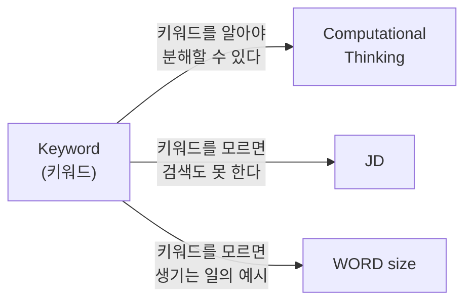

---

## Ch.2 - 로그를 뺐더니 빨라졌어요? (1) - System Call과 커널

| 키워드 | 분류 | 한 줄 설명 |
|--------|------|-----------|
| Bytecode | 새 키워드 | 소스 코드를 실행 직전 단계로 변환한 중간 코드 |
| stdout | 새 키워드 | 프로그램의 기본 출력 통로, fd 1번 |
| File Descriptor (fd) | 새 키워드 | 운영체제가 열린 파일/자원에 부여하는 정수 번호 |
| System Call | 새 키워드 | 사용자 프로그램이 커널에게 작업을 요청하는 인터페이스 |
| Kernel | 새 키워드 | 운영체제의 핵심 프로그램, 하드웨어 자원 관리자 |
| User Mode / Kernel Mode | 새 키워드 | CPU의 두 가지 권한 수준 |
| write() | 새 키워드 | 파일/자원에 데이터를 쓰는 System Call |
| CPU Cycle | 새 키워드 | CPU의 기본 동작 단위, 성능 측정의 기준 |
| Buffer | 새 키워드 | I/O 효율을 위해 데이터를 임시로 모아두는 메모리 공간 |
| flush | 새 키워드 | 버퍼의 데이터를 실제로 내보내고 비우는 행위 |
| I/O | 새 키워드 | 프로그램이 외부와 데이터를 주고받는 행위 |
| Mode Switch | 새 키워드 | User Mode <-> Kernel Mode 전환 |
| Throughput | 새 키워드 | 단위 시간당 처리량, req/s |
| Latency | 새 키워드 | 요청~응답 소요 시간, ms |
| VU | 새 키워드 | 부하 테스트의 가상 사용자 |

### 키워드 연관 관계

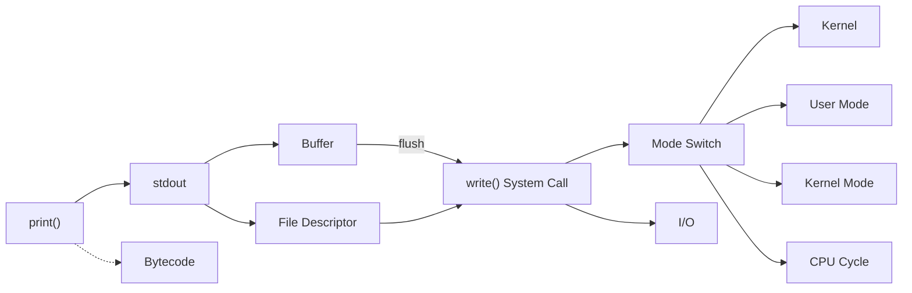

---

## Ch.3 - 로그를 뺐더니 빨라졌어요? (2) - CPU Bound와 I/O Bound

| 키워드 | 분류 | 한 줄 설명 |
|--------|------|-----------|
| CPU Bound | 새 키워드 | 실행 속도가 CPU 연산 능력에 의해 제한되는 상태 |
| I/O Bound | 새 키워드 | 실행 속도가 I/O 속도에 의해 제한되는 상태 |
| Blocking I/O | 새 키워드 | I/O 완료까지 호출 측이 멈추고 기다리는 방식 |
| Non-blocking I/O | 새 키워드 | I/O 요청 후 바로 돌아오는 방식 |
| Context Switch | 새 키워드 | 실행 중인 프로세스/스레드를 다른 것으로 전환 |
| GIL | 새 키워드 | CPython에서 한 번에 하나의 스레드만 바이트코드 실행 가능하게 하는 잠금 |
| Event Loop | 새 키워드 | asyncio의 핵심 엔진, 단일 스레드에서 비동기 작업 스케줄링 |
| Coroutine | 새 키워드 | 실행을 중간에 멈췄다가 이어서 실행할 수 있는 함수 |
| async/await | 새 키워드 | Python 비동기 프로그래밍 문법 |
| Thread Pool | 새 키워드 | 미리 생성된 스레드 묶음에 작업을 분배하는 구조 |
| Process Pool | 새 키워드 | 미리 생성된 프로세스 묶음에 작업을 분배하는 구조 |
| Concurrency | 새 키워드 | 여러 작업이 논리적으로 동시에 진행되는 것 |
| Parallelism | 새 키워드 | 여러 작업이 물리적으로 같은 순간에 실행되는 것 |
| IPC | 새 키워드 | 프로세스 간 데이터 교환 (Inter-Process Communication) |
| I/O | 재등장 (Ch.2) | I/O Bound의 "I/O" |
| Mode Switch | 재등장 (Ch.2) | Context Switch와 비교 대상 |
| Throughput | 재등장 (Ch.2) | 벤치마크에서 req/s 비교에 사용 |
| Latency | 재등장 (Ch.2) | 벤치마크에서 응답 시간 비교에 사용 |

### 키워드 연관 관계

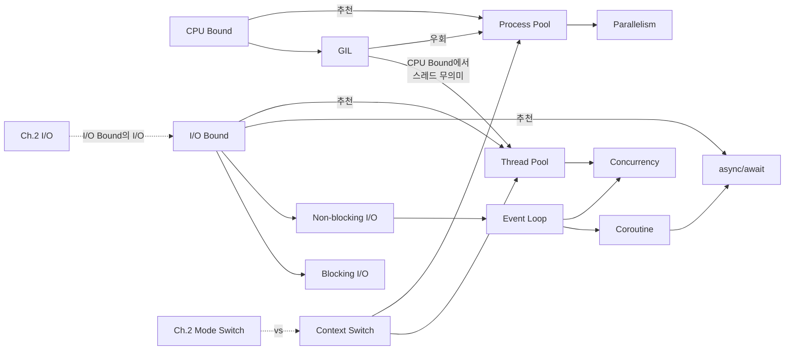

---

## Ch.4 - 프로세스와 스레드, 진짜로 이해하고 있는가

| 키워드 | 분류 | 한 줄 설명 |
|--------|------|-----------|
| Process | 새 키워드 | 실행 중인 프로그램의 인스턴스, 독립적인 메모리 공간을 가진다 |
| Thread | 새 키워드 | 프로세스 안의 경량 실행 단위, Stack만 별도이고 나머지 메모리를 공유 |
| PCB (Process Control Block) | 새 키워드 | 운영체제가 프로세스를 관리하기 위한 자료구조 |
| TCB (Thread Control Block) | 새 키워드 | 운영체제가 스레드를 관리하기 위한 자료구조 |
| Memory Layout | 새 키워드 | 프로세스의 가상 주소 공간 구성 (Text, Data, Heap, Stack) |
| Text Segment | 새 키워드 | 실행 코드(기계어)가 저장되는 Read-only 영역 |
| Data Segment | 새 키워드 | 전역/static 변수가 저장되는 영역 |
| Heap | 새 키워드 | 동적 할당 메모리 영역, 아래에서 위로 자란다 |
| Stack | 새 키워드 | 함수 호출 정보(Stack Frame)가 저장되는 고정 크기 영역 |
| Stack Frame | 새 키워드 | 함수 호출 시 Stack에 쌓이는 데이터 묶음 (매개변수, 지역변수, 복귀주소) |
| Virtual Memory | 새 키워드 | OS가 프로세스에게 제공하는 가상의 메모리 주소 공간 |
| Physical Memory | 새 키워드 | 실제 RAM, 크기가 물리적으로 고정 |
| Page / Page Table | 새 키워드 | 가상 메모리를 4KB 블록으로 관리, Page Table이 가상→물리 주소 변환 |
| Page Fault | 새 키워드 | 물리 메모리에 없는 Page 접근 시 발생하는 인터럽트 |
| OOM (Out of Memory) | 새 키워드 | 사용 가능한 메모리가 모두 소진된 상태 |
| RSS (Resident Set Size) | 새 키워드 | 프로세스가 실제로 물리 메모리에 올려놓은 데이터 크기 |
| Thrashing | 새 키워드 | Page In/Out이 끊임없이 반복되어 시스템이 극도로 느려지는 상태 |
| Context Switch | 재등장 (Ch.3) | PCB/TCB를 저장하고 복원하는 과정이라는 구체적 의미 |
| Mode Switch | 재등장 (Ch.2) | Page Fault 시 User→Kernel 전환이 발생 |
| Kernel | 재등장 (Ch.2) | Virtual Memory를 관리하는 주체, Page Fault 처리 |
| GIL | 재등장 (Ch.3) | 스레드의 Heap 공유와 연결, Reference Counting 보호 |
| Thread Pool / Process Pool | 재등장 (Ch.3) | 메모리 관점에서의 비용 차이를 이해 |
| IPC | 재등장 (Ch.3) | 프로세스가 메모리를 분리하기 때문에 IPC가 필요 |

### 키워드 연관 관계

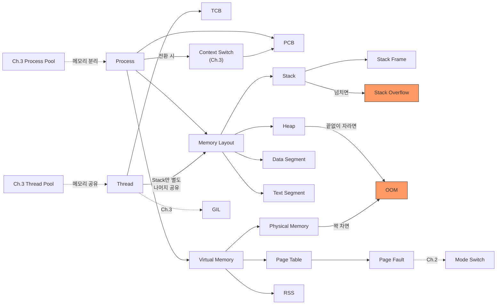

---

## Ch.5 - 동시성 제어의 기초 - Mutex에서 Deadlock까지

| 키워드 | 분류 | 한 줄 설명 |
|--------|------|-----------|
| Race Condition | 새 키워드 | 여러 스레드가 공유 자원에 동시 접근 시 실행 순서에 따라 결과가 달라지는 상황 |
| Critical Section | 새 키워드 | 동시에 두 개 이상의 스레드가 실행하면 안 되는 코드 구간 |
| Atomicity | 새 키워드 | 연산이 "다 되거나 아예 안 되거나"하는 성질 |
| Mutex / Lock | 새 키워드 | Critical Section에 한 번에 하나의 스레드만 들어갈 수 있게 하는 잠금 장치 |
| Deadlock | 새 키워드 | 두 개 이상의 스레드가 서로의 자원을 기다리며 영원히 멈추는 상태 |
| Mutual Exclusion | 새 키워드 | 자원을 한 번에 하나의 스레드만 사용할 수 있는 조건 (Deadlock 필요조건) |
| Hold and Wait | 새 키워드 | 자원을 잡고 있으면서 다른 자원을 기다리는 상태 (Deadlock 필요조건) |
| No Preemption | 새 키워드 | 다른 스레드의 자원을 강제로 빼앗을 수 없는 조건 (Deadlock 필요조건) |
| Circular Wait | 새 키워드 | A→B→A 순환 대기 구조 (Deadlock 필요조건) |
| Lock Ordering | 새 키워드 | Lock을 항상 정해진 순서로 잡아서 Deadlock을 방지하는 기법 |
| Semaphore | 새 키워드 | 동시에 N개 스레드까지 접근을 허용하는 카운팅 잠금 |
| Starvation | 새 키워드 | Lock 경쟁에서 특정 스레드가 계속 밀려 실행 기회를 못 얻는 상태 |
| Thread | 재등장 (Ch.4) | Race Condition의 주체, Heap 공유가 원인 |
| Heap | 재등장 (Ch.4) | 스레드 간 공유 데이터가 위치하는 곳 |
| GIL | 재등장 (Ch.3) | bytecode 단위만 보호, 복합 연산의 Race Condition은 못 막음 |
| Context Switch | 재등장 (Ch.3) | Critical Section 중간에 발생하면 Race Condition 트리거 |
| Thread Pool | 재등장 (Ch.3) | FastAPI 요청 핸들러가 ThreadPool에서 실행됨 |
| File Descriptor | 재등장 (Ch.2) | 파일 잠금 사례, open/close = acquire/release |

### 키워드 연관 관계

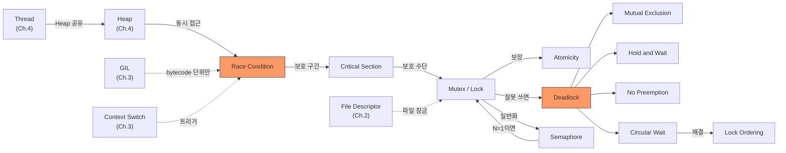

---

## Ch.6 - 네트워크 기초: 3-way handshake를 넘어서

| 키워드 | 분류 | 한 줄 설명 |
|--------|------|-----------|
| TCP/IP | 새 키워드 | 인터넷 통신의 기본 프로토콜 모음, TCP가 신뢰성, IP가 주소 지정 담당 |
| TCP | 새 키워드 | Connection-oriented 프로토콜, 순서 보장과 재전송 제공 |
| UDP | 새 키워드 | Connectionless 프로토콜, 빠르지만 신뢰성 없음 |
| Socket | 새 키워드 | 네트워크 통신의 끝점, OS 관점에서 File Descriptor |
| 3-Way Handshake | 새 키워드 | TCP Connection 수립 과정 (SYN → SYN-ACK → ACK) |
| 4-Way Handshake | 새 키워드 | TCP Connection 종료 과정 (FIN → ACK → FIN → ACK) |
| Connection Pool | 새 키워드 | 미리 N개의 Connection을 만들어두고 재활용하는 구조 |
| Keep-Alive | 새 키워드 | TCP Connection을 유지하면서 여러 요청에 재활용하는 기법 |
| TIME_WAIT | 새 키워드 | Connection을 먼저 끊은 쪽이 2MSL 동안 유지하는 대기 상태 (OS마다 다름) |
| CLOSE_WAIT | 새 키워드 | close()를 호출하지 않아 Connection이 해제되지 않는 상태 |
| File Descriptor | 재등장 (Ch.2) | Socket도 fd다, Connection 하나 = fd 하나 |
| System Call | 재등장 (Ch.2) | socket(), connect(), close() 전부 System Call |
| Semaphore | 재등장 (Ch.5) | Connection Pool = Semaphore(N) |
| Blocking I/O | 재등장 (Ch.3) | Pool 고갈 시 빈 Connection을 기다리며 블로킹 |
| Context Manager | 재등장 (Ch.5) | with engine.connect() = acquire/release 자동화 |
| Throughput / Latency | 재등장 (Ch.2) | Pool vs NullPool 벤치마크 비교 지표 |

### 키워드 연관 관계

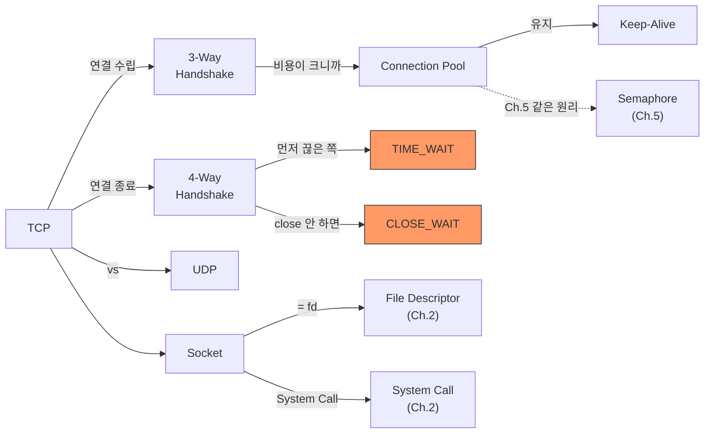

---

## Ch.7 - AI가 코드를 짜주는 시대, 왜 CS를 알아야 하는가

| 키워드 | 분류 | 한 줄 설명 |
|--------|------|-----------|
| LLM (Large Language Model) | 새 키워드 | AI 코딩 도구의 핵심 엔진, 확률적으로 다음 토큰을 예측하는 모델 |
| Token | 새 키워드 | LLM이 텍스트를 처리하는 기본 단위 |
| Context Window | 새 키워드 | LLM이 한 번에 처리할 수 있는 토큰 수의 상한 |
| Hallucination | 새 키워드 | AI가 사실이 아닌 정보를 그럴듯하게 생성하는 현상 |
| Prompt Engineering | 새 키워드 | AI에게 원하는 결과를 얻기 위해 프롬프트를 설계하는 기법 |
| System Call | 재등장 (Ch.2) | 프롬프트에서 "느린 원인" 키워드로 사용 |
| CPU Bound / I/O Bound | 재등장 (Ch.3) | "async로 바꿔줘" 대신 정확한 최적화 방향 지정 |
| Race Condition | 재등장 (Ch.5) | "동시에 에러 난다" 대신 원인 기반 프롬프트 |
| Connection Pool | 재등장 (Ch.6) | "DB 연결 끊긴다" 대신 정확한 설정 키워드 |

### 키워드 연관 관계

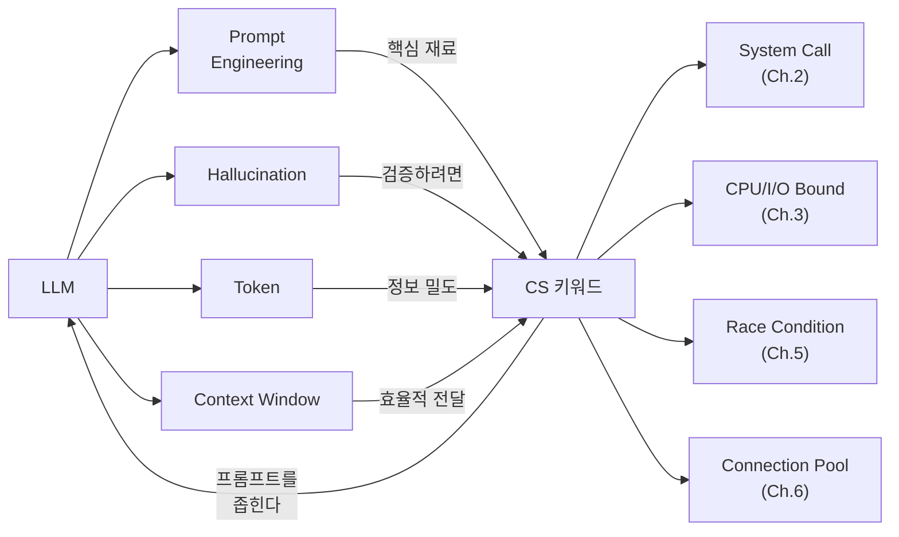

---

## Ch.8 - AI에게 좋은 지시를 내리기 위한 CS 키워드 사전

| 키워드 | 분류 | 한 줄 설명 |
|--------|------|-----------|
| DNS Resolution | 새 키워드 | 도메인 이름을 IP 주소로 변환하는 과정 |
| Load Balancing | 새 키워드 | 트래픽을 여러 서버에 분산하는 기법 |
| N+1 Problem | 새 키워드 | ORM에서 메인 쿼리 1번 + 연관 쿼리 N번이 발생하는 패턴 |
| Time Complexity | 새 키워드 | 알고리즘의 입력 크기 대비 실행 시간 증가율 (Big-O) |
| Circuit Breaker | 새 키워드 | 장애 서비스 호출을 차단해서 전파를 막는 패턴 |
| CQRS | 새 키워드 | 읽기(Query)와 쓰기(Command)를 분리하는 아키텍처 패턴 |
| System Call | 재등장 (Ch.2) | OS 키워드 표에서 프롬프트 활용법 제시 |
| CPU/I/O Bound | 재등장 (Ch.3) | OS 키워드 표에서 최적화 방향 결정 |
| Race Condition | 재등장 (Ch.5) | OS 키워드 표에서 동시성 문제 진단 |
| Connection Pool | 재등장 (Ch.6) | 네트워크 + DB 양쪽 키워드로 등장 |
| Prompt Engineering | 재등장 (Ch.7) | 키워드 카테고리별 프롬프트 작성 전략 |

### 키워드 연관 관계

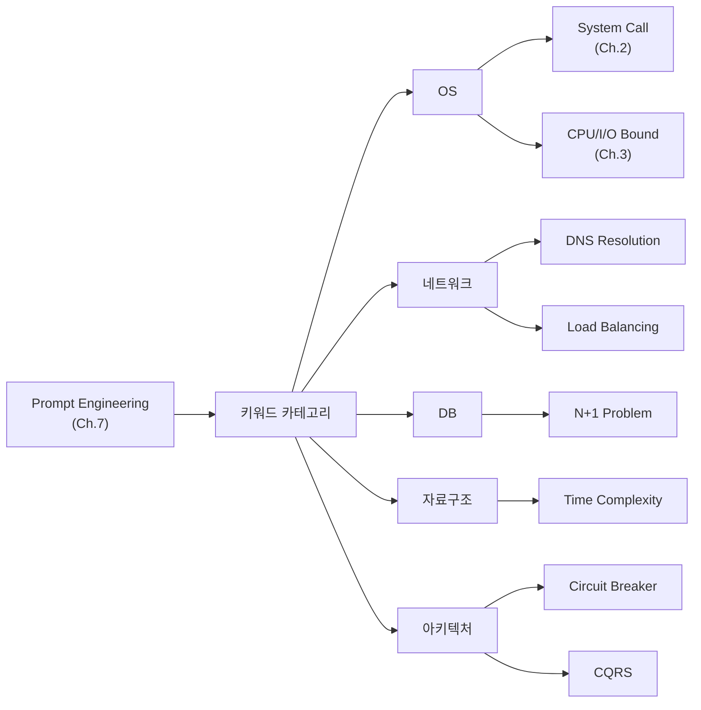

---

## Ch.9 - AI가 만든 코드 리뷰하기

| 키워드 | 분류 | 한 줄 설명 |
|--------|------|-----------|
| Code Review (코드 리뷰) | 새 키워드 | 작성된 코드를 동시성, 성능, 보안, 가독성 관점에서 검토하는 과정 |
| YAGNI | 새 키워드 | "지금 필요하지 않은 기능을 미리 만들지 마라"는 소프트웨어 공학 원칙 |
| Cache Stampede | 새 키워드 | 캐시 만료 순간에 대량의 요청이 동시에 원본 저장소를 조회하는 현상 |
| Race Condition | 재등장 (Ch.5) | AI가 놓치는 동시성 문제의 대표 사례 |
| Time Complexity | 재등장 (Ch.8) | AI 코드의 성능 문제를 판단하는 기준 |
| CPU Bound / I/O Bound | 재등장 (Ch.3) | AI가 잘못 선택하는 I/O 패턴 |
| N+1 Problem | 재등장 (Ch.8) | 코드 리뷰 체크리스트 DB 항목 |
| Hallucination | 재등장 (Ch.7) | AI가 자신 있게 틀리는 근본 원인 |
| Stack Frame | 재등장 (Ch.4) | 재귀 코드의 Stack Overflow 위험 |
| Prompt Engineering | 재등장 (Ch.7) | 체크리스트를 AI 프롬프트에 활용 |

### 키워드 연관 관계

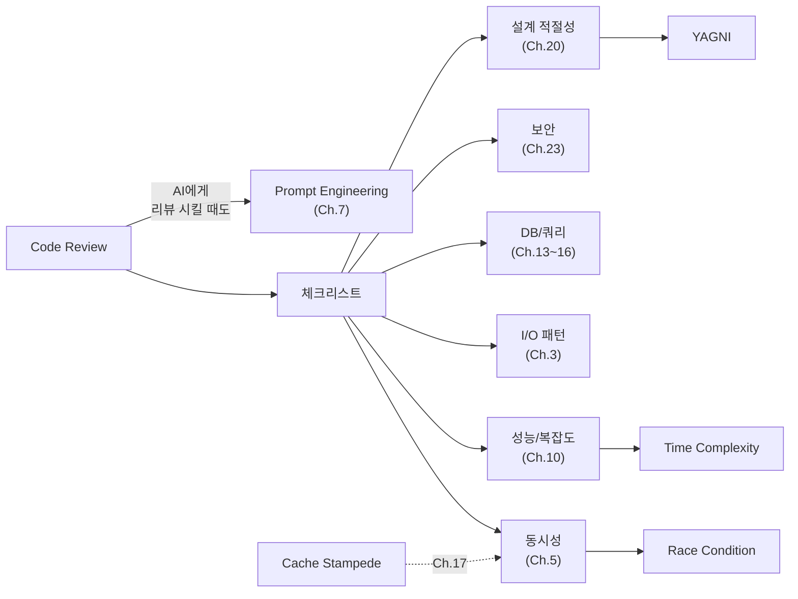

---

## Ch.10 - contains()를 쓰지 마세요

| 키워드 | 분류 | 한 줄 설명 |
|--------|------|-----------|
| Hash Table | 새 키워드 | 키를 Hash 함수로 변환해서 배열 인덱스로 사용하는 O(1) 검색 자료구조 |
| Hash Function | 새 키워드 | 임의의 입력을 고정된 크기의 숫자로 변환하는 함수 |
| Hash Collision | 새 키워드 | 서로 다른 키가 같은 Hash 값을 가지는 현상 |
| Time Complexity | 재등장 (Ch.8) | 프롬프트 키워드에서 실측 체감으로 전환 (O(1) vs O(n) = 4,000배 차이) |
| Space Complexity | 새 키워드 | 알고리즘이 사용하는 메모리의 입력 크기 대비 증가율 |
| Linear Search | 새 키워드 | 처음부터 끝까지 순서대로 비교하며 찾는 O(n) 탐색 |
| Load Factor | 새 키워드 | Hash Table의 사용률, 높아지면 충돌 증가 |

### 키워드 연관 관계

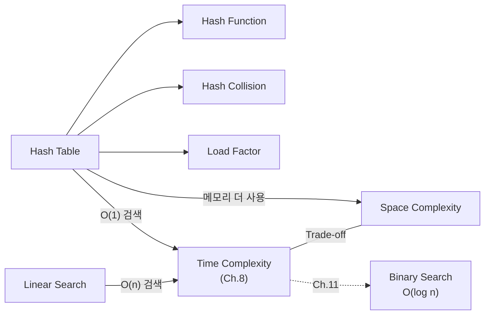

---

## Ch.11 - 정렬과 검색, 그리고 인덱스의 원리

| 키워드 | 분류 | 한 줄 설명 |
|--------|------|-----------|
| Binary Search | 새 키워드 | 정렬된 데이터에서 절반씩 범위를 줄여가며 찾는 O(log n) 탐색 |
| B-Tree / B+Tree | 새 키워드 | 디스크 기반 저장소에 최적화된 균형 트리, DB 인덱스의 핵심 자료구조 |
| Index (인덱스) | 새 키워드 | 특정 컬럼의 값을 B+Tree로 정리해서 검색 성능을 높이는 구조 |
| Full Table Scan | 새 키워드 | 테이블의 모든 행을 순회하는 O(n) 검색, 인덱스 없을 때 발생 |
| Tim Sort | 새 키워드 | Python/Java의 기본 정렬 알고리즘, Merge Sort + Insertion Sort 하이브리드 |
| EXPLAIN | 새 키워드 | 쿼리 실행 계획을 확인하는 DB 명령어, 인덱스 사용 여부 진단 |
| Time Complexity | 재등장 (Ch.8) | O(n log n) vs O(log n) 비교 |
| Hash Table | 재등장 (Ch.10) | Hash Table과 B-Tree의 용도 차이 (같은 값 vs 범위 검색) |

### 키워드 연관 관계

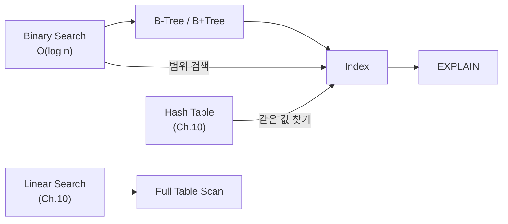
