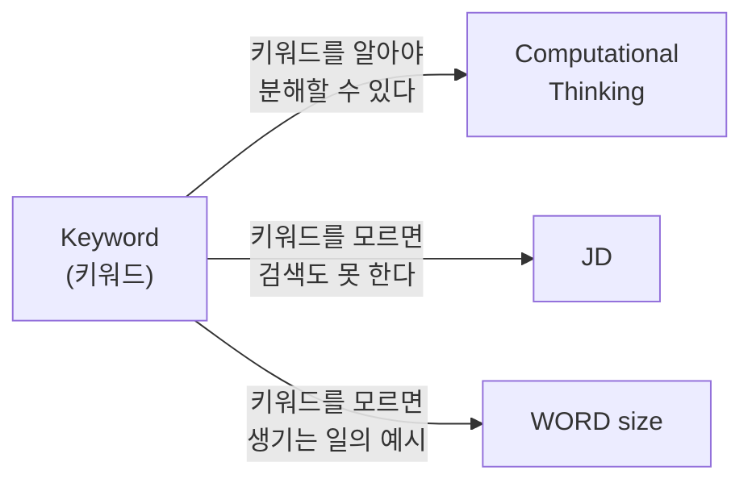
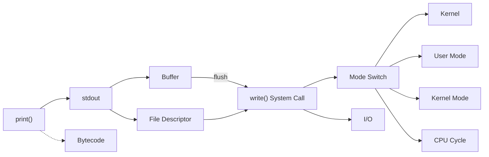

# CSBE 키워드 누적 목록

챕터별로 등장하는 CS 키워드를 누적 관리한다.
- 새 키워드: 해당 챕터에서 처음 등장
- 재등장 키워드: 이전 챕터에서 이미 다뤘고 다시 연결되는 개념

---

## Ch.1 - 왜 CS를 공부해야 하는가

| 키워드 | 분류 | 한 줄 설명 |
|--------|------|-----------|
| Computational Thinking | 새 키워드 | 문제를 CS 개념으로 분해하고 해결하는 사고방식 |
| Keyword (키워드) | 새 키워드 | CS 개념을 지칭하는 용어, 검색과 AI 활용의 출발점 |
| WORD size | 새 키워드 | CPU가 한 번에 처리하는 데이터의 기본 단위 크기 |
| JD (Job Description) | 새 키워드 | 채용 공고에 명시된 직무 요구사항 |

### 키워드 연관 관계

---

## Ch.2 - 로그를 뺐더니 빨라졌어요? (1) - System Call과 커널

| 키워드 | 분류 | 한 줄 설명 |
|--------|------|-----------|
| Bytecode | 새 키워드 | 소스 코드를 실행 직전 단계로 변환한 중간 코드 |
| stdout | 새 키워드 | 프로그램의 기본 출력 통로, fd 1번 |
| File Descriptor (fd) | 새 키워드 | 운영체제가 열린 파일/자원에 부여하는 정수 번호 |
| System Call | 새 키워드 | 사용자 프로그램이 커널에게 작업을 요청하는 인터페이스 |
| Kernel | 새 키워드 | 운영체제의 핵심 프로그램, 하드웨어 자원 관리자 |
| User Mode / Kernel Mode | 새 키워드 | CPU의 두 가지 권한 수준 |
| write() | 새 키워드 | 파일/자원에 데이터를 쓰는 System Call |
| CPU Cycle | 새 키워드 | CPU의 기본 동작 단위, 성능 측정의 기준 |
| Buffer | 새 키워드 | I/O 효율을 위해 데이터를 임시로 모아두는 메모리 공간 |
| flush | 새 키워드 | 버퍼의 데이터를 실제로 내보내고 비우는 행위 |
| I/O | 새 키워드 | 프로그램이 외부와 데이터를 주고받는 행위 |
| Mode Switch | 새 키워드 | User Mode <-> Kernel Mode 전환 |
| Throughput | 새 키워드 | 단위 시간당 처리량, req/s |
| Latency | 새 키워드 | 요청~응답 소요 시간, ms |
| VU | 새 키워드 | 부하 테스트의 가상 사용자 |

### 키워드 연관 관계

