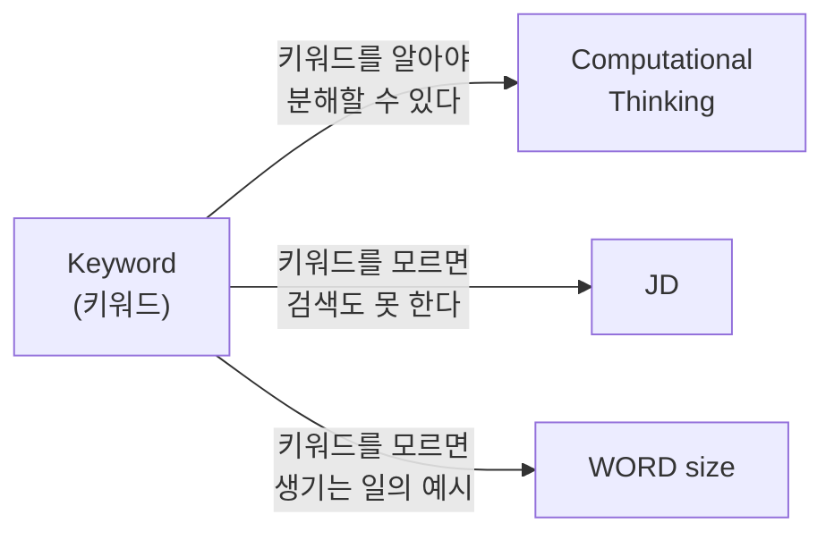
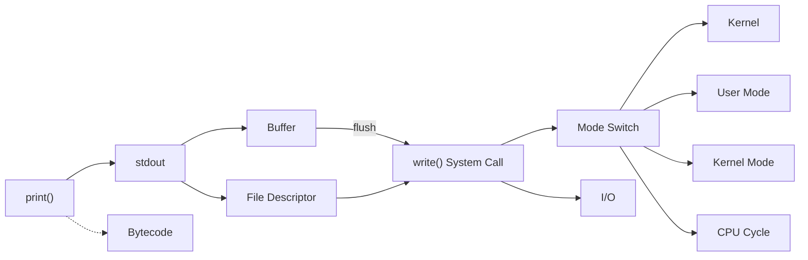
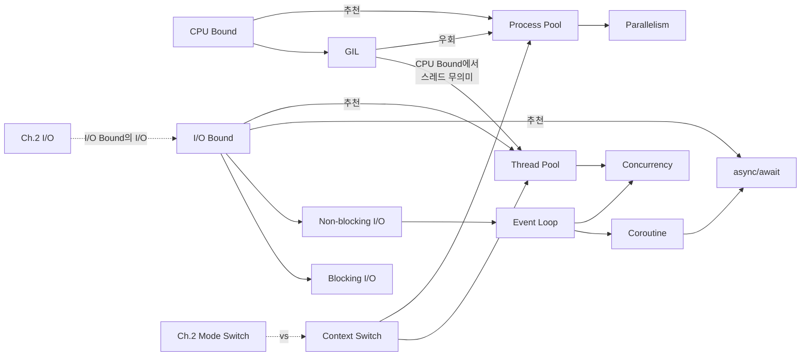

# CSBE 키워드 누적 목록

챕터별로 등장하는 CS 키워드를 누적 관리한다.
- 새 키워드: 해당 챕터에서 처음 등장
- 재등장 키워드: 이전 챕터에서 이미 다뤘고 다시 연결되는 개념

---

## Ch.1 - 왜 CS를 공부해야 하는가

| 키워드 | 분류 | 한 줄 설명 |
|--------|------|-----------|
| Computational Thinking | 새 키워드 | 문제를 CS 개념으로 분해하고 해결하는 사고방식 |
| Keyword (키워드) | 새 키워드 | CS 개념을 지칭하는 용어, 검색과 AI 활용의 출발점 |
| WORD size | 새 키워드 | CPU가 한 번에 처리하는 데이터의 기본 단위 크기 |
| JD (Job Description) | 새 키워드 | 채용 공고에 명시된 직무 요구사항 |

### 키워드 연관 관계

---

## Ch.2 - 로그를 뺐더니 빨라졌어요? (1) - System Call과 커널

| 키워드 | 분류 | 한 줄 설명 |
|--------|------|-----------|
| Bytecode | 새 키워드 | 소스 코드를 실행 직전 단계로 변환한 중간 코드 |
| stdout | 새 키워드 | 프로그램의 기본 출력 통로, fd 1번 |
| File Descriptor (fd) | 새 키워드 | 운영체제가 열린 파일/자원에 부여하는 정수 번호 |
| System Call | 새 키워드 | 사용자 프로그램이 커널에게 작업을 요청하는 인터페이스 |
| Kernel | 새 키워드 | 운영체제의 핵심 프로그램, 하드웨어 자원 관리자 |
| User Mode / Kernel Mode | 새 키워드 | CPU의 두 가지 권한 수준 |
| write() | 새 키워드 | 파일/자원에 데이터를 쓰는 System Call |
| CPU Cycle | 새 키워드 | CPU의 기본 동작 단위, 성능 측정의 기준 |
| Buffer | 새 키워드 | I/O 효율을 위해 데이터를 임시로 모아두는 메모리 공간 |
| flush | 새 키워드 | 버퍼의 데이터를 실제로 내보내고 비우는 행위 |
| I/O | 새 키워드 | 프로그램이 외부와 데이터를 주고받는 행위 |
| Mode Switch | 새 키워드 | User Mode <-> Kernel Mode 전환 |
| Throughput | 새 키워드 | 단위 시간당 처리량, req/s |
| Latency | 새 키워드 | 요청~응답 소요 시간, ms |
| VU | 새 키워드 | 부하 테스트의 가상 사용자 |

### 키워드 연관 관계

---

## Ch.3 - 로그를 뺐더니 빨라졌어요? (2) - CPU Bound와 I/O Bound

| 키워드 | 분류 | 한 줄 설명 |
|--------|------|-----------|
| CPU Bound | 새 키워드 | 실행 속도가 CPU 연산 능력에 의해 제한되는 상태 |
| I/O Bound | 새 키워드 | 실행 속도가 I/O 속도에 의해 제한되는 상태 |
| Blocking I/O | 새 키워드 | I/O 완료까지 호출 측이 멈추고 기다리는 방식 |
| Non-blocking I/O | 새 키워드 | I/O 요청 후 바로 돌아오는 방식 |
| Context Switch | 새 키워드 | 실행 중인 프로세스/스레드를 다른 것으로 전환 |
| GIL | 새 키워드 | CPython에서 한 번에 하나의 스레드만 바이트코드 실행 가능하게 하는 잠금 |
| Event Loop | 새 키워드 | asyncio의 핵심 엔진, 단일 스레드에서 비동기 작업 스케줄링 |
| Coroutine | 새 키워드 | 실행을 중간에 멈췄다가 이어서 실행할 수 있는 함수 |
| async/await | 새 키워드 | Python 비동기 프로그래밍 문법 |
| Thread Pool | 새 키워드 | 미리 생성된 스레드 묶음에 작업을 분배하는 구조 |
| Process Pool | 새 키워드 | 미리 생성된 프로세스 묶음에 작업을 분배하는 구조 |
| Concurrency | 새 키워드 | 여러 작업이 논리적으로 동시에 진행되는 것 |
| Parallelism | 새 키워드 | 여러 작업이 물리적으로 같은 순간에 실행되는 것 |
| IPC | 새 키워드 | 프로세스 간 데이터 교환 (Inter-Process Communication) |
| I/O | 재등장 (Ch.2) | I/O Bound의 "I/O" |
| Mode Switch | 재등장 (Ch.2) | Context Switch와 비교 대상 |
| Throughput | 재등장 (Ch.2) | 벤치마크에서 req/s 비교에 사용 |
| Latency | 재등장 (Ch.2) | 벤치마크에서 응답 시간 비교에 사용 |

### 키워드 연관 관계

