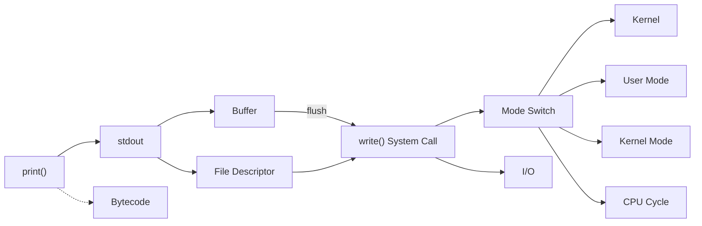

# Ch.1 어떻게 공부할 것인가

[< CS를 외워온다, 그리고 코딩과 CS](./02-cs-and-coding.md)

---

앞에서 "왜 CS를 알아야 하는가"를 이야기했다. 이제 "그럼 어떻게 공부하는가"를 이야기하겠다.


## 우선 기본기를 다지자

공부하려는 과목을 정리해보면 이렇다.

| 과목 | 주요 키워드 예시 |
|------|-----------------|
| 소프트웨어 공학 | OOP, AOP, DDD, Agile, DI, IoC, 관심사 분리 |
| 운영체제 | Process, Thread, Mutex, Semaphore, Context Switching |
| 데이터베이스 | Query, DBMS, Index, Isolation Level, Transaction |
| 분산 시스템 | Docker, Container, VM, Orchestration |
| 자료구조와 알고리즘 | 시간 복잡도, 공간 복잡도, 자료구조 선택 기준 |
| 컴퓨터 네트워크 | TCP/IP, 3-way handshake, Connection Pool |
| 프로그래밍 언어론 | Lambda, Stream, Type System |
| 컴퓨터 보안 | XSS, CORS, CSRF, TLS |

많아 보인다. 하지만 한 번에 다 알아야 하는 건 아니다.

우선은 한 번 읽자. 무슨 키워드가 무슨 과목에서 나오는지 정도를 생각하며 봐보자. "어, 이거 저 과목에서도 나왔던 건데?" 라는 생각이 들 정도로만 보면 되겠다. 재밌는 SF 소설 보는 기분으로 봐보자. (물론 전혀 그런 기분 안 드는 거 잘 알고 있다.)

한 권 다 읽었으면 빠르게 다음 책을 읽자. 아니면 책 별로 하루에 조금씩 양을 정해서 읽는 것도 좋다. 시간을 오래 잡지 마라. 읽어냄에만 집중해보자.

우선 그렇게 하나씩 읽어보고, 어디에 뭐가 나오는지 알아두자. 이제부터 하나씩 파보면 된다.

실무를 위한 우선순위를 굳이 매기자면: DB → 분산 시스템 → 자료구조와 알고리즘 → 운영체제 → 소프트웨어 공학 → 네트워크 → 보안 → 프로그래밍 언어론 정도가 되겠다. 물론 사람마다, 업무마다 다르다.


## 단순한 암기로 해결할 수 있을까?

암기에 능한 건 훌륭한 재능이라고 생각한다. (이 강의 작성자는 단기 기억에 대한 재능이 거의 없다. 장기 기억이 좀 뛰어날 뿐이다.)

CS는 Computer Science다. 과학이다. 그리고 보통 "컴퓨터 공학"이라고 부른다. 공학이다. Engineering이다.

대다수의 과학, 그리고 공학이 그렇듯 단순한 암기보다는 이해와 적용을 중시한다.

암기와 이해/적용이 각각 유리한 영역을 나눠보면 이렇다:

| 수준 | 유리한 영역 | 한계 |
|------|------------|------|
| 암기 | 기본 용어와 정의, 공식과 이론 | 꼬리 질문에 무너진다, 컨텍스트가 바뀌면 적용할 수 없다 |
| 이해와 적용 | 문제 해결, 프로그래밍 기술, 시스템 설계 | 시간이 더 걸리지만, 진짜 내 것이 된다 |

당연히 둘 다 해야 한다. 하지만 무엇이 우선이냐고 묻는다면, 이해와 적용이다.

암기는 구글이 대신 해주지 않나? 키워드만 기억하라. 괜히 "검색도 실력이다" 같은 말이 있는 게 아니다. 깊숙한 개념일수록 애매모호하게 검색하면 답이 나오지 않는 경험, 다들 갖고 있지 않은가?

이 강의에서도 매 챕터마다 세 단계를 밟는다:

| 수준 | 특징 | 이 강의에서 |
|------|------|------------|
| 암기 | 정의를 안다 | 키워드 목록으로 정리한다 |
| 이해 | "왜"를 안다 | CS Drill Down으로 파고든다 |
| 경험 | 직접 보고 측정한다 | k6, strace 등으로 증명한다 |

이 강의는 "경험" 레벨을 목표로 한다. 키워드를 외우는 게 아니라, 직접 부수고 관찰하고 측정하면서 체감하는 거다.

(Ch.1은 예외적으로 코드 없이 진행한다. Ch.2부터 매 챕터 코드를 돌리고, 측정하고, 분석한다. `strace`나 `k6` 같은 도구는 Ch.2부터 하나씩 쓰면서 익히니 지금 몰라도 괜찮다.)


## Computational Thinking

공부를 시작하기 전에 다져놓으면 좋은 게 딱 하나 있다.

<details>
<summary>Computational Thinking (컴퓨팅 사고)</summary>

문제를 CS 개념으로 분해(Decomposition)하고, 핵심을 추상화(Abstraction)하여 체계적으로 해결하는 사고방식이다.
Jeannette Wing이 2006년 Communications of the ACM에 기고한 "Computational Thinking" 논문에서 대중화된 개념이다.
단순히 코딩을 잘하는 것이 아니라, 문제를 분해하고 추상화하는 능력을 의미한다.

출처: Wing, J. M. (2006). Computational thinking. Communications of the ACM, 49(3), 33-35.

</details>

Computational Thinking. 컴퓨터와 유사한 사고 방식을 적용하여 문제를 분석하고 해결하는 접근 방법이다. CS의 근본적인 사고 방식이며, 효율적으로 문제를 해결하고 자동화하는 데 필수적인 역량이다.

간단히 말하면, 어떤 현상을 보고 "이걸 컴퓨터로 어떻게 구현하지?"라는 생각을 하는 것이다. 거기서 꽤나 복잡한 능력이 요구되지만, 결국 이걸 코드로 구현하려면 어떻게 해야 하는지 머릿속으로 구상하고 결론을 내리는 과정이다.


### Computational Thinking의 4단계

CT의 과정은 보통 네 단계로 구분한다:

1. 분해(Decomposition): 복잡한 문제나 현상을 더 작고 관리 가능한 부분으로 나눈다
2. 패턴 인식(Pattern Recognition): 분해된 정보 중에서 예측 가능한 패턴을 찾는다
3. 추상화(Abstraction): 문제 해결을 위해 중요한 정보만 추출하고 불필요한 사항을 제거한다
4. 알고리즘 디자인(Algorithm Design): 문제를 해결하기 위해 구체적인 단계별 절차를 설계한다

흡사 "수열(Sequence)" 문제를 풀이하는 것과 비슷하다. 패턴을 인식하고, 규칙을 도출하여, 적용과 검증을 한다. 수열도 엄밀히 말해 함수로 결론이 도출되지 않는가? 별 차이 없다.


### 실무에서의 CT

"서버가 느리다"는 하나의 현상이다. 이 현상을 CS 키워드로 분해할 수 있으면 원인을 찾을 수 있다.

```
"서버가 느리다"
    |
    +-- CPU Bound인가? (CPU 사용률이 100%에 가까운가?)
    |
    +-- I/O Bound인가? (DB 쿼리, 파일 읽기, 네트워크 호출이 병목인가?)
    |     |
    |     +-- Connection Pool이 고갈된 건 아닌가?
    |     |
    |     +-- 인덱스가 안 걸린 쿼리가 있는 건 아닌가?
    |     |
    |     +-- N+1 쿼리가 발생하고 있는 건 아닌가?
    |
    +-- 메모리 문제인가? (OOM, GC 오버헤드)
    |
    +-- 네트워크 문제인가? (Latency, Bandwidth)
```

이 트리를 그릴 수 있으려면, 각 가지에 해당하는 키워드를 알아야 한다. CPU Bound가 뭔지 모르면 첫 번째 질문조차 던질 수 없다.

CT는 결국 "적절한 키워드로 문제를 분해하는 능력"이다. 그리고 이 강의는 그 키워드를 하나씩 쌓아가는 과정이다.

Science라고는 하지만 어쨌든 Engineering이다. Science면 자연과학대에 있어야지 왜 공대에 있겠는가. CS는 단순히 이론적인 학문이 아닌, 실제 문제를 해결하기 위한 도구이자 학문이다. 이걸 잊으면 안 된다.


## 연관어 학습법

이 강의의 핵심 학습 방법론이다.

(학문적으로는 Concept Mapping이나 Schema Theory와 유사한 접근이지만, 이 강의에서는 CS 키워드 그래프에 특화된 독자적인 방법론으로 사용한다.)


### 위키피디아 히틀러 게임

인터넷에서 잠깐 유행했던 게임이 있다. 위키피디아에서 아무 랜덤 페이지에 들어가서, 링크만 따라가면 몇 번 만에 "아돌프 히틀러" 페이지에 도달할 수 있는지 찾는 게임이다.

WEB 2.0이라는 게 그렇듯, 서로 연관된 그래프의 연속이다. 거미줄처럼 엮여서 어떻게든 원하는 결과로 도달할 수 있다. 여러분도 GPU 출시일을 검색하러 갔다가 어느새 전혀 다른 페이지에 도달해 있었던 경험이 있지 않은가?

CS도 마찬가지다. 어떤 키워드에서 출발하든 결국 관련 키워드로 이어진다. 이 연결 고리를 따라가면서 학습 범위를 넓혀나가는 것이 연관어 학습법이다.


### Sliding Window로 해보자

앞에서 Sliding Window 이야기를 했었다. 이번에는 같은 주제를 "연관어 학습법"으로 접근해보자.

상황 설정: 이동평균선(Moving Average)을 구현하면서 Sliding Window를 사용했다고 치자. 누군가 "Sliding Window에 대해 설명해보라"고 한다.

<details>
<summary>이동평균선 (Moving Average)</summary>

시계열 데이터(특히 주식)에 대해 기술적 분석을 할 때 쓰이는 기본 도구다. 일정 기간의 데이터 평균값을 구해서 연결한 선이다.
매일 들쭉날쭉한 데이터에서 "트렌드"를 보기 위해 사용한다. 예를 들어 5일 이동평균선은 최근 5일간의 평균을, 240일 이동평균선은 최근 240일간의 평균을 보여준다.

</details>

"특정 구간별로 기초통계량(평균, 중간값 등)을 뽑기 위해 Sliding Window를 사용했습니다. Window 내의 데이터에 대해서만 연산을 하고, 정해진 Step만큼 이동 후 재연산을 합니다."

여기서 어떤 질문들이 나올 수 있는가?

- 윈도우 크기는 어떻게 정했나?
- 윈도우 전체를 매번 재연산 하는 건가, 아니면 이전 결과를 활용하는 건가? 성능은?
- Sliding Window의 원래 출처는? 다른 데서도 쓰이는 일반적인 알고리즘인가?
- Step의 단위가 바뀌어도 쉽게 적용할 수 있는 형태인가?
- 왜 다른 방법은 사용하지 않았나? 꼭 Sliding Window여야 했나?
- 데이터가 균일하지 않으면 어떻게 하는가?

이 질문들에서 키워드를 뽑아보자:

```
Sliding Window
    |
    +-- 윈도우 크기, 결정 기준
    |
    +-- 연산 방식, Aggregate, Step, 성능
    |
    +-- 개념, 출처(TCP), 원리
    |
    +-- 추상화 (Step 단위 변경 가능성)
    |
    +-- 대체 알고리즘, 당위성
    |
    +-- 데이터 구조, 데이터 변형 시 적용 가능성
```

근본적인 개념과 방법론에 대한 질문들이며, 이것을 실제 문제 해결에 어떻게 적용했는지에 대해 탐색(Exploration)할 수 있는 키워드들이다.

이 키워드들에 대해 다 알겠는가? 그렇다면 Sliding Window를 설명할 때 이 키워드들을 사용하면서 설명하면 된다. 모르겠다면? 하나씩 파고들면 된다. 그러면 또 새로운 키워드가 나오고, 그걸 또 파고들면 된다.


### print()에서 시작하는 연관어

Ch.2에서는 `print()` 하나에서 출발한다.

```
print()를 치면 뭐가 일어나지?
    -> 내부적으로 sys.stdout.write()를 호출한다
        -> stdout이 뭐지? File Descriptor 1번이다
            -> File Descriptor가 뭐지? OS가 파일/자원에 붙이는 번호다
        -> write()는 뭐지? System Call이다
            -> System Call이 뭐지? 사용자 프로그램이 커널에 요청하는 인터페이스다
                -> User Mode에서 Kernel Mode로 전환된다
                    -> 이 전환(Mode Switch)에 CPU Cycle이 많이 든다
```

하나의 함수(`print()`)에서 출발해서 stdout, File Descriptor, System Call, Kernel, Mode Switch, CPU Cycle까지 도달했다. 이게 Ch.2 한 챕터의 키워드 그래프다.

(아래 그래프에 나오는 키워드들은 전부 Ch.2에서 하나씩 설명한다. 지금은 "이런 식으로 연결된다"는 구조만 보면 된다.)



이 그래프가 챕터를 거듭할수록 점점 커진다. Ch.3에서는 I/O에서 CPU Bound/I/O Bound가 뻗어나가고, Ch.4에서는 Kernel에서 Process/Thread/Memory가 뻗어나간다. Ch.24가 끝나면 수백 개의 키워드가 하나의 거대한 그래프로 연결된다.


### AI 도구를 활용하자

요즘은 좋은 도구가 있다. AI에게 키워드를 하나 던지고 "이것과 관련된 CS 개념은 뭐가 있어?"라고 물어볼 수 있다. 물론 AI의 답변을 맹신하면 안 된다. 반드시 원본 출처(공식 문서, 교과서, 논문)를 확인해야 한다.

관련된 것에 대해 키워드를 하나씩 파고들고 공부해보자. 언젠간 모든 개념이 연결되고, 그러다 보면 자연스럽게 특정 개념에 대해 넓은 이해와 적용을 할 수 있다.

그리고 언젠가는 이런 깨달음이 올 거다: "CS 뭐... 다 그 밥에 그 나물이구나." (사실 그 밥에 그 나물은 아니지만, 그런 자신감을 가지라는 얘기다.)

프로그래밍 언어를 5~6개 쯤 공부하다 보면 대충 문법만 보고 두들겨도 프로그램을 짤 수 있다. "여기는 이 기능이 없나?" 하면서 찾아보면서 말이다. CS도 그렇다. 5~6과목 정도를 공부하다 보면 생각나는 대로 뱉다가 말이 되는 것 같은 경우가 있다. 하지만 꼭 진실 공급원(공식 문서, 교과서)을 확인하라.

외우는 게 아니다. 연결하는 거다.


## 이 강의에서 각 챕터가 진행되는 방식

모든 챕터(Ch.2부터)는 같은 패턴으로 진행된다:

1. 실무에서 벌어질 법한 사례를 하나 보여준다
2. "어떤 결과가 나올 것 같은가?" 질문을 던진다
3. 실제로 측정해서 결과를 보여준다 (k6, strace, explain 등)
4. 코드를 분석한다
5. "왜 이렇게 일어났나"를 CS 개념으로 파고든다 (Drill Down)
6. 같은 원리가 적용되는 다른 사례를 소개한다
7. 키워드를 정리한다

이 과정에서 연관어 그래프가 매 챕터 점점 커진다.

---

[< CS를 외워온다, 그리고 코딩과 CS](./02-cs-and-coding.md) | [커리큘럼과 키워드 정리 >](./04-summary.md)
