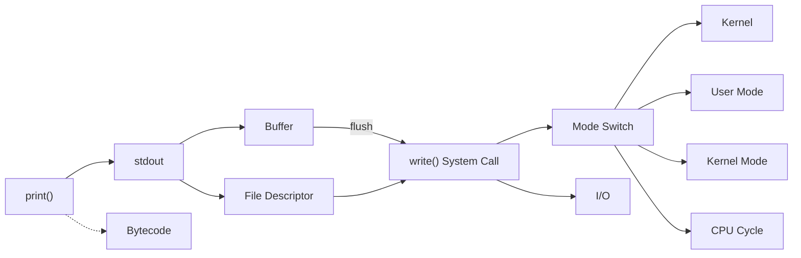

# Ch.1 어떻게 공부할 것인가 - 연관어 학습법

[< WORD size 에피소드](./02-word-size.md)

---

앞에서 "키워드를 알아야 한다"고 했다. 그러면 자연스럽게 다음 질문이 나온다.

"그 키워드를 어떻게 공부하는가?"

CS 교과서를 처음부터 읽으면 되나? 아니다. 그건 대학교 4년 과정이고, 이 강의의 대상은 이미 현업에서 코드를 짜고 있는 사람들이다. 필요한 키워드를 필요한 만큼, 그리고 실무와 연결해서 익히는 방법이 필요하다.


## 암기 vs 이해 vs 경험

CS를 공부하는 수준을 세 단계로 나눌 수 있다.

### 암기

면접 단골 질문: "프로세스와 스레드의 차이가 뭔가요?"

암기형 답변:

```
"프로세스는 실행 중인 프로그램이고, 스레드는 프로세스 내의 실행 단위입니다.
프로세스는 독립된 메모리 공간을 갖고, 스레드는 메모리를 공유합니다."
```

여기까지는 30초면 외울 수 있다. 그런데 꼬리 질문이 온다.

- "메모리를 공유한다는 게 구체적으로 뭔가요? Stack도 공유하나요?"
- "그러면 스레드 간에 데이터가 꼬이는 건 어떻게 방지하나요?"
- "Python에서 멀티스레드가 CPU Bound 작업에서 안 빠른 이유가 뭔가요?"

암기는 첫 번째 질문에서 끝난다. 꼬리 질문에는 답할 수 없다.


### 이해

이해 단계에서는 "왜"를 안다.

- 프로세스가 독립된 메모리 공간을 갖는 이유: Virtual Memory 덕분이다. 각 프로세스는 자기만의 가상 주소 공간을 갖는다.
- 스레드가 메모리를 공유하는 범위: Heap, Data, Text 영역은 공유하지만 Stack은 각자 가진다.
- Python 멀티스레드의 한계: GIL(Global Interpreter Lock) 때문에 CPU Bound 작업에서는 한 번에 하나의 스레드만 실행된다.

<details>
<summary>GIL (Global Interpreter Lock)</summary>

Python(CPython) 인터프리터가 한 번에 하나의 스레드만 Python 코드를 실행하도록 강제하는 잠금장치다.
멀티스레드로 CPU 연산을 병렬 처리하려 해도, GIL 때문에 실제로는 한 번에 하나씩만 돌아간다.
자세한 내용은 Ch.3에서 다룬다.

</details>

이 수준이면 꼬리 질문에도 답할 수 있다. 하지만 운영 환경에서 문제가 생겼을 때 바로 대응할 수 있는가? 쉽지 않다.


### 경험

경험 단계에서는 직접 본다.

- OOM(Out of Memory)을 직접 발생시켜보고, `dmesg` 로그에서 커널이 프로세스를 죽이는 과정을 관찰한다.
- `strace`로 `print()` 한 줄이 실제로 `write()` System Call로 변환되는 걸 눈으로 확인한다.
- k6로 부하를 걸어서 Connection Pool이 고갈되면 어떤 에러가 나오는지 재현한다.

위에 나온 도구(`dmesg`, `strace`, `k6`)를 지금 몰라도 된다. Ch.2부터 하나씩 쓰면서 익힌다.

이 강의는 "경험" 레벨을 목표로 한다. 키워드를 외우는 게 아니라, 직접 부수고 관찰하고 측정하면서 체감하는 거다.

| 수준 | 특징 | 한계 |
|------|------|------|
| 암기 | 정의를 안다 | 꼬리 질문에 무너진다 |
| 이해 | "왜"를 안다 | 실전에서 바로 적용하기 어렵다 |
| 경험 | 직접 보고 측정한다 | 시간이 들지만, 진짜 내 것이 된다 |


## Computational Thinking

키워드를 아는 것의 진짜 가치는 Computational Thinking에 있다.

<details>
<summary>Computational Thinking (컴퓨팅 사고)</summary>

문제를 CS 개념으로 분해(Decomposition)하고, 핵심을 추상화(Abstraction)하여 체계적으로 해결하는 사고방식이다.
원래는 Jeannette Wing이 2006년 Communications of the ACM에 기고한 "Computational Thinking" 논문에서 대중화된 개념이다.
단순히 코딩을 잘하는 것이 아니라, 문제를 추상화하고 분해하는 능력을 의미한다.

출처: Wing, J. M. (2006). Computational thinking. Communications of the ACM, 49(3), 33-35.

</details>

"서버가 느리다"는 하나의 현상이다. 이 현상을 CS 키워드로 분해할 수 있으면 원인을 찾을 수 있다.

```
"서버가 느리다"
    |
    +-- CPU Bound인가? (CPU 사용률이 100%에 가까운가?)
    |
    +-- I/O Bound인가? (DB 쿼리, 파일 읽기, 네트워크 호출이 병목인가?)
    |     |
    |     +-- Connection Pool이 고갈된 건 아닌가?
    |     |
    |     +-- 인덱스가 안 걸린 쿼리가 있는 건 아닌가?
    |     |
    |     +-- N+1 쿼리가 발생하고 있는 건 아닌가?
    |
    +-- 메모리 문제인가? (OOM, GC 오버헤드)
    |
    +-- 네트워크 문제인가? (Latency, Bandwidth)
```

이 트리를 그릴 수 있으려면, 각 가지에 해당하는 키워드를 알아야 한다. CPU Bound가 뭔지 모르면 첫 번째 질문조차 던질 수 없다.

Computational Thinking은 결국 "적절한 키워드로 문제를 분해하는 능력"이다. 그리고 이 강의는 그 키워드를 하나씩 쌓아가는 과정이다.


## 연관어 학습법

이 강의의 핵심 학습 방법론이다.

CS 키워드는 고립되어 있지 않다. 하나의 키워드에서 출발하면 자연스럽게 관련 키워드로 이어진다. 이 연결 고리를 따라가면서 학습 범위를 넓혀나가는 것이 연관어 학습법이다. (학문적으로는 Concept Mapping이나 Schema Theory와 유사한 접근이지만, 이 강의에서는 CS 키워드 그래프에 특화된 독자적인 방법론으로 사용한다.)

예를 들어, Ch.2에서는 `print()` 하나에서 출발한다.

```
print()를 치면 뭐가 일어나지?
    -> 내부적으로 sys.stdout.write()를 호출한다
        -> stdout이 뭐지? File Descriptor 1번이다
            -> File Descriptor가 뭐지? OS가 파일/자원에 붙이는 번호다
        -> write()는 뭐지? System Call이다
            -> System Call이 뭐지? 사용자 프로그램이 커널에 요청하는 인터페이스다
                -> User Mode에서 Kernel Mode로 전환된다
                    -> 이 전환(Mode Switch)에 CPU Cycle이 많이 든다
```

하나의 함수(`print()`)에서 출발해서 stdout, File Descriptor, System Call, Kernel, Mode Switch, CPU Cycle까지 도달했다. 이게 Ch.2 한 챕터의 키워드 그래프다. (아래 그래프에 나오는 키워드들은 전부 Ch.2에서 하나씩 설명한다. 지금은 "이런 식으로 연결된다"는 구조만 보면 된다.)



이 그래프가 챕터를 거듭할수록 점점 커진다. Ch.3에서는 I/O에서 CPU Bound/I/O Bound가 뻗어나가고, Ch.4에서는 Kernel에서 Process/Thread/Memory가 뻗어나간다. Ch.24가 끝나면 수백 개의 키워드가 하나의 거대한 그래프로 연결된다.

외우는 게 아니다. 연결하는 거다.


## 이 강의에서 각 챕터가 진행되는 방식

모든 챕터(Ch.2부터)는 같은 패턴으로 진행된다:

1. 실무에서 벌어질 법한 사례를 하나 보여준다
2. "어떤 결과가 나올 것 같은가?" 질문을 던진다
3. 실제로 측정해서 결과를 보여준다 (k6, strace, explain 등)
4. 코드를 분석한다
5. "왜 이렇게 일어났나"를 CS 개념으로 파고든다 (Drill Down)
6. 같은 원리가 적용되는 다른 사례를 소개한다
7. 키워드를 정리한다

Ch.1만 예외적으로 코드와 벤치마크 없이 사례와 방법론으로 구성했다. Ch.2부터는 매 챕터가 코드를 돌리고, 측정하고, 분석하는 과정을 거친다.

---

[< WORD size 에피소드](./02-word-size.md) | [이 강의의 구조와 키워드 정리 >](./04-summary.md)
