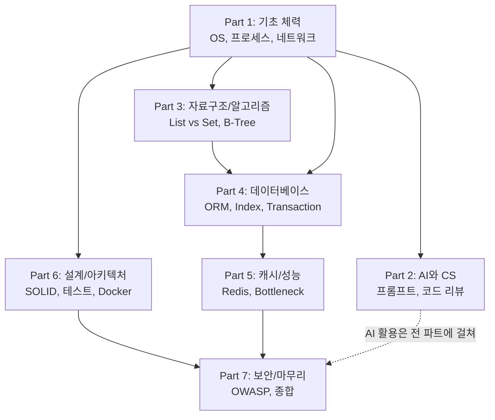
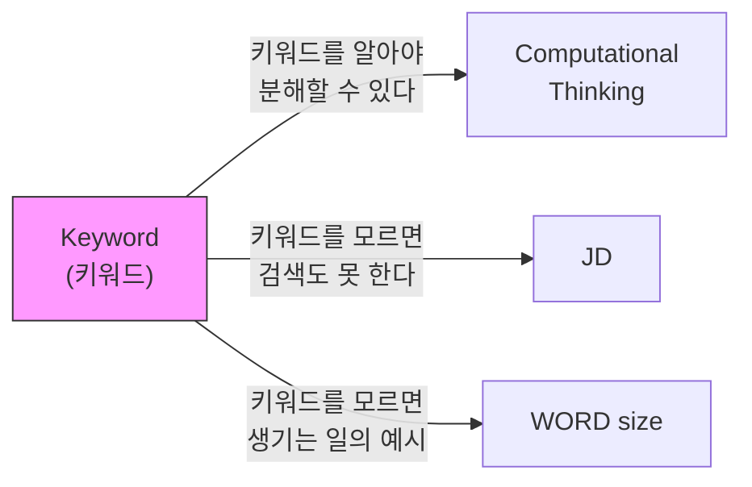

# Ch.1 이 강의의 구조와 키워드 정리

[< 어떻게 공부할 것인가](./03-how-to-learn.md)

---

## 이 강의의 구조

24개 챕터, 7개 파트로 구성된다. 각 파트가 다루는 영역은 다음과 같다.

| 파트 | 챕터 | 영역 |
|------|------|------|
| Part 1 | Ch.1~6 | 기초 체력 - OS, 프로세스, 스레드, 네트워크 |
| Part 2 | Ch.7~9 | AI 도구와 CS의 접점 |
| Part 3 | Ch.10~12 | 자료구조와 알고리즘의 실무 |
| Part 4 | Ch.13~16 | 데이터베이스 깊게 보기 |
| Part 5 | Ch.17~19 | 캐시와 성능 최적화 |
| Part 6 | Ch.20~22 | 소프트웨어 설계와 아키텍처 |
| Part 7 | Ch.23~24 | 보안과 마무리 |

파트 간의 관계를 그림으로 보면 이렇다:

Part 1에서 쌓은 기초(OS, 프로세스, System Call 등)가 이후 모든 파트의 토대가 된다. 그래서 Part 1을 "기초 체력"이라고 부른다.

## Ch.1 키워드 정리

이번 챕터에서 등장한 키워드를 정리한다. Ch.1은 기술 챕터가 아니므로 메타 키워드(학습과 사고 방식에 관한 키워드) 위주다.

Computational Thinking (컴퓨팅 사고)

문제를 CS 개념으로 분해하고, 각 구성 요소를 체계적으로 분석하여 해결하는 사고방식이다.
"서버가 느리다" -> "CPU Bound인가? I/O Bound인가? Connection Pool인가?" 이런 식으로 문제를 쪼개는 능력.

출처: Wing, J. M. (2006). Computational thinking. Communications of the ACM, 49(3), 33-35.

Keyword (키워드)

CS 개념을 지칭하는 용어. 검색과 AI 활용의 출발점이다.
"서버 느림"이 아니라 "connection pool exhaustion"을 아는 것이 키워드를 아는 것이다.
이 강의 전체가 키워드를 쌓아가는 과정이다.

WORD size

CPU가 한 번에 처리하는 데이터의 기본 단위 크기.
32비트 CPU는 4바이트, 64비트 CPU는 8바이트.
구조체 정렬(struct alignment)에 영향을 주며, 이를 모르면 크로스 플랫폼 환경에서 데이터가 깨질 수 있다.

JD (Job Description)

채용 공고에 명시된 직무 요구사항.
JD에는 도구(Python, AWS 등)가 나열되지만, 면접에서는 그 도구 아래에 깔린 CS 원리를 물어본다.

### 키워드 연관 관계

Ch.1의 키워드는 아직 기술적 연결이 아니라, 학습 구조에 대한 것이다.

Ch.2부터는 기술 키워드가 본격적으로 등장하면서, 이 그래프가 폭발적으로 커진다.

## 다음에 이어지는 이야기

Ch.1에서는 코드를 한 줄도 치지 않았다. 다음 챕터부터는 다르다.

Ch.2에서는 `print()` 한 줄이 왜 비싼지를 직접 증명한다. FastAPI 서버에 print를 넣은 것과 뺀 것의 성능 차이를 k6로 측정하고, 그 차이가 왜 발생하는지를 System Call과 커널 레벨까지 파고든다.

지금부터 본격적으로 시작한다.

---

[< 어떻게 공부할 것인가](./03-how-to-learn.md)

[Ch.2 로그를 뺐더니 빨라졌어요? (1) - System Call과 커널 >](../ch02/README.md)
