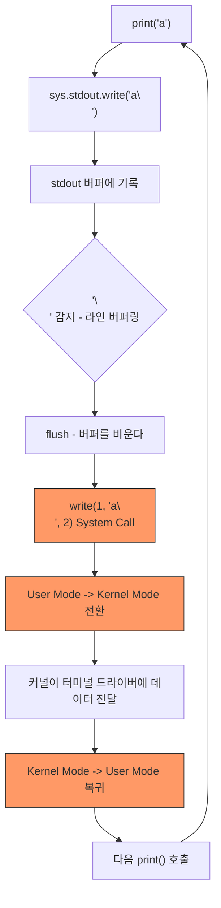
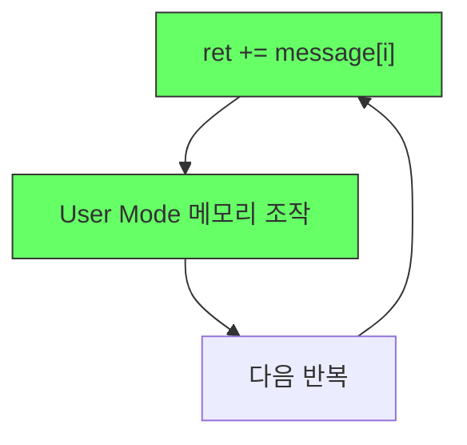

# Ch.2 CS Drill Down (2) - System Call이 왜 비싼가

[< print()는 어디로 가는가](./02-print-internals.md) | [정리 >](./04-summary.md)

---

[이전 페이지](./02-print-internals.md)에서 `print("a")`가 결국 `write()` System Call을 호출해서 커널까지 간다는 걸 확인했다. 그런데 "커널에게 부탁하는 게 뭐 그리 비싸?"라고 생각할 수 있다. 얼마나 비싼지 구체적으로 보자.


## User Mode vs Kernel Mode - 공항 비유

비유를 하나 들자. 공항의 출국장을 떠올려봐. 일반인(User Mode)은 공항 로비까지만 갈 수 있다. 활주로에 나가서 비행기에 짐을 직접 실을 수는 없다. 반드시 보안 검색대를 통과하고, 항공사 직원(커널)에게 부탁해야 한다. 이 "보안 검색대 통과" 과정이 System Call이고, 이 통과에는 시간이 든다.

<details>
<summary>User Mode / Kernel Mode (사용자 모드 / 커널 모드)</summary>

CPU가 동작하는 두 가지 권한 수준이다.
- User Mode: 일반 프로그램이 실행되는 모드. 하드웨어에 직접 접근할 수 없다.
- Kernel Mode: 운영체제 커널이 실행되는 모드. 모든 하드웨어와 메모리에 접근 가능하다.

이 구분은 CPU 하드웨어 레벨에서 강제된다. 소프트웨어적으로 우회할 수 없다.

(출처: Intel 64 and IA-32 Architectures Software Developer's Manual, Volume 3, Chapter 5 - Protection)

</details>

System Call을 호출하면, CPU는 User Mode에서 Kernel Mode로 전환한다. 이때 벌어지는 일:

```
네 프로그램 (User Mode)
    |
    | write(1, "a\n", 2) 요청
    |
    v
==================================
  System Call 경계 (모드 전환)
  - 현재 작업 상태를 임시 저장
  - CPU 권한 수준 변경
  - 커널 코드로 점프
==================================
    |
    v
커널 (Kernel Mode)
    | 터미널 드라이버에 데이터 전달
    |
    v
==================================
  복귀 (모드 전환)
  - CPU 권한 수준 복원
  - 저장해둔 작업 상태 복원
  - 사용자 코드로 복귀
==================================
    |
    v
네 프로그램 계속 실행 (User Mode)
```

이 왕복을 모드 전환(Mode Switch)이라고 부른다. 참고로, 이후 챕터에서 다룰 Context Switch(프로세스/스레드 간 전환)와는 다른 개념이다. Mode Switch는 같은 프로그램 안에서 권한만 바뀌는 것이고, Context Switch는 아예 다른 프로그램으로 전환하는 것이다. 당연히 Context Switch가 더 비싸다.


## strace로 직접 눈으로 확인하기

<details>
<summary>write() System Call</summary>

파일(또는 파일처럼 취급되는 대상)에 데이터를 쓰는 System Call이다.
형태: `write(fd, buffer, count)`
- fd: 어디에 쓸지 (File Descriptor 번호)
- buffer: 무엇을 쓸지 (데이터가 담긴 메모리 주소)
- count: 얼마나 쓸지 (바이트 수)

`print("a")`는 결국 `write(1, "a\n", 2)`로 변환된다.
fd=1은 stdout이므로 터미널 화면에 출력되는 것이다.

(출처: Linux man page - write(2))

</details>

이걸 실제로 눈으로 확인할 수 있다. Linux에서 strace라는 도구를 쓰면 프로그램이 호출하는 System Call을 추적할 수 있다.

<details>
<summary>strace</summary>

Linux에서 프로그램이 호출하는 System Call을 추적하는 디버깅 도구다.
프로그램이 커널에 어떤 요청을 보내는지 실시간으로 볼 수 있어서, 성능 문제나 버그의 원인을 찾을 때 유용하다.
macOS에서는 dtruss가 유사한 역할을 하지만, SIP(System Integrity Protection) 때문에 바로 사용하기 어렵다.
macOS 사용자는 아래 결과만 확인해도 된다.

</details>

```bash
# Linux에서 실행
strace -e trace=write python3 -c "
for i in range(5):
    print('a')
"
```

출력 (Python 초기화 과정의 출력은 생략):

```
write(1, "a\n", 2)    = 2
write(1, "a\n", 2)    = 2
write(1, "a\n", 2)    = 2
write(1, "a\n", 2)    = 2
write(1, "a\n", 2)    = 2
```

`print()` 5번 호출 = `write()` System Call 5번 발생. 1:1 대응이다.

그러면 우리 테스트 코드에서는?

```python
for _ in range(100):                    # 100번 반복
    for i in range(len(message)):       # UUID는 36글자
        print(message[i])              # 매 글자마다 print
```

한 번의 요청당: 100 x 36 = 3,600번의 `print()` = 약 3,600번의 `write()` System Call = 3,600번의 모드 전환.

"3,600번이 실무에서 현실적인 수치인가?" 이 코드 자체는 극단적이다. 하지만 동시 접속자 수백 명이 요청을 보내면, 개별 요청의 System Call 수가 적더라도 누적되면 같은 수준에 도달한다. 원리를 체감하기 위한 실험이라고 보면 된다.

반면 `dontPrint` 버전에서는? 이 루프 안에서 `write()` System Call이 0번이다. 문자열 연결(`ret += message[i]`)은 순수하게 User Mode에서 메모리 조작만으로 끝나는 작업이니까.


## 모드 전환의 비용 - CPU Cycle로 보기

이 모드 전환 하나하나가 얼마나 비싼지 숫자로 보자.

<details>
<summary>CPU Cycle (CPU 사이클)</summary>

CPU가 하나의 기본 동작을 수행하는 데 걸리는 시간 단위다.
현대 CPU의 클럭 속도가 3GHz라면, 1초에 30억 번의 사이클이 돌아간다. 1 사이클은 약 0.33 나노초다.
단순한 덧셈은 1 사이클이면 되지만, 메모리 접근은 수십~수백 사이클, System Call은 수백~수천 사이클이 필요하다.

</details>

| 작업 | 대략적인 CPU 사이클 수 |
|------|---------------------|
| 변수 간 덧셈 | 1 사이클 |
| 메모리(RAM) 읽기 | 100~300 사이클 |
| System Call (단순) | 수백~수천 사이클 |
| System Call + 실제 I/O | 수천~수만 사이클 |

(출처: Ulrich Drepper, "What Every Programmer Should Know About Memory", 2007 / Livio Soares & Michael Stumm, "FlexSC", OSDI 2010. 현대 Linux에서는 Spectre/Meltdown 보안 패치(KPTI) 이후 모드 전환 비용이 더 증가했다.)

CPU 내부에서 변수를 더하는 건 1 사이클이면 된다. 메모리를 읽는 건 수백 사이클. System Call은 수천 사이클. 자릿수가 다르다.

`ret += message[i]`는 메모리 조작이니까 수십~수백 사이클.
`print(message[i])`는 System Call을 포함하니까 수천 사이클 이상.

이걸 3,600번 반복하면? 그 차이가 수십 배의 응답 시간 차이로 나타나는 거다.


## Buffer는 왜 안 막아주는가

여기서 자연스러운 의문이 든다. "매번 System Call을 하면 비효율적이니까, 운영체제나 Python이 뭔가 방어 장치를 두지 않았을까?"

실제로 그런 장치가 있다. Buffer라는 건데, 데이터를 임시로 모아뒀다가 한 번에 내보내는 메커니즘이다.

<details>
<summary>Buffer (버퍼)</summary>

데이터를 임시로 모아두는 메모리 공간이다.
매번 조금씩 I/O를 하면 비효율적이니까, 일정량을 모았다가 한 번에 처리하기 위해 사용한다.
마트에서 장 볼 때 물건 하나 살 때마다 계산대를 가는 게 아니라, 카트에 모아서 한 번에 계산하는 것과 같다.

</details>

<details>
<summary>I/O (Input/Output, 입출력)</summary>

프로그램이 외부와 데이터를 주고받는 모든 행위를 말한다.
화면 출력, 파일 읽기/쓰기, 네트워크 통신, 키보드 입력 등이 전부 I/O다.
I/O는 CPU 연산에 비해 압도적으로 느리다. 성능 문제의 대부분은 I/O에서 발생한다.

</details>

Python의 stdout에도 내부 버퍼가 있다. 그런데 문제는 이 버퍼의 동작 모드다.

| 상황 | 버퍼링 모드 | 동작 |
|------|-----------|------|
| 터미널에 연결 | 라인 버퍼링 | `\n`(줄바꿈)이 들어오면 즉시 flush |
| 파일/파이프로 리다이렉트 | 풀 버퍼링 | 버퍼가 가득 차면 flush (보통 4~8KB) |

<details>
<summary>flush (플러시)</summary>

버퍼에 쌓아둔 데이터를 실제로 내보내고 버퍼를 비우는 행위다.
라인 버퍼링에서는 줄바꿈(`\n`)이 들어올 때, 풀 버퍼링에서는 버퍼가 가득 찰 때, 또는 프로그램이 명시적으로 `flush()`를 호출할 때 발생한다.
flush가 일어나면 그때 비로소 `write()` System Call이 호출된다.

</details>

`print()`는 기본적으로 끝에 `\n`을 붙인다. 그리고 우리 서버(uvicorn)는 터미널에서 실행하고 있다. 터미널 연결 = 라인 버퍼링 = 줄바꿈마다 flush = 매 `print()`마다 `write()` System Call 발생.

결국 버퍼가 있음에도, `print()`의 기본 동작(`\n` 추가)과 라인 버퍼링의 조합 때문에 매 호출마다 System Call이 발생하는 거다.


## 전체 그림

지금까지 print()의 겉에서부터 커널까지 한 겹씩 벗겨봤다. 전체 흐름을 한 장에 정리하면 이렇다.



이 사이클이 요청 한 번에 3,600번 반복된다.

반면 `dontPrint` 버전은:



System Call이 없다. 모드 전환이 없다. 전부 User Mode에서 끝난다. 빠를 수밖에 없다.

---

[< print()는 어디로 가는가](./02-print-internals.md) | [유사 사례, 실무 대안, 키워드 정리 >](./04-summary.md)
