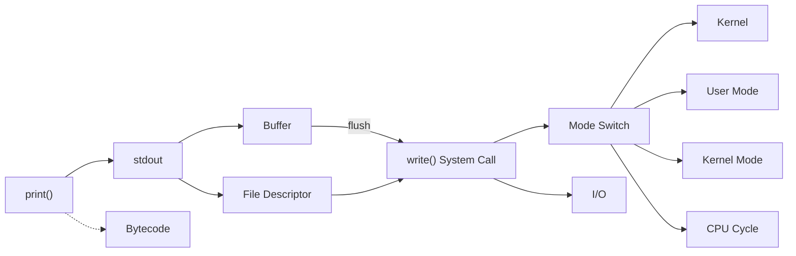

# Ch.2 유사 사례, 실무 대안, 키워드 정리

[< System Call이 왜 비싼가](./03-syscall-cost.md)

---

## 2-6. 유사 사례 소개

같은 원리가 적용되는 사례는 도처에 있다.

- Python의 `logging` 모듈도 결국 `StreamHandler`가 `sys.stderr`에 `write()`를 호출한다. 로그 레벨을 DEBUG로 설정해두고 운영에 나가면, 모든 디버그 메시지가 I/O를 유발한다.
- 파일 쓰기(`open` + `write`)도 결국 `write()` System Call이다. 다만 파일은 보통 풀 버퍼링이 적용되어서, `print()`만큼 System Call이 잦지는 않다.
- ORM(SQLAlchemy, JPA 등)의 쿼리 로그를 켜두면, 매 쿼리마다 SQL 문을 stdout에 쓴다. 이것도 System Call이다.
- Java의 `System.out.println()`도 OS의 `write()` System Call로 이어진다. 언어가 달라도 운영체제 위에서 돌아가는 한, 같은 원리가 적용된다.

핵심: "화면에 뭔가를 출력하는 행위"는 언어를 불문하고 System Call을 동반하며, System Call은 공짜가 아니다.


## 그래서 실무에서는 어떻게 하는가

"print가 느리다는 건 알겠는데, 그러면 로그를 아예 안 찍으라는 건가?"

아니다. 로그를 없애라는 게 아니라, 제어하라는 거다.

```python
import logging

# 이것만 해두면 WARNING 이상만 출력된다
logging.basicConfig(level=logging.WARNING)
logger = logging.getLogger(__name__)

# 개발 중에는 이렇게 쓰고
logger.debug("디버깅용 메시지")  # 운영에서는 출력 안 됨

# 중요한 건 이렇게
logger.warning("이건 운영에서도 출력됨")
```

`logging` 모듈을 쓰면 로그 레벨로 출력을 제어할 수 있다. 개발 환경에서는 DEBUG로 전부 보고, 운영 환경에서는 WARNING 이상만 출력하도록 설정하면, 불필요한 System Call을 원천 차단할 수 있다.

요점은 이거다: `print()`는 디버깅 도구다. 운영 코드에 남기는 게 아니라, 용도에 맞는 도구(`logging`)를 쓰는 거다.

---

## 3. 오늘 키워드 정리

이번 챕터에서 새로 등장한 키워드들을 정리한다.

<details>
<summary>Bytecode (바이트코드)</summary>

소스 코드를 컴퓨터가 실행하기 직전 단계로 변환한 중간 코드다.
Python은 `.py` -> bytecode -> CPython VM 실행 순서로 동작한다.
`dis` 모듈로 Python bytecode를 확인할 수 있다.

</details>

<details>
<summary>stdout (표준 출력)</summary>

프로그램의 기본 출력 통로. File Descriptor 1번에 해당한다.
`print()`는 내부적으로 `sys.stdout.write()`를 호출한다.
터미널에 연결되어 있을 때는 라인 버퍼링으로 동작한다.

</details>

<details>
<summary>File Descriptor (파일 디스크립터, fd)</summary>

운영체제가 열린 파일이나 I/O 자원에 부여하는 정수 번호.
0: stdin, 1: stdout, 2: stderr.
네트워크 소켓도 fd를 부여받는다.
Unix의 "Everything is a file" 철학의 핵심 개념이다.

</details>

<details>
<summary>System Call (시스템 콜)</summary>

사용자 프로그램이 커널에게 하드웨어 관련 작업을 요청하는 인터페이스.
`write()`, `read()`, `open()`, `close()`, `fork()` 등이 있다.
모든 I/O 작업은 System Call을 통해야 한다.

</details>

<details>
<summary>Kernel (커널)</summary>

운영체제의 핵심 프로그램. 하드웨어 자원을 관리하고 프로그램 간 중재 역할을 한다.
System Call을 통해서만 접근 가능하다.

</details>

<details>
<summary>User Mode / Kernel Mode (사용자 모드 / 커널 모드)</summary>

CPU의 두 가지 권한 수준.
User Mode에서는 하드웨어 직접 접근이 불가하고, Kernel Mode에서는 모든 자원에 접근 가능하다.
System Call 호출 시 User -> Kernel -> User 왕복이 발생하며, 이 전환에 수백~수천 CPU 사이클이 소요된다.

</details>

<details>
<summary>write() System Call</summary>

`write(fd, buffer, count)` - 지정된 fd에 데이터를 쓰는 System Call.
`print("a")`는 결국 `write(1, "a\n", 2)`로 변환된다.

</details>

<details>
<summary>CPU Cycle (CPU 사이클)</summary>

CPU의 기본 동작 단위. 3GHz CPU는 초당 30억 사이클이 돌아간다.
단순 연산은 1 사이클, 메모리 접근은 수백 사이클, System Call은 수백~수천 사이클이 필요하다.

</details>

<details>
<summary>Buffer (버퍼)</summary>

I/O 효율을 위해 데이터를 임시로 모아두는 메모리 공간.
Python stdout은 터미널 연결 시 라인 버퍼링(줄바꿈마다 flush), 파일 연결 시 풀 버퍼링으로 동작한다.

</details>

<details>
<summary>flush (플러시)</summary>

버퍼에 쌓아둔 데이터를 실제로 내보내고 버퍼를 비우는 행위.
flush가 일어나면 `write()` System Call이 호출된다.

</details>

<details>
<summary>I/O (Input/Output, 입출력)</summary>

프로그램이 외부와 데이터를 주고받는 행위의 총칭.
화면 출력, 파일 읽기/쓰기, 네트워크 통신, 키보드 입력 등이 전부 I/O다.
CPU 연산보다 압도적으로 느리며, 대부분의 성능 문제는 I/O에서 시작된다.

</details>

<details>
<summary>Mode Switch (모드 전환)</summary>

CPU가 User Mode에서 Kernel Mode로, 또는 그 반대로 전환되는 것.
System Call 호출 시마다 발생하며, 작업 상태 저장/복원 등의 오버헤드가 따른다.
이후 챕터에서 다룰 Context Switch(프로세스/스레드 간 전환)와는 구분되는 개념이다.

</details>

<details>
<summary>Throughput (처리량)</summary>

단위 시간당 처리할 수 있는 작업의 양. 보통 req/s로 표현하며, 높을수록 좋다.

</details>

<details>
<summary>Latency (지연 시간)</summary>

요청부터 응답까지 걸리는 시간. 보통 ms 단위로 표현하며, 낮을수록 좋다.

</details>

<details>
<summary>VU (Virtual User, 가상 사용자)</summary>

부하 테스트에서 실제 사용자를 시뮬레이션하는 가상 클라이언트.
k6에서 `vus: 100`이면 100명이 동시에 요청을 보내는 상황을 재현한다.

</details>


### 키워드 연관 관계




## 다음에 이어지는 이야기

이번 챕터에서는 `print()`라는 단순한 함수 하나가 System Call과 모드 전환이라는 무거운 작업을 유발한다는 걸 확인했다.

그런데 한 가지 의문이 남는다. "그러면 I/O를 async로 처리하면 해결되는 거 아닌가?"

다음 챕터에서는 CPU Bound와 I/O Bound의 차이를 다루면서, "모든 걸 async로 하면 빨라진다"는 흔한 오해를 깨부순다.

---

[< System Call이 왜 비싼가](./03-syscall-cost.md)

[< Ch.1 왜 CS를 공부해야 하는가](../ch01/README.md) | [Ch.3 로그를 뺐더니 빨라졌어요? (2) - CPU Bound와 I/O Bound >](../ch03/README.md)
