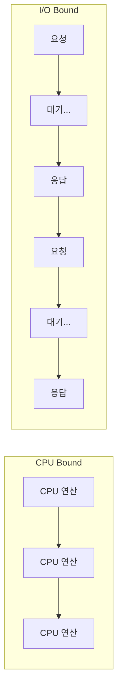
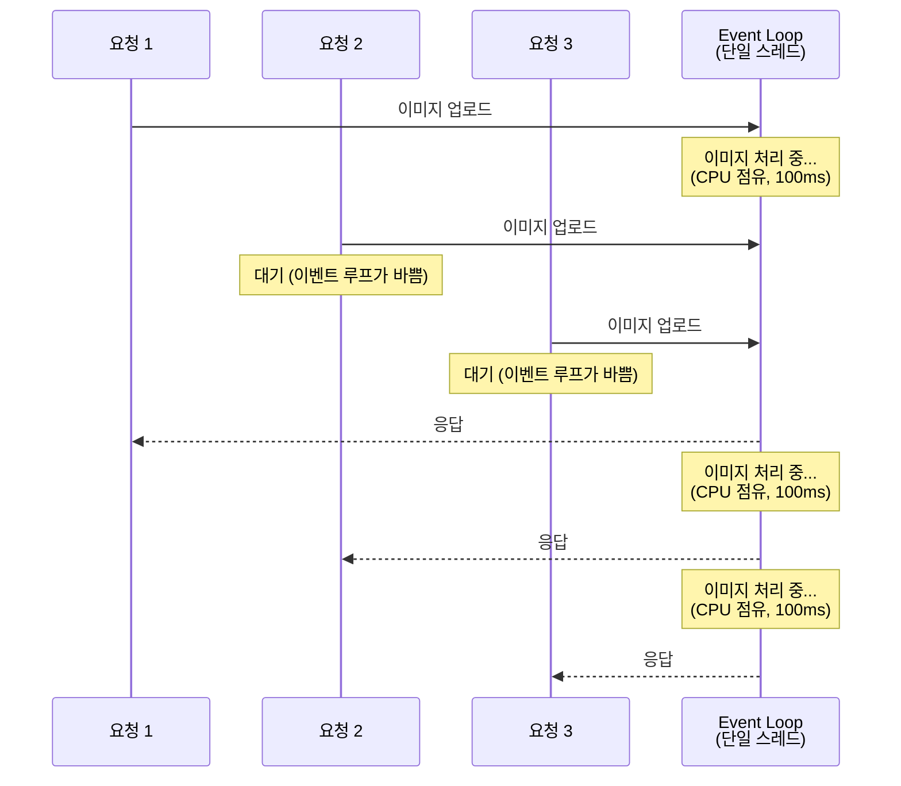

# Ch.3 CS Drill Down (1) - CPU Bound vs I/O Bound

[< 사례와 코드](./01-case.md) | [CS Drill Down (2) >](./03-concurrency-gil.md)

---

앞에서 async로 이미지 처리를 했더니 8배 느려지는 걸 확인했다. 코드 로직은 같은데, 실행 방식만 바꿨을 뿐인데 왜?

답을 한 줄로 말하면: 이미지 처리는 CPU Bound 작업이고, async는 I/O Bound 작업에 효과가 있는 기법이다. 칼을 들고 망치질을 한 격이다.

## CPU Bound와 I/O Bound

프로그램이 느린 이유는 크게 두 가지다.

1. CPU가 할 일이 많아서 느리다 → CPU Bound
2. 외부 장치(디스크, 네트워크, DB)를 기다려서 느리다 → I/O Bound

CPU Bound (CPU 바운드)

프로그램의 실행 속도가 CPU의 연산 능력에 의해 제한되는 상태다.
CPU가 쉬지 않고 계산하고 있어서, CPU가 더 빨라지지 않는 한 성능이 나아지지 않는다.
이미지 처리, 영상 인코딩, 암호화, 과학 계산, 머신러닝 학습 등이 대표적이다.

I/O Bound (I/O 바운드)

프로그램의 실행 속도가 I/O(입출력) 속도에 의해 제한되는 상태다.
CPU는 놀고 있는데, 디스크에서 파일을 읽어오거나 네트워크 응답을 기다리느라 전체가 느려진다.
DB 쿼리, 파일 읽기/쓰기, HTTP API 호출, print() 등이 대표적이다.

구분 기준은 단순하다. "CPU가 일하는 시간"과 "기다리는 시간" 중 뭐가 더 긴가?

CPU Bound는 CPU가 쉴 틈 없이 연산한다. I/O Bound는 요청을 보내고 응답이 올 때까지 대부분의 시간을 기다린다.

## 우리 사례에 적용해보기

### print()는 I/O Bound였다

Ch.2에서 다룬 `print()`는 `write()` System Call을 호출했다. CPU가 하는 일은 "커널에게 데이터를 건네주는 것"뿐이고, 실제로 시간이 걸리는 건 커널이 데이터를 stdout에 쓰는 과정이다. CPU는 그동안 기다린다. 전형적인 I/O Bound다.

그래서 async가 도움이 됐다. "기다리는 동안 다른 일을 해" 라고 CPU에게 시킬 수 있으니까.

### 이미지 처리는 CPU Bound다

Pillow의 `Image.rotate(180)`이 하는 일을 생각해보자. 1.4MB 8K 이미지의 모든 픽셀 좌표를 뒤집어야 한다. 이건 순수한 수학 연산이다. CPU가 쉬지 않고 계산한다. 기다리는 시간 같은 건 없다. 전형적인 CPU Bound다. (엄밀하게 말하면 `Image.save()`는 디스크에 쓰는 I/O도 포함한다. 하지만 이미지를 압축/인코딩하는 CPU 작업이 대부분이고, 디스크 쓰기는 아주 짧다. 전체적으로 CPU Bound 성격이 지배적이다.)

여기에 async를 건다는 건, "쉬는 시간에 다른 일을 해"라고 시키는 건데, 쉬는 시간이 없다. CPU가 계속 일하고 있다. async를 붙여봐야 아무 효과가 없는 이유가 이거다.

오히려 async의 스케줄링 오버헤드(Coroutine 생성, 이벤트 루프 관리 등)만 추가되어서 더 느려진다.

## 왜 asyncio 버전이 8배나 느린가

단순히 "효과가 없다"가 아니라 "8배 느려졌다"는 게 핵심이다. 원인은 이벤트 루프 블로킹이다.

Event Loop (이벤트 루프)

asyncio의 핵심 엔진이다. 단일 스레드에서 돌아가며, 등록된 비동기 작업들을 순서대로 실행한다.
어떤 작업이 I/O를 기다리는 동안(`await`), 이벤트 루프는 다른 작업으로 전환해서 실행한다.
그래서 하나의 스레드로도 여러 I/O 작업을 동시에 처리할 수 있다.
하지만 어떤 작업이 CPU를 오래 점유하면, 이벤트 루프가 다른 작업으로 전환할 수 없다.

FastAPI는 `async def` 핸들러를 이벤트 루프에서 직접 실행한다. 이벤트 루프는 단일 스레드다. `upload_asyncio` 핸들러가 이미지를 처리하는 동안, 이벤트 루프는 그 CPU 작업이 끝날 때까지 다른 요청을 처리하지 못한다.

코드를 다시 보자. `asyncio.gather(convert_image_async(...), insert_async(...))`로 "동시 실행"을 의도했지만, `convert_image_async` 안에 `await`가 하나도 없다. `gather`는 코루틴을 이벤트 루프에 등록하고 순서대로 실행하는데, 첫 번째 코루틴이 `await`로 양보하지 않으면 두 번째 코루틴은 시작도 못 한다. 결국 `gather`를 썼어도 이미지 처리 → DB 저장이 순차적으로 실행된다.

20명이 동시에 요청을 보내면, 한 명의 이미지 처리가 끝나야 다음 사람의 요청을 처리할 수 있다. 사실상 순차 처리가 되는 거다.

반면 `def` (동기) 핸들러는 FastAPI가 자동으로 스레드풀에서 실행한다. 여러 요청이 동시에 다른 스레드에서 돌아간다. 이벤트 루프는 자유롭게 다른 작업을 처리할 수 있다.

이게 "async로 했더니 오히려 느려진" 진짜 이유다.

## Blocking과 Non-blocking

여기서 중요한 개념이 하나 나온다. Blocking이다.

Blocking I/O (블로킹 I/O)

I/O 작업이 완료될 때까지 호출한 쪽이 멈추고 기다리는 방식이다.
파일을 읽는 동안 프로그램이 다른 일을 할 수 없다.
Python의 기본 파일 읽기(`open().read()`), 기본 소켓 통신 등이 Blocking I/O다.

Non-blocking I/O (논블로킹 I/O)

I/O 작업을 요청만 하고 바로 돌아오는 방식이다.
결과가 준비되면 나중에 알려주거나(콜백), 직접 확인한다(polling).
asyncio의 `await`가 이 방식을 활용한다. "나는 기다릴 테니 다른 일 먼저 해"라고 이벤트 루프에게 알려주는 것이다.

async/await는 "기다리는 시간"을 활용하는 기법이다. I/O를 요청하고 응답을 기다리는 동안, 이벤트 루프가 다른 작업을 처리한다.

그런데 CPU Bound 작업에는 "기다리는 시간"이 없다. CPU가 계속 일하고 있다. `await`를 걸어봐야 양보할 타이밍이 없다.

정리하면:

| 작업 유형 | CPU 상태 | async 효과 |
|-----------|---------|-----------|
| I/O Bound | 대부분 대기 | 대기 시간에 다른 작업 가능 → 효과 있음 |
| CPU Bound | 계속 연산 | 양보할 타이밍 없음 → 효과 없음 (오히려 악화) |

## Context Switch - Mode Switch와 뭐가 다른가

Ch.2에서 Mode Switch를 배웠다. User Mode에서 Kernel Mode로 전환되는 것이었다. 이번 챕터에서는 비슷하지만 다른 개념이 나온다. Context Switch다.

Context Switch (컨텍스트 스위치)

CPU가 현재 실행 중인 프로세스(또는 스레드)를 멈추고, 다른 프로세스(또는 스레드)로 전환하는 것이다.
전환할 때 현재 작업의 상태(레지스터, 프로그램 카운터, 스택 포인터 등)를 저장하고, 다음 작업의 상태를 복원해야 한다.
이 저장/복원 과정에 수천~수만 CPU 사이클이 소요된다.
OS의 스케줄러가 "이 프로세스는 잠깐 쉬고, 저 프로세스를 실행하자"고 결정할 때 발생한다.

둘의 차이:

| 개념 | 무엇이 전환되나 | 언제 발생하나 | 비용 |
|------|---------------|-------------|------|
| Mode Switch | CPU 권한 수준 (User ↔ Kernel) | System Call 호출 시 | 수백~수천 사이클 |
| Context Switch | 실행 주체 (프로세스/스레드) | 스케줄러 결정, I/O 대기 등 | 수천~수만 사이클 |

Mode Switch는 같은 프로세스 안에서 권한만 바뀌는 거다. Context Switch는 아예 다른 프로세스/스레드로 갈아탄다. 당연히 Context Switch가 더 비싸다.

(Ch.2에서 "Mode Switch와 Context Switch는 구분되는 개념이다"라고 예고했었다. 이게 그 구분이다.)

이번 사례에서 Context Switch가 중요한 이유: ThreadPool과 ProcessPool은 여러 스레드/프로세스를 사용한다. 스레드/프로세스 간 전환이 잦아지면 Context Switch 비용이 쌓인다. 이 비용도 성능에 영향을 준다.

그런데 ThreadPool은 동기와 비슷한 성능인 반면, asyncio는 8배 느렸다. Context Switch 비용이 있어도 스레드가 동시에 요청을 처리하는 이점이 더 크기 때문이다. 반면 asyncio는 단일 스레드라 Context Switch 비용은 없지만, CPU 작업 때문에 순차 처리가 되어버렸다.

다음에서 이어지는 질문: "ThreadPool이 동기와 비슷한 건 이해가 된다. 그런데 왜 동기보다 빠르지 않은가? 스레드가 여러 개면 병렬로 처리돼서 더 빨라야 하는 거 아닌가?"

답은 GIL이다. Python에서 CPU Bound 작업을 스레드로 돌려봤자 진짜 병렬이 아닌 이유를 다음에서 다룬다.

---

[< 사례와 코드](./01-case.md) | [CS Drill Down (2) - GIL과 동시성 전략 >](./03-concurrency-gil.md)
