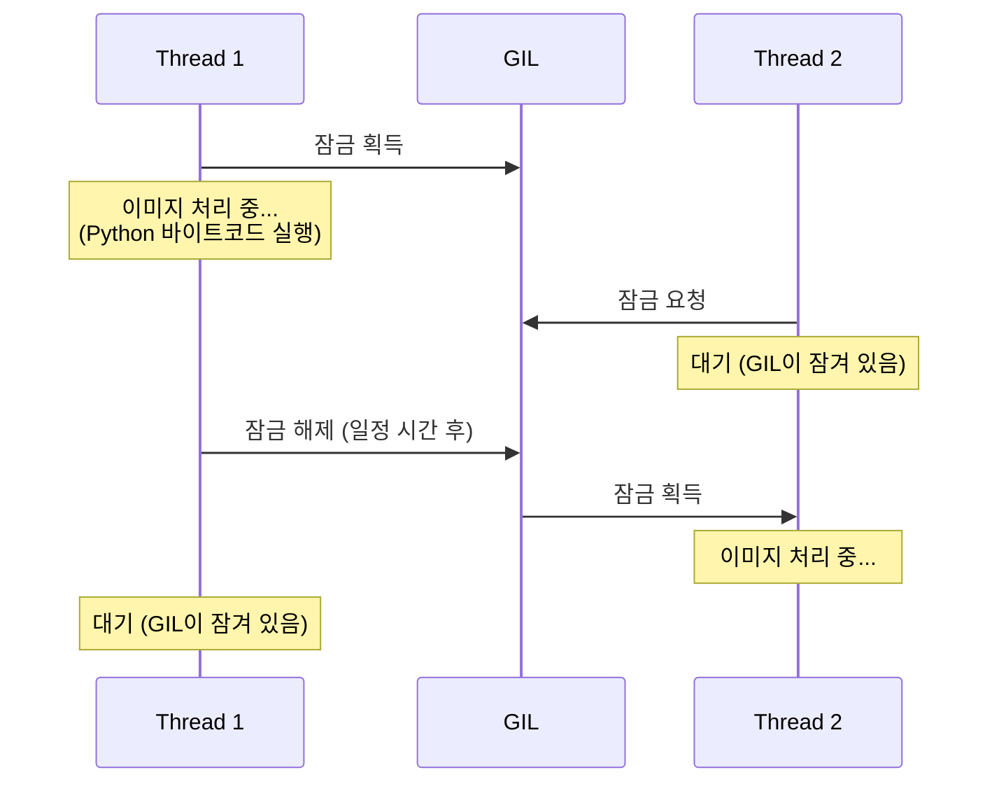
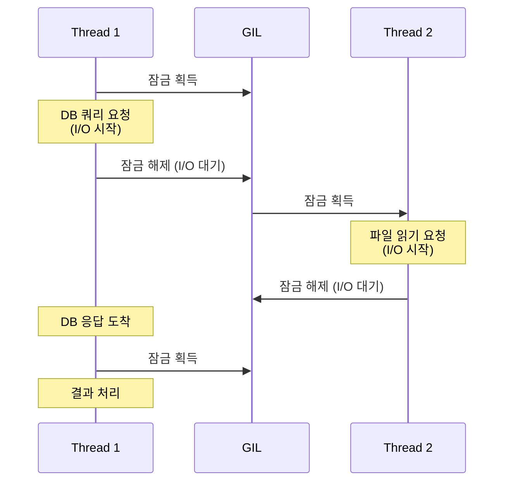

# Ch.3 CS Drill Down (2) - GIL과 동시성 전략

[< CPU Bound vs I/O Bound](./02-cpu-io-bound.md) | [유사 사례와 키워드 정리 >](./04-summary.md)

---

앞에서 CPU Bound와 I/O Bound의 차이를 확인했다. asyncio가 CPU Bound 작업에서 왜 느려지는지도 이해했다. 그런데 아직 풀리지 않는 의문이 하나 있다.

"ThreadPool은 스레드를 여러 개 쓰는데, 왜 동기보다 빠르지 않은가?"

스레드가 여러 개면 이미지를 동시에 처리할 수 있어야 하는 거 아닌가? 그런데 벤치마크에서 ThreadPool(154ms)과 sync(169ms)는 거의 같았다. 이유는 Python에만 있는 특수한 제약 때문이다.


## GIL - Global Interpreter Lock

<details>
<summary>CPython</summary>

Python의 "공식" 구현체다. `python3`을 설치하면 기본으로 설치되는 게 CPython이다. C 언어로 작성되어 있어서 CPython이라고 부른다.
PyPy(JIT 컴파일), Jython(JVM), IronPython(.NET) 같은 다른 구현체도 존재하지만, 대부분의 Python 개발자가 쓰는 건 CPython이다.
이 챕터에서 "Python"이라고 쓰면, 특별한 언급이 없는 한 CPython을 말한다.

</details>

<details>
<summary>GIL (Global Interpreter Lock, 전역 인터프리터 잠금)</summary>

CPython에서, 한 번에 하나의 스레드만 Python 바이트코드를 실행할 수 있게 강제하는 잠금 장치다.
스레드가 10개 있어도, 어느 한 시점에 Python 코드를 실행하는 스레드는 딱 하나뿐이다.
왜 이런 제약을 넣었나? CPython은 객체의 메모리를 reference counting으로 관리한다. 어떤 객체를 참조하는 변수가 몇 개인지 세고, 0이 되면 메모리를 해제한다. 이 참조 카운트를 여러 스레드가 동시에 수정하면 값이 꼬인다(race condition). 그래서 "한 번에 하나만 실행하게 하자"는 단순한 해결책으로 GIL을 도입한 거다.

</details>

<details>
<summary>Reference Counting (참조 카운팅)</summary>

CPython의 메모리 관리 방식이다.
모든 Python 객체에는 "나를 참조하고 있는 변수/컨테이너가 몇 개인지"를 세는 카운터가 있다.
`a = [1, 2, 3]`이면 그 리스트의 참조 카운트는 1이다. `b = a`를 하면 2가 된다.
참조 카운트가 0이 되면(아무도 사용하지 않으면) 즉시 메모리를 해제한다.
이 카운터를 여러 스레드가 동시에 올리고 내리면 값이 꼬이니까, GIL로 보호하는 거다.

</details>

GIL은 CPython의 설계적 제약이다. Python 인터프리터 전체에 걸리는 잠금 장치로, 한 번에 하나의 스레드만 Python 바이트코드를 실행할 수 있다.

이게 무슨 뜻이냐면:



스레드가 아무리 많아도, CPU Bound 작업(Python 바이트코드 실행)은 한 번에 하나만 진행된다. 스레드 간 전환(Context Switch) 비용만 추가되고, 실질적인 병렬 처리는 일어나지 않는다.

참고로, GIL을 영원히 독점하는 건 아니다. CPython은 약 5ms마다(기본값, `sys.getswitchinterval()`로 확인 가능) 현재 GIL을 쥐고 있는 스레드에게 "그만 양보해"라는 신호를 보낸다. 하지만 양보하고 다시 획득하는 과정에서 Context Switch가 발생하고, CPU Bound 작업은 결국 하나의 스레드만 실행되므로 병렬 효과는 없다.

그래서 ThreadPool의 결과가 sync와 비슷했던 거다. 스레드를 여러 개 만들었지만, GIL 때문에 동시에 이미지를 처리하지 못한다.

(참고: "Python이 느리다"는 불만의 상당 부분이 GIL 때문이다. 하지만 이건 반쪽짜리 진실이다. 바로 아래에서 설명한다.)


## GIL이 풀리는 순간 - I/O Bound에서는 다르다

GIL이 항상 문제인 건 아니다. 핵심은 이거다: GIL은 Python 바이트코드를 실행할 때만 잠긴다. I/O 작업을 할 때는 GIL이 풀린다.



스레드가 `write()`, `read()`, `socket.recv()` 같은 I/O System Call을 호출하면, 그 스레드는 GIL을 놓는다. 왜냐하면 I/O를 기다리는 동안에는 Python 바이트코드를 실행하지 않기 때문이다.

그래서:

| 작업 유형 | 멀티스레드 효과 | 이유 |
|-----------|--------------|------|
| CPU Bound | 효과 없음 | GIL 때문에 한 번에 하나만 실행 |
| I/O Bound | 효과 있음 | I/O 대기 중 GIL 해제 → 다른 스레드 실행 |

"GIL 때문에 Python 멀티스레드가 쓸모없다"는 말은 CPU Bound 작업에만 해당된다. I/O Bound 작업에서는 멀티스레드가 잘 동작한다.

Ch.2에서 다룬 `print()` 같은 I/O 작업을 여러 스레드에서 동시에 처리하면 효과가 있다. 하지만 이번 챕터의 이미지 처리처럼 CPU Bound 작업은 스레드를 아무리 늘려도 의미가 없다.


## 그러면 CPU Bound는 어떻게 하나 - ProcessPool

GIL은 프로세스 단위로 존재한다. 프로세스를 여러 개 만들면, 각 프로세스가 자기만의 GIL을 갖는다. 다시 말해, 서로 다른 프로세스에서는 Python 코드가 진짜 동시에 실행된다.

<details>
<summary>Process Pool (프로세스 풀)</summary>

미리 여러 개의 워커 프로세스를 만들어두고, 작업을 분배하는 구조다.
Python의 `concurrent.futures.ProcessPoolExecutor`가 이 역할을 한다.
각 워커 프로세스는 독립적인 메모리 공간과 GIL을 가지므로, CPU Bound 작업을 진짜 병렬로 실행할 수 있다.
단, 프로세스 간 데이터 교환(IPC)에는 직렬화/역직렬화(pickle) 비용이 든다.

</details>

<details>
<summary>Thread Pool (스레드 풀)</summary>

미리 여러 개의 워커 스레드를 만들어두고, 작업을 분배하는 구조다.
Python의 `concurrent.futures.ThreadPoolExecutor`가 이 역할을 한다.
같은 프로세스 안에서 동작하므로 메모리를 공유하고, IPC 비용이 없다.
하지만 GIL 때문에 CPU Bound 작업에서는 진짜 병렬 실행이 안 된다.
I/O Bound 작업에서는 GIL이 풀리므로 효과적이다.

</details>

벤치마크에서 ProcessPool(199ms)이 sync(169ms)보다 약간 느린 이유는, 프로세스 간 통신(IPC) 오버헤드 때문이다. 이미지 경로를 워커 프로세스에 전달하고, 결과를 돌려받는 데 시간이 든다.

"그러면 ProcessPool은 쓸모없는 건가?" 아니다. 이번 테스트에서는 요청당 이미지 1장을 처리하는 단순한 구조여서 IPC 오버헤드가 상대적으로 컸다. 이미지를 수십~수백 장 묶어서 처리하거나, CPU 작업이 더 무거운 경우(영상 인코딩, ML 추론 등)에는 ProcessPool의 병렬 처리 이점이 IPC 비용을 압도한다.


## Coroutine과 async/await의 정체

여기서 asyncio의 동작 원리를 좀 더 깊게 들어가보자.

<details>
<summary>Coroutine (코루틴)</summary>

실행을 중간에 멈췄다가 나중에 이어서 실행할 수 있는 함수다.
Python에서 `async def`로 정의한 함수는 호출하면 코루틴 객체를 반환한다.
`await`를 만나면 실행을 멈추고 이벤트 루프에 제어권을 넘긴다.
이벤트 루프는 그 사이에 다른 코루틴을 실행한다.
일반 함수와 달리, 코루틴은 호출 스택을 유지한 채로 멈출 수 있다.

</details>

`await`의 의미는 "여기서 잠깐 멈추고, 제어권을 이벤트 루프에 돌려줄게"다.

```python
async def fetch_data():
    response = await http_client.get("https://api.example.com")  # 여기서 양보
    # 응답이 돌아오면 여기서 이어서 실행
    return response.json()
```

`await http_client.get(...)` 에서 HTTP 요청을 보내고, 응답이 올 때까지 이 코루틴은 멈춘다. 그 동안 이벤트 루프는 다른 코루틴을 실행한다. 응답이 도착하면 이벤트 루프가 이 코루틴을 다시 깨운다.

이게 I/O Bound에서 잘 작동하는 이유다. "기다리는 시간"에 다른 일을 할 수 있으니까.

그런데 우리 이미지 처리 코드를 보자:

```python
async def convert_image_async(image_path, output_path):
    image = Image.open(image_path)      # CPU 작업 (양보 안 함)
    image = image.convert("RGB")        # CPU 작업 (양보 안 함)
    image = image.rotate(180)           # CPU 작업 (양보 안 함)
    image = image.rotate(180)           # CPU 작업 (양보 안 함)
    image = image.rotate(180)           # CPU 작업 (양보 안 함)
    image = image.rotate(180)           # CPU 작업 (양보 안 함)
    image.save(output_path)             # CPU 작업 (양보 안 함)
    return output_path
```

`await`가 없다. `async def`로 선언했지만, 내부에 양보 지점이 하나도 없다. 이 함수가 실행되는 동안 이벤트 루프는 꼼짝 못 한다. 사실상 동기 함수와 똑같이 동작하면서, 코루틴 생성/스케줄링 오버헤드만 추가된 셈이다.


## Concurrency vs Parallelism

마지막으로 혼동하기 쉬운 두 개념을 정리하자.

<details>
<summary>Concurrency (동시성)</summary>

여러 작업이 "논리적으로" 동시에 진행되는 것이다. 물리적으로 같은 순간에 실행될 필요는 없다.
단일 CPU에서도 작업 간에 빠르게 전환하면 동시에 진행되는 것처럼 보인다.
asyncio, 멀티스레딩이 동시성을 구현하는 방법이다.

</details>

<details>
<summary>Parallelism (병렬성)</summary>

여러 작업이 "물리적으로" 같은 순간에 실행되는 것이다.
여러 CPU 코어에서 각각 다른 작업을 실행한다.
멀티프로세싱이 병렬성을 구현하는 방법이다.
CPU Bound 작업의 성능을 올리려면 동시성이 아니라 병렬성이 필요하다.

</details>

| 개념 | 비유 | 실현 방법 |
|------|------|----------|
| Concurrency (동시성) | 혼자서 여러 업무를 번갈아 처리하는 것 | asyncio, threading |
| Parallelism (병렬성) | 여러 사람이 각자 업무를 처리하는 것 | multiprocessing |

Python에서 GIL 때문에, 스레드는 Concurrency는 가능하지만 Parallelism은 불가하다 (CPU Bound 한정). 프로세스는 둘 다 가능하다.

CPU Bound 작업을 빠르게 하려면 Concurrency(번갈아 실행)가 아니라 Parallelism(진짜 동시 실행)이 필요하다. Python에서 이를 달성하는 유일한 방법이 ProcessPool이다.


## 동시성 전략 선택 가이드

벤치마크 결과와 지금까지의 분석을 종합하면:

| 작업 유형 | 추천 전략 | 이유 | 비추천 |
|-----------|----------|------|--------|
| I/O Bound | asyncio 또는 ThreadPool | I/O 대기 중 다른 작업 가능 | ProcessPool (오버헤드 과다) |
| CPU Bound | ProcessPool | GIL 우회, 진짜 병렬 실행 | asyncio (이벤트 루프 블로킹) |
| CPU + I/O 혼합 | ProcessPool(CPU) + asyncio(I/O) | 각각에 맞는 전략 조합 | 하나의 전략으로 통일 |

(참고: Python 3.13에서 "Free-threaded Python"(GIL 없는 Python)이 실험적으로 도입되었다. 일반 `python3.13`이 아니라 `python3.13t`라는 별도 빌드를 설치해야 사용할 수 있다. 아직 실험 단계(experimental)이고, Pillow 같은 C 확장 라이브러리의 호환성 문제가 있어서 운영에서 쓰기는 이르다. 하지만 미래에는 GIL 없이 스레드만으로 CPU Bound 병렬 처리가 가능해질 수 있다. [PEP 703](https://peps.python.org/pep-0703/)에서 상세 내용을 확인할 수 있다.)

다음 페이지에서 이 전략들이 실무에서 어떻게 적용되는지 유사 사례와 함께 정리한다.

---

[< CPU Bound vs I/O Bound](./02-cpu-io-bound.md) | [유사 사례, 실무 대안, 키워드 정리 >](./04-summary.md)
