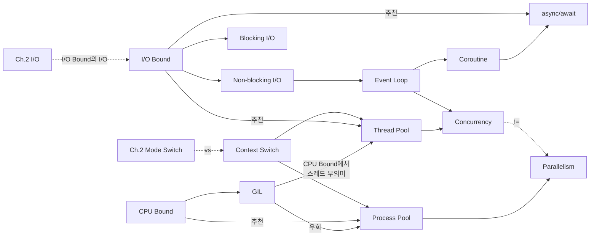

# Ch.3 유사 사례, 실무 대안, 키워드 정리

[< GIL과 동시성 전략](./03-concurrency-gil.md)

---

지금까지 "async를 잘못 쓰면 오히려 느려진다"는 걸 확인했다. CPU Bound 작업에 async를 걸면 이벤트 루프가 멈추고, ThreadPool을 써도 GIL 때문에 병렬이 안 된다. 같은 원리가 적용되는 다른 사례를 보고, 실무에서 어떻게 대응하는지 정리하겠다.


## 3-6. 유사 사례 소개

### pandas 연산을 async로 감싼 사례

데이터 분석 파이프라인을 만들면서 pandas의 `DataFrame.apply()`를 `async def` 안에서 실행하는 코드를 가끔 본다. "API 응답을 기다리는 동안 데이터 처리도 하면 효율적이겠지?" 하고 생각한 거다.

문제는 `DataFrame.apply()`가 CPU Bound 작업이라는 점이다. 수만 행의 데이터를 한 줄씩 변환하는 건 순수한 CPU 연산이다. async로 감싸봤자 이벤트 루프만 점유하고, 다른 비동기 작업(API 호출, DB 쿼리)까지 막아버린다.

### 암호화/해싱을 asyncio로 처리하려는 사례

비밀번호 해싱(`bcrypt`), 토큰 검증(`jwt.decode()`) 같은 작업을 `async def` 안에서 그대로 실행하는 경우다. 이것도 CPU Bound다. 특히 bcrypt는 의도적으로 느리게 설계된 해싱 알고리즘이라, 이벤트 루프를 수백 밀리초 단위로 멈추게 한다.

FastAPI에서 인증 미들웨어를 `async def`로 만들고 bcrypt를 직접 호출하면, 해싱이 끝날 때까지 다른 모든 요청이 멈춘다.

### DB 쿼리 결과 가공이 무거운 사례

"DB 쿼리가 느린 건 I/O Bound니까 async로 하면 되겠지"라고 생각하는 건 맞다. 그런데 쿼리 결과를 가공하는 부분은 다를 수 있다. 수만 건의 레코드를 필터링하고, 정렬하고, 집계하는 건 CPU Bound다.

쿼리 자체는 `await session.execute()`로 비동기 처리하더라도, 결과 가공이 무거우면 이벤트 루프가 멈춘다. 이런 경우 가공 로직을 ThreadPool이나 ProcessPool로 분리해야 한다.

### 언어가 달라도 원리는 같다

Node.js에서도 동일한 문제가 있다. Node.js의 이벤트 루프도 단일 스레드다. `crypto.pbkdf2Sync()` 같은 CPU 집약적 작업을 이벤트 루프에서 실행하면 모든 요청이 멈춘다. 그래서 Node.js에는 `worker_threads` 모듈이 있다. Python의 ProcessPool과 같은 역할이다.

Java나 Go처럼 진짜 멀티스레딩이 가능한 언어에서는 이 문제가 덜하다. 하지만 그래도 "이 작업이 CPU Bound인지 I/O Bound인지 파악하고, 거기에 맞는 전략을 쓴다"는 원칙은 동일하다.


## 그래서 실무에서는 어떻게 하는가

### 1. 먼저 작업 유형을 판별한다

코드를 작성하기 전에, 이 작업이 CPU Bound인지 I/O Bound인지 먼저 판단한다.

- CPU를 계속 쓰는가? → CPU Bound (이미지 처리, 데이터 변환, 암호화, ML 추론)
- 외부를 기다리는가? → I/O Bound (DB 쿼리, HTTP 요청, 파일 읽기, 메시지 큐)
- 둘 다 있는가? → 분리해서 각각에 맞는 전략을 적용

이 판별이 틀리면 모든 게 틀린다. "빠르게 하려면 async"라는 공식은 없다.


### 2. FastAPI에서의 실전 패턴

우리 테스트 코드에 이미 답이 있다. `upload` 엔드포인트(하이브리드 방식)를 보자:

```python
# 실무 권장 패턴: CPU는 ProcessPool, I/O는 async
@router.post("/upload")
async def upload(file: UploadFile = File(...)):
    image_path, output_path = _save_image(file)

    # CPU Bound: 별도 프로세스에서 실행
    loop = asyncio.get_running_loop()
    await loop.run_in_executor(
        process_executor, ImageProcessor.convert_image, image_path, output_path
    )

    # I/O Bound: 비동기로 실행
    await baseRepository.insert_async({"image_path": output_path})

    return {"image_path": image_path, "output_path": output_path}
```

CPU Bound 작업(이미지 처리)은 `ProcessPoolExecutor`에 넘기고, I/O Bound 작업(DB 저장)은 `await`로 비동기 처리한다. 각각에 맞는 도구를 쓰는 거다.

이때 주의할 점: `ProcessPoolExecutor`는 앱 레벨에서 한 번만 생성해서 재사용해야 한다. 요청마다 `with ProcessPoolExecutor() as executor:`를 쓰면, 매 요청마다 프로세스를 생성/해제하는 오버헤드가 든다.

```python
# 앱 시작 시 한 번만 생성
process_executor = ProcessPoolExecutor()

# 요청마다 재사용
await loop.run_in_executor(process_executor, heavy_cpu_function, args)
```


### 3. BackgroundTasks로 응답 먼저 보내기

이미지 처리가 끝날 때까지 사용자를 기다리게 할 필요가 없는 경우도 있다. 이럴 때는 응답을 먼저 보내고, 처리는 백그라운드에서 한다:

```python
# 백그라운드에서 실행될 함수
async def process_image_and_save(image_path: str, output_path: str):
    loop = asyncio.get_running_loop()
    await loop.run_in_executor(
        process_executor, ImageProcessor.convert_image, image_path, output_path
    )
    await baseRepository.insert_async({"image_path": output_path})


@router.post("/upload_background_task")
async def upload_background_task(
    file: UploadFile = File(...), background_tasks: BackgroundTasks = None
):
    image_path, output_path = _save_image(file)
    background_tasks.add_task(process_image_and_save, image_path, output_path)
    return {"image_path": image_path, "output_path": output_path}
```

`process_image_and_save` 안에서도 CPU Bound 작업은 `ProcessPool`에 위임하고 있다. BackgroundTasks가 이벤트 루프에서 실행되므로, 여기서도 CPU 작업을 직접 하면 다른 요청이 막힌다. 백그라운드라고 방심하지 말자.

주의할 점이 하나 더 있다. BackgroundTasks는 uvicorn 프로세스의 메모리에서 실행된다. 서버가 재시작되면(배포, 크래시 등) 아직 처리 안 된 백그라운드 작업은 사라진다. 중요한 작업이라면 Celery 같은 별도 태스크 큐를 써서 작업을 영속화(persistence)해야 한다.

사용자는 즉시 응답을 받고, 이미지 처리는 서버에서 천천히 한다. 물론 "처리 완료 알림"을 어떻게 줄 것인가는 별도로 설계해야 한다.

<details>
<summary>처리 완료 알림 방식</summary>

백그라운드로 작업을 넘긴 뒤, 클라이언트에게 "완료됐다"고 알려주는 방법은 여러 가지다:

- WebSocket: 서버와 클라이언트가 양방향 연결을 유지한다. 서버가 처리 완료 시 즉시 클라이언트에게 메시지를 보낼 수 있다. 실시간성이 필요한 경우에 적합하다.
- 폴링(Polling): 클라이언트가 주기적으로 "처리 끝났나요?"를 서버에 물어보는 방식이다. 단순하지만, 요청이 낭비될 수 있다.
- 콜백 URL: 클라이언트가 "처리 끝나면 이 URL로 POST 보내줘"라고 요청하는 방식이다. 서버 간 통신(B2B)에서 많이 쓴다.

각각의 장단점이 있고, 상황에 맞게 선택한다. 이건 네트워크 챕터(Ch.6)에서 더 다룬다.

</details>


### 4. def vs async def - 어떤 걸 쓸까

FastAPI에서 핸들러를 선언할 때, 간단한 가이드:

| 상황 | 핸들러 선언 | 이유 |
|------|-----------|------|
| 내부에 `await`가 있다 | `async def` | 비동기 I/O를 활용 |
| 내부에 `await`가 없다 | `def` | FastAPI가 자동으로 threadpool에서 실행 |
| CPU 작업이 무겁다 | `async def` + `run_in_executor` | ProcessPool에 명시적으로 위임 |

가장 흔한 실수: `async def` 안에서 동기 I/O나 CPU 작업을 그대로 호출하는 것. 이러면 이벤트 루프를 블로킹한다. `async def`를 쓸 거면, 내부의 모든 I/O가 `await` 가능한지 확인하자.

(더 나아가면 Celery 같은 태스크 큐를 사용해서 CPU Bound 작업을 완전히 분리하는 방법도 있다. 이건 분산 시스템 챕터(Ch.22)에서 다시 다룬다.)

---


## 3. 오늘 키워드 정리

이번 챕터에서 새로 등장한 키워드들을 정리한다.

(Ch.2에서 "print()가 왜 느린가"를 System Call과 Mode Switch로 설명했다. 이번 챕터에서는 "async가 왜 안 먹히는가"를 CPU Bound/I/O Bound와 GIL로 설명했다. 키워드를 알면 "왜"를 설명할 수 있다.)

<details>
<summary>CPU Bound (CPU 바운드)</summary>

프로그램의 실행 속도가 CPU의 연산 능력에 의해 제한되는 상태다.
CPU가 쉬지 않고 계산하고 있어서, CPU가 더 빨라지지 않는 한 성능이 나아지지 않는다.
이미지 처리, 영상 인코딩, 암호화, 과학 계산, ML 학습 등이 대표적이다.

</details>

<details>
<summary>I/O Bound (I/O 바운드)</summary>

프로그램의 실행 속도가 I/O(입출력) 속도에 의해 제한되는 상태다.
CPU는 놀고 있는데, 디스크에서 파일을 읽어오거나 네트워크 응답을 기다리느라 전체가 느려진다.
DB 쿼리, 파일 읽기/쓰기, HTTP API 호출, print() 등이 대표적이다.

</details>

<details>
<summary>Blocking I/O (블로킹 I/O)</summary>

I/O 작업이 완료될 때까지 호출한 쪽이 멈추고 기다리는 방식이다.
Python의 기본 파일 읽기, 소켓 통신 등이 Blocking I/O다.

</details>

<details>
<summary>Non-blocking I/O (논블로킹 I/O)</summary>

I/O 작업을 요청만 하고 바로 돌아오는 방식이다.
결과가 준비되면 나중에 알려주거나 직접 확인한다.
asyncio의 `await`가 이 방식을 활용한다.

</details>

<details>
<summary>Context Switch (컨텍스트 스위치)</summary>

CPU가 현재 실행 중인 프로세스/스레드를 멈추고, 다른 것으로 전환하는 것이다.
현재 작업의 상태(레지스터, 프로그램 카운터 등)를 저장하고 다음 작업의 상태를 복원해야 해서, 수천~수만 CPU 사이클이 소요된다.
Ch.2의 Mode Switch(같은 프로세스 내에서 권한만 전환)보다 비싸다.

</details>

<details>
<summary>GIL (Global Interpreter Lock)</summary>

CPython에서 한 번에 하나의 스레드만 Python 바이트코드를 실행할 수 있게 강제하는 잠금 장치다.
CPython의 메모리 관리 방식인 reference counting의 thread-safety를 보장하기 위해 도입되었다.
CPU Bound 작업에서 멀티스레드가 무의미한 핵심 원인이다.
I/O 작업 중에는 GIL이 해제되므로, I/O Bound에서는 멀티스레드가 효과적이다.
Python 3.13에서 Free-threaded Python(GIL 없는 모드)이 실험적으로 도입되었다 (별도 빌드 `python3.13t` 필요).

</details>

<details>
<summary>Event Loop (이벤트 루프)</summary>

asyncio의 핵심 엔진. 단일 스레드에서 돌아가며 비동기 작업들을 스케줄링한다.
코루틴이 `await`로 양보하면 다른 코루틴을 실행하고, I/O가 완료되면 원래 코루틴으로 돌아간다.
CPU Bound 작업이 이벤트 루프를 점유하면 모든 비동기 작업이 멈춘다.

</details>

<details>
<summary>Coroutine (코루틴)</summary>

실행을 중간에 멈췄다가 나중에 이어서 실행할 수 있는 함수다.
Python에서 `async def`로 정의하고, `await`로 양보 지점을 만든다.
일반 함수와 달리 호출 스택을 유지한 채 멈출 수 있다.

</details>

<details>
<summary>async/await</summary>

Python에서 비동기 프로그래밍을 위한 문법이다.
`async def`는 코루틴을 정의하고, `await`는 비동기 작업의 완료를 기다리면서 이벤트 루프에 제어권을 넘긴다.
`await`가 없는 `async def`는 사실상 동기 함수와 같다.

</details>

<details>
<summary>Thread Pool (스레드 풀)</summary>

미리 생성된 스레드 묶음에 작업을 분배하는 구조다.
`concurrent.futures.ThreadPoolExecutor`로 사용한다.
I/O Bound 작업에 적합하다. CPU Bound에는 GIL 때문에 효과 없다.

</details>

<details>
<summary>Process Pool (프로세스 풀)</summary>

미리 생성된 프로세스 묶음에 작업을 분배하는 구조다.
`concurrent.futures.ProcessPoolExecutor`로 사용한다.
각 프로세스가 독립적인 GIL을 가지므로 CPU Bound 작업을 진짜 병렬로 실행할 수 있다.
단, 프로세스 간 데이터 교환(IPC)에 직렬화(pickle) 비용이 든다.

</details>

<details>
<summary>Concurrency (동시성)</summary>

여러 작업이 논리적으로 동시에 진행되는 것이다.
물리적으로 같은 순간에 실행될 필요는 없다. 빠르게 전환하며 번갈아 실행해도 동시성이다.
asyncio, 멀티스레딩이 동시성을 구현한다.

</details>

<details>
<summary>Parallelism (병렬성)</summary>

여러 작업이 물리적으로 같은 순간에 실행되는 것이다.
여러 CPU 코어에서 각각 다른 작업을 실행한다.
멀티프로세싱이 병렬성을 구현한다. CPU Bound 작업의 성능을 올리려면 병렬성이 필요하다.

</details>

<details>
<summary>IPC (Inter-Process Communication)</summary>

서로 다른 프로세스끼리 데이터를 주고받는 것이다.
ProcessPool에서 메인 프로세스와 워커 프로세스 간에 데이터를 전달할 때 IPC가 발생한다.
Python에서는 pickle(직렬화)을 사용하며, 이 비용이 작업보다 크면 오히려 느려진다.

</details>

### 재등장 키워드 (이전 챕터에서 등장)

| 키워드 | 최초 등장 | 이번 챕터에서의 역할 |
|--------|----------|------------------|
| I/O (Ch.2) | Ch.2 | I/O Bound의 "I/O". CPU Bound와 대비되는 개념 |
| System Call (Ch.2) | Ch.2 | I/O 작업이 System Call을 통한다는 점을 전제로 깔고 감 |
| Mode Switch (Ch.2) | Ch.2 | Context Switch와 비교. Mode Switch는 같은 프로세스 내, Context Switch는 프로세스/스레드 간 |
| Throughput (Ch.2) | Ch.2 | 벤치마크에서 req/s 비교에 사용 |
| Latency (Ch.2) | Ch.2 | 벤치마크에서 응답 시간 비교에 사용 |
| VU (Ch.2) | Ch.2 | k6 부하 테스트에서 동시 사용자 수 설정 |


### 키워드 연관 관계




## 다음에 이어지는 이야기

이번 챕터에서는 "async가 만능이 아니다"라는 걸 CPU Bound vs I/O Bound, GIL, Event Loop를 통해 확인했다. 작업의 성격을 먼저 파악하고, 거기에 맞는 동시성 전략을 선택해야 한다.

그런데 "프로세스"와 "스레드"가 정확히 뭔지는 아직 깊게 다루지 않았다. 메모리를 공유한다/안 한다, 무겁다/가볍다 정도만 언급했다.

다음 챕터에서는 프로세스와 스레드의 실체를 파고든다. 메모리 구조(Stack, Heap, Data, Text)를 직접 들여다보고, Virtual Memory와 Page Fault까지 다룬다. OOM(Out of Memory)이 왜 나는지, Stack Overflow가 왜 "overflow"인지 이해하게 된다.

---

[< GIL과 동시성 전략](./03-concurrency-gil.md)

[< Ch.2 System Call과 커널](../ch02/README.md) | [Ch.4 프로세스와 스레드, 진짜로 이해하고 있는가 >](../ch04/README.md)
