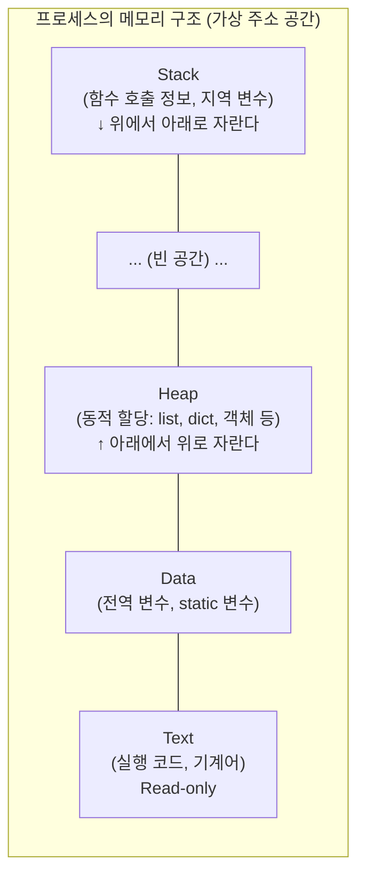
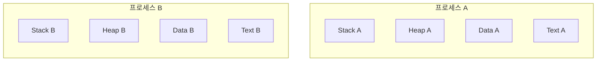
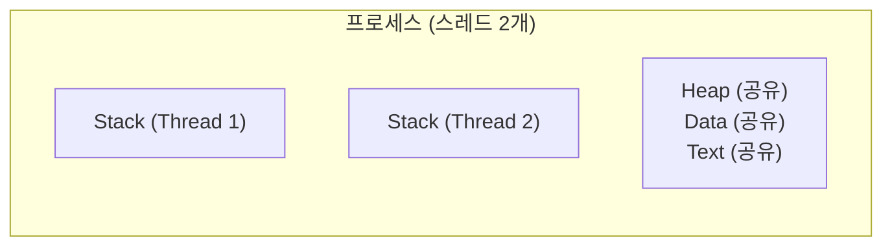

# Ch.4 CS Drill Down (1) - 메모리에서 프로세스와 스레드는 어떻게 존재하는가

[< 사례와 코드](./01-case.md) | [CS Drill Down (2) >](./03-virtual-memory.md)

---

앞에서 ProcessPool 16개가 1GB를 먹고, ThreadPool 16개는 68MB에 머무는 걸 확인했다. 약 15배 차이. 왜 이런 차이가 나는지를 이해하려면, 프로세스와 스레드가 메모리에서 어떻게 존재하는지를 알아야 한다.


## 프로세스의 메모리 구조 - 4개의 영역

운영체제가 프로세스를 만들면, 그 프로세스에게 독립적인 메모리 공간(가상 주소 공간)을 할당한다. 이 공간은 크게 4개의 영역으로 나뉜다.



아래에서부터 하나씩 본다.

<details>
<summary>Text Segment (텍스트/코드 영역)</summary>

프로그램의 실행 코드(기계어)가 저장되는 영역이다. Python의 경우, CPython 인터프리터 자체(C로 컴파일된 python3 바이너리)가 이 영역에 올라간다. Python 소스에서 컴파일된 bytecode(.pyc)는 CPython이 런타임에 객체로 관리하므로 Heap에 위치한다.
Read-only다. 실행 중에 코드가 변경되면 안 되니까. 같은 프로그램의 여러 프로세스가 이 영역을 공유할 수 있다 (Copy-on-Write라는 기법 덕분인데, 이번 챕터 마지막 유사 사례에서 다룬다).

</details>

<details>
<summary>Data Segment (데이터 영역)</summary>

전역 변수와 static 변수가 저장되는 영역이다. C/C++ 같은 언어에서는 초기화 여부에 따라 내부적으로 세분화되지만, 핵심은 "프로그램 시작부터 끝까지 존재하는 변수가 사는 곳"이다.
Python에서는 모듈 레벨 변수, 클래스 변수 등이 여기에 해당한다.

</details>

<details>
<summary>Heap (힙 영역)</summary>

동적으로 할당되는 메모리 영역이다. C에서는 `malloc()`, Java에서는 `new`, Python에서는 객체를 생성할 때마다 Heap에 메모리가 할당된다.
아래에서 위로 자란다. 크기 제한이 (거의) 없다. 시스템이 허용하는 한 계속 자랄 수 있다.
Python에서는 거의 모든 것이 객체이기 때문에, int, str, list, dict 전부 Heap에 산다. 이 말은 Python의 메모리 사용량은 대부분 Heap이 지배한다는 뜻이다.
메모리 누수(Memory Leak)가 발생하는 곳이 바로 여기다. 더 이상 사용하지 않는 객체에 대한 참조가 남아 있으면, GC(Garbage Collector)가 해제하지 못하고 Heap이 계속 자란다.

</details>

<details>
<summary>Stack (스택 영역)</summary>

함수 호출 정보가 저장되는 영역이다. 함수를 호출할 때마다 Stack Frame이 하나씩 쌓이고, 함수가 반환되면 해당 프레임이 제거된다.
위에서 아래로 자란다 (Heap과 반대 방향). 크기가 고정되어 있다 (보통 1~8MB, OS와 설정에 따라 다르다). `ulimit -s`로 현재 설정을 확인할 수 있다 (macOS/Linux 메인 스레드 기본값: 8MB). 이 크기를 초과하면? Stack Overflow다.
Python의 `sys.getrecursionlimit()`은 이 Stack Overflow를 방지하기 위한 소프트웨어 안전장치다. 하드웨어(OS) 레벨의 Stack 크기는 별도다.

</details>

Stack과 Heap이 서로 반대 방향으로 자라는 이유: 고정 크기인 Text와 Data를 아래에 놓고, 가변 크기인 Heap과 Stack이 남은 공간을 양쪽에서 나눠 쓰는 구조다. 빈 공간이 다 차면? 그때 문제가 생긴다.


## Stack Frame과 Stack Overflow

<details>
<summary>Stack Frame (스택 프레임)</summary>

함수 하나가 호출될 때 Stack에 쌓이는 데이터 묶음이다. 매개변수, 지역 변수, 복귀 주소(함수가 끝나면 돌아갈 위치) 등이 포함된다.
함수가 끝나면 해당 Stack Frame이 제거된다. 재귀 함수는 자기 자신을 호출할 때마다 Stack Frame이 하나씩 추가로 쌓인다.

</details>

사례 B를 다시 보자. `_recurse(1000)`을 호출하면:

```
Stack Frame 1000: _recurse(1000, 999)
Stack Frame 999:  _recurse(1000, 998)
...
Stack Frame 2:    _recurse(1000, 1)
Stack Frame 1:    _recurse(1000, 0)
Stack Frame 0:    recursive_test(1000)
```

Stack Frame이 1000개 이상 쌓인다. 각 프레임이 차지하는 공간은 작지만, 수가 많으면 Stack 영역의 크기를 초과한다.

Python의 기본 재귀 제한(1000)은 이 상황을 방지하기 위한 안전장치다. OS Stack 크기(보통 8MB)를 초과하기 전에 Python이 먼저 `RecursionError`를 던진다.

`sys.setrecursionlimit(100000)`으로 올리면? Python의 안전장치는 풀렸지만, OS가 부여한 Stack 크기는 그대로다. 재귀가 충분히 깊어지면 OS Stack 크기를 초과해서 Segmentation Fault가 발생한다. RecursionError는 예외니까 try/except로 잡을 수 있지만, Segfault는 잡을 수 없다. 프로세스가 그냥 죽는다.

이게 "Stack Overflow"라는 이름의 유래다. Stack 영역이 넘치는(overflow) 거다. (그래서 개발자 Q&A 사이트 이름도 Stack Overflow다.)


## PCB와 TCB - 운영체제가 프로세스/스레드를 관리하는 방법

운영체제는 프로세스와 스레드를 관리하기 위해 각각의 자료구조를 유지한다.

<details>
<summary>PCB (Process Control Block, 프로세스 제어 블록)</summary>

운영체제가 프로세스 하나를 관리하기 위해 유지하는 자료구조다. 다음 정보가 들어 있다:
- PID (프로세스 ID)
- 프로세스 상태 (실행 중, 대기 중, 종료 등)
- Program Counter (다음에 실행할 명령어의 주소)
- CPU 레지스터 값
- 메모리 관리 정보 (Page Table 포인터, 메모리 할당 범위)
- 열린 파일 목록 (File Descriptor 테이블)
- 스케줄링 정보 (우선순위 등)

Ch.3에서 배운 Context Switch가 실제로 하는 일이 이거다. PCB에 현재 상태를 저장하고, 다음 프로세스의 PCB에서 상태를 복원하는 것.

</details>

<details>
<summary>TCB (Thread Control Block, 스레드 제어 블록)</summary>

운영체제가 스레드 하나를 관리하기 위해 유지하는 자료구조다. PCB보다 가볍다:
- Thread ID
- Program Counter
- CPU 레지스터 값
- Stack 포인터 (각 스레드는 자기만의 Stack을 가진다)

메모리 관리 정보, 열린 파일 목록 같은 것은 없다. 이런 건 프로세스의 PCB에 있고, 같은 프로세스의 스레드들이 공유한다. TCB가 PCB보다 가벼운 이유가 이거다.

</details>

Ch.3에서 "Context Switch는 PCB/TCB를 저장하고 복원하는 과정"이라고 했다. 이제 PCB와 TCB가 뭔지 알았으니 그 비용이 왜 다른지도 이해가 된다. 프로세스 간 Context Switch는 PCB 전체(메모리 매핑 포함)를 바꿔야 하니까 비싸고, 스레드 간 Context Switch는 TCB(레지스터, Stack 포인터)만 바꾸면 되니까 상대적으로 싸다.


## 프로세스 vs 스레드 - 메모리 관점

이제 핵심이다. 프로세스와 스레드가 메모리에서 어떻게 다른지.

### 프로세스: 모든 것이 별도



프로세스 A와 프로세스 B는 완전히 독립적인 메모리 공간을 가진다. Text, Data, Heap, Stack 전부 별도다. 프로세스 A가 Heap에 뭘 쓰든 프로세스 B에는 아무 영향이 없다.

### 스레드: Stack만 별도, 나머지는 공유



같은 프로세스 안의 스레드들은 Stack만 각자 가지고, Heap, Data, Text는 공유한다.

이 구조 차이가 사례 A의 답이다.

ProcessPool 워커 16개 = 프로세스 16개 = 메모리 공간 16벌. Python 인터프리터(Text + Data)가 16개, Heap이 16개, Stack이 16개.

ThreadPool 워커 16개 = 스레드 16개 = Stack만 16개. Python 인터프리터, Heap, Data는 하나를 공유.

| 항목 | ProcessPool 16 | ThreadPool 16 |
|------|---------------|---------------|
| Python 런타임 | 16벌 | 1벌 |
| Heap | 16개 (각 ~40MB) | 1개 (공유) |
| Stack | 16개 | 16개 |
| 총 RSS | ~1,031 MB | ~68 MB |
| PID | 전부 다름 | 전부 같음 |

ProcessPool의 메모리 비용은 "워커 수 x Python 런타임 크기"에 비례한다. 이게 ProcessPool을 무한정 늘릴 수 없는 이유다.


## GIL과 메모리 공유의 관계

Ch.3에서 GIL(Global Interpreter Lock)을 배웠다. GIL이 있으면 한 번에 하나의 스레드만 Python 코드를 실행한다.

그런데 GIL이 있어도 스레드는 Heap을 공유한다. GIL은 "한 번에 하나의 스레드만 Python 코드를 실행한다"는 것이지, "메모리를 보호한다"는 게 아니다.

여러 스레드가 같은 리스트를 동시에 수정하면? GIL이 있어도 데이터가 꼬일 수 있다. GIL은 Python bytecode 한 줄 단위로 보호하는 거지, 여러 줄에 걸친 복합 연산을 원자적으로 만들어주는 게 아니다.

(이 문제는 Ch.5에서 Race Condition, Mutex, Deadlock을 다룰 때 자세히 본다.)

스레드가 Heap을 공유한다는 것의 양면:
- 장점: 메모리 효율적, 데이터 공유가 쉬움 (IPC 불필요)
- 단점: 동시성 문제(Race Condition)의 근본 원인

프로세스가 메모리를 분리한다는 것의 양면:
- 장점: 독립적이라 안전, 한 프로세스가 죽어도 다른 프로세스에 영향 없음
- 단점: 메모리 비용이 크고, 데이터를 주고받으려면 IPC(Inter-Process Communication, 프로세스 간 통신. Ch.3에서 언급)가 필요


## 정리

프로세스는 완전히 독립적인 메모리 공간(Text, Data, Heap, Stack)을 가진다. 스레드는 Stack만 별도이고 나머지를 공유한다. 이 차이가 ProcessPool의 메모리 비용과 ThreadPool의 메모리 효율을 결정한다.

그런데 한 가지 의문이 남는다. "각 프로세스가 독립적인 주소 공간을 가진다"고 했는데, 8GB RAM인 컴퓨터에서 프로세스 16개가 각각 60MB씩 쓰면 960MB다. 프로세스가 100개면? 물리 메모리가 모자라면 어떻게 되는 건가?

---

[< 사례와 코드](./01-case.md) | [CS Drill Down (2) - Virtual Memory와 OOM >](./03-virtual-memory.md)
