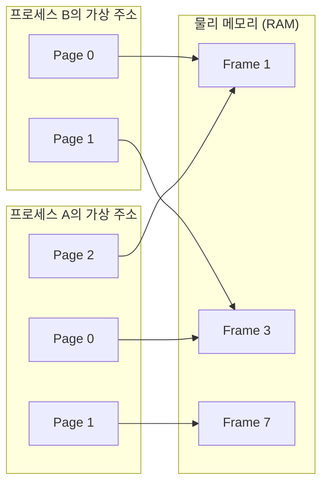
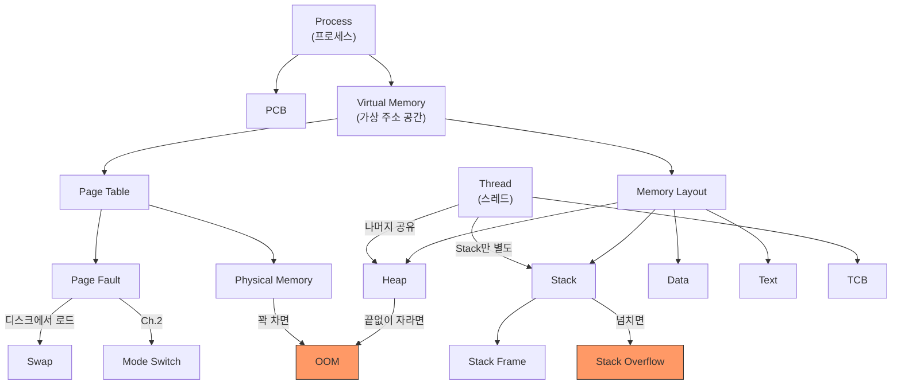

# Ch.4 왜 이렇게 되는가 - Stack Frame과 Virtual Memory

[< 사례 B: 재귀 API가 죽는다](./03-case-stack.md) | [유사 사례와 키워드 정리 >](./05-summary.md)

---

앞에서 카테고리 경로 조회 API가 깊이 1000에서 RecursionError를 내뱉고, setrecursionlimit으로 올리면 Segfault로 죽는 걸 확인했다. 그리고 Heap에 데이터를 쌓으면 선형으로 메모리가 자라는 것도 봤다. Stack은 고정 크기라 넘치면 죽고, Heap은 (거의) 무한히 자란다. 이게 어떻게 가능한 건가?

먼저 Stack에서 무슨 일이 벌어지는지부터 보고, 그 다음에 Virtual Memory로 넘어간다.


## Stack Frame과 Stack Overflow

<details>
<summary>Stack Frame (스택 프레임)</summary>

함수 하나가 호출될 때 Stack에 쌓이는 데이터 묶음이다. 매개변수, 지역 변수, 복귀 주소(함수가 끝나면 돌아갈 위치) 등이 포함된다.
함수가 끝나면 해당 Stack Frame이 제거된다. 재귀 함수는 자기 자신을 호출할 때마다 Stack Frame이 하나씩 추가로 쌓인다.

</details>

사례 B를 다시 보자. 깊이 1000인 카테고리 트리에서 가장 깊은 카테고리를 루트부터 재귀 DFS로 찾으면:

```
Stack Frame 1000: _find_from_root_recursive(tree, 999, 999)
Stack Frame 999:  _find_from_root_recursive(tree, 999, 998)
...
Stack Frame 2:    _find_from_root_recursive(tree, 999, 1)
Stack Frame 1:    _find_from_root_recursive(tree, 999, 0)
Stack Frame 0:    category_recursive_search(1000)
```

Stack Frame이 1000개 이상 쌓인다. 각 프레임에는 `tree`, `target_id`, `current_id`, `children`, `result` 등의 지역 변수가 들어 있다. 프레임 하나하나는 작지만, 수가 많으면 Stack 영역의 크기를 초과한다.

Python의 기본 재귀 제한(1000)은 이 상황을 방지하기 위한 안전장치다. OS Stack 크기(보통 8MB)를 초과하기 전에 Python이 먼저 `RecursionError`를 던진다.

`sys.setrecursionlimit(100000)`으로 올리면? Python의 안전장치는 풀렸지만, OS가 부여한 Stack 크기는 그대로다. 재귀가 충분히 깊어지면 OS Stack 크기를 초과해서 Segmentation Fault가 발생한다. RecursionError는 예외니까 try/except로 잡을 수 있지만, Segfault는 잡을 수 없다. 프로세스가 그냥 죽는다.

이게 "Stack Overflow"라는 이름의 유래다. Stack 영역이 넘치는(overflow) 거다. (그래서 개발자 Q&A 사이트 이름도 Stack Overflow다.)

사례 B는 해결됐다. 그런데 한 가지 의문이 남는다. "각 프로세스가 독립적인 주소 공간을 가진다"고 했는데, 8GB RAM인 컴퓨터에서 프로세스 16개가 각각 60MB씩 쓰면 960MB다. 프로세스가 100개면? 물리 메모리가 모자라면 어떻게 되는 건가?


## Virtual Memory - 물리 메모리보다 넓은 세계

<details>
<summary>Virtual Memory (가상 메모리)</summary>

운영체제가 프로세스에게 제공하는 "가상의 메모리 주소 공간"이다. 각 프로세스는 자기가 메모리 전체를 독점하고 있다고 "착각"한다. 실제로는 OS가 물리 메모리(RAM)와 디스크(Swap)를 조합해서 이 착각을 유지해준다.
64비트 시스템이라고 64비트 전체(16 EB)를 주소 공간으로 쓰지는 않는다. x86-64는 48비트(사용자 공간 128 TB), ARM64(M1/M2 Mac)도 비슷한 범위다. 중요한 건 숫자가 아니라, 물리 메모리(RAM)보다 훨씬 넓은 공간을 각 프로세스에게 줄 수 있다는 점이다.

</details>

<details>
<summary>Physical Memory (물리 메모리)</summary>

실제 RAM 칩에 있는 메모리다. 크기가 물리적으로 고정되어 있다 (8GB, 16GB, 32GB 등).
프로세스가 사용하는 가상 주소는 OS가 물리 메모리의 실제 주소로 변환해준다. 모든 가상 주소가 항상 물리 메모리에 매핑되어 있는 건 아니다. 필요할 때만 물리 메모리에 올린다.

</details>

비유를 하자면, 물리 메모리는 책상 위 공간이고, 가상 메모리는 도서관 전체 서가다.

- 책상 위 공간은 제한적이다 (RAM 8GB, 16GB)
- 서가는 넓다 (디스크까지 포함하면 훨씬 큼)
- 지금 필요한 책만 책상에 올려놓고, 안 쓰는 책은 서가에 놓아둔다
- 책상이 꽉 차면? 안 쓰는 책을 서가로 돌려보내고 새 책을 올린다

이게 Virtual Memory가 하는 일이다. 프로세스에게는 "넓은 서가 전체를 쓸 수 있다"고 보여주면서, 실제로는 책상(RAM) 위의 제한된 공간을 효율적으로 돌려쓴다.


## Page와 Page Table

Virtual Memory는 Page라는 작은 단위로 관리된다.

<details>
<summary>Page (페이지)</summary>

가상 메모리를 일정 크기로 나눈 블록이다. 보통 4KB(4,096 bytes)다.
프로세스의 가상 주소 공간은 수만~수백만 개의 Page로 나뉜다. 각 Page는 물리 메모리의 Frame에 매핑되거나, 디스크에 있거나, 아직 할당되지 않은 상태다.

</details>

<details>
<summary>Page Table (페이지 테이블)</summary>

가상 주소를 물리 주소로 변환하는 매핑 테이블이다. 프로세스마다 별도의 Page Table을 가진다.
"이 프로세스의 Page 0은 물리 메모리 Frame 3에 있다, Page 1은 Frame 7에 있다, Page 2는 디스크에 있다..." 이런 매핑 정보를 담고 있다.
PCB(Process Control Block)에 Page Table 포인터가 들어 있다.

</details>



프로세스 A와 B가 각각 Page 0을 가지고 있지만, 물리 메모리에서는 다른 Frame에 매핑된다. 각 프로세스는 자기가 메모리 전체를 독점하고 있다고 생각하지만, 실제로는 OS가 Page Table로 물리 메모리를 쪼개서 나눠주고 있는 거다.

프로세스 간 Context Switch를 할 때, Page Table도 바뀌어야 한다. 이게 프로세스 간 Context Switch가 스레드 간보다 비싼 이유 중 하나다. (같은 프로세스의 스레드끼리는 Page Table이 같으니까.)


## Page Fault - 물리 메모리에 없으면

프로세스가 접근하려는 Page가 물리 메모리(RAM)에 없을 때 Page Fault가 발생한다.

<details>
<summary>Page Fault (페이지 폴트)</summary>

프로세스가 접근하려는 가상 주소의 Page가 물리 메모리에 매핑되어 있지 않을 때 발생하는 인터럽트다. 크게 두 종류가 있다:
- Minor Page Fault: 물리 메모리에 Page가 이미 있지만 Page Table에 아직 매핑이 안 된 경우. 디스크 접근 없이 빠르게 처리된다.
- Major Page Fault: Page가 디스크(Swap 또는 파일)에 있어서 실제로 읽어와야 하는 경우. 수십~수백 ms의 지연이 발생한다.

Major Page Fault의 처리 과정:
1. 디스크(Swap 영역)에서 해당 Page를 찾는다
2. 물리 메모리에 빈 Frame이 없으면, 기존 Page 중 하나를 디스크로 보낸다 (Page Out)
3. 디스크에서 Page를 읽어와 물리 메모리에 올린다 (Page In)
4. Page Table을 업데이트한다
이 과정에서 Mode Switch가 발생한다 (Ch.2). User Mode에서 Kernel Mode로 전환해야 하니까.

</details>

<details>
<summary>Swap (스왑 영역)</summary>

디스크의 일부를 메모리 확장 용도로 쓰는 영역이다. 물리 메모리가 부족하면, 당장 안 쓰는 Page를 디스크의 Swap 영역으로 보낸다 (Page Out). 나중에 필요하면 다시 물리 메모리로 가져온다 (Page In).
디스크는 RAM보다 수백~수천 배 느리다. Swap을 많이 쓰면 시스템이 극도로 느려진다.

</details>

Ch.2에서 배운 Mode Switch가 여기서도 발생한다. Page Fault는 커널이 처리해야 하니까 User Mode → Kernel Mode 전환이 필요하다. System Call처럼 비싼 작업인 거다.

Page Fault가 가끔 발생하는 건 정상이다. 프로그램이 처음 실행될 때 코드와 데이터를 메모리에 올리는 과정에서 Page Fault가 발생한다 (Demand Paging).

<details>
<summary>Demand Paging (요구 페이징)</summary>

프로그램의 모든 Page를 처음부터 물리 메모리에 올리지 않고, 실제로 접근할 때 비로소 올리는 방식이다. 프로그램 시작 시 전부 올리는 것보다 초기 실행이 빠르고 메모리도 절약된다. 그래서 프로그램 첫 실행 시 Page Fault가 발생하는 건 정상이다. 이때의 Page Fault는 디스크에서 코드를 읽어오는 것이므로 약간의 지연이 있지만, 한 번 올라간 Page는 다시 접근할 때 Page Fault가 발생하지 않는다.

</details>

문제는 Page Fault가 빈번하게 발생할 때다.

<details>
<summary>Thrashing (스래싱)</summary>

물리 메모리가 심하게 부족해서, Page In/Out이 끊임없이 반복되는 상태다.
CPU는 Page Fault 처리에 대부분의 시간을 쓰고, 실제 작업을 거의 진행하지 못한다. 시스템이 극도로 느려진다.
프로세스를 너무 많이 띄우면 Thrashing이 발생할 수 있다. 이것도 ProcessPool 워커를 무한정 늘리면 안 되는 이유 중 하나다.

</details>


## OOM - 메모리가 진짜로 다 차면

물리 메모리 + Swap이 모두 소진되면 OOM(Out of Memory)이 발생한다.

Linux에서는 OOM Killer라는 커널 기능이 작동한다.

<details>
<summary>OOM Killer</summary>

Linux 커널의 메모리 보호 기능이다. 시스템의 메모리가 완전히 소진되면, 커널이 메모리를 가장 많이 쓰고 있는 (또는 OOM 점수가 높은) 프로세스를 강제로 종료시킨다.
관리자가 의도하지 않은 프로세스가 죽을 수도 있다. 서버 운영에서 OOM Killer가 동작하면 서비스 중단으로 이어질 수 있다.
`dmesg | grep -i oom`으로 OOM Killer 동작 기록을 확인할 수 있다.

</details>

사례 A의 진짜 원인이 여기 있다. ProcessPool 워커 16개가 각각 독립 주소 공간을 차지한다. 이미지 처리처럼 메모리를 많이 쓰는 워커가 16개이면, 물리 메모리를 빠르게 소진한다. Swap으로 버텨보지만, Swap마저 다 차면 OOM Killer가 프로세스를 죽이거나, Python이 MemoryError를 던진다.


## Python에서의 메모리 특성

Python은 모든 것이 객체다. `int`, `str`, `list`, `dict` 전부 Heap에 할당되는 객체다.

```python
import sys

# 정수 하나도 객체다
print(sys.getsizeof(1))     # 28 bytes
print(sys.getsizeof(100))   # 28 bytes

# 빈 리스트도 메모리를 차지한다
print(sys.getsizeof([]))    # 56 bytes
print(sys.getsizeof([1,2,3]))  # 80 bytes
```

C에서 `int`는 4 bytes지만, Python에서 `int` 객체는 28 bytes다. 객체 헤더(reference count, type pointer 등)가 붙기 때문이다. 이게 Python이 메모리를 많이 쓰는 이유 중 하나다.

Python은 Reference Counting + GC(Garbage Collector)로 메모리를 관리한다.
- Reference Counting: 객체를 참조하는 변수가 몇 개인지 세고, 0이 되면 즉시 해제
- GC: Reference Counting으로 잡지 못하는 순환 참조를 주기적으로 탐지하고 해제

(Ch.3에서 GIL이 Reference Counting을 보호하기 위해 존재한다고 했다. 여기서 연결된다.)

`tracemalloc`으로 Heap 할당을 추적할 수 있다:

```python
import tracemalloc

tracemalloc.start()
data = [i for i in range(1_000_000)]
current, peak = tracemalloc.get_traced_memory()
print(f"현재: {current / 1024 / 1024:.1f} MB")
print(f"최대: {peak / 1024 / 1024:.1f} MB")
tracemalloc.stop()
```

앞에서 측정한 Heap 증가 패턴:

| 항목 수 | Heap 사용량 |
|---------|-----------|
| 100,000 | 3.8 MB |
| 500,000 | 19.1 MB |
| 1,000,000 | 39.1 MB |

리스트에 데이터를 추가할수록 Heap이 선형으로 자란다. 이 데이터를 해제하지 않으면 메모리가 계속 쌓인다.


## 전체 그림

이번 챕터에서 다룬 개념들의 관계:



Stack이 넘치면 Stack Overflow, Heap이 끝없이 자라면 OOM. 프로세스는 모든 메모리 영역이 독립적이고, 스레드는 Stack만 별도다. Virtual Memory는 물리 메모리보다 넓은 공간을 제공하지만, 물리 메모리 + Swap이 다 차면 결국 OOM이다.

---

[< 사례 B: 재귀 API가 죽는다](./03-case-stack.md) | [유사 사례와 키워드 정리 >](./05-summary.md)
