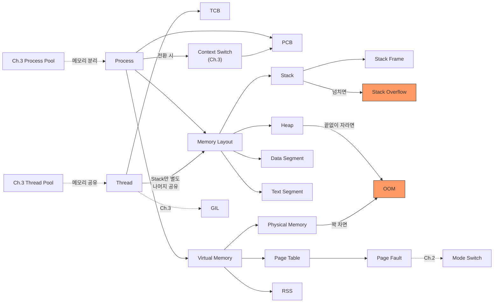

# Ch.4 유사 사례와 키워드 정리

[< Stack Frame과 Virtual Memory](./04-virtual-memory.md)

---

이번 챕터에서는 프로세스와 스레드가 메모리에서 어떻게 존재하는지 확인했다. ProcessPool 16개가 1GB를 먹는 이유, 재귀 1000번이 죽는 이유를 Memory Layout, Virtual Memory, Page Fault로 설명했다.

같은 원리가 적용되는 실무 사례를 몇 가지 더 본다.


## 4-6. 유사 사례

### Docker 컨테이너 메모리 제한

Docker(또는 K8s)에서 컨테이너에 메모리 제한을 건다:

```bash
docker run --memory=512m my-app
```

컨테이너 안의 프로세스가 512MB를 초과하면? OOM Killer가 컨테이너를 죽인다.

K8s에서는 `resources.limits.memory`로 동일한 제한을 건다:

```yaml
resources:
  limits:
    memory: "512Mi"
```

"왜 Pod이 자꾸 Restart 되는가"의 흔한 원인이 메모리 제한 초과다. ProcessPool 워커를 많이 띄우면서 컨테이너 메모리 제한을 고려하지 않으면, 배포하자마자 OOM으로 죽는 상황이 벌어진다.

### Java의 -Xmx와 Python의 차이

Java는 JVM 시작 시 Heap 크기를 명시적으로 설정한다:

```bash
java -Xms256m -Xmx512m MyApp
```

(Python 사용자를 위해: `-Xms`는 초기 Heap 크기, `-Xmx`는 최대 Heap 크기다.)

Heap이 `-Xmx`를 초과하면 `OutOfMemoryError`가 즉시 발생한다. 경계가 명확하다.

Python은? 이런 명시적 제한이 없다. Heap이 시스템이 허용하는 한 계속 자란다. 메모리 제한을 걸려면 OS 레벨(`resource.setrlimit()`)이나 컨테이너 레벨(`--memory`)로 해야 한다. Python의 OOM이 더 예측하기 어려운 이유가 이거다.

### Gunicorn 워커 수 결정

Python 웹 서버로 Gunicorn을 쓸 때, 워커 수를 설정한다:

```bash
gunicorn -w 4 myapp:app
```

<details>
<summary>Gunicorn</summary>

Python WSGI 서버다. 프로세스 기반으로 동작한다. `-w 4`는 워커 프로세스를 4개 띄운다는 뜻이다.
각 워커가 독립 프로세스이므로, 이번 챕터에서 본 것처럼 워커 수 x Python 런타임 크기만큼 메모리를 먹는다.

</details>

Gunicorn 공식 문서가 권장하는 워커 수 공식: `(2 x CPU 코어 수) + 1`. 4코어 서버라면 9개.

왜 이 공식인가? CPU 코어 수보다 워커가 많으면 실제 병렬 실행 이점 없이 메모리만 낭비한다. 코어 수의 2배 + 1 정도가 CPU 활용과 메모리 비용의 균형점이라는 경험적 공식이다.

(무턱대고 `-w 32`로 올리는 사람이 가끔 있다. 이번 챕터를 읽었다면 왜 그게 위험한지 이해할 거다.)

### fork()와 Copy-on-Write

ProcessPool이 워커를 만들 때 내부적으로 `fork()` System Call을 쓴다.

<details>
<summary>fork()</summary>

Unix/Linux/macOS에서 프로세스를 복제하는 System Call이다. 부모 프로세스의 메모리 공간을 자식 프로세스에게 복사한다.
단, 현대 OS는 Copy-on-Write(CoW)를 쓴다. fork() 직후에는 실제로 메모리를 복사하지 않고, 부모와 자식이 같은 물리 메모리 Page를 공유한다. 어느 한쪽이 Page를 수정할 때 비로소 해당 Page만 복사한다.
그래서 fork() 직후에는 메모리가 거의 증가하지 않지만, 워커가 실제로 작업을 시작하면(데이터를 쓰면) 메모리가 급증한다.
참고: macOS의 Python 3.8 이후 `multiprocessing`의 기본 start method는 `fork`가 아닌 `spawn`이다. `spawn`은 fork() 대신 새 Python 인터프리터 프로세스를 처음부터 시작하므로, 부모 프로세스의 상태를 복제하지 않는다. 이번 챕터의 실습 환경(M1 Mac, Python 3.12)에서 ProcessPoolExecutor는 `spawn`으로 동작한다.

</details>

앞에서 ProcessPool 워커의 RSS가 각각 ~60MB였는데, 이건 워커가 Python 인터프리터를 실행하면서 데이터를 쓰기 시작한 이후의 값이다. fork() 직후에는 Copy-on-Write 덕분에 물리 메모리를 덜 먹지만, 실질적인 작업이 시작되면 Page가 복사되면서 메모리가 늘어난다.


## 그래서 실무에서는 어떻게 하는가

### 1. 프로세스 워커 수는 CPU 코어 수 기반으로 결정한다

```python
import os

cpu_count = os.cpu_count()

# CPU Bound 작업: 코어 수 이하
process_workers = cpu_count

# I/O Bound 작업: 코어 수 x 2 정도
io_workers = cpu_count * 2
```

Ch.3에서 "CPU Bound에는 ProcessPool"이라고 했지만, 워커 수는 코어 수를 넘기지 않는 게 안전하다. 코어 수를 초과하면 실제 병렬 처리 이점 없이 메모리만 낭비한다.

### 2. 재귀 대신 반복을 쓴다

Stack Overflow의 위험이 있는 재귀는 반복으로 바꿀 수 있다:

```python
# 재귀 (Stack Overflow 위험)
def factorial_recursive(n):
    if n <= 1:
        return 1
    return n * factorial_recursive(n - 1)

# 반복 (Stack Overflow 없음)
def factorial_iterative(n):
    result = 1
    for i in range(2, n + 1):
        result *= i
    return result
```

트리 탐색처럼 재귀가 자연스러운 경우에도, 명시적 Stack(리스트)을 사용하면 Heap에 데이터를 쌓으므로 Stack 크기 제한에 걸리지 않는다:

```python
# 재귀 (Stack에 Frame이 쌓임)
def dfs_recursive(node):
    visit(node)
    for child in node.children:
        dfs_recursive(child)

# 반복 + 명시적 Stack (Heap에 쌓임 → Stack Overflow 없음)
def dfs_iterative(root):
    stack = [root]
    while stack:
        node = stack.pop()
        visit(node)
        stack.extend(node.children)
```

### 3. 메모리 사용량을 모니터링한다

```python
import resource
import sys

def get_rss_mb():
    usage = resource.getrusage(resource.RUSAGE_SELF)
    if sys.platform == "darwin":
        return usage.ru_maxrss / (1024 * 1024)  # macOS: bytes
    return usage.ru_maxrss / 1024  # Linux: KB
```

서버 운영에서는 Prometheus + Grafana 같은 도구로 프로세스 메모리를 상시 모니터링한다. RSS가 꾸준히 증가하는 패턴이 보이면 메모리 누수를 의심해야 한다.

### 4. Generator로 Heap을 아낀다

대용량 데이터를 처리할 때, 전부 메모리에 올리는 대신 Generator를 쓰면 Heap 사용량을 극적으로 줄일 수 있다:

```python
# 리스트: 100만 개를 한번에 Heap에 올림 (~39 MB)
data = [process(item) for item in range(1_000_000)]

# Generator: 하나씩 처리, Heap에 한 개만 유지
data = (process(item) for item in range(1_000_000))
```

(앞에서 측정한 Heap 증가 패턴을 떠올려보자. 100만 개 리스트 = ~39MB였다. Generator를 쓰면 이걸 거의 0에 가깝게 줄일 수 있다.)


## 3. 오늘 키워드 정리

CS를 키워드로 배운다는 건, 개별 개념을 외우는 게 아니라 개념들 사이의 연결을 이해하는 거다. 이번 챕터에서 나온 키워드들을 모아서 정리한다.

<details>
<summary>Process (프로세스)</summary>

실행 중인 프로그램의 인스턴스다. 운영체제로부터 독립적인 메모리 공간(Text, Data, Heap, Stack)과 시스템 자원(File Descriptor 등)을 할당받는다. PCB로 관리된다.
프로세스 간에는 메모리가 완전히 격리되어 있어서 안전하지만, 그만큼 생성 비용과 메모리 비용이 크다.

</details>

<details>
<summary>Thread (스레드)</summary>

프로세스 안에서 실행되는 경량 실행 단위다. 같은 프로세스의 스레드들은 Heap, Data, Text를 공유하고, Stack만 각자 가진다. TCB로 관리된다.
메모리를 공유하기 때문에 생성 비용이 적고 데이터 교환이 쉽지만, 동시성 문제(Race Condition)의 원인이 된다.

</details>

<details>
<summary>PCB (Process Control Block)</summary>

운영체제가 프로세스를 관리하기 위한 자료구조다. PID, 상태, 레지스터, Page Table 포인터, 파일 목록 등이 담겨 있다. Context Switch 시 PCB의 내용을 저장하고 복원한다.

</details>

<details>
<summary>TCB (Thread Control Block)</summary>

운영체제가 스레드를 관리하기 위한 자료구조다. Thread ID, 레지스터, Stack 포인터가 담겨 있다. PCB보다 가볍다. 메모리 매핑 정보는 프로세스의 PCB에서 공유한다.

</details>

<details>
<summary>Memory Layout (메모리 배치)</summary>

프로세스의 가상 주소 공간이 어떻게 구성되어 있는지를 나타낸다. Text(코드), Data(전역 변수), Heap(동적 할당), Stack(함수 호출)의 4개 영역으로 나뉜다.

</details>

<details>
<summary>Text Segment (텍스트/코드 영역)</summary>

프로그램의 실행 코드(기계어)가 저장되는 영역이다. Read-only. 같은 프로그램의 여러 프로세스가 공유할 수 있다.

</details>

<details>
<summary>Data Segment (데이터 영역)</summary>

전역 변수와 static 변수가 저장되는 영역이다. 프로그램 시작부터 끝까지 존재한다.

</details>

<details>
<summary>Heap (힙 영역)</summary>

동적으로 할당되는 메모리 영역이다. `malloc()`, `new`, Python의 객체 생성 시 사용된다. 아래에서 위로 자라며, 크기 제한이 (거의) 없다. 메모리 누수가 발생하는 곳이다.

</details>

<details>
<summary>Stack (스택 영역)</summary>

함수 호출 정보(Stack Frame)가 저장되는 영역이다. 위에서 아래로 자라며, 크기가 고정되어 있다 (보통 1~8MB). 이 크기를 초과하면 Stack Overflow가 발생한다.

</details>

<details>
<summary>Stack Frame (스택 프레임)</summary>

함수 하나가 호출될 때 Stack에 쌓이는 데이터 묶음이다. 매개변수, 지역 변수, 복귀 주소가 포함된다. 재귀 호출마다 하나씩 추가로 쌓인다.

</details>

<details>
<summary>Virtual Memory (가상 메모리)</summary>

OS가 프로세스에게 제공하는 가상의 메모리 주소 공간이다. 물리 메모리(RAM)보다 큰 공간을 쓸 수 있게 해준다. Page 단위로 관리되며, 필요할 때만 물리 메모리에 매핑된다.

</details>

<details>
<summary>Physical Memory (물리 메모리)</summary>

실제 RAM 칩의 메모리다. 크기가 물리적으로 고정되어 있다. 가상 주소는 Page Table을 통해 물리 주소로 변환된다.

</details>

<details>
<summary>Page / Page Table (페이지 / 페이지 테이블)</summary>

Page는 가상 메모리를 일정 크기(보통 4KB)로 나눈 블록이다. Page Table은 가상 주소를 물리 주소로 변환하는 매핑 테이블이다. 프로세스마다 별도의 Page Table을 가진다.

</details>

<details>
<summary>Page Fault (페이지 폴트)</summary>

접근하려는 Page가 물리 메모리에 없을 때 발생하는 인터럽트다. OS가 디스크(Swap)에서 해당 Page를 물리 메모리로 로드한다. Mode Switch가 발생한다.

</details>

<details>
<summary>OOM (Out of Memory)</summary>

시스템의 사용 가능한 메모리가 모두 소진된 상태다. Linux의 OOM Killer가 프로세스를 강제 종료시키거나, Python에서 MemoryError가 발생한다.

</details>

<details>
<summary>RSS (Resident Set Size)</summary>

프로세스가 실제로 물리 메모리에 올려놓고 있는 데이터의 크기다. "이 프로세스가 RAM을 얼마나 차지하고 있는가"의 기본 지표다.

</details>

<details>
<summary>Thrashing (스래싱)</summary>

물리 메모리가 심하게 부족해서, Page In/Out이 끊임없이 반복되는 상태다. CPU는 Page Fault 처리에 대부분의 시간을 쓰고 실제 작업을 거의 진행하지 못한다. 프로세스를 너무 많이 띄우면 Thrashing이 발생할 수 있다.

</details>


### 재등장 키워드

| 키워드 | 최초 등장 | 이번 챕터에서의 역할 |
|--------|----------|-------------------|
| Context Switch | Ch.3 | PCB/TCB를 저장하고 복원하는 과정이라는 구체적 의미를 알게 됨 |
| Mode Switch | Ch.2 | Page Fault 시 User→Kernel 전환이 발생, System Call과 같은 메커니즘 |
| Kernel | Ch.2 | Virtual Memory를 관리하는 주체, Page Fault를 처리 |
| GIL | Ch.3 | 스레드의 Heap 공유와 연결, Reference Counting 보호 |
| Thread Pool / Process Pool | Ch.3 | 메모리 관점에서의 비용 차이를 이해 |
| IPC | Ch.3 | 프로세스가 메모리를 분리하기 때문에 IPC가 필요 |


### 키워드 연관 관계




## 다음에 이어지는 이야기

이번 챕터에서는 프로세스와 스레드가 메모리에서 어떻게 존재하는지 확인했다. 프로세스는 모든 걸 분리하고, 스레드는 Stack만 분리하고 나머지를 공유한다.

그런데 "스레드가 Heap을 공유한다"는 말의 의미를 아직 제대로 다루지 않았다. 여러 스레드가 같은 변수를 동시에 읽고 쓰면 어떻게 되는가? 데이터가 꼬인다. GIL이 있어도 막아주지 못하는 상황이 있다.

다음 챕터에서는 동시성 제어의 기초를 다룬다. Race Condition이 왜 발생하는지, Mutex가 뭔지, Deadlock은 어떻게 생기는지 파고든다.

---

[< Stack Frame과 Virtual Memory](./04-virtual-memory.md)

[< Ch.3 로그를 뺐더니 빨라졌어요? (2)](../ch03/README.md) | [Ch.5 동시성 제어의 기초 >](../ch05/README.md)
