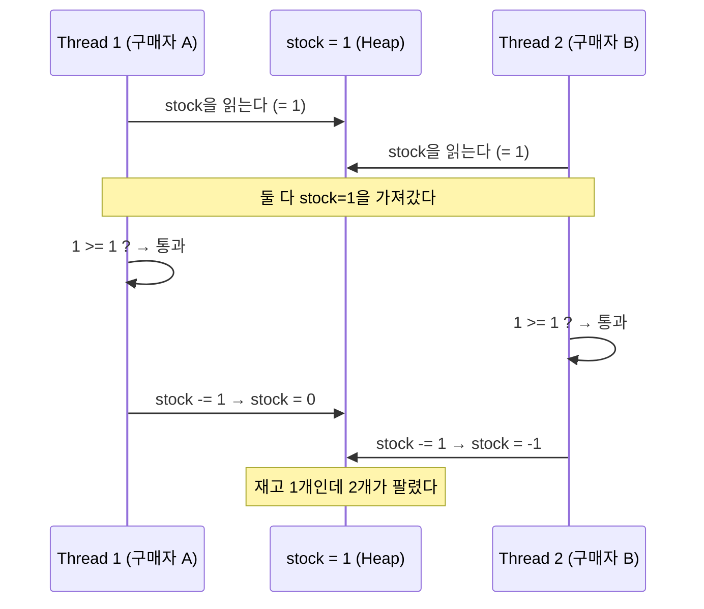
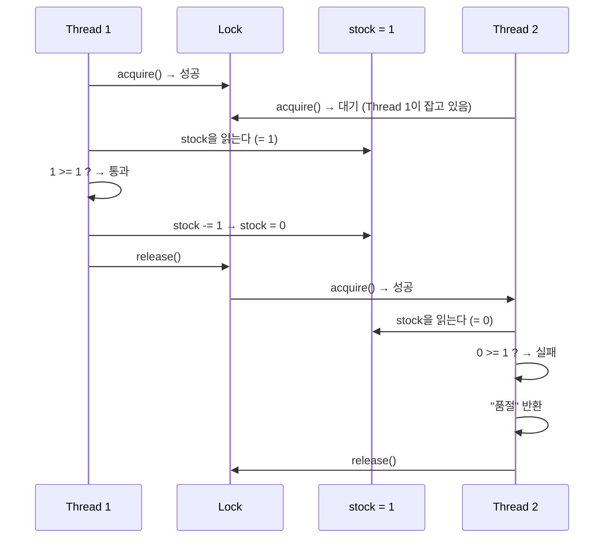

# Ch.5 왜 이렇게 되는가 - Critical Section과 Lock

[< 사례 A: 재고가 마이너스가 됐다](./01-case-race-condition.md) | [사례 B: Lock을 걸었더니 먹통 >](./03-case-deadlock.md)

---

앞에서 Lock 없이 재고를 건드리면 데이터가 꼬이는 걸 확인했다. 재고 100개인데 131건이 팔렸다. 왜 이런 일이 벌어지는지 CS 관점에서 파고든다.


## Race Condition (경쟁 조건)

<details>
<summary>Race Condition (경쟁 조건)</summary>

두 개 이상의 스레드(또는 프로세스)가 공유 자원에 동시에 접근할 때, 실행 순서에 따라 결과가 달라지는 상황이다. "경쟁(Race)"이라는 이름이 붙은 이유는, 어느 스레드가 먼저 실행되느냐에 따라 결과가 바뀌기 때문이다.
Race Condition의 핵심은 "비결정성"이다. 같은 코드를 같은 입력으로 실행해도 결과가 매번 다를 수 있다. 그래서 테스트에서 잡기가 극히 어렵다.
(Java에서는 `volatile`, `synchronized`, `AtomicInteger` 등으로, Go에서는 channel이나 `sync.Mutex`로 대응한다.)

</details>

사례 A에서 벌어진 일을 시간순으로 보면 이렇다:



Thread 1과 Thread 2가 "읽기 → 체크 → 쓰기"를 동시에 실행한다. 둘 다 같은 값(1)을 읽었으니까, 둘 다 "재고 있음"이라고 판단하고, 둘 다 차감한다. 결과: 재고 -1.

단일 스레드에서는 절대 발생하지 않는 문제다. Thread 1이 끝난 뒤에 Thread 2가 실행되면, Thread 2는 stock=0을 읽고 "품절"을 반환한다. 문제는 "동시에" 실행될 때 생긴다.


## Critical Section (임계 영역)

<details>
<summary>Critical Section (임계 영역)</summary>

공유 자원에 접근하는 코드 구간 중, 동시에 두 개 이상의 스레드가 실행하면 안 되는 부분이다. "이 구간에는 한 번에 하나만 들어올 수 있다"는 뜻이다.
사례 A에서 "읽기 → 체크 → 쓰기" 세 줄이 바로 Critical Section이다. 이 세 줄이 하나의 묶음으로 실행되어야 데이터가 꼬이지 않는다.
(운영체제 교과서에서 가장 먼저 나오는 동시성 개념 중 하나다.)

</details>

사례 A의 Critical Section을 표시하면:

```python
def purchase_unsafe(quantity):
    current_stock = _inventory["stock"]   # ─┐
    time.sleep(0.01)                      #  │ Critical Section
    if current_stock >= quantity:          #  │ (이 구간에 동시에
        _inventory["stock"] -= quantity   #  │  두 스레드가 들어가면
        _inventory["success_count"] += 1  # ─┘  Race Condition)
```

이 다섯 줄은 하나의 원자적(atomic) 단위로 실행되어야 한다. "중간에 끊기면 안 된다."


## Atomicity (원자성)

<details>
<summary>Atomicity (원자성)</summary>

연산이 "다 되거나 아예 안 되거나(all or nothing)"하는 성질이다. 원자(atom)가 쪼갤 수 없다는 뜻에서 유래했다.
`stock -= 1`이 하나의 문장이니까 원자적일 것 같지만, 실제로는 아니다. Python bytecode로 분해하면 여러 단계다.

</details>

`_inventory["stock"] -= 1`이 왜 원자적이지 않은지 보자. Python의 `dis` 모듈로 바이트코드를 확인할 수 있다 (Ch.2에서 bytecode를 다뤘다). 아래는 `_inventory["stock"] -= 1` 한 줄이 내부적으로 분해되는 실제 실행 단계다:

```
LOAD_GLOBAL    _inventory       # 1) dict 객체를 스택에 올린다
LOAD_CONST     'stock'          # 2) 키를 스택에 올린다
COPY           2                # 3) ─┐ 저장할 때 쓸 dict, key를 복사
COPY           2                # 4) ─┘
BINARY_SUBSCR                   # 5) dict["stock"] 값을 읽는다
LOAD_CONST     1                # 6) 1을 스택에 올린다
BINARY_OP      (-=)             # 7) 뺄셈 실행
SWAP           3                # 8) ─┐ 스택 순서 정리
SWAP           2                # 9) ─┘
STORE_SUBSCR                    # 10) 결과를 dict["stock"]에 저장한다
```

(Python 3.12 기준. 3.11 이하에서는 `BINARY_OP` 대신 `BINARY_SUBTRACT`가 나온다.)

10단계다. GIL은 일정 시간 간격(기본 5ms)마다 스레드 전환 기회를 주고, I/O 연산이나 `time.sleep()` 같은 GIL 해제 지점에서는 즉시 양보한다. 5단계(읽기)와 10단계(쓰기) 사이에 다른 스레드가 같은 코드를 실행하면? 두 스레드가 같은 "오래된 값"을 가지고 각자 계산해서 각자 저장한다.

게다가 사례 A에서는 `time.sleep(0.01)`이 GIL을 명시적으로 해제한다. sleep은 "나는 쉴 테니 다른 스레드가 돌아"라는 뜻이다. sleep 이후의 코드는 다른 스레드와 완전한 경쟁 상태가 된다.


## Mutex / Lock (뮤텍스 / 잠금)

<details>
<summary>Mutex (Mutual Exclusion, 상호 배제)</summary>

Critical Section에 한 번에 하나의 스레드만 들어갈 수 있게 하는 잠금 장치다. "Mutual Exclusion(상호 배제)"의 줄임말이다.
한 스레드가 Lock을 잡으면(acquire), 다른 스레드는 Lock이 풀릴 때까지(release) 기다려야 한다.
Python에서는 `threading.Lock()`으로 만든다. Java의 `synchronized`, Go의 `sync.Mutex`와 같은 개념이다.

</details>

사례 A의 해결 코드를 다시 보자:

```python
_inventory_lock = threading.Lock()

def purchase_safe(quantity):
    with _inventory_lock:                     # Lock 획득
        current_stock = _inventory["stock"]   # ─┐
        time.sleep(0.01)                      #  │ Critical Section
        if current_stock >= quantity:          #  │ (Lock이 보호)
            _inventory["stock"] -= quantity   #  │
            _inventory["success_count"] += 1  # ─┘
                                              # Lock 해제 (with 블록 종료)
```

`with _inventory_lock:`가 하는 일:

1. `_inventory_lock.acquire()` - Lock을 잡는다. 다른 스레드가 이미 잡고 있으면, 풀릴 때까지 기다린다.
2. with 블록 안의 코드를 실행한다.
3. `_inventory_lock.release()` - Lock을 풀어준다. 기다리던 스레드 중 하나가 Lock을 잡고 들어온다.



Lock 덕분에 Thread 2는 Thread 1이 완전히 끝난 후에야 stock을 읽는다. stock=0을 읽고 "품절"을 반환한다. Race Condition이 사라졌다.


## GIL과 Mutex의 차이

Ch.3에서 "GIL이 있으니까 Python 스레드는 안전한 거 아닌가?"라는 의문이 있었다. Ch.4에서 "GIL이 있어도 막아주지 못하는 상황이 있다"고 했다. 이제 그 차이를 명확히 정리한다.

| 구분 | GIL | Mutex (threading.Lock) |
|------|-----|----------------------|
| 보호 대상 | CPython 인터프리터 내부 자료구조 | 개발자가 지정한 공유 데이터 |
| 보호 단위 | switch interval (기본 5ms) 단위 | 개발자가 정의한 Critical Section |
| 개수 | Python 프로세스당 1개 | 필요한 만큼 생성 |
| 누가 관리 | CPython이 자동으로 | 개발자가 직접 |

GIL은 "Python 인터프리터가 자기 자신을 보호하기 위해" 거는 잠금이다. `list.append()` 같은 단일 bytecode 연산이 동시에 호출되어도 Python이 죽지 않게 보호한다.

Mutex는 "개발자가 자기 데이터를 보호하기 위해" 거는 잠금이다. "읽기 → 체크 → 쓰기"처럼 여러 단계에 걸친 복합 연산을 원자적으로 만들어준다.

GIL이 있다고 Lock을 안 걸어도 된다고 생각하면, 사례 A처럼 재고가 마이너스가 된다.


## 정리

여러 스레드가 같은 데이터를 동시에 건드리면 Race Condition이 발생한다. "읽기 → 체크 → 쓰기"가 한 묶음으로 실행되어야 하는 코드 구간이 Critical Section이다. Mutex(Lock)가 이 구간을 보호해서, 한 번에 하나의 스레드만 들어가게 한다.

Lock을 걸면 Race Condition은 해결된다. 그런데 Lock이 만능인 건 아니다. Lock을 잘못 쓰면 더 무서운 문제가 생긴다.

---

[< 사례 A: 재고가 마이너스가 됐다](./01-case-race-condition.md) | [사례 B: Lock을 걸었더니 먹통 >](./03-case-deadlock.md)
