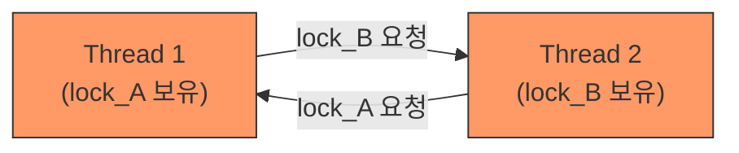
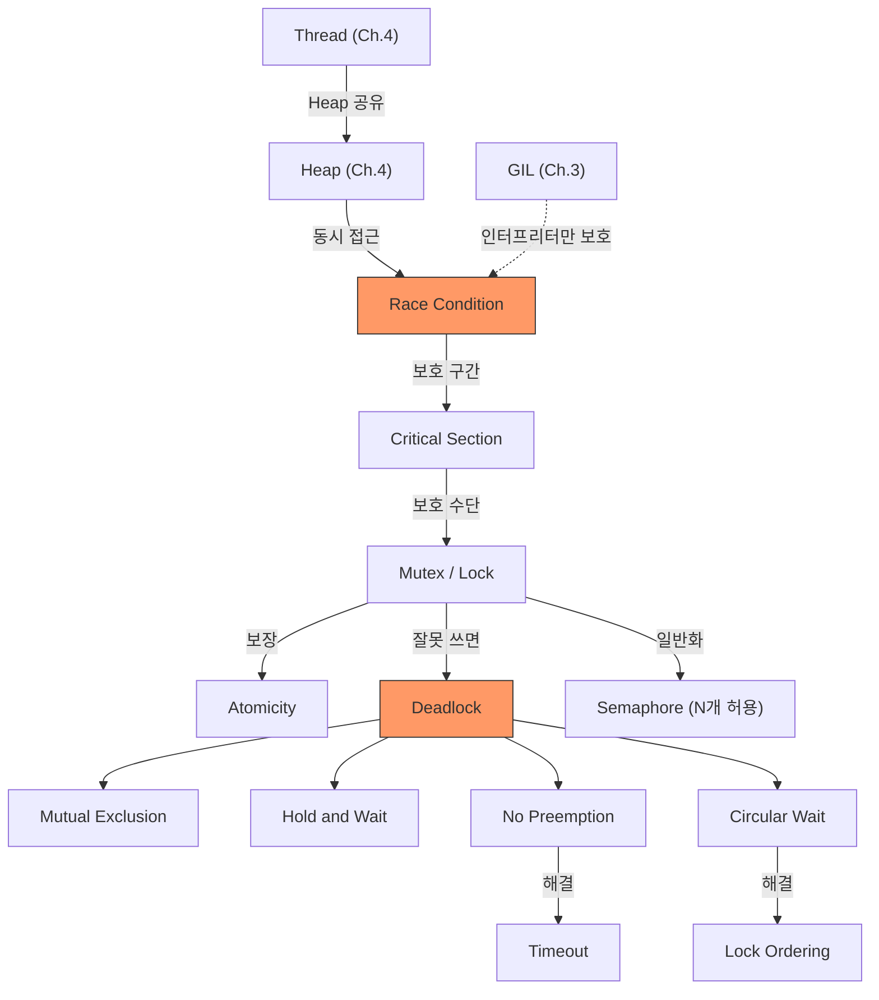

# Ch.5 왜 이렇게 되는가 - Deadlock의 조건과 Semaphore

[< 사례 B: Lock을 걸었더니 먹통](./03-case-deadlock.md) | [유사 사례와 키워드 정리 >](./05-summary.md)

---

앞에서 Lock 순서를 고정하면 Deadlock이 해결되는 걸 확인했다. 왜 Lock 순서를 고정하면 Deadlock이 안 생기는가? Deadlock이 발생하려면 4가지 조건이 동시에 성립해야 한다. 그 중 하나만 깨면 Deadlock은 불가능하다.


## Deadlock (교착 상태)

<details>
<summary>Deadlock (교착 상태)</summary>

두 개 이상의 스레드(또는 프로세스)가 서로가 가진 자원을 기다리면서 영원히 멈추는 상태다. 아무도 진행하지 못한다.
Deadlock의 무서운 점은 "에러가 나지 않는다"는 거다. 프로세스가 죽는 것도 아니고, 예외가 발생하는 것도 아니다. 그냥 멈춰 있다. CPU도 안 쓴다. 로그도 안 남는다. 그래서 디버깅이 극히 어렵다.
비유하면, 좁은 일방통행 골목에서 마주 온 두 차량이다. 둘 다 "니가 먼저 비켜"라고 기다린다. 아무도 비키지 않으니까 둘 다 영원히 서 있다.

</details>


## Deadlock의 4가지 필요조건 (Coffman Conditions)

1971년 E. G. Coffman Jr. 등 세 명이 정리한 조건이다. Deadlock이 발생하려면 아래 4가지가 모두 성립해야 한다.

(출처: E. G. Coffman Jr., M. J. Elphick, A. Shoshani, "System Deadlocks", ACM Computing Surveys, 1971)

### 1. Mutual Exclusion (상호 배제)

<details>
<summary>Mutual Exclusion (상호 배제)</summary>

자원을 한 번에 하나의 스레드만 사용할 수 있다는 조건이다. Lock이 이 성질을 가진다. 한 스레드가 Lock을 잡으면 다른 스레드는 사용할 수 없다.

</details>

사례 B에서 lock_A와 lock_B는 각각 한 번에 하나의 스레드만 잡을 수 있다. 이건 Lock의 본질이니까 깨기 어렵다.

### 2. Hold and Wait (점유 대기)

<details>
<summary>Hold and Wait (점유 대기)</summary>

자원을 하나 이상 잡고 있는 상태에서, 다른 자원을 추가로 기다리는 것이다.
사례 B에서 Thread 1이 lock_A를 잡고 있으면서 lock_B를 기다리는 게 바로 이 상태다.

</details>

사례 B에서 Thread 1은 lock_A를 잡고 lock_B를 기다린다. "이미 하나를 들고 있으면서 다른 걸 요청한다."

해결: 필요한 Lock을 한꺼번에 잡거나, 아예 다 내려놓고 다시 시도하는 방식으로 깰 수 있다.

### 3. No Preemption (비선점)

<details>
<summary>No Preemption (비선점)</summary>

다른 스레드가 가진 자원을 강제로 빼앗을 수 없다는 조건이다. Lock은 소유자만 풀 수 있다. OS가 강제로 빼앗지 않는다.

</details>

Thread 2가 잡고 있는 lock_B를 Thread 1이 강제로 빼앗을 수 없다. Lock은 `release()`를 호출한 스레드만 풀 수 있다.

해결: timeout을 걸어서, 일정 시간 안에 Lock을 못 잡으면 포기하고 재시도하는 방식으로 깰 수 있다. 사례 B의 실습 코드에서 `lock.acquire(timeout=5)`를 쓴 게 이 방법이다.

### 4. Circular Wait (순환 대기)

<details>
<summary>Circular Wait (순환 대기)</summary>

A가 B를 기다리고, B가 A를 기다리는 순환 구조다. "A→B→A" 또는 "A→B→C→A" 식의 원형 대기 체인이 형성된 상태다.

</details>

사례 B의 unsafe 코드에서:

```
Thread 1: lock_A를 잡고 → lock_B를 기다린다
Thread 2: lock_B를 잡고 → lock_A를 기다린다
```

Thread 1 → Thread 2 → Thread 1. 순환이다.



safe 코드에서는 둘 다 lock_A를 먼저 잡는다. Thread 1이 lock_A를 잡으면 Thread 2는 lock_A부터 기다린다. Thread 1이 lock_B까지 잡고 작업을 끝내고 둘 다 풀어야 Thread 2가 진행된다. 순환이 깨진다.


## 4가지 중 하나만 깨면 된다

| 조건 | 사례 B에서 | 깨는 방법 |
|------|-----------|----------|
| Mutual Exclusion | Lock의 본질 | (보통 깨지 않음) |
| Hold and Wait | lock_A 잡고 lock_B 대기 | 한꺼번에 잡거나 다 내려놓기 |
| No Preemption | Lock 강제 해제 불가 | timeout 후 포기, 재시도 |
| Circular Wait | A→B, B→A 순환 | Lock 순서 고정 |

사례 B의 safe 코드는 Circular Wait를 깬 것이다. Lock을 항상 알파벳순(A→B)으로 잡으면, "A가 B를 기다리고, B가 A를 기다리는" 순환이 만들어질 수 없다.

실무에서 가장 흔하게 쓰는 Deadlock 방지법이 Lock Ordering(순서 고정)이다. 모든 Lock에 번호(또는 이름)를 매기고, 항상 번호가 작은 것부터 잡는다.


## Semaphore (세마포어)

Mutex는 "1개만 허용"하는 Lock이다. 그런데 실무에서는 "최대 N개까지 동시에 허용하고 싶다"는 경우가 있다. 그 도구가 Semaphore다.

<details>
<summary>Semaphore (세마포어)</summary>

동시에 N개의 스레드까지 접근을 허용하는 카운팅 잠금이다. Mutex(Lock)가 "한 번에 1개만"이라면, Semaphore는 "한 번에 N개까지"다.
Binary Semaphore(N=1)는 Mutex처럼 동작하지만, 엄밀히는 다르다. Mutex에는 소유권(ownership) 개념이 있어서 Lock을 잡은 스레드만 풀 수 있다. Semaphore는 다른 스레드가 풀 수도 있다 (신호 메커니즘으로 쓸 수 있는 이유다). 실무에서는 이 차이를 구분해서 쓴다.
Python에서는 `threading.Semaphore(n)`으로 만든다.
(Java의 `java.util.concurrent.Semaphore`, Go의 `golang.org/x/sync/semaphore`와 같은 개념이다.)

</details>

좀 더 일반적인 상황을 보자.

DB Connection Pool을 생각해보자. 동시에 최대 10개의 Connection만 허용하고 싶다. Mutex를 쓰면? 한 번에 1개의 Connection만 쓸 수 있어서 너무 느리다. Semaphore(10)을 쓰면? 10개까지는 동시에 쓸 수 있고, 11번째 요청은 기다린다.

```python
import threading

# 최대 10개 동시 접속
db_pool_semaphore = threading.Semaphore(10)

def query_database():
    with db_pool_semaphore:
        # Connection 획득 → 쿼리 실행 → Connection 반환
        execute_query()
```

Connection Pool의 "최대 연결 수 제한"이 사실상 Semaphore다. (Ch.6에서 네트워크 Connection을, Ch.16에서 DB Connection Pool을 다룰 때 다시 만난다.)


## Starvation (기아)

Deadlock은 해결했다. 그런데 Lock을 제대로 쓰더라도 생기는 또 다른 문제가 있다. 특정 스레드가 Lock을 영원히 잡지 못하는 상태, Starvation이다.

<details>
<summary>Starvation (기아 상태)</summary>

Lock 경쟁에서 특정 스레드가 계속 밀려서 실행 기회를 얻지 못하는 상태다. Deadlock은 모두 멈추지만, Starvation은 일부만 굶는다.
예를 들어 Lock 경쟁에서 우선순위가 낮은 스레드가 계속 밀려서 영원히 Lock을 잡지 못하는 경우다.

</details>

Deadlock과 Starvation의 차이:

| 구분 | Deadlock | Starvation |
|------|----------|-----------|
| 누가 멈추는가 | 관련 스레드 전부 | 특정 스레드만 |
| 원인 | 순환 대기 | 불공정한 스케줄링 |
| 해결 | Lock Ordering, timeout | 공정한 Lock (FIFO) |

Python의 `threading.Lock()`은 FIFO를 보장하지 않는다. (실제로는 OS 스케줄러에 의존한다.) 극단적인 경우 Starvation이 발생할 수 있지만, 실무에서 이것 때문에 문제가 되는 경우는 드물다.


## 전체 그림



Race Condition 때문에 Lock을 건다. Lock을 잘못 쓰면 Deadlock이 생긴다. Deadlock을 방지하려면 Lock 순서를 고정하거나 timeout을 건다. 동시성 제어는 이 순환을 이해하는 데서 시작한다.

---

[< 사례 B: Lock을 걸었더니 먹통](./03-case-deadlock.md) | [유사 사례와 키워드 정리 >](./05-summary.md)
