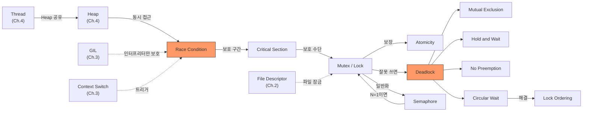

# Ch.5 유사 사례와 키워드 정리

[< Deadlock의 조건과 Semaphore](./04-deadlock-conditions.md)

---

이번 챕터에서는 Race Condition이 왜 발생하는지, Lock으로 어떻게 해결하는지, Lock을 잘못 쓰면 Deadlock이 어떻게 생기는지 확인했다.

같은 원리가 적용되는 실무 사례를 몇 가지 더 본다.


## 5-6. 유사 사례

### DB 레벨의 Race Condition

사례 A에서는 Python 변수(dict)로 재고를 관리했다. 실제 서비스에서는 DB에 저장한다. 그런데 DB로 바꿔도 같은 문제가 생긴다.

```sql
-- Thread 1
SELECT stock FROM products WHERE id = 1;  -- stock = 1
-- Thread 2
SELECT stock FROM products WHERE id = 1;  -- stock = 1 (같은 값)
-- Thread 1
UPDATE products SET stock = stock - 1 WHERE id = 1;  -- stock = 0
-- Thread 2
UPDATE products SET stock = stock - 1 WHERE id = 1;  -- stock = -1
```

"읽기 → 체크 → 쓰기"가 하나의 트랜잭션 안에서 원자적으로 실행되지 않으면, Python이든 DB든 같은 문제가 발생한다.

DB 레벨의 해결책: `SELECT ... FOR UPDATE`로 행에 잠금을 건다.

```sql
BEGIN;
SELECT stock FROM products WHERE id = 1 FOR UPDATE;  -- 행에 쓰기 잠금
-- 다른 트랜잭션의 SELECT ... FOR UPDATE는 기다린다
-- (단, 일반 SELECT는 잠금 없이 읽을 수 있다 - Consistent Read)
UPDATE products SET stock = stock - 1 WHERE id = 1;
COMMIT;
```

(Ch.15에서 Transaction Isolation Level을 다룰 때 이 문제를 더 깊이 파고든다.)

### 파일 잠금

프로세스가 파일을 열고(open) 작업을 하다가, close를 안 하고 비정상 종료되면? 파일에 걸린 잠금이 해제되지 않는다. 다른 프로세스가 같은 파일을 열려고 하면 접근이 거부된다.

이건 Lock의 acquire/release와 같은 구조다. `open()`이 acquire, `close()`가 release. close를 안 하면 Lock이 영원히 풀리지 않는 셈이다.

Python의 `with open()` 패턴이 이 문제를 해결한다:

```python
# 안전하지 않은 패턴
f = open("data.txt", "w")
f.write("hello")
# 예외 발생 시 close()가 호출되지 않는다!

# 안전한 패턴
with open("data.txt", "w") as f:
    f.write("hello")
# with 블록을 나오면 자동으로 close()가 호출된다
```

`with lock:`과 `with open():`이 같은 패턴이라는 걸 눈치챘을 수도 있다. 둘 다 Python의 Context Manager다. "자원을 획득하고, 사용하고, 반드시 해제한다." Ch.2에서 다뤘던 File Descriptor(fd)와도 연결된다. 파일을 open하면 fd가 할당되고, close하면 fd가 반환된다.

<details>
<summary>Context Manager</summary>

Python에서 `with` 구문을 지원하는 객체를 Context Manager라고 한다. `__enter__`(진입)과 `__exit__`(종료)를 구현하면 된다. with 블록을 나올 때 예외가 발생하더라도 `__exit__`가 반드시 호출되므로, 자원 해제를 자동화하는 표준 패턴이다. `threading.Lock()`, `open()`, DB Connection 등이 모두 이 패턴을 쓴다.

</details>

### Connection Pool 고갈

DB Connection Pool의 최대 연결 수가 10이다. 모든 Connection이 사용 중인데 11번째 요청이 오면? 기다린다. 그런데 Connection을 잡고 있는 스레드가 Deadlock에 빠지면? Connection이 영원히 반환되지 않는다. 결국 Pool의 모든 Connection이 고갈되고, 새 요청은 전부 timeout에 걸린다.

Connection Pool의 "최대 동시 접속 수 제한"은 사실상 Semaphore다. Semaphore(10)은 "최대 10개 동시 접근"을 허용한다. 11번째는 기다린다.

(Ch.6에서 네트워크 Connection을, Ch.16에서 DB Connection Pool 사이징을 다룬다. Semaphore 개수를 정하는 게 곧 Pool 크기를 정하는 거다.)

### GIL의 한계 재확인

Ch.3에서 "GIL이 있으니까 Python 스레드는 한 번에 하나만 실행된다"고 했다. Ch.4에서 "그래도 스레드가 Heap을 공유한다"고 했다. Ch.5에서 확인했다: GIL이 있어도 Race Condition은 발생한다.

정리하면:

- GIL이 보호하는 것: CPython 인터프리터의 내부 자료구조 (Reference Count 등)
- GIL이 보호하지 않는 것: 개발자의 공유 데이터 (재고, 잔액, 카운터 등)

"GIL이 있으니까 Lock 안 걸어도 된다"는 위험한 착각이다.


## 그래서 실무에서는 어떻게 하는가

### 1. threading.Lock()으로 Critical Section을 보호한다

```python
import threading

lock = threading.Lock()
counter = 0

def increment():
    global counter
    with lock:  # acquire + release 자동
        counter += 1
```

`with lock:` 패턴을 쓰면 예외가 발생해도 Lock이 자동으로 해제된다. `lock.acquire()` / `lock.release()`를 직접 호출하는 것보다 안전하다.

### 2. Lock 순서를 항상 고정한다

여러 Lock을 잡아야 할 때, 순서를 고정해서 Deadlock을 방지한다:

```python
def transfer(from_wh, to_wh, quantity):
    # 항상 이름순으로 Lock을 잡는다
    first, second = sorted([from_wh, to_wh], key=lambda w: w.name)
    with first.lock:
        with second.lock:
            # 이동 처리
            pass
```

Lock에 번호나 이름을 부여하고, 항상 작은 번호부터 잡는다. 이것만 지켜도 Circular Wait가 깨져서 Deadlock이 불가능하다.

### 3. Lock에 timeout을 건다

Deadlock이 발생해도 영원히 멈추지 않게 방어한다:

```python
acquired = lock.acquire(timeout=5)
if not acquired:
    # Lock 획득 실패 → Deadlock 가능성
    raise TimeoutError("Lock 획득 시간 초과")
try:
    # Critical Section
    pass
finally:
    lock.release()
```

timeout은 Deadlock을 "방지"하는 게 아니라 "탈출"하는 거다. 근본적인 해결은 Lock Ordering이다.

### 4. DB에서는 SELECT ... FOR UPDATE를 쓴다

Python 레벨이 아니라 DB 레벨에서 동시성을 제어해야 할 때:

```python
# SQLAlchemy 예시
product = (
    session.query(Product)
    .filter(Product.id == product_id)
    .with_for_update()  # SELECT ... FOR UPDATE
    .first()
)

if product.stock >= quantity:
    product.stock -= quantity
    session.commit()
```

`with_for_update()`가 해당 행에 잠금을 건다. 다른 트랜잭션은 이 행을 수정하려면 현재 트랜잭션이 끝날 때까지 기다려야 한다.

(Ch.15에서 더 자세히 다룬다.)

### 5. 언제 threading.Lock()을 쓰고, 언제 DB Lock을 쓰는가

| 상황 | 도구 | 예시 |
|------|------|------|
| 인메모리 공유 상태 | `threading.Lock()` | 캐시, 카운터, 전역 설정 |
| DB 행 단위 동시성 | `SELECT ... FOR UPDATE` | 재고, 잔액, 좌석 예약 |
| 분산 환경 (서버 여러 대) | Redis Lock, DB Lock | 여러 서버가 동일 자원 접근 |

`threading.Lock()`은 같은 프로세스 안의 스레드 간에만 동작한다. 서버가 여러 대면 각 서버의 Lock은 서로 모른다. 분산 환경에서는 DB Lock이나 Redis 기반 분산 Lock이 필요하다.

### 6. async def에서는 asyncio.Lock()을 쓴다

이 챕터의 실습은 전부 `def`(동기) 엔드포인트로 진행했다. FastAPI에서 `def`로 정의한 함수는 ThreadPool에서 실행되니까, `threading.Lock()`이 맞다.

그런데 `async def`로 정의한 엔드포인트는 이벤트 루프에서 실행된다 (Ch.3에서 다뤘다). 이벤트 루프 안에서 `threading.Lock()`을 쓰면? Lock이 이벤트 루프 전체를 블로킹한다. 다른 코루틴도 전부 멈춘다.

```python
import asyncio

_async_lock = asyncio.Lock()

@router.post("/purchase-async-safe")
async def purchase_async_safe(quantity: int = 1):
    async with _async_lock:  # asyncio.Lock은 이벤트 루프를 블로킹하지 않는다
        # Critical Section
        pass
```

`async def` 안에서는 `asyncio.Lock()`, `def` 안에서는 `threading.Lock()`. 이걸 섞으면 문제가 생긴다.


## 3. 오늘 키워드 정리

CS를 키워드로 배운다는 건, 개별 개념을 외우는 게 아니라 개념들 사이의 연결을 이해하는 거다. 이번 챕터에서 나온 키워드들을 모아서 정리한다.

<details>
<summary>Race Condition (경쟁 조건)</summary>

두 개 이상의 스레드가 공유 자원에 동시에 접근할 때, 실행 순서에 따라 결과가 달라지는 상황이다. 재현이 어렵고, 테스트에서 잡기 극히 어렵다. "읽기 → 체크 → 쓰기"가 원자적으로 실행되지 않으면 발생한다.

</details>

<details>
<summary>Critical Section (임계 영역)</summary>

공유 자원에 접근하는 코드 구간 중, 동시에 두 개 이상의 스레드가 실행하면 안 되는 부분이다. Mutex로 보호해야 한다.

</details>

<details>
<summary>Atomicity (원자성)</summary>

연산이 "다 되거나 아예 안 되거나"하는 성질이다. `stock -= 1`은 bytecode로 여러 줄이라 원자적이지 않다. Lock으로 원자성을 확보해야 한다.

</details>

<details>
<summary>Mutex / Lock (뮤텍스 / 잠금)</summary>

Critical Section에 한 번에 하나의 스레드만 들어갈 수 있게 하는 잠금 장치다. "Mutual Exclusion(상호 배제)"의 줄임말이다. Python에서는 `threading.Lock()`으로 만든다.

</details>

<details>
<summary>Deadlock (교착 상태)</summary>

두 개 이상의 스레드가 서로가 가진 자원을 기다리면서 영원히 멈추는 상태다. 에러가 나지 않고, 로그도 안 남는다. 디버깅이 극히 어렵다.

</details>

<details>
<summary>Mutual Exclusion (상호 배제)</summary>

자원을 한 번에 하나의 스레드만 사용할 수 있다는 조건. Deadlock의 4가지 필요조건 중 하나이자, Mutex의 핵심 성질이다.

</details>

<details>
<summary>Hold and Wait (점유 대기)</summary>

자원을 하나 이상 잡고 있는 상태에서 다른 자원을 추가로 기다리는 것. Deadlock의 4가지 필요조건 중 하나.

</details>

<details>
<summary>No Preemption (비선점)</summary>

다른 스레드가 가진 자원을 강제로 빼앗을 수 없다는 조건. Deadlock의 4가지 필요조건 중 하나.

</details>

<details>
<summary>Circular Wait (순환 대기)</summary>

A가 B를 기다리고 B가 A를 기다리는 순환 구조. Deadlock의 4가지 필요조건 중 하나. Lock Ordering으로 깰 수 있다.

</details>

<details>
<summary>Lock Ordering (잠금 순서 고정)</summary>

여러 Lock을 잡을 때 항상 정해진 순서(이름순, 번호순 등)로 잡는 기법. Circular Wait를 깨서 Deadlock을 방지한다. 실무에서 가장 흔하게 쓰는 Deadlock 방지법이다.

</details>

<details>
<summary>Semaphore (세마포어)</summary>

동시에 N개의 스레드까지 접근을 허용하는 카운팅 잠금이다. Binary Semaphore(N=1)는 Mutex처럼 동작하지만, Mutex에는 소유권 개념이 있다는 차이가 있다. Connection Pool의 "최대 연결 수 제한"이 사실상 Semaphore다.

</details>

<details>
<summary>Starvation (기아 상태)</summary>

Lock 경쟁에서 특정 스레드가 계속 밀려서 실행 기회를 얻지 못하는 상태. Deadlock은 전부 멈추지만, Starvation은 일부만 굶는다.

</details>


### 재등장 키워드

| 키워드 | 최초 등장 | 이번 챕터에서의 역할 |
|--------|----------|-------------------|
| Thread | Ch.4 | Race Condition의 주체. Heap을 공유하기 때문에 발생 |
| Heap | Ch.4 | 스레드 간 공유 데이터가 사는 곳. Race Condition의 무대 |
| GIL | Ch.3 | switch interval(5ms) 단위로 스레드 전환. 복합 연산의 Race Condition은 못 막음 |
| Context Switch | Ch.3 | Critical Section 중간에 발생하면 Race Condition의 트리거 |
| Thread Pool | Ch.3 | FastAPI 요청 핸들러가 ThreadPool에서 실행됨. 공유 자원 접근의 원인 |
| File Descriptor | Ch.2 | 파일 잠금 사례. open/close = Lock의 acquire/release와 같은 구조 |


### 키워드 연관 관계




## 다음에 이어지는 이야기

이번 챕터에서는 같은 프로세스 안의 스레드가 Heap을 공유하면서 생기는 문제를 다뤘다. Race Condition, Lock, Deadlock. 전부 "하나의 서버 안에서" 벌어지는 일이다.

그런데 서버는 프로세스 하나로 끝나지 않는다. 여러 서버가 네트워크로 연결되어 있고, 그 사이에도 공유 자원(DB, Connection)이 있다. Connection Refused가 쏟아지는데 서버는 살아 있다? Connection Pool이 Semaphore라는 건 이제 알겠는데, 그 Connection 자체가 어떻게 관리되는가?

다음 챕터에서는 네트워크 기초를 다룬다. TCP/IP, Socket, Connection Pool, Keep-Alive까지 파고든다.

---

[< Deadlock의 조건과 Semaphore](./04-deadlock-conditions.md)

[< Ch.4 프로세스와 스레드](../ch04/README.md) | [Ch.6 네트워크 기초 >](../ch06/README.md)
