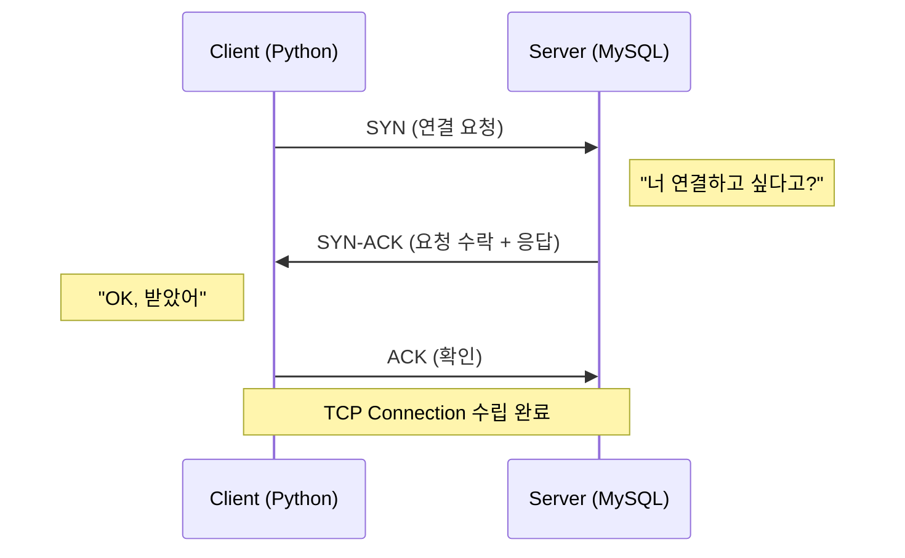
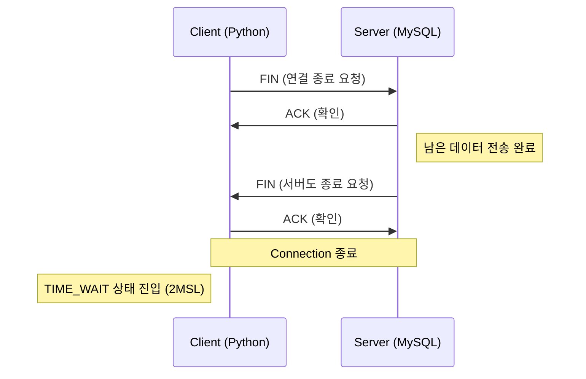
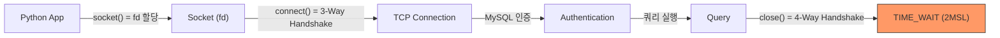

# Ch.6 왜 이렇게 되는가 - TCP/IP와 Socket

[< 사례: 서버는 살아있는데 요청이 실패한다](./01-case-connection-pool.md) | [Connection Pool과 Keep-Alive >](./03-connection-pool.md)

---

앞에서 NullPool이 QueuePool보다 1.75배 느리고, TIME_WAIT가 503개나 쌓이는 걸 확인했다. "Connection을 새로 만든다"는 게 대체 뭘 하는 건가? TCP/IP부터 시작한다.


## TCP/IP

인터넷의 통신 규칙이다. 우리가 쓰는 HTTP, MySQL Protocol, Redis Protocol 같은 건 전부 TCP/IP 위에서 동작한다.

<details>
<summary>TCP/IP (Transmission Control Protocol / Internet Protocol)</summary>

인터넷 통신의 기본 프로토콜 모음이다. 데이터를 패킷으로 쪼개서 보내고, 받는 쪽에서 다시 조립한다. TCP가 신뢰성(순서 보장, 재전송)을 담당하고, IP가 주소 지정과 라우팅을 담당한다.

</details>

TCP/IP는 4계층으로 나뉜다:

```
┌─────────────────────────────┐
│  Application Layer          │  HTTP, MySQL Protocol, DNS, ...
├─────────────────────────────┤
│  Transport Layer            │  TCP, UDP
├─────────────────────────────┤
│  Internet Layer             │  IP
├─────────────────────────────┤
│  Network Interface Layer    │  Ethernet, Wi-Fi
└─────────────────────────────┘
```

(OSI 7계층을 들어본 적이 있을 거다. OSI 7계층은 교과서용 이론 모델이고, 실무에서 실제로 쓰는 건 이 TCP/IP 4계층이다.)

우리가 관심 있는 건 Transport Layer의 TCP다. "Connection을 만든다"는 건 이 TCP 레벨에서 일어나는 일이다.


## TCP vs UDP

Transport Layer에는 TCP와 UDP 두 가지가 있다.

<details>
<summary>TCP (Transmission Control Protocol)</summary>

Connection-oriented 프로토콜이다. 데이터를 보내기 전에 먼저 연결을 수립(3-Way Handshake)하고, 데이터 전송 중 순서를 보장하고, 유실되면 재전송한다. 신뢰성이 필요한 통신(HTTP, DB, 파일 전송)에 사용한다.

</details>

<details>
<summary>UDP (User Datagram Protocol)</summary>

Connectionless 프로토콜이다. 연결 수립 없이 바로 데이터를 보낸다. 순서 보장도 재전송도 없다. 빠르지만 신뢰성이 없다. 실시간 스트리밍, 온라인 게임, DNS 조회 등에 사용한다.

</details>

| | TCP | UDP |
|--|-----|-----|
| 연결 | 있음 (3-Way Handshake) | 없음 |
| 순서 보장 | 있음 | 없음 |
| 재전송 | 있음 | 없음 |
| 속도 | 상대적으로 느림 | 빠름 |
| 용도 | HTTP, DB, 파일 전송 | 게임, 스트리밍, DNS |

DB Connection은 TCP를 쓴다. 데이터가 중간에 빠지거나 순서가 뒤바뀌면 안 되니까. 그런데 TCP를 쓰려면 먼저 "연결"을 만들어야 한다.


## 3-Way Handshake: Connection을 만드는 과정

TCP Connection을 만드려면 클라이언트와 서버가 3번 패킷을 주고받아야 한다. 이걸 3-Way Handshake라고 한다.

<details>
<summary>3-Way Handshake</summary>

TCP Connection을 수립하는 과정이다. SYN → SYN-ACK → ACK, 총 3번의 패킷 교환으로 양쪽이 통신 준비가 됐음을 확인한다. 클라이언트 기준으로, SYN을 보내고 SYN-ACK를 받아야 데이터를 보낼 수 있으므로, 최소 1 RTT(왕복 시간)가 소요된다.

</details>

<details>
<summary>RTT (Round-Trip Time, 왕복 시간)</summary>

패킷이 클라이언트에서 서버로 갔다가 다시 돌아오는 데 걸리는 시간이다. 같은 데이터센터 안이면 0.1~1ms, 서울-도쿄면 약 30ms, 서울-미국 동부면 약 200ms다. 3-Way Handshake는 이 왕복을 최소 1번 해야 하므로, RTT가 클수록 Connection 생성 비용이 커진다.

</details>



이 3번의 패킷 교환이 끝나야 비로소 데이터를 주고받을 수 있다. localhost에서는 RTT가 거의 0이라 체감이 안 되지만, DB가 별도 서버에 있으면 RTT가 0.5ms~수ms다. 클라이언트가 SYN을 보내고 SYN-ACK를 받을 때까지 1 RTT가 걸리니까, Connection 하나 만드는 데만 최소 1~수ms가 든다.

그런데 MySQL은 여기서 끝이 아니다. TCP Connection이 수립된 후, MySQL 프로토콜의 인증 과정(Authentication Handshake)이 추가로 필요하다. 사용자/비밀번호 확인, 권한 체크, 문자셋 협상 등. 이것까지 합치면 Connection 하나 만드는 비용은 더 커진다.

NullPool이 느렸던 이유가 이거다. 매 요청마다 이 전체 과정을 반복한다.


## 4-Way Handshake: Connection을 끊는 과정

만드는 것도 비용이지만, 끊는 것도 비용이다. TCP Connection을 끊으려면 4번의 패킷 교환이 필요하다.

<details>
<summary>4-Way Handshake</summary>

TCP Connection을 종료하는 과정이다. FIN → ACK → FIN → ACK, 총 4번의 패킷 교환이 필요하다. 양쪽이 각각 "나 보낼 거 다 보냈어"를 선언하고 확인하는 과정이다.

</details>



여기서 중요한 게 TIME_WAIT다. Connection을 먼저 끊은 쪽(클라이언트)이 TIME_WAIT 상태에 들어간다.

<details>
<summary>TIME_WAIT</summary>

TCP Connection을 먼저 끊은 쪽이 들어가는 대기 상태다. 2MSL(Maximum Segment Lifetime) 동안 유지된다. MSL은 패킷이 네트워크에서 살아있을 수 있는 최대 시간이다. 이 대기 시간은 OS마다 다르다: Linux는 보통 60초, macOS는 약 30초다. 이 기간에 같은 (source IP, source port, dest IP, dest port) 조합을 재사용할 수 없다. 왜 대기하는가? 네트워크에 아직 떠돌고 있을 수 있는 지연된 패킷이 새 Connection과 섞이는 걸 방지하기 위해서다.

</details>

NullPool 벤치마크 후 503개의 TIME_WAIT가 발생한 이유가 바로 이거다. 500건의 요청이 각각 Connection을 만들고 끊었다. 끊은 후 TIME_WAIT 상태로 수십 초간 남아 있다. 이게 수천 개 쌓이면 사용 가능한 로컬 포트가 고갈된다.

로컬 포트(ephemeral port) 범위는 직접 확인할 수 있다:

```bash
# Linux
cat /proc/sys/net/ipv4/ip_local_port_range
# 기본값: 32768  60999 (약 28,000개)

# macOS
sysctl net.inet.ip.portrange.first net.inet.ip.portrange.last
# 기본값: 49152 ~ 65535 (약 16,000개)
```

TIME_WAIT가 이 포트를 다 차지하면 새 Connection을 만들 수 없다.


## Socket = File Descriptor

TCP Connection의 실체가 뭔가? 프로그래밍 관점에서 보면, Socket이다.

<details>
<summary>Socket (소켓)</summary>

네트워크 통신의 끝점(endpoint)이다. IP 주소 + Port 번호의 조합으로 식별된다. 프로그램은 Socket을 통해 데이터를 보내고 받는다. OS 관점에서 Socket은 File Descriptor(fd)다.
(Python에서는 `socket` 모듈로 직접 다룰 수 있지만, 보통은 SQLAlchemy, requests 같은 라이브러리가 내부적으로 관리한다.)

</details>

Ch.2에서 "열린 파일은 fd(File Descriptor)로 관리된다"고 했다. stdout이 fd 1번이었고, 파일을 open하면 fd가 할당됐다. Socket도 마찬가지다. Socket을 만들면 fd가 할당된다.

```
socket()   → fd 할당          ← System Call (Ch.2)
connect()  → 3-Way Handshake  ← System Call
send/recv  → 데이터 송수신      ← System Call
close()    → 4-Way Handshake  ← System Call, fd 반환
```

전부 System Call이다. Ch.2에서 "System Call은 User Mode → Kernel Mode 전환이 필요하고, 그게 비용"이라고 했다. Connection 하나를 만들고 끊는 데 최소 4번의 System Call이 필요하다.

`netstat`이나 `lsof`로 확인하면, DB Connection이 실제로 fd를 차지하고 있는 걸 볼 수 있다:

```
$ netstat -an | grep 3306
tcp6  0  0  ::1.60929  ::1.3306  ESTABLISHED   ← Pool의 Connection (fd 1개)
tcp6  0  0  ::1.60927  ::1.3306  ESTABLISHED   ← Pool의 Connection (fd 1개)
tcp6  0  0  ::1.60925  ::1.3306  ESTABLISHED   ← Pool의 Connection (fd 1개)
```

ESTABLISHED 상태의 Connection 3개. 이게 Pool에서 유지하고 있는 Connection이다. 각각이 fd를 하나씩 차지한다.

fd에는 한계가 있다. `ulimit -n`으로 확인할 수 있는데, 보통 프로세스당 1,024개 또는 그 이상이다. Connection이 이 한계를 넘으면 새 Connection을 만들 수 없다.


## 전체 그림: Connection을 만들고 끊는 비용



NullPool은 매 요청마다 이 전체 과정을 반복한다. QueuePool은 한 번 만든 Connection을 재활용한다. connect() → 인증 → close() 과정을 생략한다. 그 차이가 1.75배의 성능 차이와 503개의 TIME_WAIT로 나타난 거다.

Connection을 만드는 게 비싸다는 건 알겠다. 그래서 Connection Pool이 필요하다. Pool이 어떻게 동작하고, 어떻게 설정해야 하는지 다음에서 본다.

---

[< 사례: 서버는 살아있는데 요청이 실패한다](./01-case-connection-pool.md) | [Connection Pool과 Keep-Alive >](./03-connection-pool.md)
