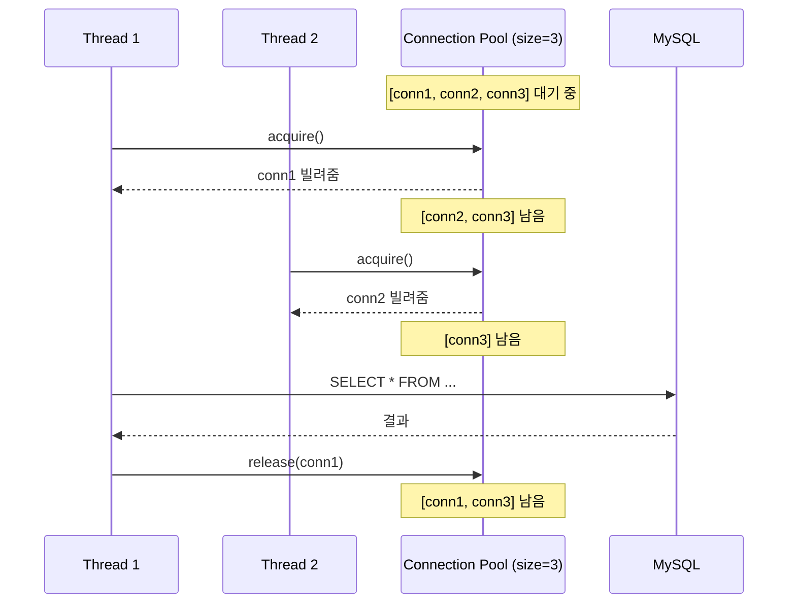
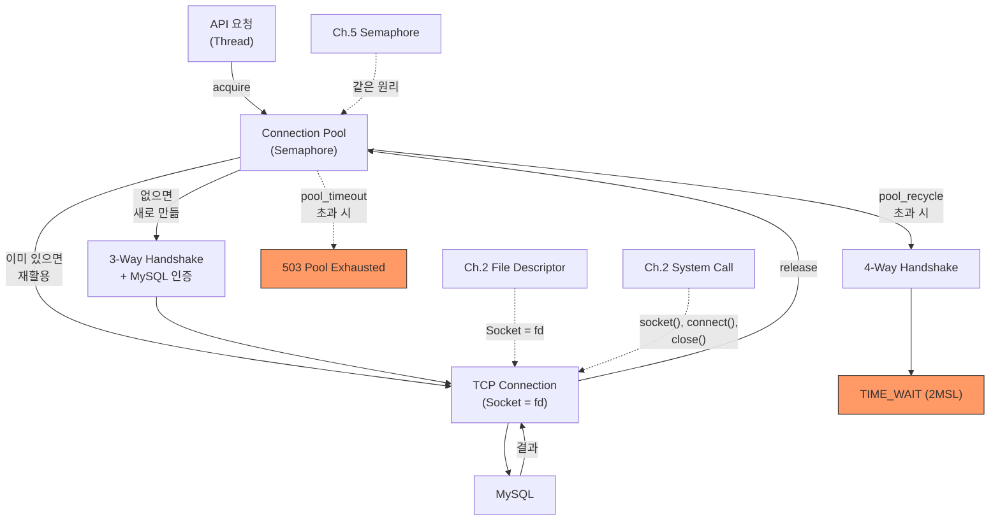

# Ch.6 왜 이렇게 되는가 - Connection Pool과 Keep-Alive

[< TCP/IP와 Socket](./02-tcp-socket.md) | [유사 사례와 키워드 정리 >](./04-summary.md)

---

앞에서 Connection 하나를 만드는 데 3-Way Handshake + MySQL 인증 + System Call 여러 번이 필요하다는 걸 확인했다. 끊을 때도 4-Way Handshake + TIME_WAIT. 그래서 Connection을 재활용하는 Connection Pool이 필요하다.


## Connection Pool

<details>
<summary>Connection Pool (커넥션 풀)</summary>

미리 N개의 DB Connection을 만들어두고, 요청이 올 때 빌려주고 다 쓰면 돌려받는 구조다. TCP Handshake와 인증을 매번 반복하지 않아도 된다. SQLAlchemy의 QueuePool, Java의 HikariCP, Go의 `database/sql` 내장 Pool이 모두 같은 원리다.

</details>

Pool의 동작을 비유하면, 도서관 열람실이다. 좌석이 10개다. 사람이 오면 빈 좌석에 앉고, 나가면 좌석이 반환된다. 좌석이 꽉 차면 기다린다. 기다리는 시간이 너무 길면 포기한다.

Ch.5에서 Semaphore를 "동시에 N개까지 허용하는 카운팅 잠금"이라고 했다. Connection Pool은 사실상 Semaphore(N)다:

| Semaphore | Connection Pool |
|-----------|----------------|
| N (카운트) | pool_size (Pool 크기) |
| acquire() | Pool에서 Connection 빌림 |
| release() | Connection을 Pool에 반환 |
| 대기 | pool_timeout까지 기다림 |



Connection을 빌릴 때 3-Way Handshake가 없다. 이미 만들어져 있으니까. 반환할 때 4-Way Handshake도 없다. 끊는 게 아니라 Pool에 돌려놓는 거니까. 이게 성능 차이의 핵심이다.


## Pool 사이징: 크기를 어떻게 정하는가

SQLAlchemy의 Connection Pool 설정 파라미터:

| 파라미터 | 기본값 | 의미 |
|---------|--------|------|
| pool_size | 5 | Pool에 유지할 기본 Connection 수 |
| max_overflow | 10 | pool_size를 넘어서 추가로 만들 수 있는 Connection 수 |
| pool_timeout | 30 | Connection을 기다리는 최대 시간 (초) |
| pool_recycle | -1 | Connection을 재사용할 최대 시간 (초). -1이면 무제한 |

`pool_size=5, max_overflow=10`이면 최대 15개의 Connection을 동시에 사용할 수 있다. 평상시에는 5개를 유지하고, 부하가 몰리면 10개까지 추가로 만든다. 추가로 만든 Connection은 사용 후 바로 닫힌다.

"그러면 pool_size를 크게 잡으면 되지 않나?" 문제가 있다. DB 쪽에도 `max_connections`라는 한계가 있다. MySQL 기본값은 151이다. 서버가 3대이고 각각 pool_size=60이면? 3 x 60 = 180. DB의 max_connections(151)을 초과한다. 새 Connection을 만들 수 없다.

(Ch.16에서 DB Connection Pool 사이징을 본격적으로 다룬다. "서버 대수 x pool_size < DB max_connections"가 기본 공식이다.)

사례 A에서 pool_size=3으로 설정한 이유가 이런 상황을 재현하기 위해서다. 실무에서는 보통 pool_size=5~20, max_overflow=5~10 정도를 쓴다.


## Keep-Alive: Connection을 유지하는 이유

Connection Pool이 Connection을 유지하는 원리가 Keep-Alive다.

<details>
<summary>Keep-Alive</summary>

TCP Connection을 한 번의 요청/응답 후 끊지 않고 유지하는 기법이다. HTTP/1.1에서는 기본적으로 Keep-Alive가 활성화되어 있어서, 하나의 TCP Connection으로 여러 HTTP 요청을 순차적으로 보낼 수 있다. DB Connection Pool도 같은 방향의 최적화다: Connection을 끊지 않고 유지하면서 재활용한다.

</details>

HTTP의 Keep-Alive와 DB Connection Pool은 "Connection을 재활용한다"는 같은 방향의 최적화다. 다만 동작하는 레이어가 다르다:

```
HTTP Keep-Alive: 하나의 TCP Connection을 여러 HTTP 요청에 순차 재사용
  TCP Connection 수립 → 요청1 → 응답1 → 요청2 → 응답2 → ... → 종료

DB Connection Pool: 여러 TCP Connection을 미리 만들어두고, 다수의 쿼리 세션에 배분
  TCP Connection 수립 → 쿼리1 → 결과1 → (Pool에 반환)
                         → 쿼리2 → 결과2 → (Pool에 반환) → ... → 종료
```

Keep-Alive는 "Connection 하나를 더 오래 쓰는 것"이고, Connection Pool은 "여러 Connection을 미리 만들어두고 나눠 쓰는 것"이다. 공통점은 한 번 만든 Connection을 재활용해서 3-Way Handshake + 인증을 매번 반복하지 않는다는 점이다.

그런데 Connection을 영원히 유지할 수는 없다. MySQL에는 `wait_timeout`이라는 설정이 있다. 기본값 28800초(8시간). 이 시간 동안 아무 쿼리도 안 보내면 MySQL이 먼저 Connection을 끊는다.

Pool에서 가져온 Connection이 이미 MySQL에 의해 끊겨 있으면? "MySQL server has gone away" 에러가 난다. 이걸 방지하는 게 `pool_recycle`이다:

```python
_engine = create_engine(
    SYNC_URL,
    pool_size=10,
    pool_recycle=3600,  # 1시간마다 Connection을 갱신한다
)
```

`pool_recycle=3600`이면 1시간이 넘은 Connection은 Pool에서 꺼낼 때 자동으로 폐기하고 새로 만든다. MySQL의 `wait_timeout`(8시간)보다 짧게 설정해야 한다.

`pool_recycle`만으로는 완벽하지 않다. 네트워크 문제로 Connection이 갑자기 끊길 수도 있다. 이때는 `pool_pre_ping=True`를 같이 쓴다:

```python
_engine = create_engine(
    SYNC_URL,
    pool_size=10,
    pool_recycle=3600,     # 1시간마다 Connection 갱신
    pool_pre_ping=True,    # Pool에서 꺼낼 때 살아있는지 확인 (ping)
)
```

`pool_pre_ping=True`면 Pool에서 Connection을 꺼낼 때마다 실제로 살아있는지 ping을 보낸다. 죽어있으면 폐기하고 새로 만든다. 약간의 오버헤드가 있지만, "MySQL server has gone away" 에러를 확실히 방지한다. 실무에서는 `pool_recycle`과 `pool_pre_ping`을 세트로 쓰는 것이 표준 패턴이다.


## TIME_WAIT와 CLOSE_WAIT

Connection을 끊을 때 발생하는 두 가지 문제 상태가 있다. 앞에서 TIME_WAIT를 봤다. CLOSE_WAIT도 알아야 한다.

<details>
<summary>CLOSE_WAIT</summary>

상대방이 FIN(종료 요청)을 보냈는데, 내가 아직 close()를 호출하지 않은 상태다. "상대는 끊으려 하는데 나는 아직 안 끊은 것"이다. CLOSE_WAIT가 쌓이면 fd가 고갈된다. Connection을 반환(close)하지 않는 코드가 원인인 경우가 많다.

</details>

| 상태 | 누가 들어가는가 | 원인 | 위험 |
|------|----------------|------|------|
| TIME_WAIT | Connection을 먼저 끊은 쪽 | 정상 종료 과정의 일부 | 포트 고갈 |
| CLOSE_WAIT | close()를 안 한 쪽 | Connection 반환 누락 | fd 고갈 |

TIME_WAIT는 정상적인 TCP 동작이다. Connection Pool로 재활용하면 자연스럽게 줄어든다. 문제는 CLOSE_WAIT다.

CLOSE_WAIT는 Ch.5에서 다뤘던 파일 잠금과 같은 구조다. "파일을 open()하고 close()를 안 하면 fd가 남아 있다." Connection도 마찬가지다. Pool에서 빌린 Connection을 반환하지 않으면 CLOSE_WAIT에 빠질 수 있다.

```python
# 위험한 패턴: 예외 발생 시 Connection이 반환되지 않는다
conn = engine.connect()
result = conn.execute(text("SELECT ..."))  # 여기서 예외 발생하면?
conn.close()  # 여기까지 안 온다

# 안전한 패턴: Context Manager로 반드시 반환
with engine.connect() as conn:
    result = conn.execute(text("SELECT ..."))
# with 블록을 나오면 자동으로 반환된다 (예외가 발생해도)
```

Ch.5의 `with lock:`과 같은 패턴이다. `with engine.connect() as conn:`이 acquire, 블록을 나오면 release. Python의 Context Manager가 여기서도 동작한다.


## 전체 그림



앞에서 봤던 개념들이 연결된다:

- Ch.2의 File Descriptor: Socket도 fd다. Connection 하나가 fd 하나
- Ch.2의 System Call: socket(), connect(), close() 전부 System Call
- Ch.5의 Semaphore: Pool size = Semaphore count. acquire/release
- Ch.5의 Context Manager: `with engine.connect()` = 자원 자동 반환

Connection Pool은 "비싼 자원을 미리 만들어두고 재활용한다"는 단순한 원리다. 그런데 이게 제대로 동작하려면 TCP/IP, Socket, fd, TIME_WAIT 전부를 이해해야 한다. 키워드를 모르면 "Connection Pool exhausted" 에러를 보고도 원인을 모른다.

---

[< TCP/IP와 Socket](./02-tcp-socket.md) | [유사 사례와 키워드 정리 >](./04-summary.md)
