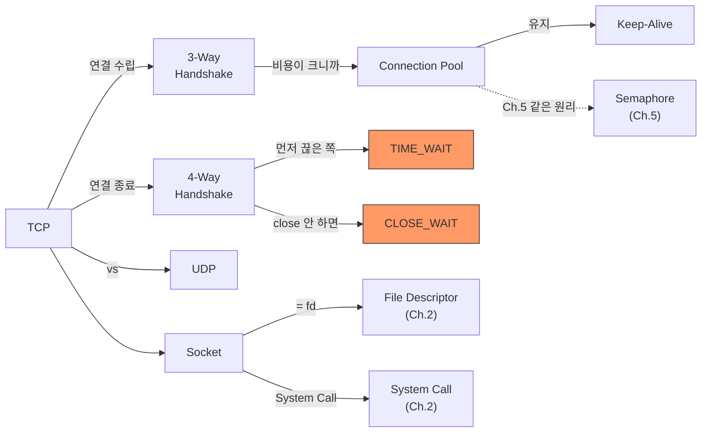

# Ch.6 유사 사례와 키워드 정리

[< Connection Pool과 Keep-Alive](./03-connection-pool.md)

---

이번 챕터에서는 Connection Pool 고갈이 왜 일어나는지, Connection을 매번 새로 만드는 비용이 얼마나 큰지, TCP/IP와 Socket의 실체를 확인했다.

같은 원리가 적용되는 실무 사례를 몇 가지 더 본다.


## 6-5. 유사 사례

### HTTP Client의 Connection Pool

서버가 외부 API를 호출할 때도 TCP Connection이 필요하다. 매번 새로 만들면 느리다.

```python
import requests

# 안 좋은 패턴: 매 호출마다 새 TCP Connection
for url in urls:
    response = requests.get(url)  # 매번 3-Way Handshake

# 좋은 패턴: Session으로 Connection 재활용
session = requests.Session()
for url in urls:
    response = session.get(url)   # TCP Connection 재활용 (Keep-Alive)
```

`requests.Session()`이 HTTP 레벨의 Connection Pool이다. `httpx.Client()`도 같은 역할을 한다. 내부적으로 TCP Connection을 유지하고 재활용한다.

### Redis Connection Pool

Redis도 TCP 기반이다. DB Connection Pool과 같은 원리가 적용된다.

```python
import redis

# Pool 없이 매번 새 Connection
r = redis.Redis(host='localhost', port=6379)  # 매번 연결

# Pool 사용 (redis-py 기본 동작)
pool = redis.ConnectionPool(host='localhost', port=6379, max_connections=10)
r = redis.Redis(connection_pool=pool)  # Connection 재활용
```

redis-py는 기본적으로 Connection Pool을 사용한다. `max_connections`가 Pool 크기이고, 이것도 Semaphore다.

(Ch.17에서 Redis를 본격적으로 다룰 때 Connection Pool 설정을 자세히 본다.)

### Slow Query가 Pool을 죽인다

사례 A에서 `SELECT SLEEP(1)`로 Connection을 1초간 점유했다. 실제 서비스에서 이런 역할을 하는 게 Slow Query다.

Index가 없는 테이블에 Full Scan 쿼리가 날아간다. 10초 걸린다. 그 10초 동안 Connection이 반환되지 않는다. 요청이 계속 들어오면? Pool이 고갈된다. 서버는 살아 있는데 요청이 전부 실패한다.

"성능이 안 나오니까 서버를 늘리자" → 서버를 3대 → pool_size x 3 → DB max_connections 초과 → 더 심한 장애.

원인은 Pool 크기가 아니라 Slow Query다. Index를 걸면 쿼리가 0.01초에 끝나고, Connection이 바로 반환된다.

(Ch.14에서 Index를 다루고, Ch.16에서 Slow Query와 Connection Pool의 관계를 자세히 본다.)

### gRPC와 HTTP/2 Multiplexing

지금 바로 이해하지 못해도 된다. "이런 방향도 있다"는 것만 알면 충분하다.

HTTP/1.1에서는 Keep-Alive로 Connection을 유지하더라도, 한 번에 하나의 요청-응답 쌍만 순차 처리할 수 있다. 앞 요청이 끝나야 다음 요청을 보낸다. HTTP/2에서는 하나의 TCP Connection으로 여러 요청을 동시에 처리할 수 있다. 이걸 Multiplexing이라고 한다.

gRPC는 HTTP/2 기반이다. TCP Connection 하나로 여러 RPC를 동시에 처리한다. Connection Pool의 필요성이 줄어든다. 하지만 완전히 없어지는 건 아니다. 하나의 Connection이 처리할 수 있는 동시 스트림 수에도 한계가 있다.

(이건 맛보기다. 이 강의에서 HTTP/2나 gRPC를 본격적으로 다루지는 않는다. "Connection 하나를 여러 요청이 공유할 수 있다"는 방향이 있다는 것만 기억하면 된다.)


## 그래서 실무에서는 어떻게 하는가

### 1. pool_size와 max_overflow를 적절히 설정한다

```python
engine = create_engine(
    "mysql+pymysql://...",
    pool_size=10,       # 평상시 유지할 Connection 수
    max_overflow=5,     # 부하 시 추가 생성 가능한 수
    pool_timeout=30,    # Connection 대기 시간 (초)
    pool_recycle=3600,  # Connection 갱신 주기 (초)
)
```

기본 공식: `서버 대수 x (pool_size + max_overflow) < DB max_connections`

### 2. pool_recycle과 pool_pre_ping을 세트로 설정한다

MySQL의 기본 `wait_timeout`은 28800초(8시간)다. `pool_recycle=3600`(1시간)이면 MySQL이 먼저 끊기 전에 Connection을 갱신한다. `pool_pre_ping=True`를 같이 쓰면 Connection을 꺼낼 때 살아있는지 확인하고, 죽어있으면 새로 만든다.

```python
engine = create_engine(
    "mysql+pymysql://...",
    pool_size=10,
    pool_recycle=3600,     # 1시간마다 갱신
    pool_pre_ping=True,    # 꺼낼 때 살아있는지 확인
)
```

이 두 설정을 같이 써야 "MySQL server has gone away" 에러를 확실히 방지한다.

### 3. with 문으로 Connection을 반드시 반환한다

```python
# 반드시 이 패턴을 쓴다
with engine.connect() as conn:
    result = conn.execute(text("SELECT ..."))
    conn.commit()
# 여기서 자동으로 Pool에 반환

# 절대 이렇게 쓰지 않는다
conn = engine.connect()
result = conn.execute(text("SELECT ..."))
# 예외 발생 시 conn.close()가 호출되지 않는다 → Connection 누수 → Pool 고갈
```

Ch.5의 `with lock:`과 같은 원리다. Context Manager가 자원 반환을 보장한다.

### 4. Connection 상태를 모니터링한다

```bash
# 현재 MySQL Connection 수 확인
mysql -u root -p -e "SHOW STATUS LIKE 'Threads_connected';"

# TCP Connection 상태 확인 (Linux)
ss -tn state established '( dport = 3306 )'
ss -tn state time-wait '( dport = 3306 )'

# macOS
netstat -an | grep 3306
```

TIME_WAIT가 수천 개 이상 쌓이고 있으면 Connection Pool이 없거나, NullPool을 쓰고 있을 가능성이 높다. CLOSE_WAIT가 쌓이고 있으면 Connection 반환 누락(close 안 함)을 의심한다.

### 5. DB 쪽 max_connections를 확인한다

```sql
SHOW VARIABLES LIKE 'max_connections';
-- 기본값: 151

SHOW STATUS LIKE 'Threads_connected';
-- 현재 연결된 Connection 수
```

서버를 늘리기 전에, 서버 대수 x pool_size가 max_connections를 초과하지 않는지 반드시 확인한다.


## 3. 오늘 키워드 정리

Connection이 뭔지, 왜 비싸고, 어떻게 재활용하는지를 키워드로 정리한다.

<details>
<summary>TCP/IP (Transmission Control Protocol / Internet Protocol)</summary>

인터넷 통신의 기본 프로토콜 모음이다. TCP가 신뢰성(순서 보장, 재전송)을 담당하고, IP가 주소 지정과 라우팅을 담당한다. HTTP, MySQL Protocol, Redis Protocol 전부 TCP/IP 위에서 동작한다.

</details>

<details>
<summary>TCP (Transmission Control Protocol)</summary>

Connection-oriented 프로토콜이다. 연결을 먼저 수립(3-Way Handshake)하고, 데이터 순서를 보장하고, 유실 시 재전송한다. DB, HTTP 등 신뢰성이 필요한 통신에 사용한다.

</details>

<details>
<summary>UDP (User Datagram Protocol)</summary>

Connectionless 프로토콜이다. 연결 수립 없이 바로 데이터를 보낸다. 순서 보장도 재전송도 없다. 빠르지만 신뢰성이 없다. 게임, 스트리밍, DNS 조회 등에 사용한다.

</details>

<details>
<summary>Socket (소켓)</summary>

네트워크 통신의 끝점이다. IP 주소 + Port 번호로 식별된다. OS 관점에서 Socket은 File Descriptor(fd)다. Ch.2에서 다뤘던 "열린 파일은 fd로 관리된다"는 원리가 그대로 적용된다.

</details>

<details>
<summary>3-Way Handshake</summary>

TCP Connection을 수립하는 과정이다. SYN → SYN-ACK → ACK, 3번의 패킷 교환이 필요하다. 클라이언트 기준 최소 1 RTT가 소요된다. Connection을 매번 새로 만드는 게 비싼 핵심 이유다.

</details>

<details>
<summary>4-Way Handshake</summary>

TCP Connection을 종료하는 과정이다. FIN → ACK → FIN → ACK, 4번의 패킷 교환이 필요하다. 종료 후 먼저 끊은 쪽이 TIME_WAIT에 들어간다.

</details>

<details>
<summary>Connection Pool (커넥션 풀)</summary>

미리 N개의 TCP Connection을 만들어두고 재활용하는 구조다. 3-Way Handshake + 인증을 매번 반복하지 않아도 된다. Ch.5의 Semaphore와 같은 원리: pool_size = Semaphore 카운트, acquire = 빌림, release = 반환.

</details>

<details>
<summary>Keep-Alive</summary>

TCP Connection을 한 번 만든 후 끊지 않고 유지하는 기법이다. HTTP/1.1에서는 기본 활성화되어 있다. DB Connection Pool도 같은 방향의 최적화: Connection을 유지하면서 여러 쿼리에 재활용한다. Keep-Alive는 단일 Connection의 수명을 늘리는 것이고, Connection Pool은 여러 Connection을 관리하는 더 상위 개념이다.

</details>

<details>
<summary>TIME_WAIT</summary>

TCP Connection을 먼저 끊은 쪽이 들어가는 대기 상태다. 2MSL 동안 유지되며, 시간은 OS마다 다르다 (Linux 약 60초, macOS 약 30초). Connection Pool 없이 대량의 Connection을 만들고 끊으면 TIME_WAIT가 쌓여서 포트 고갈이 발생한다.

</details>

<details>
<summary>CLOSE_WAIT</summary>

상대방이 FIN을 보냈는데 내가 close()를 호출하지 않은 상태다. Connection 반환(close)을 빠뜨린 코드가 원인인 경우가 많다. fd 고갈로 이어진다. `with` 문(Context Manager)으로 방지한다.

</details>


### 재등장 키워드

| 키워드 | 최초 등장 | 이번 챕터에서의 역할 |
|--------|----------|-------------------|
| File Descriptor | Ch.2 | Socket도 fd다. Connection 하나 = fd 하나. fd 한계 = 동시 Connection 한계 |
| System Call | Ch.2 | socket(), connect(), close() 전부 System Call. 비용이 드는 이유 |
| Semaphore | Ch.5 | Connection Pool = Semaphore(N). pool_size = 카운트 |
| Blocking I/O | Ch.3 | Pool 고갈 시 빈 Connection을 기다리며 블로킹 |
| Context Manager | Ch.5 | `with engine.connect()` = acquire/release 자동화. Connection 누수 방지 |
| Throughput / Latency | Ch.2 | Pool vs NullPool 벤치마크 비교 지표 |


### 키워드 연관 관계




## 다음에 이어지는 이야기

이번 챕터에서 네트워크 Connection이 어떻게 만들어지고, 왜 재활용하는지 확인했다. Part 1의 기초 체력 6챕터가 끝났다.

Ch.1에서 "키워드를 모르면 검색도 AI도 못 쓴다"고 했다. Ch.2~6에서 System Call, File Descriptor, GIL, Context Switch, Memory Layout, Virtual Memory, Race Condition, Deadlock, TCP/IP, Connection Pool 등의 키워드를 하나씩 쌓았다. Part 2에서는 이 기초 체력을 가지고 "AI 도구를 어떻게 활용하는가"를 다룬다.

---

[< Connection Pool과 Keep-Alive](./03-connection-pool.md)

[< Ch.5 동시성 제어의 기초](../ch05/README.md) | [Ch.7 AI가 코드를 짜주는 시대 >](../ch07/README.md)
