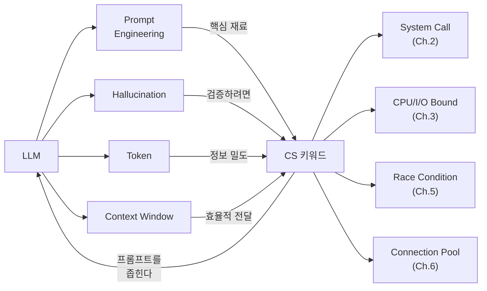

# Ch.7 유사 사례와 키워드 정리

[< CS 키워드로 AI를 제어하는 법](./03-do-dont-patterns.md)

---

앞에서 AI 코딩 도구의 작동 원리와, CS 키워드가 프롬프트에서 하는 역할을 봤다. 이번에는 Part 1 (Ch.1~6)에서 배운 키워드를 활용한 유사 사례를 더 보고, 키워드를 정리한다.


## 7-6. 유사 사례

앞에서 세 가지 사례(압축, 성능, 테스트)를 봤다. 같은 패턴이 다른 상황에서도 반복된다. Part 1에서 배운 키워드별로 몇 개 더 보자.

### 사례: "비동기로 바꿔줘"

개발자가 CPU 집약적인 이미지 리사이즈 코드를 AI에게 "비동기로 바꿔줘"라고 했다. AI는 `async def resize_image()`로 바꿔줬다. 그런데 성능이 전혀 개선되지 않았다.

Ch.3에서 배운 키워드가 있었다면: "이미지 리사이즈는 CPU Bound 작업이다. asyncio는 I/O Bound에만 효과가 있다. ProcessPoolExecutor로 병렬 처리해줘."

### 사례: "메모리 누수 같다"

서버가 점점 느려지다가 죽는다. 개발자가 "메모리 누수인 것 같다, 찾아줘"라고 했다. AI는 `gc.collect()`를 추가하고, weakref를 쓰라고 추천했다. 실제 원인은 무한히 커지는 리스트를 global 변수에 append하고 있었던 거였다.

Ch.4에서 배운 키워드가 있었다면: "RSS가 계속 증가한다. Heap 영역에서 해제되지 않는 객체가 있는 것 같다. `tracemalloc`으로 Heap 할당을 추적해줘."

### 사례: "동시에 요청하면 에러 난다"

재고 차감 API가 동시 요청에서 간헐적으로 잘못된 결과를 낸다. 개발자가 "동시에 요청하면 에러 난다"라고 했다. AI는 `try/except`를 추가하고, 에러 메시지를 로깅하라고 했다.

Ch.5에서 배운 키워드가 있었다면: "Race Condition이다. 재고 차감이 Critical Section인데 Lock이 없다. DB 레벨에서 `SELECT ... FOR UPDATE`로 Row-level Lock을 걸어줘."


## 그래서 실무에서는 어떻게 하는가

AI 코딩 도구를 실무에서 쓸 때 기억할 것 세 가지:

### 1. 진단 먼저, 프롬프트 나중

"문제가 뭔지 모르겠어, AI한테 물어보자"는 순서가 잘못됐다. 먼저 진단하고, 진단 결과를 프롬프트에 넣어라.

```
# 진단 도구 예시
$ EXPLAIN SELECT * FROM user WHERE email = 'test@test.com';   # DB
$ k6 run test.js                                              # 부하
$ htop                                                        # CPU/메모리
$ netstat -an | grep TIME_WAIT | wc -l                        # 네트워크
$ tracemalloc                                                 # 메모리 추적
```

### 2. 키워드를 모르면 키워드부터 물어봐라

진단 결과가 있는데 키워드를 모를 때는, "이 현상의 CS 용어가 뭔가?"부터 물어보는 게 낫다.

```
[나쁜 순서]
"이 문제 해결해줘" → 엉뚱한 답

[좋은 순서]
1. "EXPLAIN 결과가 이건데, 이 현상의 CS 용어가 뭔가?" → "Full Table Scan입니다"
2. "Full Table Scan을 해결하려면?" → "인덱스를 추가하세요"
3. "email 컬럼에 B-Tree 인덱스 거는 migration 만들어줘" → 정확한 코드
```

3단계로 나눠 물어보면 각 단계의 답이 다음 프롬프트의 키워드가 된다. 한 번에 해결하려고 하지 말고, 키워드를 학습하면서 프롬프트를 정교하게 만들어가는 거다.

### 3. AI의 답을 반드시 검증하라

AI가 "Redis를 붙이세요"라고 하면, 진짜 캐시가 필요한 상황인지 확인해라. AI가 "async로 바꾸세요"라고 하면, 이게 I/O Bound인지 CPU Bound인지 확인해라. AI가 "Mock으로 테스트하세요"라고 하면, Integration Test가 더 적절한 게 아닌지 확인해라.

검증하려면 CS 키워드를 알아야 한다. 결국 원점이다.


## 오늘의 키워드 정리

### 새 키워드

<details>
<summary>LLM (Large Language Model, 대규모 언어 모델)</summary>

대량의 텍스트 데이터로 훈련된 AI 모델이다. "다음에 올 가장 적절한 토큰을 확률적으로 예측"하는 방식으로 동작한다. GPT, Claude, Gemini 등이 여기에 해당한다. 코드도 텍스트의 일종이니까 코드 생성이 가능하고, 이게 AI 코딩 도구의 핵심 엔진이다. 정답을 계산하는 게 아니라 확률적으로 생성한다는 점이 핵심이다.

</details>

<details>
<summary>Token (토큰)</summary>

LLM이 텍스트를 처리하는 기본 단위다. 영어에서는 대략 단어 하나가 1~2 토큰, 한국어에서는 한 글자가 1~3 토큰 정도다. 프롬프트도 토큰으로 변환되고, 응답도 토큰 단위로 생성된다. CS 키워드 하나가 여러 일반 단어보다 "정보 밀도"가 높다는 점이 프롬프트 작성에서 중요하다.

</details>

<details>
<summary>Context Window (컨텍스트 윈도우)</summary>

LLM이 한 번에 처리할 수 있는 토큰 수의 상한이다. 모델마다 다르고 세대가 바뀌면 늘어나는 추세다. 프롬프트 + 응답이 이 범위 안에 들어가야 한다. Context Window가 유한하기 때문에, 적은 토큰으로 정확한 정보를 전달하는 CS 키워드의 가치가 높아진다.

</details>

<details>
<summary>Hallucination (환각, 할루시네이션)</summary>

LLM이 사실이 아닌 정보를 마치 사실인 것처럼 생성하는 현상이다. 존재하지 않는 라이브러리, 잘못된 API 사용법, 틀린 코드를 자신 있게 내놓는다. LLM은 사실을 검증하는 메커니즘이 없기 때문에 발생하는 구조적 한계다. AI의 답을 검증하려면 CS 지식이 필요한 이유가 여기에 있다. Ch.9에서 AI가 만든 코드를 리뷰하는 방법을 다룬다.

</details>

<details>
<summary>Prompt Engineering (프롬프트 엔지니어링)</summary>

AI에게 원하는 결과를 얻기 위해 프롬프트를 설계하는 기법이다. 이 챕터에서 다룬 4가지 패턴(원인 기반, 제약 조건, 방향 지정, 진단 결과 포함)이 실무에서의 Prompt Engineering이다. CS 키워드가 좋은 프롬프트의 핵심 재료라는 게 이 챕터의 결론이다.

</details>


### 재등장 키워드

| 키워드 | 최초 등장 | 이번 챕터에서의 역할 |
|--------|----------|-------------------|
| System Call | Ch.2 | "print가 느리다"의 원인 키워드로 프롬프트에 사용 |
| CPU Bound / I/O Bound | Ch.3 | "async로 바꿔줘" 대신 정확한 최적화 방향 지정 |
| Race Condition | Ch.5 | "동시에 요청하면 에러" 대신 원인 기반 프롬프트 |
| Connection Pool | Ch.6 | "DB 연결이 끊긴다" 대신 정확한 설정 키워드 |
| Full Table Scan | 맛보기 (Ch.14) | 사례 B에서 진단 결과 키워드로 등장 |
| B-Tree Index | 맛보기 (Ch.14) | 사례 B에서 해결 방향 키워드로 등장 |
| Integration Test | 맛보기 (Ch.21) | 사례 C에서 테스트 방식 지정 키워드로 등장 |

본문에서 맛보기로 언급된 키워드(Full Table Scan, B-Tree Index, Integration Test)는 이후 해당 챕터에서 자세히 다룬다. 지금은 "이런 키워드가 프롬프트에서 이런 역할을 한다" 정도로만 보면 된다.


### 키워드 연관 관계




다음 챕터(Ch.8)에서는 카테고리별로 "AI한테 줄 수 있는 CS 키워드 사전"을 정리한다. OS, DB, 네트워크, 자료구조, 아키텍처 분야별로 어떤 키워드를 알아야 AI를 정밀하게 제어할 수 있는지.

---

[< CS 키워드로 AI를 제어하는 법](./03-do-dont-patterns.md)
