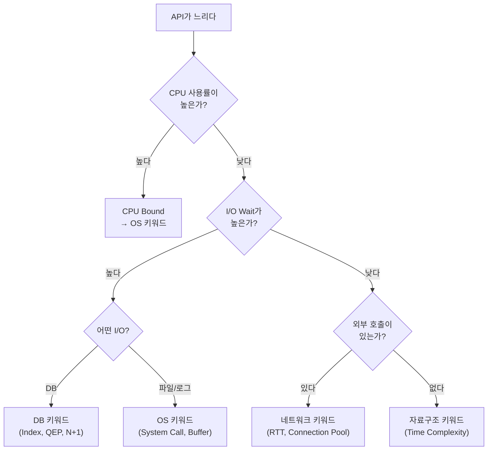

# Ch.8 DB와 자료구조 키워드

[< OS와 네트워크 키워드](./02-os-network-keywords.md) | [유사 사례와 키워드 정리 >](./04-summary.md)

---

앞에서 OS와 네트워크 키워드를 정리했다. 이번에는 DB, 자료구조, 아키텍처 키워드를 정리한다.

## DB 키워드

DB 키워드는 "데이터를 어떻게 저장하고 조회하는가"를 다룬다. 쿼리 성능, 데이터 정합성, Connection 관리 문제를 진단할 때 필요하다.

| 키워드 | 한 줄 설명 | 이런 상황에 쓴다 | 프롬프트 예시 |
|--------|-----------|-----------------|-------------|
| Index | 조회 속도를 높이기 위한 자료구조 (보통 B-Tree) | 쿼리가 느릴 때 가장 먼저 확인 | "EXPLAIN 결과 Full Table Scan이다. email 컬럼에 인덱스 걸어줘" |
| Full Table Scan | 인덱스 없이 테이블 전체를 훑는 것 | EXPLAIN 결과 type이 ALL일 때 | "Full Table Scan을 피하도록 WHERE 절 컬럼에 인덱스를 걸어줘" |
| Query Execution Plan (QEP) | DB가 쿼리를 실행하는 계획 | 쿼리가 왜 느린지 원인을 찾을 때 | "EXPLAIN ANALYZE 결과를 보고 병목 구간을 찾아줘" |
| N+1 Problem | 1번 쿼리 후 N번의 추가 쿼리가 발생하는 패턴 | ORM에서 연관 데이터를 반복 조회할 때 | "N+1 쿼리가 발생한다. joinedload로 eager loading 적용해줘" |
| Isolation Level | 동시 트랜잭션 간 데이터 격리 수준 | 동시 요청에서 데이터가 꼬일 때 | "Dirty Read가 발생한다. Isolation Level을 READ COMMITTED로 올려줘" |
| Connection Pool | DB Connection을 미리 만들어두고 재활용 | Connection 관련 에러가 날 때 | "pool_size=5인데 동시 요청이 50이다. pool_size와 max_overflow를 조정해줘" |
| Transaction | 하나의 작업 단위, 전부 성공하거나 전부 실패 | 데이터 정합성이 깨질 때 | "주문 생성과 재고 차감을 하나의 Transaction으로 묶어줘" |
| Deadlock (DB) | 두 트랜잭션이 서로의 Lock을 기다리는 상태 | DB에서 Deadlock detected 에러가 날 때 | "DB Deadlock이 발생한다. Lock 순서를 통일하거나 재시도 로직을 넣어줘" |

(Ch.6에서 Connection Pool을 배웠고, Ch.13~16에서 나머지를 자세히 다룬다.)

## 자료구조 키워드

자료구조 키워드는 "데이터를 어떤 형태로 저장하고 접근하는가"를 다룬다. "왜 이 코드가 느린가"를 데이터 구조 관점에서 진단할 때 필요하다.

| 키워드 | 한 줄 설명 | 이런 상황에 쓴다 | 프롬프트 예시 |
|--------|-----------|-----------------|-------------|
| Hash Map (dict) | 키→값 매핑, 평균 O(1) 조회 | 리스트에서 반복 검색할 때 | "List에서 in 연산을 1만 번 하고 있다. Set이나 Dict로 바꿔줘" |
| B-Tree | 디스크 기반 정렬 트리, DB 인덱스의 기본 구조 | 인덱스 작동 원리를 AI에게 설명할 때 | "B-Tree 인덱스 기반이니까 범위 검색이 가능하다. BETWEEN 쿼리로 바꿔줘" |
| Bloom Filter | 원소가 집합에 있는지 확률적으로 판별 | 대량 데이터에서 존재 여부를 빠르게 확인할 때 | "100만 건 중 중복 체크를 매번 DB 조회 없이 하고 싶다. Bloom Filter를 적용해줘" |
| Queue (FIFO) | 선입선출 구조 | 작업을 순서대로 처리할 때 | "요청을 Queue에 넣고 Worker가 순서대로 처리하는 구조로 바꿔줘" |
| Stack (LIFO) | 후입선출 구조 | 재귀를 반복문으로 바꿀 때 | "재귀가 깊어서 Stack Overflow 위험이 있다. 명시적 Stack으로 바꿔줘" |
| Tree / Graph | 계층/관계 구조 | 카테고리, 의존성, 조직도 같은 계층 데이터에 | "카테고리 트리를 매번 재귀로 조회한다. CTE로 한 번에 가져오게 바꿔줘" |
| Time Complexity | 알고리즘의 입력 크기 대비 실행 시간 증가율 | "이 코드가 왜 느린지" 근본 원인을 설명할 때 | "이 로직이 O(n^2)이다. O(n log n)으로 개선해줘" |

(Ch.10~12에서 자세히 다룬다.)

## 아키텍처 키워드

아키텍처 키워드는 "시스템을 어떻게 구성하는가"를 다룬다. 설계, 확장, 배포 문제를 논의할 때 필요하다.

| 키워드 | 한 줄 설명 | 이런 상황에 쓴다 | 프롬프트 예시 |
|--------|-----------|-----------------|-------------|
| Monolith | 하나의 코드베이스에 모든 기능이 들어있는 구조 | 서비스가 커져서 배포가 느려질 때 | "Monolith에서 주문 서비스만 분리하고 싶다. 어떻게 시작하면 되는가?" |
| Microservice | 기능별로 독립된 서비스로 분리한 구조 | 서비스 분리를 고려할 때 | "주문과 결제를 Microservice로 분리하면 통신은 어떻게 하는가?" |
| Event-Driven | 이벤트를 발행하고 구독하는 비동기 아키텍처 | 서비스 간 결합도를 낮추고 싶을 때 | "주문 생성 시 알림/재고/정산을 Event-Driven으로 처리하고 싶다" |
| Message Queue | 서비스 간 메시지를 비동기로 전달하는 중간 계층 | 직접 호출 대신 비동기 통신이 필요할 때 | "외부 API 호출을 Celery + RabbitMQ Message Queue로 비동기 처리해줘" |
| CQRS | 읽기와 쓰기를 분리하는 패턴 | 읽기/쓰기 부하가 크게 다를 때 | "읽기가 쓰기의 100배다. CQRS로 읽기 전용 DB를 분리해줘" |
| Circuit Breaker | 장애가 난 외부 서비스 호출을 차단하는 패턴 | 외부 서비스 장애가 내 서비스에 전파될 때 | "외부 API 장애 시 Circuit Breaker로 fallback 처리해줘" |

(Ch.20~22에서 자세히 다룬다.)

## 카테고리를 넘나드는 진단

실무 문제는 한 카테고리에 깔끔하게 떨어지지 않는다. "API가 느리다"라는 증상 하나에도 여러 카테고리의 키워드가 엮인다. 빠른 진단을 위한 "키워드 카테고리 결정 트리"를 하나 그려보면:

이 트리를 머리에 넣어두면, 문제 상황에서 어느 카테고리의 키워드를 꺼낼지 빠르게 결정할 수 있다. AI에게 물어볼 때도 "어느 방향에서 봐야 하는가"를 먼저 정하고 프롬프트를 쓰는 거다.

---

[< OS와 네트워크 키워드](./02-os-network-keywords.md) | [유사 사례와 키워드 정리 >](./04-summary.md)
