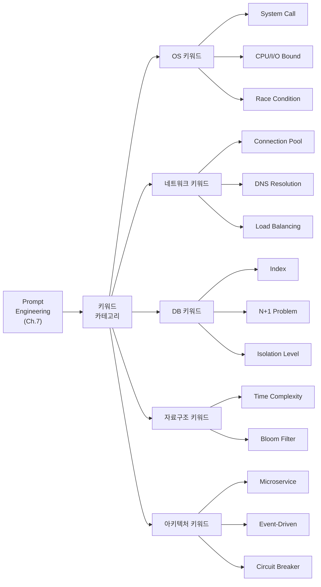

# Ch.8 유사 사례와 키워드 정리

[< DB와 자료구조 키워드](./03-db-ds-keywords.md)

---

앞에서 OS, 네트워크, DB, 자료구조, 아키텍처 5개 카테고리의 키워드를 정리했다. 이번에는 카테고리를 조합해서 쓰는 실전 사례를 더 보고, 키워드를 정리한다.


## 8-6. 유사 사례

### 사례: 이미지 업로드 API가 느리고 서버가 죽는다

이미지 업로드 API가 있다. 사용자가 이미지를 올리면 리사이즈하고 DB에 메타데이터를 저장한다. 동시에 10명이 올리면 서버가 느려지다가 OOM으로 죽는다.

키워드를 모르면: "이미지 업로드가 느리고 서버가 죽어요. 도와주세요."

키워드를 알면:

```
이미지 리사이즈는 CPU Bound 작업이다 (OS).
동시 업로드 10건이 전부 메인 스레드에서 실행되고 있다.
1. ProcessPoolExecutor로 리사이즈를 별도 프로세스에서 처리 (OS)
2. 원본 이미지를 메모리에 전부 올리지 말고 streaming으로 chunk 단위 처리 (자료구조/메모리)
3. 리사이즈 완료 후 S3에 업로드하는 건 I/O Bound니까 asyncio로 처리 (네트워크)
4. 메타데이터 INSERT는 Transaction으로 묶어줘 (DB)
```

OS + 자료구조 + 네트워크 + DB 키워드를 한 프롬프트에 조합했다. AI는 이 프롬프트를 받으면 네 가지 최적화를 동시에 적용한 코드를 생성할 수 있다.


### 사례: 동시 주문에서 재고가 음수가 된다

재고 차감 API에서 동시 주문이 들어오면 재고가 0 아래로 떨어진다. 이건 Ch.5에서 봤다.

키워드를 모르면: "동시에 주문하면 재고가 마이너스가 돼요."

키워드를 알면:

```
Race Condition이다 (OS/동시성).
1. DB에서 SELECT ... FOR UPDATE로 Row-level Lock을 걸어줘 (DB/Isolation)
2. 혹은 Optimistic Locking으로 version 컬럼 추가해줘 (DB)
3. 트래픽이 많으면 Redis DECR로 Atomic 연산해줘 (자료구조/캐시)
```

동시성 (OS) + Lock (DB) + Atomic 연산 (자료구조) 키워드를 조합했다. 문제 해결 방향이 여러 개이고, 상황에 따라 다른 방법을 쓸 수 있다는 것도 키워드를 알아야 보인다.


## 그래서 실무에서는 어떻게 하는가

### 키워드 사전을 "외우는" 게 아니다

이 챕터에서 정리한 키워드 표를 전부 외울 필요는 없다. 중요한 건 두 가지다:

1. "이런 카테고리의 키워드가 있다"는 걸 안다
2. 문제 상황에서 "이건 어느 카테고리인가?"를 판단할 수 있다

이 두 가지만 되면, 구체적인 키워드는 검색하거나 AI에게 물어보면 된다. Ch.7에서 봤듯이 "이 현상의 CS 용어가 뭔가?"부터 물어보는 것도 좋은 전략이다.

### 진단 → 카테고리 → 키워드 → 프롬프트

실무에서의 흐름을 정리하면:

1. 증상을 확인한다 ("느리다", "죽는다", "꼬인다")
2. 진단 도구로 원인을 좁힌다 (htop, EXPLAIN, netstat, tracemalloc)
3. 원인이 어느 카테고리인지 판단한다 (OS? DB? 네트워크? 자료구조?)
4. 해당 카테고리의 키워드를 프롬프트에 넣는다
5. AI의 답을 CS 지식으로 검증한다

이 흐름이 Ch.7에서 말한 "진단 먼저, 프롬프트 나중"의 구체적인 모습이다.


## 오늘의 키워드 정리

이번 챕터는 기존 키워드를 "프롬프트에서 어떻게 활용하는가" 관점으로 재정리한 챕터다. 새 키워드보다 기존 키워드의 활용법이 핵심이다.

### 새 키워드

<details>
<summary>DNS Resolution (DNS 해석)</summary>

도메인 이름(예: api.example.com)을 IP 주소로 변환하는 과정이다. 첫 번째 요청이 유독 느리다면 DNS Resolution에 시간이 걸린 것일 수 있다. OS나 애플리케이션 레벨에서 DNS 캐시를 확인하면 된다. Ch.6에서 다룬 TCP Connection 수립 이전에 일어나는 단계다.

</details>

<details>
<summary>Load Balancing (부하 분산)</summary>

들어오는 트래픽을 여러 서버에 분산하는 기법이다. Round Robin(순서대로), Least Connections(연결 수가 가장 적은 서버에), IP Hash(같은 IP는 같은 서버에) 등 여러 알고리즘이 있다. Ch.19에서 Scale-Out과 함께 자세히 다룬다.

</details>

<details>
<summary>N+1 Problem (N+1 문제)</summary>

ORM에서 연관 데이터를 조회할 때, 메인 쿼리 1번 + 연관 데이터 쿼리 N번이 발생하는 패턴이다. 10건의 주문을 조회하면서 각 주문의 사용자 정보를 1건씩 따로 가져오면 총 11번의 쿼리가 실행된다. Ch.13에서 자세히 다룬다.

</details>

<details>
<summary>Time Complexity (시간 복잡도)</summary>

알고리즘의 입력 크기(n) 대비 실행 시간이 어떻게 증가하는지를 나타내는 지표다. O(1)은 입력 크기에 관계없이 일정, O(n)은 비례, O(n^2)은 제곱으로 증가한다. "이 코드가 왜 느린지"의 근본 원인을 설명하는 도구다. Ch.10에서 자세히 다룬다.

</details>

<details>
<summary>Circuit Breaker (서킷 브레이커)</summary>

외부 서비스가 장애일 때 계속 호출하지 않고, 일정 실패 횟수 이후 호출 자체를 차단하는 패턴이다. 전기 회로의 차단기(breaker)에서 이름을 따왔다. 장애가 내 서비스로 전파되는 걸 막아준다. Ch.22에서 분산 시스템과 함께 다룬다.

</details>

<details>
<summary>CQRS (Command Query Responsibility Segregation)</summary>

읽기(Query)와 쓰기(Command)를 분리하는 아키텍처 패턴이다. 읽기가 쓰기보다 압도적으로 많은 서비스에서, 읽기 전용 DB(Read Replica)를 두고 쓰기 DB와 분리하는 게 대표적인 구현이다. Ch.19에서 Scale-Out과 함께 다룬다.

</details>


### 재등장 키워드

이번 챕터에서 다시 등장한 키워드가 많다. 전부 "프롬프트에서의 활용"이라는 새로운 관점으로 다뤘다.

| 키워드 | 최초 등장 | 이번 챕터에서의 역할 |
|--------|----------|-------------------|
| System Call | Ch.2 | OS 키워드 표 - 로그 I/O 진단 |
| CPU Bound / I/O Bound | Ch.3 | OS 키워드 표 - 최적화 방향 결정 |
| Context Switch | Ch.3 | OS 키워드 표 - 스레드 과다 진단 |
| Race Condition / Deadlock | Ch.5 | OS 키워드 표 - 동시성 문제 진단 |
| OOM | Ch.4 | OS 키워드 표 - 메모리 문제 진단 |
| Connection Pool | Ch.6 | 네트워크 + DB 양쪽에서 등장 |
| TIME_WAIT | Ch.6 | 네트워크 키워드 표 - 포트 고갈 |
| Latency / Throughput | Ch.2 | 네트워크 키워드 표 - 성능 지표 |
| Prompt Engineering | Ch.7 | 키워드를 프롬프트에 녹이는 구체적 방법 |

본문에서 맛보기로 언급된 키워드(N+1, Isolation Level, Bloom Filter, CQRS, Circuit Breaker 등)는 이후 해당 챕터에서 자세히 다룬다. 지금은 "이런 키워드가 있고, 이런 상황에서 AI에게 줄 수 있다" 정도로만 보면 된다.


### 키워드 연관 관계




다음 챕터(Ch.9)에서는 "AI가 만든 코드를 CS 관점에서 리뷰하는 방법"을 다룬다. 키워드를 알아서 좋은 프롬프트를 쓸 수 있게 됐는데, AI의 답이 정말 맞는지는 어떻게 검증하는가?

---

[< DB와 자료구조 키워드](./03-db-ds-keywords.md)
