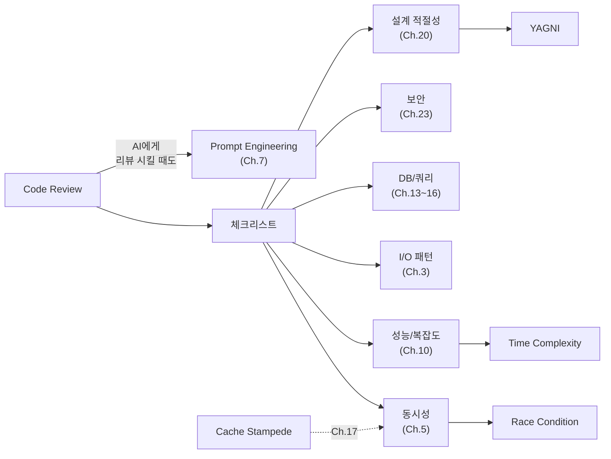

# Ch.9 유사 사례와 키워드 정리

[< CS 관점 코드 리뷰 체크리스트](./03-review-checklist.md)

---

앞에서 AI가 자주 틀리는 패턴과 CS 관점 코드 리뷰 체크리스트를 정리했다. 이번에는 유사 사례를 더 보고, Part 2 전체를 마무리한다.


## 9-6. 유사 사례

### 사례: AI가 만든 캐시 코드에 Cache Stampede가 숨어있었다

AI에게 "Redis 캐시를 적용해줘"라고 했다. AI가 준 코드:

```python
def get_user(user_id: int):
    cached = redis.get(f"user:{user_id}")
    if cached:
        return json.loads(cached)

    user = db.query(User).get(user_id)
    redis.set(f"user:{user_id}", json.dumps(user.dict()), ex=60)
    return user
```

잘 동작한다. 그런데 캐시 만료 순간에 동시 요청 100개가 들어오면? 100개 전부 캐시 미스가 나고, 100개 전부 DB를 조회한다. 이게 Cache Stampede다.

CS를 아는 사람은 이 코드를 보고 "캐시 만료 시점의 동시성이 고려되지 않았다"는 걸 안다. Mutex Lock이나 캐시 갱신 전략(예: 만료 전에 미리 갱신)이 필요하다. Ch.17에서 자세히 다룬다.


### 사례: AI가 만든 재귀 코드가 Stack Overflow를 냈다

AI에게 "카테고리 트리를 순회하는 함수를 만들어줘"라고 했다. AI가 준 재귀 코드는 카테고리가 5단계면 잘 동작했지만, 운영 DB에서 100단계 깊이의 데이터가 들어오자 `RecursionError: maximum recursion depth exceeded`가 발생했다.

Ch.4에서 배운 것: 재귀는 함수 호출마다 Stack Frame이 쌓인다. Python의 기본 재귀 제한은 1,000이다. 명시적 Stack(리스트)을 사용한 반복문으로 바꾸면 해결된다. Ch.12에서 자세히 다룬다.


## Part 2 마무리: AI 시대의 CS

Part 2 (Ch.7~9)에서 말하고 싶은 결론은 세 줄이다:

1. CS 키워드를 알아야 좋은 프롬프트를 쓸 수 있다 (Ch.7)
2. 카테고리별 키워드를 알아야 문제를 진단하고 방향을 잡을 수 있다 (Ch.8)
3. CS 지식이 있어야 AI의 답을 검증할 수 있다 (Ch.9)

AI는 도구다. 도구를 잘 쓰려면 도구의 한계를 알아야 한다. AI의 한계는 "기능은 만들지만, 품질은 보장하지 않는다"는 거다. 품질을 보장하는 건 개발자의 CS 역량이다.

Part 3부터는 다시 CS 본론으로 돌아간다. 자료구조, 알고리즘, 데이터베이스, 캐시, 아키텍처, 보안까지. 각 챕터에서 배우는 키워드가 곧 AI에게 줄 수 있는 프롬프트 재료가 된다는 걸 기억하면서 읽으면 된다.


## 오늘의 키워드 정리

### 새 키워드

<details>
<summary>Code Review (코드 리뷰)</summary>

작성된 코드를 다른 사람(또는 자동화 도구)이 검토하는 과정이다. 기능 동작 여부뿐 아니라 동시성, 성능, 보안, 가독성 등을 확인한다. AI가 만든 코드도 반드시 리뷰해야 한다. 이 챕터에서는 CS 관점의 리뷰 체크리스트를 제시했다.

</details>

<details>
<summary>YAGNI (You Ain't Gonna Need It)</summary>

"지금 필요하지 않은 기능을 미리 만들지 마라"는 소프트웨어 공학 원칙이다. AI는 확장 가능성을 고려해서 불필요한 추상화를 만드는 경향이 있다. 구체 구현이 하나뿐인 인터페이스, 사용처가 하나뿐인 팩토리 패턴 등이 YAGNI 위반의 전형이다. Ch.20에서 관심사의 분리와 함께 다룬다.

</details>

<details>
<summary>Cache Stampede (캐시 스탬피드)</summary>

캐시가 만료되는 순간에 대량의 요청이 동시에 원본 저장소(DB 등)를 조회하는 현상이다. 캐시가 있을 때는 안정적이다가 만료 순간에 DB 부하가 폭증한다. Mutex Lock, 만료 전 갱신, 확률적 갱신 등으로 방지한다. Ch.17에서 자세히 다룬다.

</details>


### 재등장 키워드

| 키워드 | 최초 등장 | 이번 챕터에서의 역할 |
|--------|----------|-------------------|
| Race Condition | Ch.5 | AI가 놓치는 동시성 문제의 대표 사례 |
| Time Complexity | Ch.8 | AI 코드의 성능 문제를 판단하는 기준 |
| CPU Bound / I/O Bound | Ch.3 | AI가 잘못 선택하는 I/O 패턴 |
| N+1 Problem | Ch.8 | 코드 리뷰 체크리스트 DB 항목 |
| Hallucination | Ch.7 | AI가 자신 있게 틀리는 근본 원인 |
| Stack Frame | Ch.4 | 재귀 코드의 Stack Overflow 위험 |
| Prompt Engineering | Ch.7 | 체크리스트를 AI 프롬프트에 활용 |


### 키워드 연관 관계




Part 3 (Ch.10)부터는 자료구조와 알고리즘의 실무로 넘어간다. "contains()를 쓰지 마세요"라는 제목부터 호기심이 생기지 않는가?

---

[< CS 관점 코드 리뷰 체크리스트](./03-review-checklist.md)
