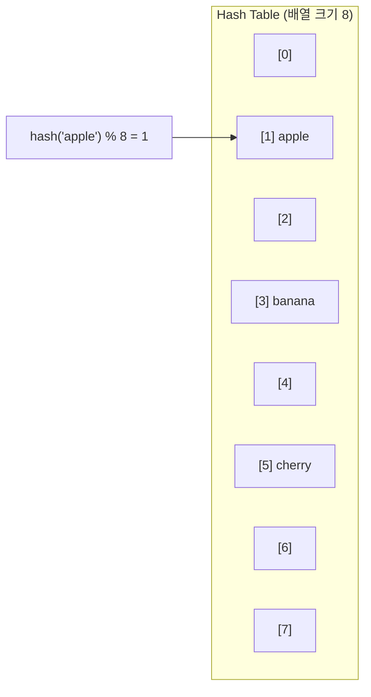

# Ch.10 Hash Table과 시간 복잡도

[< 사례 - contains()가 API를 멈추게 한 날](./01-case.md) | [자료구조 선택의 기준 >](./03-choosing-ds.md)

---

앞에서 List의 `in`은 O(n), Set과 Dict의 `in`은 O(1)이라는 걸 확인했다. 그런데 Set과 Dict는 어떻게 O(1)로 검색하는가? Hash Table이다.


## Hash 함수: 값을 주소로 바꾸는 함수

Hash 함수는 임의의 입력을 받아서 고정된 크기의 숫자(Hash 값)를 만들어내는 함수다.

```python
>>> hash(42)
42
>>> hash("hello")
-1460269652697719381
>>> hash("world")
-3087853098795208927
```

Python의 `hash()` 함수가 바로 그거다. 같은 입력에는 항상 같은 출력을 내놓고, 다른 입력에는 (대부분) 다른 출력을 내놓는다.

Hash Table은 이 Hash 값을 배열의 인덱스로 사용한다. 비유하자면 이렇다.

도서관에서 책을 찾는 두 가지 방법이 있다:

1. 모든 책장을 처음부터 끝까지 훑는다 (Linear Search)
2. 청구기호(Hash 값)를 보고 바로 해당 책장으로 간다 (Hash Table)

두 번째 방법이 빠른 이유는 "어디에 있는지 계산할 수 있기 때문"이다.


## Hash Table의 내부 동작

Set에 값을 추가할 때 일어나는 일을 단순화하면 이렇다:

```
1. hash(값) 계산 → 예: hash("apple") = 7239481
2. 내부 배열 크기로 나눈 나머지 → 7239481 % 8 = 1
3. 배열[1]에 "apple"을 저장
```

검색할 때도 같은 순서다:

```
1. hash("apple") 계산 → 7239481
2. 7239481 % 8 = 1
3. 배열[1]에 가서 확인 → 있다!
```

배열의 인덱스 접근은 O(1)이다. 계산 한 번으로 바로 위치를 알 수 있으니까 10만 개든 100만 개든 검색 시간이 동일하다.




## Hash 충돌: 같은 위치에 두 값이 들어가면?

Hash 함수의 출력을 배열 크기로 나눈 나머지를 쓰니까, 다른 값이 같은 인덱스에 배정될 수 있다. 이걸 Hash 충돌(Hash Collision)이라고 한다.

```
hash("apple") % 8 = 1
hash("grape") % 8 = 1  # 충돌!
```

충돌을 해결하는 방법은 크게 두 가지다.

### Chaining (체이닝)

같은 인덱스에 연결 리스트를 만든다. 배열[1]에 `apple → grape`처럼 체인으로 연결한다. 검색할 때는 해당 인덱스의 연결 리스트를 순회한다.

(Java의 `HashMap`이 이 방식이다. 충돌이 많아지면 연결 리스트를 Red-Black Tree로 전환하는 최적화도 한다.)

### Open Addressing (개방 주소법)

충돌이 나면 다음 빈 칸을 찾아간다. Python의 `dict`와 `set`이 이 방식이다. 정확히는 Linear Probing이 아니라 Perturbation Probing이라는 방식을 쓰는데, 충돌이 나면 Hash 값의 일부를 추가로 사용해서 다음 위치를 결정한다.

(궁금하면 CPython 소스의 `Objects/dictobject.c`를 보면 된다. 주석이 아주 잘 되어 있다.)

<details>
<summary>Hash Collision (해시 충돌)</summary>

서로 다른 키가 같은 Hash 값(또는 같은 버킷 위치)을 가지는 현상이다. Hash Table에서는 불가피하게 발생하며, Chaining이나 Open Addressing으로 해결한다. 충돌이 많아지면 O(1)이 보장되지 않고 최악의 경우 O(n)까지 퇴화할 수 있다. 그래서 Hash Table은 적절한 크기를 유지하는 게 중요하다.

</details>


## Hash Table의 리사이즈

Hash Table은 내부 배열이 꽉 차면 성능이 떨어진다. 충돌이 많아지니까. 그래서 일정 비율(Load Factor) 이상 차면 배열 크기를 늘리고 전부 재배치한다. 이걸 Rehashing이라고 한다.

Python에서 Set과 Dict의 메모리 크기 변화를 보면:

```
=== Set 크기 변화 ===
Empty set: 216 bytes
After 5 elements: 728 bytes (resize!)
After 19 elements: 2,264 bytes (resize!)
After 77 elements: 8,408 bytes (resize!)

=== Dict 크기 변화 ===
Empty dict: 64 bytes
After 1 entries: 224 bytes (resize!)
After 6 entries: 352 bytes (resize!)
After 11 entries: 632 bytes (resize!)
After 22 entries: 1,168 bytes (resize!)
After 43 entries: 2,264 bytes (resize!)
After 86 entries: 4,688 bytes (resize!)
```

원소가 일정 수를 넘을 때마다 내부 배열이 커진다. 이 리사이즈 비용이 간헐적으로 발생한다. 하지만 전체적으로 보면(Amortized Analysis) 삽입은 여전히 O(1)이다.

<details>
<summary>Load Factor (적재율)</summary>

Hash Table에서 사용 중인 슬롯 수 / 전체 슬롯 수다. Load Factor가 높아지면 충돌이 많아져서 성능이 떨어진다. 보통 0.66~0.75 정도가 되면 리사이즈한다. Python의 Dict는 약 2/3(0.66) 정도에서 리사이즈한다. Java의 HashMap은 기본 Load Factor가 0.75다.

</details>


## 시간 복잡도 정리

자주 쓰는 시간 복잡도를 정리하면:

| 표기 | 의미 | 예시 |
|------|------|------|
| O(1) | 상수 시간 - 입력 크기와 무관 | Hash Table 검색, 배열 인덱스 접근 |
| O(log n) | 로그 시간 - 반씩 줄어듦 | Binary Search, B-Tree 검색 |
| O(n) | 선형 시간 - 입력에 비례 | List 순회, Linear Search |
| O(n log n) | - | 효율적인 정렬 (Merge Sort, Tim Sort) |
| O(n^2) | 제곱 시간 | 이중 루프, Bubble Sort |

n = 10만일 때 실제 연산 횟수를 비교하면:

| 복잡도 | n = 100 | n = 10,000 | n = 100,000 |
|--------|---------|------------|-------------|
| O(1) | 1 | 1 | 1 |
| O(log n) | 7 | 14 | 17 |
| O(n) | 100 | 10,000 | 100,000 |
| O(n log n) | 700 | 140,000 | 1,700,000 |
| O(n^2) | 10,000 | 100,000,000 | 10,000,000,000 |

O(1)과 O(n)의 차이가 앞에서 본 4,000배 차이다. n이 커질수록 격차는 더 벌어진다.

여기서 한 가지 주의. 시간 복잡도는 "성장률"이지 "절대 시간"이 아니다. O(1)이라고 해서 "한 번의 연산"이라는 뜻이 아니다. Hash 계산, 비교, 메모리 접근 등 상수 시간의 작업이 여러 번 들어간다. 다만 그 횟수가 n에 의존하지 않는다는 뜻이다. O(n)이 O(1)보다 빠른 경우도 n이 매우 작을 때는 있을 수 있다.

(이 주의사항은 면접에서도 자주 나온다. "O(n)인 알고리즘이 O(n log n)인 알고리즘보다 항상 빠른가?"에 대한 답은 "아니다"다. 상수 계수와 n의 크기에 따라 다르다.)

다음 파일에서는 "그래서 실무에서 어떤 자료구조를 언제 쓰는가"를 정리한다.

---

[< 사례 - contains()가 API를 멈추게 한 날](./01-case.md) | [자료구조 선택의 기준 >](./03-choosing-ds.md)
