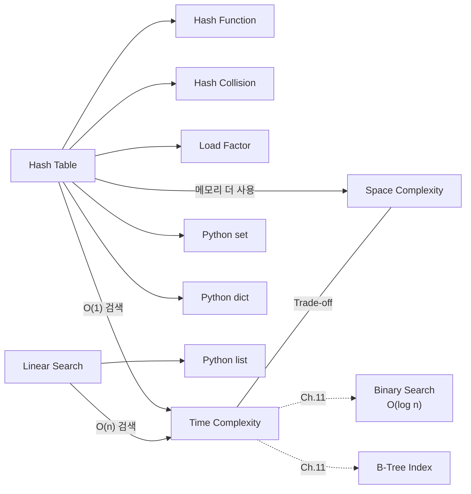

# Ch.10 유사 사례와 키워드 정리

[< 자료구조 선택의 기준](./03-choosing-ds.md)

---

앞에서 List vs Set vs Dict의 검색 성능 차이, Hash Table의 원리, 자료구조 선택 기준을 확인했다. 이번에는 같은 원리가 적용되는 유사 사례를 더 보고, 키워드를 정리한다.


## 10-6. 유사 사례

### 사례: 로그에서 고유 IP 추출

웹 서버 로그에서 고유 IP를 추출하는 코드다.

```python
# 나쁜 코드 - O(n^2)
unique_ips = []
for line in log_lines:
    ip = extract_ip(line)
    if ip not in unique_ips:   # O(n)
        unique_ips.append(ip)

# 좋은 코드 - O(n)
unique_ips = set()
for line in log_lines:
    ip = extract_ip(line)
    unique_ips.add(ip)         # O(1)

# 더 좋은 코드 - 한 줄
unique_ips = {extract_ip(line) for line in log_lines}
```

로그가 100만 줄이고 고유 IP가 10만 개라면, 나쁜 코드는 최대 100만 x 10만 = 1000억 번의 비교가 일어날 수 있다. 좋은 코드는 100만 번이다.


### 사례: 캐시 키 검색

API 응답을 메모리 캐시에 저장해두는 코드다.

```python
# 나쁜 코드 - List of Tuple
cache = []

def get_cached(key):
    for k, v in cache:          # O(n)
        if k == key:
            return v
    return None

def set_cached(key, value):
    cache.append((key, value))  # 중복 키 처리도 안 됨

# 좋은 코드 - Dict
cache = {}

def get_cached(key):
    return cache.get(key)       # O(1)

def set_cached(key, value):
    cache[key] = value          # O(1), 중복 키는 자동 덮어쓰기
```

캐시는 "키로 값을 빠르게 찾는" 용도다. Dict가 정확히 그 용도에 맞는 자료구조다. (Redis도 내부적으로 Hash Table을 사용한다. Ch.17에서 다룬다.)


### 사례: 권한 체크

유저가 특정 권한을 가지고 있는지 확인하는 코드다.

```python
# 나쁜 코드
user_permissions = ["read", "write", "delete", "admin", "export"]

if "admin" in user_permissions:  # O(n)
    allow_admin_action()

# 좋은 코드
user_permissions = {"read", "write", "delete", "admin", "export"}

if "admin" in user_permissions:  # O(1)
    allow_admin_action()
```

권한 목록은 보통 5~20개 정도라 List여도 느리지 않다. 하지만 이 체크가 매 요청마다 수행된다면? 초당 1,000 요청이 들어오면 의미가 생긴다. 습관적으로 Set을 쓰는 게 낫다.


## 그래서 실무에서는 어떻게 하는가

1. "이 값이 있는가?" 류의 연산이 반복되면 Set으로 바꿔라
2. "키로 값 찾기"가 있으면 Dict를 써라
3. 순서가 필요하지 않다면 List 대신 Set을 기본으로 고려해라
4. 데이터 크기가 작으면(수십 개) List도 괜찮다. 시간 복잡도의 상수 계수가 Hash 계산보다 작을 수 있다
5. AI에게 코드를 시킬 때 "검색이 잦으니 Set/Dict를 써라"고 명시해라. 안 그러면 AI는 List를 쓴다


## 오늘의 키워드 정리

### 새 키워드

<details>
<summary>Hash Table (해시 테이블)</summary>

키를 Hash 함수로 변환해서 배열의 인덱스로 사용하는 자료구조다. 검색, 삽입, 삭제가 평균 O(1)이다. Python의 `set`과 `dict`, Java의 `HashSet`과 `HashMap`이 내부적으로 Hash Table을 사용한다. 충돌 해결 방법으로 Chaining과 Open Addressing이 있다.

</details>

<details>
<summary>Hash Function (해시 함수)</summary>

임의의 입력을 고정된 크기의 숫자(Hash 값)로 변환하는 함수다. 같은 입력에는 항상 같은 출력을 내놓는다. Hash Table, 암호화, 데이터 무결성 검증 등에 사용된다. Python에서는 `hash()` 내장 함수가 제공된다.

</details>

<details>
<summary>Hash Collision (해시 충돌)</summary>

서로 다른 키가 같은 Hash 값(또는 같은 버킷 위치)을 가지는 현상이다. Chaining(연결 리스트)이나 Open Addressing(다음 빈 칸 탐색)으로 해결한다. 충돌이 많아지면 O(1)이 O(n)까지 퇴화할 수 있다.

</details>

<details>
<summary>Time Complexity (시간 복잡도)</summary>

알고리즘의 실행 시간이 입력 크기에 따라 어떻게 증가하는지를 Big-O 표기법으로 표현한 것이다. O(1)은 상수 시간, O(n)은 선형 시간, O(n^2)은 제곱 시간이다. 절대 시간이 아니라 성장률을 나타낸다. Ch.8에서 프롬프트 키워드로 등장했는데, 이 챕터에서 실측으로 체감했다.

</details>

<details>
<summary>Space Complexity (공간 복잡도)</summary>

알고리즘이 사용하는 메모리가 입력 크기에 따라 어떻게 증가하는지를 나타낸 것이다. Hash Table은 시간 복잡도 O(1)을 얻기 위해 공간 복잡도를 희생한다 (메모리를 더 쓴다). 시간-공간 트레이드오프의 전형적인 예다.

</details>

<details>
<summary>Linear Search (선형 탐색)</summary>

데이터를 처음부터 끝까지 순서대로 하나씩 비교하며 찾는 탐색 방법이다. 시간 복잡도 O(n)이다. List의 `in` 연산자가 이 방식이다. 데이터가 정렬되어 있지 않을 때 사용할 수 있는 가장 단순한 방법이다. Ch.11에서 Binary Search와 비교한다.

</details>

<details>
<summary>Load Factor (적재율)</summary>

Hash Table에서 (사용 중인 슬롯 수 / 전체 슬롯 수)의 비율이다. 높아지면 충돌이 많아져서 성능이 떨어진다. Python Dict는 약 2/3에서, Java HashMap은 0.75에서 리사이즈한다.

</details>


### 재등장 키워드

| 키워드 | 최초 등장 | 이번 챕터에서의 역할 |
|--------|----------|-------------------:|
| Time Complexity | Ch.8 | 프롬프트 키워드에서 실측 체감으로 전환 |
| Code Review | Ch.9 | 자료구조 선택이 리뷰 체크리스트의 핵심 |
| File Descriptor | Ch.2 | Hash Table의 배열 인덱스 접근과 비슷한 O(1) 패턴 |


### 키워드 연관 관계




다음 챕터(Ch.11)에서는 정렬과 검색, 그리고 DB 인덱스의 원리를 다룬다. Hash Table이 O(1)로 "있느냐 없느냐"를 판별했다면, B-Tree는 O(log n)으로 "정렬된 데이터에서 범위 검색"을 한다. 용도가 다르다.

---

[< 자료구조 선택의 기준](./03-choosing-ds.md)
