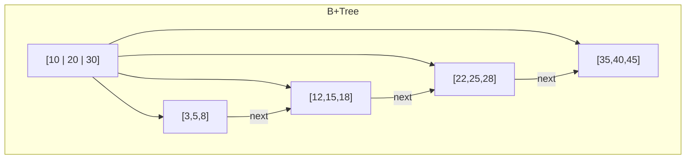

# Ch.11 Binary Search와 B-Tree

[< 사례 - 매 요청마다 정렬하는 API](./01-case.md) | [인덱스의 원리 >](./03-index-internals.md)

---

앞에서 "인덱스가 있으면 정렬이 필요 없다"고 했다. 왜 그런지 이해하려면 Binary Search부터 시작해야 한다.


## Binary Search: 반씩 줄여가며 찾기

사전에서 "Python"이라는 단어를 찾는다고 하자. 1,000페이지짜리 사전을 첫 페이지부터 한 장씩 넘기지 않는다. 중간쯤을 펼쳐서 "P보다 앞이면 왼쪽, 뒤면 오른쪽"을 반복한다.

이게 Binary Search다. 전제 조건이 하나 있다: 데이터가 정렬되어 있어야 한다.

```python
import bisect

sorted_data = [2, 5, 8, 12, 16, 23, 38, 56, 72, 91]

# 23을 찾으려면?
# 1단계: 중간값 16과 비교 → 23 > 16 → 오른쪽
# 2단계: 중간값 38과 비교 → 23 < 38 → 왼쪽
# 3단계: 중간값 23과 비교 → 찾았다!

index = bisect.bisect_left(sorted_data, 23)  # → 5
```

10개의 데이터에서 3번 만에 찾았다. 100만 개면? 최대 20번이면 된다. `log2(1,000,000) ≈ 20`이니까.

| 데이터 수 | Linear Search (O(n)) | Binary Search (O(log n)) |
|----------|---------------------|------------------------|
| 100 | 100번 | 7번 |
| 10,000 | 10,000번 | 14번 |
| 1,000,000 | 1,000,000번 | 20번 |
| 100,000,000 | 1억 번 | 27번 |

1억 개의 데이터에서 27번 비교면 끝난다. Hash Table의 O(1)에는 못 미치지만, Binary Search는 Hash Table이 못 하는 걸 할 수 있다: 범위 검색.

<details>
<summary>Binary Search (이진 탐색)</summary>

정렬된 데이터에서 절반씩 범위를 줄여가며 찾는 탐색 알고리즘이다. 시간 복잡도 O(log n)이다. 전제 조건은 "데이터가 정렬되어 있어야 한다"는 거다. Python에서는 `bisect` 모듈로 사용한다. DB의 B-Tree 인덱스가 이 원리를 확장한 것이다.

</details>


## Hash Table vs Binary Search

| 비교 항목 | Hash Table | Binary Search |
|----------|-----------|--------------|
| 검색 시간 | O(1) | O(log n) |
| 범위 검색 | 불가능 | 가능 |
| 순서 유지 | 안 함 | 정렬 필요 |
| "WHERE price BETWEEN 100 AND 200" | 불가 | 가능 |
| "WHERE email = 'test@test.com'" | 최적 | 가능 |

"같은 값 찾기"에는 Hash Table이 최적이다. "범위로 찾기"에는 Binary Search(정렬된 구조)가 필요하다. DB 인덱스가 Hash Index 대신 B-Tree Index를 기본으로 쓰는 이유가 여기 있다.


## B-Tree: DB 인덱스의 자료구조

Binary Search는 배열에서 잘 동작하지만, 디스크에서는 문제가 있다. 디스크는 한 번에 한 블록(보통 4KB~16KB)을 읽는다. 배열의 Binary Search는 매 비교마다 다른 위치를 참조하니까 디스크 I/O가 많이 발생한다.

B-Tree는 이 문제를 해결한다. 하나의 노드에 여러 개의 키를 넣어서, 한 번의 디스크 I/O로 여러 비교를 할 수 있게 만든 트리다.

```
                    [10 | 20 | 30]              ← 루트 노드 (1번 읽기)
                   /    |    |    \
          [3|5|8]  [12|15|18]  [22|25|28]  [35|40|45]  ← 중간 노드 (1번 읽기)
          / | \     / | \      / | \       / | \
        ... ...   ... ...    ... ...     ... ...  ← 리프 노드 (1번 읽기)
```

100만 건이라도 보통 3~4번의 디스크 I/O면 원하는 레코드를 찾을 수 있다. 이게 B-Tree 인덱스의 위력이다.

<details>
<summary>B-Tree (B-트리)</summary>

하나의 노드에 여러 개의 키를 가지는 균형 트리(Balanced Tree)다. 디스크 기반 저장소에 최적화되어 있어서 대부분의 RDBMS가 인덱스 자료구조로 사용한다. MySQL의 InnoDB, PostgreSQL, SQLite 모두 B-Tree(정확히는 B+Tree) 기반 인덱스를 사용한다. 검색, 삽입, 삭제 모두 O(log n)이고, 범위 검색도 효율적이다. Ch.14에서 B+Tree와의 차이, 실무 인덱스 설계를 더 자세히 다룬다.

</details>


## B-Tree vs B+Tree

실제 RDBMS에서는 B-Tree의 변형인 B+Tree를 쓴다. 차이점:

- B-Tree: 모든 노드에 데이터(레코드 포인터)를 저장
- B+Tree: 리프 노드에만 데이터를 저장, 리프 노드끼리 연결 리스트로 연결

리프 노드끼리 연결되어 있으니까 범위 검색(`BETWEEN`, `ORDER BY`)이 훨씬 효율적이다. 리프에서 시작 지점을 찾고, 연결 리스트를 따라가면 끝이다.



"WHERE price BETWEEN 100 AND 200"이 빠른 이유: price=100인 리프 노드를 O(log n)으로 찾고, 거기서 연결 리스트를 따라 price=200까지 순회하면 된다.

다음에서 실제 DB 인덱스가 어떻게 동작하는지, EXPLAIN으로 어떻게 확인하는지 본다.

---

[< 사례 - 매 요청마다 정렬하는 API](./01-case.md) | [인덱스의 원리 >](./03-index-internals.md)
