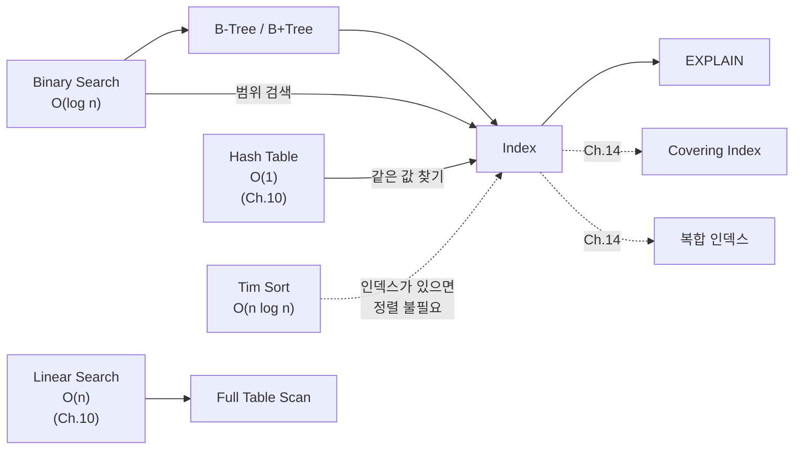

# Ch.11 유사 사례와 키워드 정리

[< 인덱스의 원리](./03-index-internals.md)

---

앞에서 Binary Search, B-Tree, 인덱스의 원리를 확인했다. 같은 원리가 적용되는 유사 사례를 보고 키워드를 정리한다.


## 11-6. 유사 사례

### 사례: 정렬을 매번 하는 랭킹 API

유저 랭킹을 보여주는 API에서 매 요청마다 `SELECT * FROM scores ORDER BY score DESC LIMIT 10`을 실행한다. score 컬럼에 인덱스가 없으면 매번 Full Table Scan + 전체 정렬이 일어난다.

해결: `CREATE INDEX idx_scores_score ON scores(score DESC)` 한 줄이면 된다.

(실무에서는 랭킹처럼 갱신 빈도 대비 조회 빈도가 높은 데이터는 Redis Sorted Set을 쓰기도 한다. Ch.17에서 다룬다.)


### 사례: 로그 검색에서 날짜 범위 쿼리

`SELECT * FROM logs WHERE created_at BETWEEN '2024-01-01' AND '2024-01-31'`이 느리다. created_at에 인덱스가 없으면 수백만 건의 로그를 전부 스캔한다. B+Tree 인덱스가 있으면 해당 범위의 시작점을 O(log n)으로 찾고, 리프 노드를 순회하면 된다.


### 사례: Python에서 bisect로 정렬된 리스트 검색

정렬된 리스트에서 값을 찾을 때 `in` 연산자를 쓰면 O(n)이다. `bisect`를 쓰면 O(log n)이다.

```python
import bisect

sorted_prices = sorted(all_prices)  # 한 번만 정렬

# 나쁜 코드: O(n)
if target_price in sorted_prices:
    pass

# 좋은 코드: O(log n)
idx = bisect.bisect_left(sorted_prices, target_price)
if idx < len(sorted_prices) and sorted_prices[idx] == target_price:
    pass
```

(물론 "있느냐 없느냐"만 확인할 거면 Set이 더 낫다. bisect는 "위치를 알아야 할 때"나 "범위 검색"이 필요할 때 쓴다.)


## 오늘의 키워드 정리

### 새 키워드

<details>
<summary>Binary Search (이진 탐색)</summary>

정렬된 데이터에서 절반씩 범위를 줄여가며 찾는 O(log n) 탐색 알고리즘이다. 전제 조건은 데이터가 정렬되어 있어야 한다는 것. Python에서는 `bisect` 모듈이 이 기능을 제공한다. DB의 B-Tree 인덱스가 이 원리를 디스크에 최적화한 것이다.

</details>

<details>
<summary>B-Tree / B+Tree</summary>

디스크 기반 저장소에 최적화된 균형 트리 자료구조다. 하나의 노드에 여러 키를 저장해서 디스크 I/O 횟수를 줄인다. 대부분의 RDBMS가 인덱스 자료구조로 B+Tree를 사용한다. B+Tree는 리프 노드끼리 연결 리스트로 연결되어 범위 검색이 효율적이다. Ch.14에서 실무 인덱스 설계를 다룬다.

</details>

<details>
<summary>Index (인덱스)</summary>

DB에서 검색 성능을 높이기 위해 특정 컬럼의 값을 별도의 자료구조(주로 B+Tree)로 정리해둔 것이다. 책의 목차와 같은 역할이다. 읽기는 빨라지지만 쓰기(INSERT/UPDATE/DELETE) 성능은 약간 떨어진다. `EXPLAIN` 명령으로 인덱스 사용 여부를 확인할 수 있다.

</details>

<details>
<summary>Full Table Scan (풀 테이블 스캔)</summary>

테이블의 모든 행을 처음부터 끝까지 읽는 것이다. 인덱스가 없거나 인덱스를 탈 수 없는 쿼리에서 발생한다. 데이터 양에 비례해서 느려지는 O(n) 연산이다. EXPLAIN에서 `type: ALL`로 나타나면 Full Table Scan이다.

</details>

<details>
<summary>Tim Sort (팀 정렬)</summary>

Python과 Java가 사용하는 하이브리드 정렬 알고리즘이다. Merge Sort + Insertion Sort를 결합했고, 실제 데이터에서 흔한 "거의 정렬된" 패턴에 최적화되어 있다. 평균/최악 O(n log n), 최선 O(n)이다.

</details>

<details>
<summary>EXPLAIN</summary>

DB에서 쿼리 실행 계획(Query Execution Plan)을 보여주는 명령어다. 쿼리가 인덱스를 타는지, Full Table Scan을 하는지, 어떤 순서로 테이블을 조인하는지 등을 확인할 수 있다. 성능 문제를 진단하는 첫 번째 도구다. Ch.14에서 EXPLAIN 결과 해석을 자세히 다룬다.

</details>


### 재등장 키워드

| 키워드 | 최초 등장 | 이번 챕터에서의 역할 |
|--------|----------|-------------------:|
| Time Complexity | Ch.8 | O(n log n) vs O(log n) 비교 |
| Linear Search | Ch.10 | Full Table Scan = Linear Search |
| Hash Table | Ch.10 | Hash Table과 B-Tree의 용도 차이 |


### 키워드 연관 관계




다음 챕터(Ch.12)에서는 트리와 그래프를 다룬다. B-Tree는 "디스크를 위한 트리"였다면, 트리와 그래프는 "계층 데이터와 의존성"을 위한 자료구조다.

---

[< 인덱스의 원리](./03-index-internals.md)
