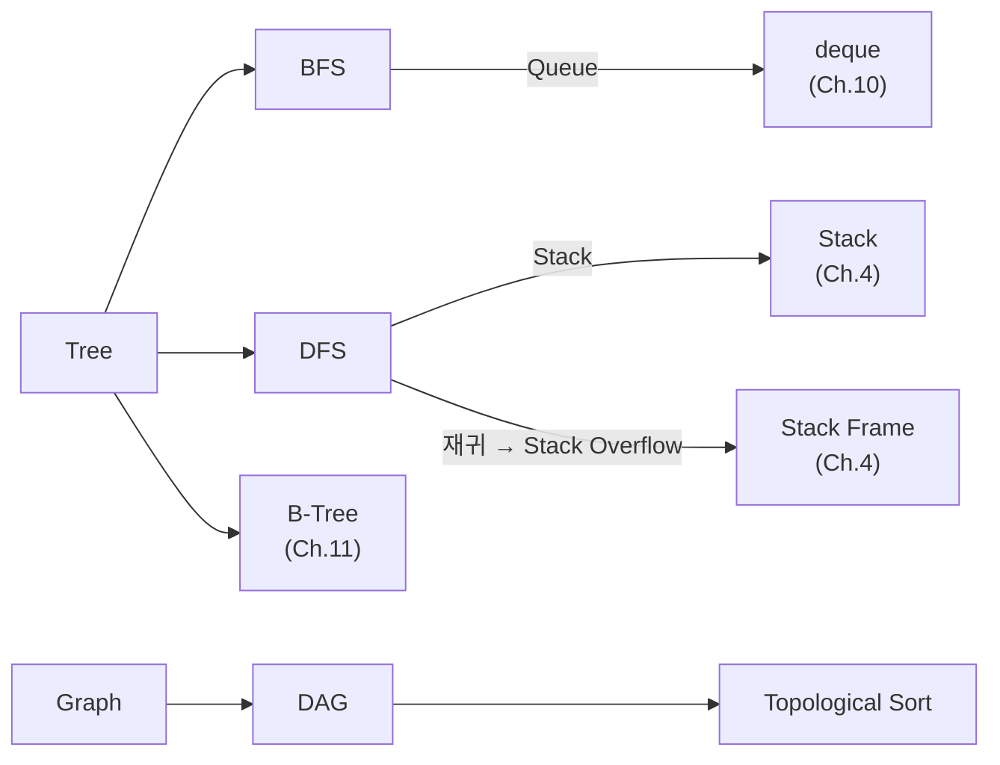

# Ch.12 유사 사례와 키워드 정리

[< BFS, DFS, 그리고 DAG](./02-bfs-dfs-dag.md)

---

앞에서 트리 순회, BFS/DFS, DAG와 위상 정렬을 확인했다. Part 3 (Ch.10~12)의 마지막이다.

## 12-5. 유사 사례

### 사례: 파일 시스템 용량 계산

디렉토리의 전체 용량을 계산하려면 하위 디렉토리를 재귀적으로 순회해야 한다. `du -sh` 명령이 하는 일이 트리의 DFS다.

### 사례: 웹 크롤러

특정 페이지에서 시작해서 링크를 따라가며 페이지를 수집한다. BFS로 구현하면 "가까운 페이지부터", DFS로 구현하면 "한 방향으로 끝까지" 크롤링한다.

### 사례: Kubernetes의 Pod 의존성

Pod A가 DB에 의존하고, Pod B가 Pod A에 의존하면, 배포 순서는 DB → A → B다. 이게 DAG의 위상 정렬이다. Helm Chart나 ArgoCD의 Sync Wave가 이 원리다.

## Part 3 마무리

Part 3 (Ch.10~12)에서 다룬 핵심:

1. 자료구조 선택이 성능을 결정한다 (Ch.10: List vs Set, 4,000배 차이)
2. 정렬과 검색은 DB 인덱스의 기초다 (Ch.11: B-Tree, EXPLAIN)
3. 트리와 그래프는 계층 데이터와 의존성의 언어다 (Ch.12: BFS/DFS, DAG)

Part 4부터는 데이터베이스를 깊게 파고든다. Ch.10~12의 자료구조 지식이 DB 인덱스, 쿼리 최적화, 트랜잭션을 이해하는 기반이 된다.

## 오늘의 키워드 정리

### 새 키워드

BFS (Breadth-First Search)

같은 깊이의 노드를 먼저 방문하는 탐색 알고리즘이다. Queue(FIFO)를 사용한다. 최단 경로 찾기, 레벨 단위 처리에 적합하다. Python에서는 `collections.deque`로 Queue를 구현한다.

DFS (Depth-First Search)

한 방향으로 끝까지 파고든 뒤 돌아오는 탐색 알고리즘이다. Stack(LIFO)이나 재귀를 사용한다. 재귀 구현은 깔끔하지만 깊이가 깊으면 Stack Overflow 위험이 있다. 반복문 + 명시적 Stack이 더 안전하다.

DAG (Directed Acyclic Graph)

간선에 방향이 있고 사이클이 없는 그래프다. 빌드 시스템, CI/CD, 데이터 파이프라인, 패키지 의존성 등 실무에서 의존 관계를 표현하는 데 핵심적으로 사용된다.

Topological Sort (위상 정렬)

DAG에서 의존 관계를 지키면서 노드를 일렬로 나열하는 알고리즘이다. "선행 조건을 먼저 처리"하는 순서를 결정한다. 사이클이 있으면 위상 정렬이 불가능하다.

### 재등장 키워드

| 키워드 | 최초 등장 | 이번 챕터에서의 역할 |
|--------|----------|-------------------:|
| Stack Frame | Ch.4 | 재귀 깊이와 Stack Overflow |
| N+1 Problem | Ch.8 | 트리의 재귀 쿼리 = N+1의 트리 버전 |
| B-Tree | Ch.11 | 트리 자료구조의 DB 특화 버전 |

### 키워드 연관 관계

다음 챕터(Ch.13)부터 Part 4: 데이터베이스 깊게 보기다. "JPA를 써서 DB를 모른다고요?"라는 제목부터 찔리지 않는가?

---

[< BFS, DFS, 그리고 DAG](./02-bfs-dfs-dag.md)
