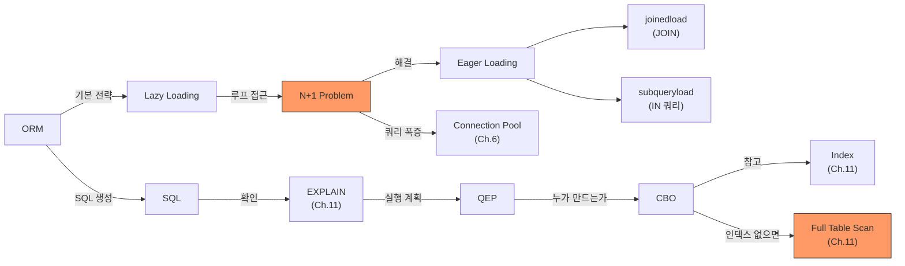

# Ch.13 유사 사례와 키워드 정리

[< ORM과 SQL](./02-orm-sql.md)

---

앞에서 N+1 Problem이 뭔지, ORM이 만드는 SQL을 확인하는 방법, EXPLAIN으로 실행 계획을 읽는 방법, CBO의 기본 동작을 확인했다.

같은 원리가 적용되는 다른 사례를 몇 가지 본다.


## 13-9. 유사 사례

### Django ORM: select_related / prefetch_related

Django ORM도 기본이 Lazy Loading이다. N+1을 해결하는 방법이 두 가지 있다.

```python
# N+1 발생 (Lazy Loading)
users = User.objects.all()
for user in users:
    print(user.profile.bio)  # 유저마다 쿼리 1개씩

# select_related: SQL JOIN으로 한 번에 (SQLAlchemy의 joinedload)
users = User.objects.select_related("profile").all()

# prefetch_related: 별도 쿼리로 한 번에 (SQLAlchemy의 subqueryload)
users = User.objects.prefetch_related("orders").all()
```

`select_related`는 ForeignKey, OneToOne 관계에서 사용한다. SQL JOIN을 쓴다. `prefetch_related`는 ManyToMany, 역참조(related_name) 관계에서 사용한다. `IN` 쿼리를 날린다.

(Django의 `select_related`는 SQLAlchemy의 `joinedload`와, `prefetch_related`는 `subqueryload`와 거의 같은 역할이다. 이름은 다르지만 원리는 같다.)


### JPA/Hibernate: fetch join

Java 진영의 JPA도 기본이 Lazy Loading이다. `@ManyToOne(fetch = FetchType.LAZY)`가 기본값이다.

```java
// N+1 발생 (JPQL)
List<User> users = em.createQuery("SELECT u FROM User u", User.class).getResultList();
for (User user : users) {
    user.getOrders().size();  // 유저마다 쿼리 1개씩
}

// fetch join으로 해결
List<User> users = em.createQuery(
    "SELECT u FROM User u JOIN FETCH u.orders", User.class
).getResultList();
```

(Python 사용자라면 `JOIN FETCH`가 SQLAlchemy의 `joinedload`와 같다고 보면 된다. JPQL이라는 JPA 전용 쿼리 언어를 쓰는 게 차이점이다.)

Spring Data JPA를 쓴다면 `@EntityGraph`로도 해결할 수 있다:

```java
@EntityGraph(attributePaths = {"orders"})
List<User> findAll();
```

### Node.js Prisma: include

Prisma는 명시적으로 `include`를 넣어야 연관 데이터를 가져온다. 안 넣으면 아예 가져오지 않는다. Lazy Loading이 아니라 "명시적 로딩"에 가깝다.

```typescript
// orders를 가져오지 않음
const users = await prisma.user.findMany();

// orders를 한 번에 가져옴 (N+1 방지)
const users = await prisma.user.findMany({
    include: { orders: true },
});
```

Prisma의 접근 방식이 N+1을 원천적으로 방지하지는 않지만, "명시하지 않으면 아예 안 가져온다"는 설계가 실수를 줄여준다.


### ORM 없이 직접 SQL을 쓰는 경우

"ORM이 문제라면, SQL을 직접 쓰면 N+1이 없는 거 아닌가?" 반은 맞다. 직접 SQL을 쓰면 쿼리를 직접 제어하니까 N+1이 발생할 여지가 적다. 하지만 코드에서 루프를 돌면서 쿼리를 날리면 같은 문제가 생긴다:

```python
# ORM 없이 직접 SQL을 썼지만 N+1과 같은 패턴
users = conn.execute(text("SELECT * FROM users")).fetchall()
for user in users:
    orders = conn.execute(
        text("SELECT * FROM orders WHERE user_id = :uid"),
        {"uid": user.id}
    ).fetchall()
```

N+1은 ORM만의 문제가 아니다. "루프 안에서 쿼리를 날리는 패턴" 자체가 문제다. ORM의 Lazy Loading이 이 패턴을 "보이지 않게" 만드는 게 더 위험할 뿐이다.


## 그래서 실무에서는 어떻게 하는가

### 1. 쿼리 로그를 반드시 확인한다

개발 환경에서는 ORM의 SQL 로그를 켜놓는다.

```python
# SQLAlchemy
engine = create_engine("...", echo=True)

# Django (settings.py)
LOGGING = {
    "loggers": {
        "django.db.backends": {"level": "DEBUG"},
    }
}
```

API 하나를 호출할 때 쿼리가 몇 개 실행되는지 세는 습관을 들인다. 단일 API 호출에 쿼리가 10개 이상이면 N+1을 의심한다.

### 2. 연관 데이터가 필요하면 Eager Loading을 명시한다

```python
# SQLAlchemy
session.query(User).options(joinedload(User.orders)).all()

# Django
User.objects.select_related("profile").prefetch_related("orders")
```

"이 API에서 어떤 연관 데이터가 필요한가?"를 먼저 생각하고, 필요한 데이터를 Eager Loading으로 한 번에 가져온다.

### 3. EXPLAIN으로 실행 계획을 확인한다

쿼리를 줄인 뒤에도 EXPLAIN을 반드시 확인한다. JOIN 쿼리가 인덱스를 안 타면, 쿼리 1개라도 느릴 수 있다.

```sql
EXPLAIN SELECT users.*, orders.*
FROM users LEFT JOIN orders ON users.id = orders.user_id
WHERE users.created_at > '2024-01-01';
```

type이 ALL이면 인덱스를 걸어야 한다. Ch.14에서 인덱스를 본격적으로 다룬다.

### 4. 복잡한 쿼리는 ORM보다 Raw SQL이 나을 수 있다

ORM이 만드는 SQL이 비효율적일 때가 있다. 여러 테이블을 복잡하게 JOIN하거나, 서브쿼리가 필요한 경우다. 이럴 때는 Raw SQL을 직접 작성하는 게 더 효율적이고 가독성도 좋다.

```python
# SQLAlchemy Raw SQL
with engine.connect() as conn:
    result = conn.execute(text("""
        SELECT u.name, COUNT(o.id) as order_count, SUM(o.amount) as total
        FROM users u
        LEFT JOIN orders o ON u.id = o.user_id
        WHERE u.created_at > :since
        GROUP BY u.id, u.name
        HAVING SUM(o.amount) > :min_amount
    """), {"since": "2024-01-01", "min_amount": 10000})
```

ORM과 Raw SQL은 양자택일이 아니다. 간단한 CRUD는 ORM으로, 복잡한 조회는 Raw SQL로, 상황에 맞게 섞어 쓰는 게 실무의 정답이다.


## 오늘의 키워드 정리

### 새 키워드

<details>
<summary>ORM (Object-Relational Mapping)</summary>

DB 테이블을 프로그래밍 언어의 클래스(객체)로 매핑하는 기술이다. SQL을 직접 작성하지 않고 객체의 메서드를 호출하면, ORM이 내부적으로 SQL을 생성해서 DB에 보낸다. 편리하지만, 생성되는 SQL을 모르면 성능 문제를 발견할 수 없다.

Java: JPA/Hibernate, Python: SQLAlchemy/Django ORM, Go: GORM, Node.js: Prisma/TypeORM.

</details>

<details>
<summary>N+1 Problem</summary>

ORM에서 연관 데이터를 조회할 때, 메인 쿼리 1개 + 연관 쿼리 N개가 실행되는 패턴이다. 기본 Lazy Loading 전략과 루프 접근이 결합되면 발생한다. N이 커질수록 네트워크 왕복 비용이 선형으로 증가한다. Eager Loading(joinedload, subqueryload, select_related, fetch join 등)으로 해결한다.

Ch.8에서 프롬프트 키워드로 처음 등장했고, 이번 챕터에서 본격적으로 다뤘다.

</details>

<details>
<summary>Lazy Loading (지연 로딩)</summary>

연관 데이터를 실제로 접근할 때 비로소 DB에서 가져오는 전략이다. 메모리를 아끼는 장점이 있지만, 루프 안에서 접근하면 N+1 Problem이 발생한다. 대부분의 ORM에서 기본 전략이다.

</details>

<details>
<summary>Eager Loading (즉시 로딩)</summary>

연관 데이터를 메인 쿼리와 함께 미리 가져오는 전략이다. joinedload(SQL JOIN)와 subqueryload(IN 서브쿼리) 두 가지 방식이 있다. N+1 Problem의 해결책이다.

SQLAlchemy: joinedload/subqueryload, Django: select_related/prefetch_related, JPA: JOIN FETCH/@EntityGraph.

</details>

<details>
<summary>QEP (Query Execution Plan, 쿼리 실행 계획)</summary>

DB가 SQL을 실행할 때 세우는 내부 전략이다. 어떤 순서로 테이블을 읽고, 인덱스를 쓸지 말지, JOIN을 어떻게 처리할지를 결정한다. EXPLAIN 명령어로 확인할 수 있다. Ch.11에서 인덱스 관련으로 잠깐 등장했고, 이번 챕터에서 ORM 쿼리 진단 도구로 본격 사용했다.

</details>

<details>
<summary>CBO (Cost-Based Optimizer, 비용 기반 최적화기)</summary>

SQL을 실행할 수 있는 여러 방법 중 "비용이 가장 낮은 것"을 선택하는 DB 내부 모듈이다. 테이블 통계(행 수, 컬럼 분포), 인덱스 정보, 하드웨어 비용 모델을 참고해서 실행 계획을 세운다. 통계가 오래되면 잘못된 계획을 세울 수 있으므로, EXPLAIN으로 반드시 확인해야 한다.

</details>


### 재등장 키워드

| 키워드 | 최초 등장 | 이번 챕터에서의 역할 |
|--------|----------|-------------------|
| Full Table Scan | Ch.11 | EXPLAIN type=ALL, 인덱스 없이 전체 행 스캔 |
| Index | Ch.11 | JOIN 성능의 핵심, EXPLAIN에서 key 컬럼으로 확인 |
| EXPLAIN | Ch.11 | ORM이 만든 쿼리의 실행 계획 확인 도구 |
| Connection Pool | Ch.6 | N+1로 쿼리가 폭증하면 Pool 고갈 위험 |
| N+1 Problem | Ch.8 | 프롬프트 키워드에서 등장, 이번에 본격 분석 |


### 키워드 연관 관계




## 다음에 이어지는 이야기

이번 챕터에서 ORM이 N+1을 만들어내는 원리와, SQL 로그/EXPLAIN으로 진단하는 방법을 확인했다. 그런데 EXPLAIN 결과에서 "인덱스를 안 탄다"고 나올 때, 인덱스를 어떻게 걸어야 하는지는 아직 이야기하지 않았다.

Ch.14에서는 "인덱스를 안 걸어놓고 Redis를 설치했습니다"라는 사례를 통해, 인덱스의 작동 원리(B-Tree, Hash), Covering Index, 그리고 인덱스 안티패턴을 파고든다. Ch.11에서 봤던 B-Tree 이야기가 실전으로 연결된다.

---

[< ORM과 SQL](./02-orm-sql.md)

[< Ch.12 트리, 그래프, 실무](../ch12/README.md) | [Ch.14 인덱스를 안 걸어놓고 Redis를 설치했습니다 >](../ch14/README.md)
