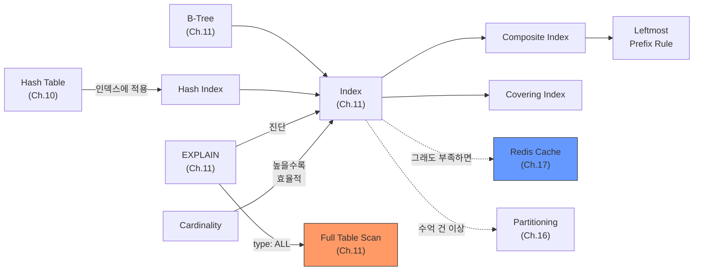

# Ch.14 유사 사례와 키워드 정리

[< 인덱스 설계](./02-index-design.md)

---

앞에서 B-Tree vs Hash Index, Covering Index, 복합 인덱스의 컬럼 순서, Cardinality, 인덱스 안티패턴을 확인했다. 같은 원리가 적용되는 유사 사례를 보고 키워드를 정리한다.


## 14-5. 유사 사례

### 사례: 불필요한 Redis 도입

검색 API가 느려서 Redis에 검색 결과를 캐싱했다. 검색어 조합이 수만 가지라 Cache Hit Rate이 5%도 안 됐다. 결국 Redis 메모리만 낭비하고 성능은 개선되지 않았다.

원인은 검색 조건 컬럼에 인덱스가 없었다. `WHERE category = 'electronics' AND price BETWEEN 10000 AND 50000` 쿼리에 `(category, price)` 복합 인덱스를 추가하자 응답 시간이 1.8초에서 12ms로 떨어졌다. Redis를 제거해도 충분했다.

캐시를 도입하기 전에 확인해야 할 것: EXPLAIN에서 `type: ALL`이 나오는가? 나온다면 인덱스부터.


### 사례: SELECT * 때문에 Covering Index를 못 쓴 경우

유저 목록 API에서 `SELECT * FROM users WHERE status = 'active' ORDER BY created_at DESC LIMIT 50`을 실행한다. `(status, created_at)` 인덱스가 있어서 인덱스를 타기는 하지만, `SELECT *` 때문에 매번 테이블 룩업이 발생한다.

실제로 프론트엔드에서 필요한 건 user_id, name, created_at 세 컬럼뿐이었다. `SELECT user_id, name, created_at`으로 바꾸고, 인덱스를 `(status, created_at, user_id, name)`으로 확장하자 EXPLAIN에 `Using index`가 떴다. 응답 시간이 절반으로 줄었다.

`SELECT *`은 편하지만, 성능 관점에서는 비용이 있다.


### 사례: 인덱스만으로 해결된 슬로우 쿼리

로그 테이블에서 `SELECT * FROM access_logs WHERE created_at > '2024-01-01' AND user_agent LIKE 'Mozilla%'` 쿼리가 30초 걸렸다. access_logs는 5천만 건이었다.

created_at에 단일 인덱스가 있었지만, 날짜 범위가 넓어서 수백만 건을 읽은 뒤 user_agent 조건을 필터링하고 있었다. `(created_at, user_agent)` 복합 인덱스를 추가하니 1.2초로 줄었다. 여기에 날짜 범위를 하루 단위로 좁히자 50ms가 됐다.

인덱스 설계 + 쿼리 조건 최적화. 이 두 가지만으로 30초를 50ms로 만들 수 있다. 600배 차이다.


## 실무에서는 어떻게 하는가

### 인덱스 설계 체크리스트

```
1. EXPLAIN을 찍는다
   - type: ALL이면 인덱스가 필요하다
   - rows가 실제 결과 대비 지나치게 많으면 인덱스가 비효율적이다

2. WHERE 절의 컬럼을 확인한다
   - = 조건 컬럼: 복합 인덱스의 앞쪽에 배치
   - 범위 조건 컬럼: = 조건 뒤에 배치
   - 함수 적용, LIKE '%...', OR: 인덱스 안 타는 패턴인지 확인

3. Cardinality를 확인한다
   - SHOW INDEX FROM table_name
   - Cardinality가 낮은 컬럼 단독으로는 인덱스 효과 없음

4. ORDER BY / GROUP BY 컬럼을 확인한다
   - 인덱스 순서와 ORDER BY 순서가 일치하면 filesort 제거 가능

5. SELECT 컬럼을 확인한다
   - 필요한 컬럼만 SELECT하면 Covering Index 가능성 증가
   - SELECT * 습관은 버려야 한다
```

### 인덱스가 답이 아닌 경우

인덱스만이 능사는 아니다. 이런 경우에는 다른 해결책이 필요하다:

- 테이블이 수억 건 이상: Partitioning 또는 Sharding 검토 (Ch.16에서 다룬다)
- 같은 데이터를 수천 명이 동시 조회: 이때는 진짜 캐시가 필요하다 (Ch.17에서 다룬다)
- 전문 검색(Full-Text Search): B-Tree로는 한계, Elasticsearch 같은 검색 엔진 검토
- 집계 쿼리(COUNT, SUM, AVG): 인덱스보다는 사전 집계 테이블이 효과적

순서를 기억하자. EXPLAIN으로 진단 -> 인덱스로 해결 시도 -> 그래도 부족하면 캐시/아키텍처 변경. Redis는 마지막 수단이지 첫 번째 수단이 아니다.


## 오늘의 키워드 정리

### 새 키워드

<details>
<summary>Covering Index (커버링 인덱스)</summary>

쿼리가 요구하는 모든 컬럼이 인덱스에 포함되어 있어서, 테이블 데이터를 읽지 않고 인덱스만으로 결과를 반환하는 인덱스다. 테이블 룩업(Random I/O)을 제거하기 때문에 성능이 크게 향상된다. EXPLAIN에서 `Extra: Using index`로 확인할 수 있다. `SELECT *`을 쓰면 거의 불가능하고, 필요한 컬럼만 SELECT해야 혜택을 받을 수 있다.

</details>

<details>
<summary>Composite Index (복합 인덱스)</summary>

두 개 이상의 컬럼을 하나의 인덱스로 묶은 것이다. 컬럼 순서가 매우 중요한데, Leftmost Prefix Rule에 따라 왼쪽부터 순서대로 사용된다. WHERE 절의 = 조건 컬럼을 앞에, 범위 조건 컬럼을 뒤에, ORDER BY 컬럼을 그 뒤에 놓는 것이 일반적인 원칙이다. 순서를 잘못 잡으면 인덱스가 있어도 안 탄다.

</details>

<details>
<summary>Cardinality (카디널리티)</summary>

컬럼이 가진 고유 값(distinct value)의 수다. Cardinality가 높을수록 인덱스의 선택도(Selectivity)가 높아서 효율이 좋다. email이나 user_id처럼 고유 값이 많은 컬럼은 인덱스 효과가 크고, gender나 is_active처럼 2~3종류뿐인 컬럼은 단독 인덱스로는 효과가 없다. `SHOW INDEX FROM table_name`으로 확인할 수 있다.

</details>

<details>
<summary>Hash Index (해시 인덱스)</summary>

Hash Table을 인덱스에 적용한 것이다. 같은 값 검색(=)에서는 O(1)로 B-Tree보다 빠르지만, 범위 검색과 정렬이 불가능하다. MySQL InnoDB에서는 사용자가 직접 생성할 수 없고, 내부적으로 Adaptive Hash Index를 자동 관리한다. PostgreSQL에서는 `USING HASH`로 명시적 생성이 가능하다. 실무에서 99%는 B-Tree를 쓴다.

</details>

<details>
<summary>Leftmost Prefix Rule (왼쪽 접두사 규칙)</summary>

복합 인덱스가 왼쪽 컬럼부터 순서대로 사용되는 규칙이다. 인덱스가 (A, B, C)이면, WHERE A = 1은 인덱스를 타지만 WHERE B = 2는 못 탄다. 전화번호부에서 "성"으로는 찾을 수 있지만 "이름"만으로는 찾을 수 없는 것과 같은 원리다. 복합 인덱스 설계에서 가장 중요한 규칙이다.

</details>


### 재등장 키워드

| 키워드 | 최초 등장 | 이번 챕터에서의 역할 |
|--------|----------|-------------------:|
| B-Tree / B+Tree | Ch.11 | 인덱스의 핵심 자료구조, Hash Index와의 비교 대상 |
| EXPLAIN | Ch.11 | type 컬럼 해석을 상세하게 다룸 |
| Full Table Scan | Ch.11 | 인덱스 없을 때 발생하는 현상, type: ALL |
| Index | Ch.11 | 단일 인덱스를 넘어서 Composite/Covering Index로 확장 |
| Hash Table | Ch.10 | Hash Index의 원리, B-Tree와의 용도 차이 |


### 키워드 연관 관계




다음 챕터(Ch.15)에서는 Transaction과 Isolation Level을 다룬다. 인덱스가 "읽기 성능"의 핵심이었다면, Transaction은 "동시 쓰기에서 데이터 정합성"의 핵심이다. 동시에 주문이 들어왔을 때 재고가 마이너스가 되지 않으려면, Isolation Level을 이해해야 한다.

---

[< 인덱스 설계](./02-index-design.md)
