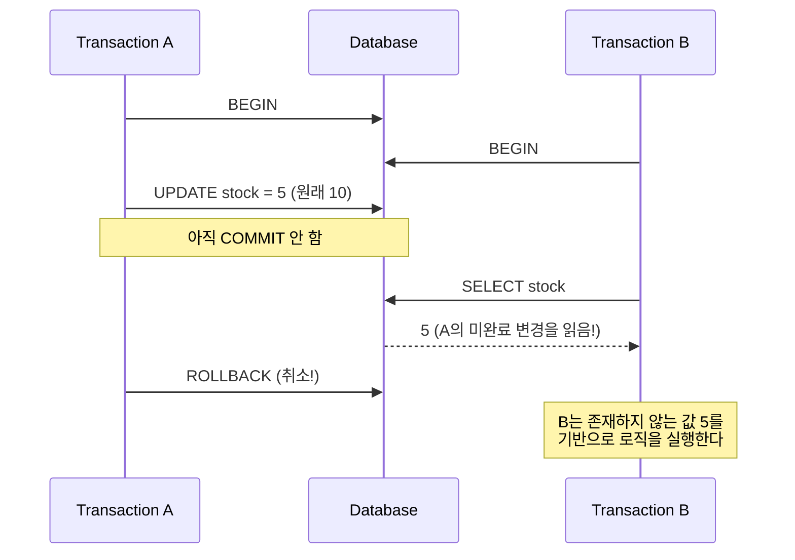
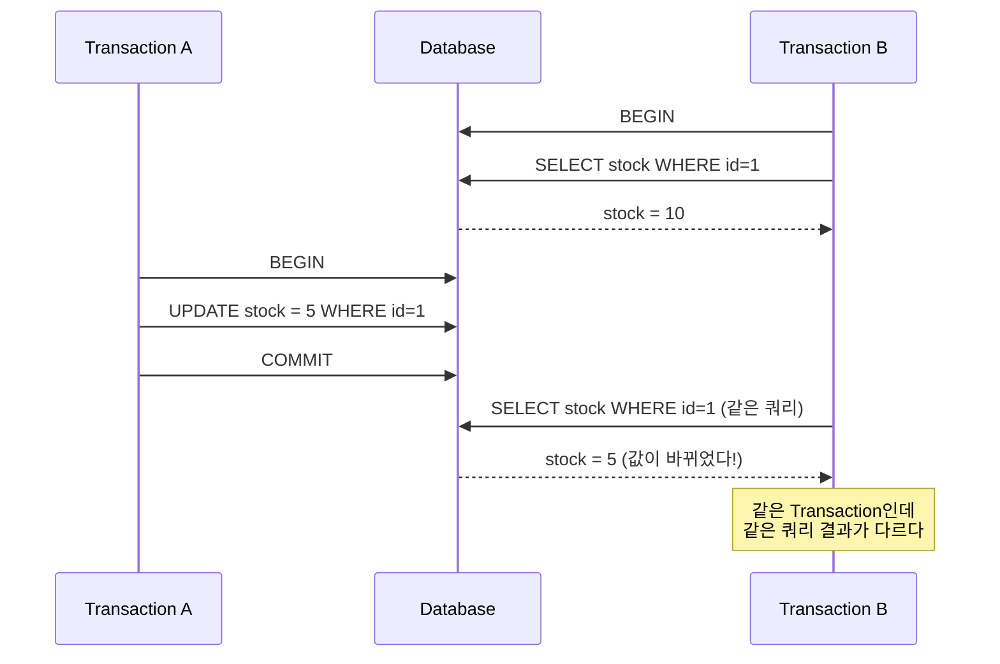
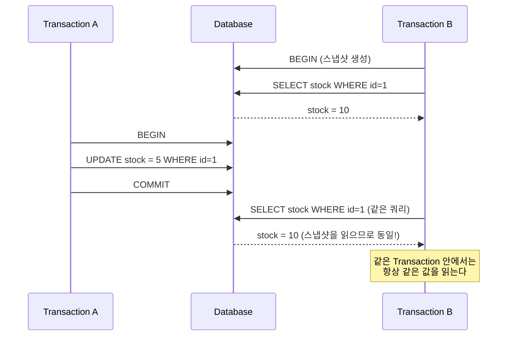

# Ch.15 왜 이렇게 되는가 - Isolation Level

[< 사례](./01-case.md) | [유사 사례와 키워드 정리 >](./03-summary.md)

---

앞에서 Transaction의 ACID 중 Isolation(격리성)이 핵심이라고 했다. 완벽한 격리는 성능 비용이 크기 때문에 DB는 격리 수준을 단계별로 나눈다. 이번에는 그 4단계를 파고든다.


## Isolation Level이 왜 필요한가

이상적인 세계에서는 모든 Transaction이 순차적으로 실행된다. A가 끝나야 B가 시작한다. 간섭이 불가능하다. 하지만 현실에서 이렇게 하면? 초당 1,000건의 주문을 처리해야 하는데, 한 번에 하나씩만 처리한다. 서비스가 멈춘다.

그래서 DB는 타협한다. "격리를 조금 느슨하게 하면 동시성을 높일 수 있다." Isolation Level은 이 타협의 수준을 조절하는 다이얼이다.

느슨하면 빠르지만 데이터가 꼬일 수 있다. 엄격하면 안전하지만 느리다.

SQL 표준은 4단계를 정의한다.


## 4단계 Isolation Level

낮은 격리 수준부터 높은 격리 수준 순서로 본다.

### 1. READ UNCOMMITTED

가장 느슨한 수준이다. 다른 Transaction이 COMMIT하지 않은 데이터도 읽을 수 있다.



Transaction B가 읽은 값 5는 실제로는 존재하지 않는 값이다. A가 ROLLBACK했으니까. 이걸 Dirty Read라고 한다.

<details>
<summary>Dirty Read (더티 리드)</summary>

다른 Transaction이 아직 COMMIT하지 않은 데이터를 읽는 현상이다. COMMIT 전의 데이터는 언제든 ROLLBACK될 수 있으므로, "존재하지 않는 데이터"를 기반으로 로직을 실행하게 된다. READ UNCOMMITTED에서 발생한다.
비유하자면, 은행에서 송금 처리 중에 상대방 잔액이 변한 걸 보고 "입금됐다!"고 확인했는데, 사실 송금이 취소된 경우다.

</details>

실무에서 READ UNCOMMITTED를 쓰는 경우는 거의 없다. (MySQL에서도 기본값이 아니다.) "ROLLBACK될 수도 있는 데이터를 읽는다"는 건 데이터 정합성이 전혀 보장되지 않는다는 뜻이다.


### 2. READ COMMITTED

COMMIT된 데이터만 읽을 수 있다. Dirty Read는 발생하지 않는다. 하지만 같은 Transaction 안에서 같은 SELECT를 두 번 실행했을 때, 결과가 달라질 수 있다.



Transaction B 입장에서, 같은 쿼리를 두 번 실행했는데 결과가 10에서 5로 바뀌었다. 이걸 Non-repeatable Read라고 한다.

<details>
<summary>Non-repeatable Read (반복 불가능한 읽기)</summary>

같은 Transaction 안에서 같은 행을 두 번 읽었는데, 그 사이에 다른 Transaction이 해당 행을 수정하고 COMMIT해서 값이 달라진 현상이다. READ COMMITTED에서 발생한다.
"아까 읽었을 때는 10이었는데, 다시 읽으니까 5네?" 이 상황이다. 잔액 조회 -> 로직 처리 -> 잔액 재확인 사이에 값이 바뀌면 문제가 된다.

</details>

Oracle, PostgreSQL의 기본 Isolation Level이 READ COMMITTED다.


### 3. REPEATABLE READ

같은 Transaction 안에서 같은 행을 여러 번 읽어도 항상 같은 결과가 나온다. Non-repeatable Read가 발생하지 않는다. InnoDB의 MVCC가 Transaction 시작 시점의 스냅샷을 유지하기 때문이다.



Transaction B는 시작 시점의 스냅샷을 읽는다. A가 중간에 값을 바꾸고 COMMIT해도, B에게는 보이지 않는다.

그런데 SQL 표준에 따르면 REPEATABLE READ에서도 발생할 수 있는 문제가 있다. Phantom Read다.

<details>
<summary>Phantom Read (팬텀 리드)</summary>

같은 Transaction 안에서 같은 범위 조건으로 SELECT를 두 번 실행했는데, 그 사이에 다른 Transaction이 해당 범위에 새 행을 INSERT(또는 DELETE)해서 결과 행의 수가 달라진 현상이다. 기존 행의 값이 바뀌는 Non-repeatable Read와 달리, 행 자체가 나타나거나(Phantom) 사라진다.
예를 들어, "가격이 100 이상인 상품"을 SELECT했더니 5개였는데, 다시 SELECT하니까 6개가 된 경우다.

</details>

SQL 표준에서는 REPEATABLE READ가 Phantom Read를 허용한다고 정의한다. 하지만 MySQL InnoDB는 여기서 한 발 더 나간다. InnoDB의 REPEATABLE READ는 대부분의 Phantom Read도 방지한다. 그 비밀이 Gap Lock과 Next-Key Lock이다.

<details>
<summary>MVCC (Multi-Version Concurrency Control)</summary>

데이터의 여러 버전을 동시에 유지하는 동시성 제어 기법이다. 읽기 작업이 잠금을 걸지 않아도 일관된 스냅샷을 볼 수 있게 해준다. InnoDB는 Undo Log에 이전 버전의 데이터를 보관하고, 각 Transaction은 자기 시작 시점의 버전을 읽는다. 읽기와 쓰기가 서로를 블로킹하지 않으므로 동시성이 높다.
(PostgreSQL도 MVCC를 쓰지만, 구현 방식이 다르다. PostgreSQL은 테이블에 여러 버전을 직접 저장하고, Vacuum으로 정리한다.)

</details>


### InnoDB의 Gap Lock과 Next-Key Lock

(이 부분은 지금 전부 이해하지 않아도 된다. "InnoDB가 SQL 표준보다 한 단계 더 강력한 보호를 한다"는 것만 기억하면 충분하다.)

일반적인 Row Lock(행 잠금)은 이미 존재하는 행만 잠근다. 그런데 Phantom Read는 "아직 존재하지 않는 행"이 INSERT되면서 생기는 문제다. 존재하지 않는 행을 어떻게 잠그는가?

InnoDB는 인덱스의 "간격(gap)"까지 잠근다.

<details>
<summary>Gap Lock (갭 잠금)</summary>

인덱스 레코드 사이의 간격(gap)을 잠그는 것이다. 예를 들어, 인덱스에 값 3과 7이 있으면, (3, 7) 사이의 간격을 잠근다. 이 간격에 4, 5, 6을 INSERT하려는 다른 Transaction은 대기해야 한다. InnoDB의 REPEATABLE READ에서 Phantom Read를 방지하는 핵심 메커니즘이다.

</details>

<details>
<summary>Next-Key Lock (넥스트 키 잠금)</summary>

Row Lock + Gap Lock의 조합이다. 인덱스 레코드 자체와 그 앞의 간격을 함께 잠근다. InnoDB에서 `SELECT ... FOR UPDATE`를 실행하면 Next-Key Lock이 걸린다. 이 조합 덕분에 InnoDB의 REPEATABLE READ는 SQL 표준에서 SERIALIZABLE에서나 방지되는 Phantom Read까지 대부분 막아준다.

</details>

```
인덱스 값:  ... 3 ... 7 ... 10 ...
Gap Lock:      (3,7)  (7,10)
Next-Key Lock: (3,7] + 7 자체
```

이게 MySQL InnoDB의 기본 Isolation Level이 REPEATABLE READ인 이유다. SQL 표준대로라면 Phantom Read가 발생해야 하지만, Gap Lock 덕분에 대부분 막아준다. SERIALIZABLE까지 올리지 않아도 실용적으로 충분한 보호를 제공한다.

(다만 100% 완벽한 건 아니다. 특수한 경우 - 예를 들어 일반 SELECT로 읽은 후 UPDATE를 하면 - Phantom이 발생할 수 있다. 하지만 SELECT ... FOR UPDATE를 쓰면 Next-Key Lock이 걸려서 방지된다.)


### 4. SERIALIZABLE

가장 엄격한 수준이다. 모든 SELECT가 자동으로 `SELECT ... FOR SHARE`로 변환된다. 읽기에도 잠금이 걸린다. Dirty Read, Non-repeatable Read, Phantom Read 전부 발생하지 않는다.

하지만 대가가 크다. 모든 읽기에 잠금이 걸리니까, 동시 처리량이 급격히 떨어진다. Deadlock 발생 확률도 높아진다.

```
Transaction A: SELECT stock FOR SHARE --> 공유 잠금
Transaction B: SELECT stock FOR SHARE --> 공유 잠금 (읽기끼리는 호환)
Transaction A: UPDATE stock = 5 --> 배타적 잠금 필요, B의 공유 잠금 대기
Transaction B: UPDATE stock = 3 --> 배타적 잠금 필요, A의 공유 잠금 대기
--> Deadlock!
```

(Ch.5에서 Deadlock을 다뤘다. 두 Transaction이 서로의 잠금을 기다리면서 영원히 멈추는 상태다. SERIALIZABLE에서는 이런 상황이 더 자주 발생한다.)


## 정리: 4단계 비교

| Isolation Level | Dirty Read | Non-repeatable Read | Phantom Read | 동시성 |
|-----------------|-----------|-------------------|-------------|--------|
| READ UNCOMMITTED | 발생 | 발생 | 발생 | 가장 높음 |
| READ COMMITTED | 방지 | 발생 | 발생 | 높음 |
| REPEATABLE READ | 방지 | 방지 | 발생 (InnoDB는 대부분 방지) | 보통 |
| SERIALIZABLE | 방지 | 방지 | 방지 | 가장 낮음 |

위로 올라갈수록 안전하지만 느리다. 아래로 내려갈수록 빠르지만 위험하다.

MySQL InnoDB는 REPEATABLE READ를 기본값으로 쓴다. Gap Lock 덕분에 Phantom Read까지 대부분 방지하면서도, SERIALIZABLE보다 동시성이 높다. 실무에서 대부분의 경우 이 기본값으로 충분하다.


## Isolation Level 확인과 변경

```sql
-- 현재 세션의 Isolation Level 확인
SELECT @@transaction_isolation;
-- REPEATABLE-READ

-- 세션 단위로 변경
SET SESSION TRANSACTION ISOLATION LEVEL READ COMMITTED;

-- 전역 변경 (모든 새 세션에 적용)
SET GLOBAL TRANSACTION ISOLATION LEVEL READ COMMITTED;
```

SQLAlchemy에서:

```python
from sqlalchemy import create_engine

# Engine 레벨에서 설정
engine = create_engine(
    "mysql+pymysql://...",
    isolation_level="REPEATABLE READ"  # 기본값
)

# Session 단위로 변경도 가능
with Session(engine) as session:
    session.connection(execution_options={"isolation_level": "READ COMMITTED"})
```

"언제 기본값을 바꿔야 하는가?"

대부분은 바꿀 필요가 없다. REPEATABLE READ + SELECT ... FOR UPDATE 조합이면 재고, 잔액, 좌석 예약 같은 동시성 문제를 충분히 해결할 수 있다. READ COMMITTED로 내리는 경우는 주로 대량 배치 작업에서 Gap Lock에 의한 Deadlock이 빈번할 때다.

"그러면 결국 SELECT ... FOR UPDATE만 잘 쓰면 되는 거 아닌가?"

대부분의 경우 그렇다. Isolation Level은 "기본적인 동시성 보호 수준"을 정하는 거고, SELECT ... FOR UPDATE는 "특정 행에 대한 명시적 잠금"을 거는 거다. 둘을 이해하면 DB 레벨의 동시성 문제를 해결할 수 있다.

핵심을 한 줄로 요약하면 이렇다: Transaction을 쓴다고 동시성이 자동으로 해결되는 게 아니다. Isolation Level이 무엇을 보호하고 무엇을 보호하지 않는지 알아야 한다.

---

[< 사례](./01-case.md) | [유사 사례와 키워드 정리 >](./03-summary.md)
