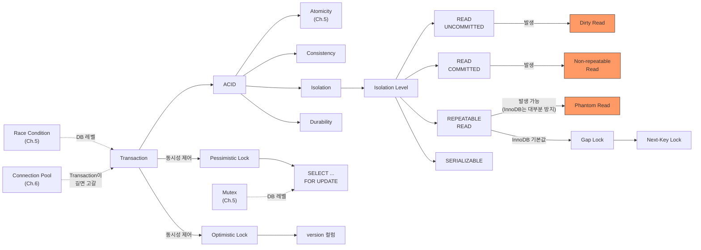

# Ch.15 유사 사례와 키워드 정리

[< Isolation Level](./02-isolation-levels.md)

---

이번 챕터에서는 DB 레벨의 동시성 문제를 파고들었다. Transaction이 있다고 동시성이 자동으로 해결되지 않는다는 것, Isolation Level에 따라 보호 수준이 다르다는 것, 그리고 SELECT ... FOR UPDATE로 명시적 잠금을 거는 방법을 확인했다.

같은 원리가 적용되는 실무 사례를 몇 가지 더 본다.


## 15-5. 유사 사례

### 포인트 중복 차감

이벤트 보상으로 포인트 10,000점을 지급했다. 사용자가 동시에 두 개의 주문을 넣는다. 각 주문에서 7,000점을 차감한다.

```sql
-- 주문 A
SELECT points FROM users WHERE id=1;  --> 10000
-- 주문 B
SELECT points FROM users WHERE id=1;  --> 10000 (같은 값!)
-- 주문 A
UPDATE users SET points = 10000 - 7000 WHERE id=1;  --> 3000
-- 주문 B
UPDATE users SET points = 10000 - 7000 WHERE id=1;  --> 3000 (다시 3000으로!)
```

재고 문제와 완전히 같은 구조다. 읽기 -> 계산 -> 쓰기가 원자적이지 않다. 포인트 10,000점으로 14,000점어치를 쓴 셈이다.

해결: `SELECT ... FOR UPDATE`로 행 잠금을 건다. 또는 `UPDATE users SET points = points - 7000 WHERE id=1 AND points >= 7000`처럼 UPDATE 구문 자체에 조건을 넣는다. 후자는 DB 엔진이 원자적으로 처리한다.

### 좌석 예약 동시성

콘서트 좌석 예약. A석 1자리가 남았다. 두 명이 동시에 예약 버튼을 누른다.

```python
# 사용자 1
seat = session.query(Seat).filter(Seat.id == "A1").first()
if seat.status == "available":
    seat.status = "reserved"
    seat.reserved_by = user_1_id
    session.commit()

# 사용자 2 (거의 동시에)
seat = session.query(Seat).filter(Seat.id == "A1").first()
if seat.status == "available":  # 사용자 1의 COMMIT 전이면 아직 "available"
    seat.status = "reserved"
    seat.reserved_by = user_2_id
    session.commit()  # 사용자 1의 예약이 덮어씌워진다!
```

이것도 같은 구조다. 재고든 포인트든 좌석이든, "읽기 -> 체크 -> 쓰기"가 원자적이지 않으면 동시성 문제가 발생한다.

해결: 좌석 예약에는 비관적 잠금이 적합하다. 인기 좌석은 충돌이 잦기 때문이다.

```python
seat = (
    session.query(Seat)
    .filter(Seat.id == "A1")
    .with_for_update()  # 행 잠금
    .first()
)
if seat.status == "available":
    seat.status = "reserved"
    seat.reserved_by = user_id
    session.commit()
else:
    session.rollback()
    return "이미 예약된 좌석입니다"
```

### Lost Update (갱신 분실)

Dirty Read, Non-repeatable Read, Phantom Read는 "읽기"에서 생기는 문제다. 그런데 "쓰기"에서도 문제가 생긴다.

두 Transaction이 같은 행을 동시에 UPDATE하면, 나중에 쓴 쪽이 먼저 쓴 쪽의 변경을 덮어쓴다. 이걸 Lost Update라고 한다. 재고 사례에서 본 것과 정확히 같은 현상이다.

```
Transaction A: 재고를 10으로 읽음
Transaction B: 재고를 10으로 읽음
Transaction A: 재고를 9로 UPDATE (10 - 1)
Transaction B: 재고를 9로 UPDATE (10 - 1, A의 변경을 덮어씀)
--> 2개 팔았는데 1개만 차감됨
```

Lost Update는 모든 Isolation Level에서 발생할 수 있다. SELECT ... FOR UPDATE 또는 Optimistic Lock으로 방지해야 한다.


## 그래서 실무에서는 어떻게 하는가

### 1. 동시성이 중요한 곳에는 SELECT ... FOR UPDATE를 쓴다

```python
# 재고 차감, 포인트 차감, 좌석 예약 등
with Session(engine) as session:
    product = (
        session.query(Product)
        .filter(Product.id == product_id)
        .with_for_update()  # 명시적 잠금
        .first()
    )
    if product.stock >= quantity:
        product.stock -= quantity
        session.commit()
```

"모든 SELECT에 FOR UPDATE를 붙여야 하는가?" 아니다. 동시 수정이 발생할 수 있는 곳에만 쓴다. 단순 조회(상품 목록, 게시글 읽기)에는 필요 없다. 불필요한 잠금은 처리량을 떨어뜨린다.

### 2. UPDATE 구문에 조건을 넣는다

```sql
-- 이렇게 하면 DB 엔진이 원자적으로 처리한다
UPDATE products
SET stock = stock - 1
WHERE id = 1 AND stock >= 1;
```

Python에서 비교하지 않고 SQL 자체에 조건을 넣으면, DB가 행 잠금 + 조건 체크 + 갱신을 원자적으로 처리한다. SELECT ... FOR UPDATE를 안 써도 되는 경우가 많다.

```python
# SQLAlchemy에서
rows_updated = (
    session.query(Product)
    .filter(Product.id == product_id, Product.stock >= quantity)
    .update({Product.stock: Product.stock - quantity})
)
session.commit()

if rows_updated == 0:
    return "품절"
```

`rows_updated`가 0이면 조건에 맞는 행이 없었다는 뜻이다. 재고가 부족했거나, 다른 Transaction이 먼저 차감한 거다.

### 3. 충돌이 적으면 Optimistic Lock을 고려한다

```python
# version 컬럼 활용
rows_updated = (
    session.query(Product)
    .filter(Product.id == product_id, Product.version == current_version)
    .update({
        Product.stock: Product.stock - quantity,
        Product.version: Product.version + 1
    })
)
```

게시글 수정, 설정 변경 같은 곳은 동시 수정이 드물다. 비관적 잠금으로 매번 행을 잠그는 건 과잉 대응이다. 낙관적 잠금으로 충돌 시에만 재시도하는 게 효율적이다.

### 4. Transaction을 짧게 유지한다

```python
# 나쁜 패턴: Transaction 안에서 외부 API를 호출한다
with Session(engine) as session:
    product = session.query(Product).with_for_update().first()
    response = requests.post("https://payment.api/charge")  # 외부 호출 (수 초 소요)
    if response.ok:
        product.stock -= 1
        session.commit()
    # 외부 API 응답 올 때까지 행 잠금이 유지된다!

# 좋은 패턴: 잠금 구간을 최소화한다
response = requests.post("https://payment.api/charge")  # 먼저 외부 처리
if response.ok:
    with Session(engine) as session:
        product = session.query(Product).with_for_update().first()
        product.stock -= 1
        session.commit()
    # 잠금 구간이 극히 짧다
```

SELECT ... FOR UPDATE로 잠긴 행은 Transaction이 끝날 때까지 다른 Transaction을 블로킹한다. Transaction이 길면 다른 요청이 전부 대기한다. 그러면 Connection Pool이 고갈되고 서버가 먹통이 된다.

(Ch.6에서 Connection Pool 고갈을 다뤘다. Ch.16에서 Slow Query가 Connection Pool을 죽이는 사례를 더 자세히 본다.)

### 5. Deadlock에 대비한다

비관적 잠금을 쓰면 Deadlock 가능성이 생긴다. Ch.5에서 다뤘던 그 Deadlock이다.

```
Transaction A: SELECT ... FOR UPDATE WHERE id=1  --> 행 1 잠금
Transaction B: SELECT ... FOR UPDATE WHERE id=2  --> 행 2 잠금
Transaction A: SELECT ... FOR UPDATE WHERE id=2  --> 대기 (B가 잠금 중)
Transaction B: SELECT ... FOR UPDATE WHERE id=1  --> 대기 (A가 잠금 중)
--> Deadlock!
```

MySQL InnoDB는 Deadlock을 자동 감지한다. Deadlock이 감지되면 한쪽 Transaction을 강제로 ROLLBACK한다 (보통 비용이 적은 쪽). 애플리케이션에서는 이 ROLLBACK을 감지하고 재시도하면 된다.

```python
from sqlalchemy.exc import OperationalError

max_retries = 3
for attempt in range(max_retries):
    try:
        with Session(engine) as session:
            product = session.query(Product).with_for_update().first()
            product.stock -= quantity
            session.commit()
            break
    except OperationalError as e:
        if "Deadlock" in str(e):
            continue  # 재시도
        raise
```

Ch.5에서 Lock Ordering을 배웠다. DB에서도 같다. 여러 행을 잠글 때 항상 같은 순서(id 오름차순 등)로 잠그면 Deadlock을 방지할 수 있다.


## 3. 오늘 키워드 정리

Ch.5의 Race Condition이 DB 레벨로 확장되었다. 도구와 키워드가 달라졌지만 본질은 같다: "읽기 -> 체크 -> 쓰기"를 원자적으로 만들어야 한다는 것.

<details>
<summary>Transaction (트랜잭션)</summary>

데이터베이스에서 하나의 논리적 작업 단위를 구성하는 연산들의 묶음이다. "다 되거나, 아예 안 되거나"가 핵심이다. BEGIN으로 시작해서 COMMIT(반영) 또는 ROLLBACK(취소)으로 끝난다.
Ch.5의 Critical Section이 "코드 레벨의 보호 구간"이라면, Transaction은 "DB 레벨의 보호 구간"이다.

</details>

<details>
<summary>ACID</summary>

Transaction이 지켜야 하는 4가지 성질이다.
- Atomicity (원자성): 전부 성공하거나 전부 실패. Ch.5의 Atomicity와 같은 개념이 DB로 확장.
- Consistency (일관성): 트랜잭션 전후로 데이터가 일관된 상태 유지.
- Isolation (격리성): 동시 트랜잭션이 서로 간섭하지 않음. Isolation Level로 수준을 조절.
- Durability (지속성): 커밋된 결과는 장애가 나도 유지됨.

</details>

<details>
<summary>Isolation Level (격리 수준)</summary>

동시에 실행되는 Transaction 간의 격리 정도를 결정하는 설정이다. READ UNCOMMITTED, READ COMMITTED, REPEATABLE READ, SERIALIZABLE의 4단계가 있다. 올라갈수록 안전하지만 느리다.
MySQL InnoDB의 기본값은 REPEATABLE READ이고, Gap Lock 덕분에 SQL 표준보다 강력한 보호를 제공한다.

</details>

<details>
<summary>Dirty Read (더티 리드)</summary>

다른 Transaction이 아직 COMMIT하지 않은 데이터를 읽는 현상이다. ROLLBACK되면 존재하지 않는 데이터를 기반으로 로직을 실행하게 된다. READ UNCOMMITTED에서 발생하고, READ COMMITTED 이상에서 방지된다.

</details>

<details>
<summary>Non-repeatable Read (반복 불가능한 읽기)</summary>

같은 Transaction 안에서 같은 행을 두 번 읽었는데 값이 달라진 현상이다. 다른 Transaction이 중간에 해당 행을 수정하고 COMMIT했기 때문이다. READ COMMITTED에서 발생하고, REPEATABLE READ 이상에서 방지된다.

</details>

<details>
<summary>Phantom Read (팬텀 리드)</summary>

같은 Transaction 안에서 같은 범위 조건으로 SELECT를 두 번 실행했는데 결과 행 수가 달라진 현상이다. 다른 Transaction이 해당 범위에 INSERT/DELETE했기 때문이다. REPEATABLE READ에서 발생할 수 있지만, MySQL InnoDB는 Gap Lock으로 대부분 방지한다.

</details>

<details>
<summary>Pessimistic Lock (비관적 잠금)</summary>

"충돌이 날 거라고 비관적으로 가정"하고 읽는 시점에 잠금을 거는 전략이다. `SELECT ... FOR UPDATE`가 대표적이다. 충돌이 잦은 환경(한정 수량 이벤트, 금융 거래)에서 유리하다. Ch.5의 `threading.Lock()`이 비관적 잠금이다.
(Java/JPA: `@Lock(LockModeType.PESSIMISTIC_WRITE)`)

</details>

<details>
<summary>Optimistic Lock (낙관적 잠금)</summary>

"충돌이 안 날 거라고 낙관적으로 가정"하고 잠금 없이 읽은 뒤, 쓸 때 version 컬럼으로 충돌 여부를 확인하는 전략이다. 충돌이 적은 환경(게시글 수정, 설정 변경)에서 유리하다. 충돌 시 재시도가 필요하다.
(Java/JPA: `@Version`)

</details>


### 재등장 키워드

| 키워드 | 최초 등장 | 이번 챕터에서의 역할 |
|--------|----------|-------------------|
| Race Condition | Ch.5 | Heap에서 DB로 무대가 바뀌었을 뿐, 같은 구조의 문제. "읽기 -> 체크 -> 쓰기"의 비원자성 |
| Mutex / Lock | Ch.5 | SELECT ... FOR UPDATE가 DB 레벨의 Mutex. threading.Lock()과 같은 역할 |
| Connection Pool | Ch.6 | Transaction이 길어지면 Connection을 오래 점유. Pool 고갈의 원인 |


### 키워드 연관 관계




## 다음에 이어지는 이야기

이번 챕터에서는 Transaction과 Isolation Level, 그리고 Pessimistic/Optimistic Lock으로 DB 레벨의 동시성 문제를 해결하는 방법을 확인했다. 그런데 동시성 문제가 해결되었다고 DB 성능이 좋아지는 건 아니다.

Transaction이 길어지면 Connection을 오래 잡고 있고, Connection Pool이 고갈되고, 서버가 먹통이 된다. Slow Query 하나가 이 연쇄 반응을 일으킨다. Index를 안 걸어놓고 Redis를 설치하는 사람도 있다.

Ch.16에서는 DB 성능 튜닝의 실무를 다룬다. Slow Query가 Connection Pool을 어떻게 죽이는지, 서브쿼리와 JOIN과 EXISTS의 차이가 뭔지 파고든다.

---

[< Isolation Level](./02-isolation-levels.md)

[< Ch.14 인덱스를 안 걸어놓고 Redis를 설치했습니다](../ch14/README.md) | [Ch.16 DB 성능 튜닝의 실무 >](../ch16/README.md)
