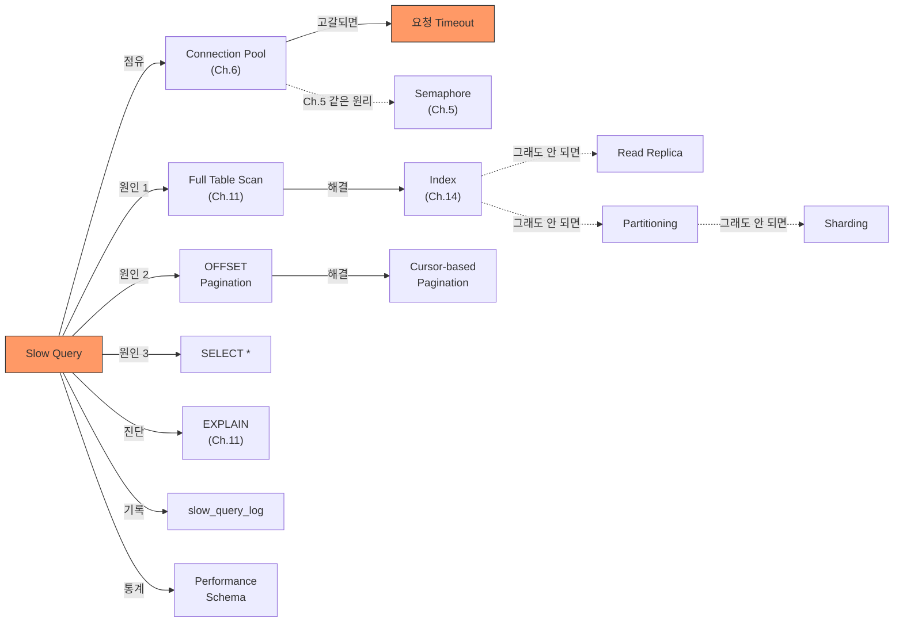

# Ch.16 유사 사례와 키워드 정리

[< 쿼리 최적화](./02-query-optimization.md)

---

앞에서 Slow Query가 Connection Pool을 먹는 메커니즘, 쿼리 최적화 기법, Partitioning/Sharding/Read Replica를 확인했다. 같은 원리가 적용되는 유사 사례를 보고 키워드를 정리한다.


## 16-6. 유사 사례

### 사례: 배치 작업이 운영 DB를 죽였다

매일 새벽 3시에 배치 작업이 돈다. 어제의 모든 주문 데이터를 집계하는 작업이다.

```sql
SELECT product_id, COUNT(*), SUM(total_price)
FROM orders
WHERE created_at >= '2024-07-14' AND created_at < '2024-07-15'
GROUP BY product_id;
```

이 쿼리 자체는 문제가 아니다. 문제는 이 배치가 운영 DB의 Primary에서 돌아간다는 거다. 새벽 3시에는 트래픽이 적으니까 괜찮았다. 그런데 어느 날 배치가 지연됐다. 오전 9시까지 안 끝났다. 출근 시간에 트래픽이 몰리기 시작하면서 배치 쿼리가 Connection을 잡고 있고, 일반 요청도 Connection이 필요하고, Pool이 고갈됐다.

해결:

1. 배치를 Read Replica에서 돌린다. Primary에는 영향 없다.
2. 배치 전용 Connection을 별도 Pool로 분리한다. 배치가 일반 요청의 Connection을 뺏지 않는다.
3. 배치 쿼리에 시간 제한을 건다. `SET SESSION max_execution_time = 300000;` (300초). 이 시간이 지나면 MySQL이 쿼리를 강제 종료한다.

(배치 작업이 Primary에서 돌아야 하는 경우도 있다. UPDATE/DELETE가 포함된 배치라면 Replica에서 못 돌린다. 이때는 작업을 작은 단위로 쪼개서 한 번에 1,000건씩 처리하고, 건마다 잠깐 sleep을 넣어서 DB에 숨 돌릴 틈을 주는 게 일반적이다.)


### 사례: 관리자 페이지의 "전체 주문 검색"

관리자 페이지에서 "전체 주문"을 검색하는 기능이 있다. 검색 조건이 없으면 500만 건 전체를 COUNT한다.

```sql
SELECT COUNT(*) FROM orders;
```

InnoDB에서 `COUNT(*)`는 Full Table Scan이다. MyISAM과 달리 InnoDB는 행 수를 별도로 관리하지 않는다. MVCC 때문에 트랜잭션마다 보이는 행이 다를 수 있어서, 매번 세야 한다.

(출처: MySQL 8.0 Reference Manual, "InnoDB and MyISAM - COUNT(*)" 관련 설명)

500만 건의 COUNT(*)가 수 초 걸리는 건 이상한 게 아니다. 이걸 매 요청마다 실행하면 Slow Query가 된다.

해결:

1. 대략적인 수치로 충분하다면: `SHOW TABLE STATUS LIKE 'orders'`의 `Rows` 컬럼. 정확하지 않지만 즉시 반환된다.
2. 정확한 수치가 필요하다면: 별도의 카운터 테이블을 두고, INSERT/DELETE 시 +1/-1 한다. 또는 Redis에 카운터를 둔다 (Ch.17에서 다룬다).
3. 검색 조건을 강제한다. "최소 날짜 범위 필수"로 만들면 Full Table Scan을 방지할 수 있다.


### 사례: N+1이 Slow Query를 만든다

Ch.13에서 N+1 문제를 다뤘다. N+1 자체도 느리지만, N이 크면 쿼리 하나하나가 Slow Query가 아니어도 전체 합산이 문제가 된다.

주문 1,000건을 조회하면서 각 주문의 상품 정보를 N+1로 가져오면, 1,001번의 쿼리가 실행된다. 각 쿼리가 0.01초라 해도 합산 10초다. 이 10초 동안 Connection 하나가 잡혀 있다.

여기에 인덱스가 없는 테이블이 끼어 있으면? 각 쿼리가 0.01초가 아니라 0.1초가 된다. 합산 100초. Connection이 100초간 반환되지 않는다.

해결은 Ch.13에서 다뤘던 Eager Loading이지만, 핵심은 "N+1 + 인덱스 미설정"이 겹치면 Connection Pool 고갈로 이어진다는 거다. 문제는 항상 겹쳐서 온다.


## 그래서 실무에서는 어떻게 하는가

### 1. EXPLAIN을 습관화한다

새 쿼리를 작성하면 EXPLAIN부터 본다. 코드 리뷰에서 쿼리가 포함된 PR이 올라오면 EXPLAIN 결과를 같이 첨부하게 한다.

```sql
EXPLAIN SELECT ...;
```

봐야 할 핵심 컬럼:

| 컬럼 | 의미 | 위험 신호 |
|------|------|----------|
| type | 접근 방식 | ALL = Full Table Scan |
| key | 사용한 인덱스 | NULL = 인덱스 안 탐 |
| rows | 예상 읽기 행 수 | 테이블 전체 행 수와 비슷하면 위험 |
| Extra | 추가 정보 | Using filesort, Using temporary |

### 2. slow_query_log를 항상 켜둔다

운영 환경에서 slow_query_log는 항상 켜두는 게 맞다. `long_query_time`을 1초로 설정하면 오버헤드가 거의 없다. 문제가 생겼을 때 "어떤 쿼리가 범인인가"를 바로 알 수 있다.

```sql
SET GLOBAL slow_query_log = 'ON';
SET GLOBAL long_query_time = 1;
```

### 3. Connection Pool을 모니터링한다

```python
# SQLAlchemy Pool 상태 확인
engine = create_engine("mysql+pymysql://...", pool_size=10, max_overflow=5)

# Pool 상태 출력
pool = engine.pool
print(f"Pool Size: {pool.size()}")
print(f"Checked Out: {pool.checkedout()}")  # 현재 사용 중인 Connection
print(f"Overflow: {pool.overflow()}")        # 추가 생성된 Connection
print(f"Checked In: {pool.checkedin()}")    # 반환된 Connection
```

`checkedout()`이 `pool_size + max_overflow`에 근접하면 경고를 울린다. 거기까지 가기 전에 원인(Slow Query)을 찾아야 한다.

### 4. 쿼리별 타임아웃을 건다

DB 전체 타임아웃이 아니라, 쿼리 단위로 제한을 건다.

```sql
-- MySQL 8.0
SET SESSION max_execution_time = 5000;  -- 5초
SELECT /*+ MAX_EXECUTION_TIME(5000) */ * FROM orders WHERE ...;
```

```python
# SQLAlchemy에서
with engine.connect() as conn:
    conn.execute(text("SET SESSION max_execution_time = 5000"))
    result = conn.execute(text("SELECT ..."))
```

5초 안에 안 끝나면 MySQL이 쿼리를 죽인다. Connection이 무한히 잡혀 있는 걸 방지한다. 에러가 나는 게 전체 서비스가 먹통이 되는 것보다 낫다.

### 5. Pagination은 Cursor-based를 기본으로 한다

"N번째 페이지 이동"이 반드시 필요한 경우가 아니라면 Cursor-based Pagination을 쓴다. 특히 관리자 도구, 배치 작업, 무한 스크롤 UI에서는 Cursor-based가 거의 항상 맞다.

```python
# FastAPI Cursor-based Pagination 예시
@app.get("/orders")
def get_orders(
    cursor_created_at: str = None,
    cursor_id: int = None,
    limit: int = 20,
):
    query = "SELECT id, created_at, total_price FROM orders"
    conditions = ["created_at >= '2024-01-01'"]

    if cursor_created_at and cursor_id:
        conditions.append(
            f"(created_at, id) < ('{cursor_created_at}', {cursor_id})"
        )

    query += " WHERE " + " AND ".join(conditions)
    query += " ORDER BY created_at DESC, id DESC"
    query += f" LIMIT {limit}"

    # 실제로는 파라미터 바인딩을 써야 한다 (SQL Injection 방지)
    ...
```

(위 코드는 설명용이다. 실제 코드에서는 반드시 `text()` + 파라미터 바인딩을 써야 한다. SQL Injection은 Ch.23에서 다룬다.)


## Part 4 마무리

Ch.13~16에서 다룬 핵심:

1. ORM이 만드는 SQL을 읽을 줄 알아야 한다 (Ch.13: N+1, EXPLAIN)
2. 인덱스를 이해해야 한다 (Ch.14: B-Tree, Covering Index, 안티패턴)
3. 트랜잭션과 Isolation Level을 알아야 한다 (Ch.15: ACID, Phantom Read)
4. Slow Query가 서비스를 죽이는 메커니즘을 알아야 한다 (Ch.16: Connection Pool 고갈)

Part 4의 한 줄 결론: DB를 모르면 ORM이 도움이 안 된다. ORM은 SQL을 대신 써주는 도구이지, DB를 대신 이해해주는 도구가 아니다.

Part 5 (Ch.17~19)에서는 캐시와 성능 최적화를 다룬다. Ch.14의 제목이 "인덱스를 안 걸어놓고 Redis를 설치했습니다"였다. Part 4에서 "DB 자체를 먼저 최적화하라"를 배웠으니, Part 5에서는 "그래도 안 되면 캐시를 어떻게 쓰는가"를 다룬다.


## 오늘의 키워드 정리

### 새 키워드

<details>
<summary>Slow Query (슬로우 쿼리)</summary>

실행 시간이 일정 기준을 초과하는 SQL 쿼리다. MySQL에서는 `slow_query_log`를 켜고 `long_query_time`을 설정하면 기준 초과 쿼리를 파일에 기록한다. Slow Query 자체도 문제지만, 진짜 위험한 건 Connection Pool을 고갈시키는 거다. 하나의 Slow Query가 Connection을 수십 초간 잡고 있으면, 다른 정상 요청까지 전부 대기하게 된다.

</details>

<details>
<summary>Pagination (페이지네이션)</summary>

대량의 데이터를 일정 크기(페이지)로 나누어 조회하는 기법이다. OFFSET 방식과 Cursor-based 방식이 있다. OFFSET은 구현이 쉽지만 뒤쪽 페이지에서 성능이 급격히 떨어지고, Cursor-based는 구현이 약간 복잡하지만 페이지 위치와 관계없이 성능이 일정하다.

</details>

<details>
<summary>Cursor-based Pagination (커서 기반 페이지네이션)</summary>

OFFSET 대신 "마지막으로 본 행의 값"을 기준으로 다음 데이터를 가져오는 방식이다. DB는 인덱스에서 해당 지점을 바로 찾고 N개만 읽으면 된다. 앞의 데이터를 읽고 버리는 낭비가 없어서 1페이지든 10,000페이지든 성능이 같다. 무한 스크롤, 배치 처리, API 페이지네이션에 적합하다.

</details>

<details>
<summary>Partitioning (파티셔닝)</summary>

하나의 논리적 테이블을 여러 물리적 조각(파티션)으로 나누는 기법이다. 날짜 기반 파티셔닝이 가장 흔하다. 쿼리 조건에 따라 필요한 파티션만 스캔하는 Partition Pruning이 핵심이다. 애플리케이션 코드 변경 없이 DB 레벨에서 성능을 개선할 수 있다. 오래된 데이터 정리도 파티션 DROP으로 빠르게 처리 가능하다.

</details>

<details>
<summary>Sharding (샤딩)</summary>

데이터를 여러 DB 서버에 수평 분할하는 기법이다. 하나의 서버로 감당할 수 없는 데이터량이나 쓰기 부하를 분산한다. 하지만 Cross-Shard JOIN 불가, 트랜잭션 복잡성, 리밸런싱 어려움 등 운영 비용이 매우 높다. "마지막 수단"으로 취급된다. 인덱스, 쿼리 최적화, Read Replica, 캐시를 전부 적용한 뒤에 고려한다.

</details>

<details>
<summary>Read Replica (읽기 전용 복제본)</summary>

Primary DB의 데이터를 실시간 복제하는 읽기 전용 DB 서버다. 읽기 요청을 Replica로 분산하면 Primary의 부하가 줄어든다. 주의할 점은 Replication Lag(복제 지연)이다. 방금 쓴 데이터를 즉시 읽어야 하는 경우에는 Primary에서 읽어야 한다. Python SQLAlchemy에서는 `binds` 설정으로 라우팅할 수 있다.

</details>

<details>
<summary>Performance Schema</summary>

MySQL 내장 모니터링 프레임워크다. 쿼리별 실행 횟수, 평균 시간, 읽은 행 수, 반환 행 수 등을 수집한다. slow_query_log가 "기준을 넘는 쿼리"만 기록하는 반면, Performance Schema는 모든 쿼리의 통계를 누적한다. `rows_examined / rows_sent` 비율이 높은 쿼리가 최적화 대상이다.

</details>


### 재등장 키워드

| 키워드 | 최초 등장 | 이번 챕터에서의 역할 |
|--------|----------|-------------------|
| Connection Pool | Ch.6 | Slow Query가 Pool을 고갈시키는 메커니즘의 핵심 |
| EXPLAIN | Ch.11 | Slow Query 원인 진단의 첫 번째 도구 |
| Full Table Scan | Ch.11 | 인덱스 없는 쿼리의 결과, Slow Query의 주요 원인 |
| Semaphore | Ch.5 | Connection Pool = Semaphore(N), Pool 고갈 = Semaphore 0 |
| N+1 Problem | Ch.8, Ch.13 | N+1 + 인덱스 미설정 = Connection Pool 고갈 |
| B-Tree / Index | Ch.11, Ch.14 | Slow Query 해결의 기본 수단 |


### 키워드 연관 관계




## 다음에 이어지는 이야기

Part 4에서 DB를 깊게 팠다. SQL을 읽고, 인덱스를 이해하고, 트랜잭션을 알고, Slow Query를 잡을 수 있게 됐다.

그런데 DB 최적화에는 한계가 있다. 쿼리가 아무리 빨라도 DB에 요청 자체를 안 보내는 것보다 빠를 수는 없다. Part 5 (Ch.17~19)에서는 캐시를 다룬다. "느리니까 Redis 붙이고 생각해볼까요?" -- Ch.17의 제목이다. 캐시를 잘못 쓰면 오히려 장애가 나는 이유를, 이제 Part 4의 지식을 바탕으로 이해할 수 있다.

---

[< 쿼리 최적화](./02-query-optimization.md)
