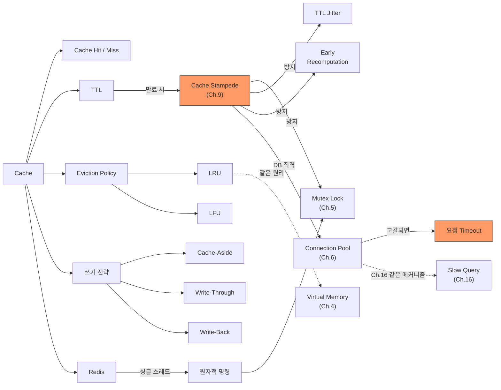

# Ch.17 유사 사례와 키워드 정리

[< Cache 전략과 설계](./02-cache-strategy.md)

---

앞에서 Cache-Aside 패턴, Write-Through/Write-Back, Eviction Policy, TTL 설계, Redis의 기본 구조를 확인했다. 같은 "캐시" 원리가 적용되는 다른 사례를 보고 키워드를 정리한다.


## 17-5. 유사 사례

### 사례: HTTP 캐시 (304 Not Modified)

웹 브라우저가 서버에서 이미지를 받았다. 다음에 같은 이미지를 요청할 때, 서버에 "이 이미지 바뀌었나?"만 물어본다.

```
첫 요청:
  GET /images/logo.png
  → 200 OK + 이미지 데이터 (100KB)
  → 응답 헤더: ETag: "abc123", Cache-Control: max-age=3600

두 번째 요청 (1시간 이내):
  → 브라우저가 로컬 캐시에서 반환. 서버에 요청 안 감.

세 번째 요청 (1시간 이후):
  GET /images/logo.png
  If-None-Match: "abc123"
  → 304 Not Modified (이미지 안 바뀜, 본문 없음)
  → 브라우저가 로컬 캐시의 이미지를 사용
```

`Cache-Control: max-age=3600`이 TTL이다. `ETag`는 데이터의 버전 식별자다. max-age가 지나면 서버에 "바뀌었나?"만 확인하고, 안 바뀌었으면 304 응답 (본문 없음)으로 네트워크 전송량을 줄인다.

Redis 캐시와 같은 원리다. TTL(max-age)로 캐시 수명을 관리하고, 만료 후에는 원본(서버)에서 갱신 여부를 확인한다.


### 사례: CDN 캐시

CDN(Content Delivery Network)은 전 세계에 분산된 서버에 정적 콘텐츠를 캐시하는 시스템이다. 사용자가 서울에서 접속하면 서울 근처의 CDN 서버(Edge)에서 응답한다. 미국의 원본 서버까지 갈 필요가 없다.

```
사용자 (서울) → CDN Edge (서울) → Origin Server (미국)

CDN Hit:  사용자 → CDN Edge (10ms) → 사용자
CDN Miss: 사용자 → CDN Edge → Origin (200ms) → CDN Edge → 사용자
```

CDN 캐시가 만료되면? 원본 서버에서 새 데이터를 가져온다. 이때 인기 콘텐츠의 CDN 캐시가 동시에 만료되면? Cache Stampede와 같은 현상이 원본 서버에서 발생한다. CDN도 "Stale-While-Revalidate" 같은 기법으로 이걸 방지한다 (만료된 캐시를 일단 반환하면서 백그라운드에서 갱신).


### 사례: MySQL Query Cache

MySQL 5.7 이하에서는 Query Cache라는 기능이 있었다. 같은 SQL 쿼리가 들어오면 실행하지 않고 이전 결과를 반환하는 기능이다.

```sql
-- 첫 번째 실행: 쿼리를 실행하고 결과를 Query Cache에 저장
SELECT * FROM products WHERE category = 'electronics';

-- 두 번째 실행 (같은 쿼리): 실행 안 하고 Cache에서 반환
SELECT * FROM products WHERE category = 'electronics';
```

그런데 MySQL 8.0에서 이 기능이 제거됐다. 왜? 해당 테이블에 INSERT/UPDATE/DELETE가 하나라도 발생하면 그 테이블에 관련된 모든 Query Cache가 무효화된다. 쓰기가 빈번한 테이블에서는 Cache Hit Rate가 거의 0%에 가깝다. 캐시 무효화 자체가 Lock을 잡아서 오히려 성능이 떨어지는 경우도 있었다.

(출처: MySQL 8.0 Release Notes, "The query cache is deprecated as of MySQL 5.7.20, and is removed in MySQL 8.0.")

이게 "캐시는 만능이 아니다"의 좋은 예시다. 쓰기가 잦은 데이터에 캐시를 붙이면 캐시 무효화 비용이 캐시 이득을 상쇄한다. Ch.14에서 "느리면 캐시"가 아니라 "왜 느린지 먼저 확인"이라고 했다. 캐시를 붙일지 말지도 데이터의 읽기/쓰기 비율을 먼저 확인해야 한다.


### 사례: API Rate Limiting과 캐시

외부 API를 호출하는데 Rate Limit이 있다. 분당 100회까지만 호출할 수 있다.

```python
# 환율 정보를 외부 API에서 가져오는 경우
async def get_exchange_rate(currency: str):
    cache_key = f"exchange:{currency}"
    cached = redis_client.get(cache_key)
    if cached:
        return json.loads(cached)

    # 외부 API 호출 (Rate Limit: 분당 100회)
    response = await httpx.get(f"https://api.example.com/rates/{currency}")
    rate = response.json()

    # 1분간 캐시 (Rate Limit에 맞춤)
    redis_client.setex(cache_key, 60, json.dumps(rate))
    return rate
```

여기서 캐시는 성능 향상이 아니라 Rate Limit 보호가 목적이다. 같은 환율 정보를 1분 안에 1,000번 요청해도 외부 API에는 1번만 간다. 캐시 없이 1,000번 호출하면 Rate Limit에 걸려서 차단된다.

캐시의 용도는 "빠르게 하기 위해서"만이 아니다. "원본에 대한 요청을 줄이기 위해서"도 캐시를 쓴다. DB 보호, 외부 API 보호, 네트워크 비용 절감 전부 같은 맥락이다.


## 그래서 실무에서는 어떻게 하는가

### 1. 캐시를 붙이기 전에 확인할 것

```
1. 왜 느린가? (인덱스? 쿼리? N+1? Slow Query?)
   → Part 4 (Ch.13~16)의 방법으로 먼저 해결

2. 캐시가 정말 필요한가?
   → 읽기 비율이 높은가? (80% 이상?)
   → 같은 데이터에 반복 접근이 있는가?
   → 약간의 데이터 지연(stale)이 허용되는가?

3. 캐시가 죽어도 서비스는 돌아가는가?
   → Redis 없이도 DB가 버틸 수 있는가?
   → Fallback 로직이 있는가?
```

### 2. 기본 세팅

```python
import redis

# Connection Pool 사용 (매번 새 Connection을 만들지 않는다)
pool = redis.ConnectionPool(
    host="localhost",
    port=6379,
    db=0,
    max_connections=20,
    decode_responses=True,  # bytes 대신 str로 반환
)
redis_client = redis.Redis(connection_pool=pool)
```

(Redis에도 Connection Pool이 있다. Ch.6에서 DB Connection Pool을 다뤘다. 같은 원리다. Redis Connection도 TCP 기반이라 생성 비용이 있다. Pool로 재활용하는 게 맞다.)

### 3. TTL Jitter를 기본으로 적용

```python
import random

def cache_set(key: str, value: str, base_ttl: int = 300, jitter_range: int = 60):
    ttl = base_ttl + random.randint(0, jitter_range)
    redis_client.setex(key, ttl, value)
```

모든 캐시 SET에 이걸 쓴다. 동시 만료를 원천적으로 방지한다.

### 4. 트래픽이 높은 키에는 Mutex Lock 추가

초당 수백~수천 요청이 몰리는 키에만 Lock을 건다. 전체 키에 Lock을 걸면 코드가 복잡해지고 Lock 자체의 오버헤드가 생긴다.

### 5. 모니터링

```bash
# Redis 상태 확인
redis-cli INFO stats | grep -E "keyspace_hits|keyspace_misses"
```

```
keyspace_hits:1234567
keyspace_misses:12345
```

Hit Rate = 1234567 / (1234567 + 12345) = 99.0%

Hit Rate가 90% 아래로 떨어지면 TTL이 너무 짧거나, 캐시 크기(maxmemory)가 부족하거나, 데이터 접근 패턴이 캐시에 맞지 않는 거다.


## Part 5 시작

Ch.17~19에서 다루는 핵심:

1. 캐시를 언제, 어떻게 쓰는가 (Ch.17: 전략, Stampede, TTL, Redis)
2. 캐시를 어디에 두는가 (Ch.18: Local vs Remote, 계층 캐시, Cache Invalidation)
3. 캐시를 넘어서 성능을 어떻게 올리는가 (Ch.19: Bottleneck 식별, Amdahl's Law)


## 오늘의 키워드 정리

### 새 키워드

<details>
<summary>Cache (캐시)</summary>

자주 접근하는 데이터를 원본 저장소보다 빠른 곳에 미리 복사해두는 기법이다. CPU Cache가 RAM보다 빠르고, Redis가 MySQL보다 빠르고, CDN이 Origin Server보다 빠른 것이 전부 같은 원리다. 핵심 조건은 "읽기 비율이 높고, 같은 데이터에 반복 접근이 많은" 상황이다. 쓰기가 잦은 데이터에 캐시를 붙이면 무효화 비용이 이득을 상쇄한다.

</details>

<details>
<summary>Cache Hit / Cache Miss</summary>

캐시에 원하는 데이터가 있으면 Hit, 없으면 Miss다. Hit Rate = Hit / (Hit + Miss). 일반적인 캐시 서비스의 Hit Rate 목표는 90~99%다. Hit Rate가 낮으면 TTL이 너무 짧거나, 데이터 접근 패턴이 캐시에 맞지 않는 거다.

</details>

<details>
<summary>TTL (Time-To-Live)</summary>

캐시 데이터의 유효 기간이다. 설정된 시간이 지나면 캐시에서 자동 삭제된다. TTL이 짧으면 Hit Rate가 낮아지고, 길면 데이터 불일치가 커진다. 데이터의 변경 빈도와 허용 가능한 지연 시간을 기준으로 결정한다. DNS TTL, HTTP max-age, CDN TTL 전부 같은 개념이다.

</details>

<details>
<summary>Eviction Policy (퇴거 정책)</summary>

캐시 메모리가 가득 찼을 때 어떤 데이터를 삭제할지 결정하는 규칙이다. LRU(최근에 안 쓰인 것 삭제)와 LFU(적게 쓰인 것 삭제)가 대표적이다. Redis에서는 maxmemory-policy로 설정한다. 대부분의 웹 서비스에서는 allkeys-lru가 기본이다.

</details>

<details>
<summary>Cache-Aside / Write-Through / Write-Back</summary>

캐시의 읽기/쓰기 전략 세 가지다. Cache-Aside는 읽기 시 캐시를 확인하고 Miss면 DB에서 가져오는 가장 보편적인 패턴이다. Write-Through는 쓰기 시 캐시와 DB를 동시에 업데이트한다. Write-Back은 캐시에만 쓰고 나중에 DB에 반영한다. 대부분 Cache-Aside로 시작하고, 요구사항에 따라 다른 전략을 조합한다.

</details>

<details>
<summary>Redis</summary>

인메모리 Key-Value 저장소다. 캐시, 세션 저장, 메시지 브로커 등 다양한 용도로 쓰인다. 싱글 스레드 기반으로 명령어를 원자적으로 처리한다. String, Hash, List, Set, Sorted Set 등 다양한 자료구조를 네이티브로 지원한다. 캐시 용도로 가장 널리 쓰이는 도구다.

</details>

<details>
<summary>LRU (Least Recently Used)</summary>

가장 오랫동안 접근되지 않은 데이터를 제거하는 알고리즘이다. 시간적 지역성(Temporal Locality) 원리에 기반한다. 대부분의 웹 서비스에서 잘 동작한다. Redis의 기본 Eviction Policy가 LRU 계열이다. 운영체제의 Page Replacement에서도 같은 원리를 쓴다 (Ch.4의 Virtual Memory 참고).

</details>

<details>
<summary>LFU (Least Frequently Used)</summary>

접근 빈도가 가장 낮은 데이터를 제거하는 알고리즘이다. 특정 데이터에 접근이 집중되는 패턴에서 LRU보다 효과적이다. 단점은 과거에 많이 접근했지만 현재는 안 쓰이는 데이터가 남는 "Cache Pollution" 문제가 있다는 거다. Redis는 접근 빈도를 시간에 따라 감쇠시키는 방식으로 이를 완화한다.

</details>


### 재등장 키워드

| 키워드 | 최초 등장 | 이번 챕터에서의 역할 |
|--------|----------|-------------------|
| Cache Stampede | Ch.9 | Ch.9에서 "AI 코드의 함정"으로 짧게 언급, 이번 챕터에서 원인과 해결을 본격적으로 다룸 |
| Connection Pool | Ch.6 | Cache Stampede 시 DB Connection Pool이 고갈되는 메커니즘 |
| Slow Query | Ch.16 | Slow Query가 Connection을 점유하는 것과 Cache Miss 폭발이 같은 메커니즘 |
| Mutex / Lock | Ch.5 | Cache Stampede 방지를 위한 분산 Lock (Redis SET NX) |
| Semaphore | Ch.5 | Connection Pool = Semaphore, Redis Connection Pool도 같은 원리 |


### 키워드 연관 관계




## 다음에 이어지는 이야기

이번 챕터에서 다룬 캐시는 전부 Redis, 즉 Remote Cache다. 모든 캐시 요청이 네트워크를 타고 Redis까지 간다. 로컬 환경에서는 0.1~1ms지만, 운영 환경에서는 네트워크 지연이 더 클 수 있다.

그런데 "도로명 주소 목록"이나 "카테고리 트리"처럼 거의 안 바뀌는 데이터를 매번 Redis에서 가져와야 하는가? 서버 메모리에 들고 있으면 네트워크 지연 자체가 0이다. Ch.18에서는 Local Cache vs Remote Cache, 그리고 이 둘을 결합한 계층 캐시를 다룬다.

---

[< Cache 전략과 설계](./02-cache-strategy.md)
