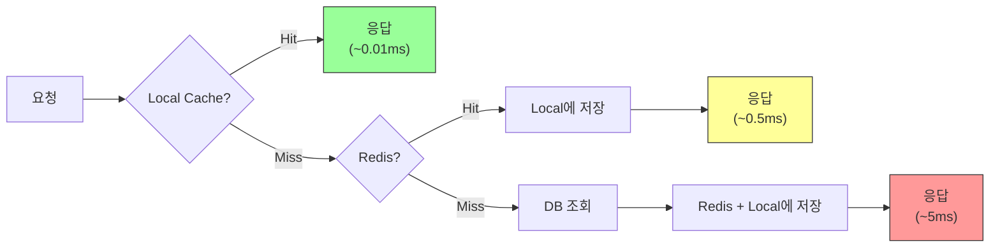

# Ch.18 사례: 매번 Redis에서 가져온다고?

[< 환경 세팅](./README.md) | [계층 캐시 설계 >](./02-layered-cache.md)

---

앞에서 캐시의 기본 전략과 잘못된 캐시 설계가 만드는 장애를 확인했다. 이번에는 캐시를 "잘" 쓰고 있는데도 성능이 아쉬운 경우를 이야기한다. Redis를 쓰고 있으니 캐시를 쓰고 있는 거 맞다. 그런데 정말 그걸로 충분한가?


## 18-1. 사례 설명

도로명 주소 검색 API를 운영하고 있다. 사용자가 주소를 입력하면 도로명 주소를 반환한다. 주소 데이터는 행정안전부가 월 1회 갱신하는 데이터다. 거의 변하지 않는다.

서비스가 커지면서 초당 1,000건의 요청이 들어오기 시작했다. 개발자는 Ch.17에서 배운 대로 Redis 캐시를 적용했다. Cache-Aside 패턴이다. 요청이 오면 Redis를 먼저 보고, 없으면 DB에서 가져와서 Redis에 넣는다. TTL은 1시간.

```python
import redis
from fastapi import FastAPI

app = FastAPI()
redis_client = redis.Redis(host="localhost", port=6379, decode_responses=True)

@app.get("/address/{keyword}")
def search_address(keyword: str):
    # 1. Redis에서 먼저 조회
    cached = redis_client.get(f"addr:{keyword}")
    if cached:
        return {"address": cached, "source": "cache"}

    # 2. Cache Miss면 DB에서 조회
    address = db_search_address(keyword)  # DB 쿼리

    # 3. Redis에 저장
    redis_client.set(f"addr:{keyword}", address, ex=3600)  # TTL 1시간
    return {"address": address, "source": "db"}
```

잘 돌아간다. Cache Hit Rate도 95%가 넘는다. DB 부하도 거의 없다. 그런데 뭔가 아쉽다.

Redis 서버의 네트워크 트래픽을 보니 초당 1,000건의 GET 요청이 Redis로 가고 있다. Redis 자체는 초당 10만 건도 처리할 수 있으니 문제는 아니다. 하지만 한 가지 의문이 든다.

"서울특별시 강남구 테헤란로" 같은 주소를 1시간 동안 950번 Redis에서 가져온다. 매번 네트워크를 탄다. Redis가 같은 서버에 있어도 TCP 왕복은 발생한다. 다른 데이터센터에 있으면? RTT(Round Trip Time)가 0.5ms라고 하자. 작아 보인다.

```
초당 1,000건 x 0.5ms = 초당 500ms를 네트워크 왕복에 쓴다
```

한 요청 기준 0.5ms면 무시할 만하다. 하지만 전체 시스템 관점에서 보면 매 초마다 0.5초를 네트워크 왕복에 쓰고 있다. 이건 Request당이 아니라 시스템 전체의 네트워크 대역폭과 Redis 서버 부하 관점이다.

더 근본적인 질문: 이 주소 데이터는 월 1회 바뀐다. 그런데 초당 1,000번 네트워크를 타야 하는가? 애플리케이션 메모리에 들고 있으면 네트워크 왕복이 0이다.


## 18-2. 결과 예측

여기서 질문이다.

- 애플리케이션 메모리(Local Cache)에 주소 데이터를 캐시하면 어떻게 되는가?
- Redis 호출이 몇 퍼센트 줄어드는가?
- 응답 시간은 얼마나 빨라지는가?
- Local Cache를 쓰면 생기는 문제는 없는가?

<!-- 기대 키워드: Local Cache, Remote Cache, Cache Invalidation, TTL, 메모리 계층 -->


## 18-3. 결과 분석

Local Cache(Python 딕셔너리 or cachetools.TTLCache)를 Redis 앞에 한 겹 추가한다. 요청이 오면 Local Cache -> Redis -> DB 순서로 조회한다.

```python
from cachetools import TTLCache
import redis
from fastapi import FastAPI

app = FastAPI()
redis_client = redis.Redis(host="localhost", port=6379, decode_responses=True)

# Local Cache: 최대 10,000개, TTL 5분
local_cache = TTLCache(maxsize=10000, ttl=300)

@app.get("/address/{keyword}")
def search_address(keyword: str):
    cache_key = f"addr:{keyword}"

    # 1. Local Cache에서 먼저 조회
    if cache_key in local_cache:
        return {"address": local_cache[cache_key], "source": "local"}

    # 2. Local Miss면 Redis에서 조회
    cached = redis_client.get(cache_key)
    if cached:
        local_cache[cache_key] = cached  # Local에도 저장
        return {"address": cached, "source": "redis"}

    # 3. Redis도 Miss면 DB에서 조회
    address = db_search_address(keyword)
    redis_client.set(cache_key, address, ex=3600)
    local_cache[cache_key] = address
    return {"address": address, "source": "db"}
```

결과는 이렇다.

| 지표 | Redis만 사용 | Local + Redis |
|------|-------------|---------------|
| 초당 Redis 호출 | 1,000 | 10~50 |
| Redis 호출 감소율 | 기준 | 95~99% 감소 |
| 평균 응답 시간 (캐시 Hit 기준) | 0.5~1ms | 0.01~0.05ms |
| 응답 시간 개선 | 기준 | 10~50배 빨라짐 |

(참고 수치. Python cachetools TTLCache는 딕셔너리 기반이라 조회가 O(1)이고 네트워크 왕복이 없다. 실제 수치는 서버 사양, Redis 위치, 데이터 크기에 따라 다르지만, "네트워크 왕복 vs 메모리 접근"의 차이는 구조적으로 10배 이상이다. 출처: Redis 공식 벤치마크에서 단일 서버 Redis GET 레이턴시 평균 0.1~0.5ms, 메모리 딕셔너리 접근은 마이크로초 단위.)

핵심은 Redis 호출이 95~99% 줄었다는 거다. 인기 있는 주소 검색어("서울", "강남", "테헤란로" 등)는 Local Cache에서 바로 반환된다. Redis를 거칠 필요가 없다. Redis에 가는 요청은 Local Cache의 TTL이 만료됐거나 처음 검색되는 키워드뿐이다.

<details>
<summary>Local Cache (로컬 캐시)</summary>

애플리케이션 프로세스의 메모리에 데이터를 저장하는 캐시다. Python의 딕셔너리, Java의 ConcurrentHashMap, 또는 cachetools/Caffeine 같은 라이브러리를 사용한다. 장점은 네트워크 왕복이 없어서 가장 빠르다는 거다. 단점은 프로세스별로 독립된 캐시를 가지기 때문에 서버가 여러 대면 서버마다 캐시 내용이 다를 수 있다는 거다. 프로세스가 재시작되면 캐시도 사라진다.

(Python에서는 `functools.lru_cache`, `cachetools.TTLCache`가 대표적이다. Java에서는 Caffeine, Guava Cache가 같은 역할을 한다.)

</details>

<details>
<summary>Remote Cache (원격 캐시)</summary>

애플리케이션 외부의 별도 서버에 데이터를 저장하는 캐시다. Redis, Memcached가 대표적이다. 장점은 여러 서버가 같은 캐시를 공유할 수 있어서 데이터 일관성이 높다는 거다. 단점은 네트워크를 타야 해서 Local Cache보다 느리다. Redis가 죽으면 모든 서버의 캐시가 한꺼번에 사라진다는 것도 리스크다.

Ch.17에서 다뤘던 Redis 캐시가 바로 Remote Cache다.

</details>

### 그런데 문제가 없는가?

Local Cache의 TTL을 5분으로 잡았다. 5분 동안은 원본 데이터가 바뀌어도 Local Cache가 옛날 데이터를 내려준다. 이 주소 데이터는 월 1회 바뀌니까 5분이 문제가 안 된다. 그런데 다른 데이터라면?

서버가 3대라고 하자. Local Cache가 서버마다 따로 있다.

```
서버 A: Local Cache에 "강남구 테헤란로 123" (최신)
서버 B: Local Cache에 "강남구 테헤란로 123" (최신)
서버 C: Local Cache TTL 만료, Redis에서 새로 가져옴 -> "강남구 테헤란로 456" (갱신됨)
```

사용자가 새로고침을 누를 때마다 다른 서버로 요청이 가면(Load Balancer 라운드 로빈), 어떤 때는 "123", 어떤 때는 "456"이 보인다. 이게 Local Cache의 근본적인 문제다. 서버마다 캐시가 다를 수 있다.

이 문제를 어떻게 해결하는가? 다음 파일에서 계층 캐시 설계와 Cache Invalidation 전략을 다룬다.


## 18-4. 코드 설명

위에서 보여준 코드의 핵심 구조를 정리한다.

### 2단계 캐시 조회 흐름



요청이 들어오면:

1. Local Cache를 본다. Hit면 즉시 반환한다. 네트워크 비용 0.
2. Local Miss면 Redis를 본다. Hit면 데이터를 Local Cache에도 저장하고 반환한다.
3. Redis도 Miss면 DB에서 가져온다. Redis와 Local Cache 양쪽에 저장한다.

"가까운 곳부터 찾는다"는 원리다. 이건 CPU가 데이터를 찾는 방식과 정확히 같다. 다음 파일에서 이 비유를 자세히 다룬다.

### TTL 설계

Local Cache와 Redis의 TTL을 다르게 잡는 게 핵심이다.

```python
# Local Cache: TTL 5분, 최대 10,000개
local_cache = TTLCache(maxsize=10000, ttl=300)

# Redis: TTL 1시간
redis_client.set(cache_key, address, ex=3600)
```

왜 다르게 잡는가?

- Local Cache의 TTL이 짧아야 데이터 불일치 시간이 짧다. 5분이면 최악의 경우 5분간 옛날 데이터를 보여준다.
- Redis의 TTL은 더 길어도 된다. Redis는 모든 서버가 공유하니까 일관성 문제가 없다.
- Local Cache의 TTL < Redis의 TTL < 원본 데이터 갱신 주기. 이 관계가 유지되어야 한다.

```
Local TTL (5분) < Redis TTL (1시간) < 데이터 갱신 주기 (1개월)
```

이 계층 구조가 무너지면 이상한 일이 벌어진다. 예를 들어 Local TTL을 2시간으로 잡으면? Redis TTL(1시간)보다 길다. Redis에서 데이터가 만료돼서 DB에서 새 데이터를 가져왔는데, Local Cache에는 아직 옛날 데이터가 남아 있다. 데이터가 "역행"하는 거다.

### maxsize의 의미

```python
local_cache = TTLCache(maxsize=10000, ttl=300)
```

`maxsize=10000`은 최대 10,000개의 키를 저장한다는 뜻이다. 10,001번째 키가 들어오면 가장 오래된(LRU) 키를 제거한다. 이건 메모리를 보호하기 위한 장치다.

왜 필요한가? Local Cache는 프로세스 메모리를 쓴다. 제한 없이 캐시하면 메모리가 끝없이 자란다. Ch.4에서 봤던 OOM의 원인이 될 수 있다. maxsize로 상한을 정해두면 메모리 사용량을 예측할 수 있다.

얼마로 잡아야 하는가? 데이터 크기에 따라 다르다. 주소 데이터 한 건이 200바이트라면 10,000건 = 약 2MB. 이 정도면 문제없다. 이미지나 JSON 같은 큰 데이터라면 maxsize를 더 작게 잡아야 한다.

---

[< 환경 세팅](./README.md) | [계층 캐시 설계 >](./02-layered-cache.md)
