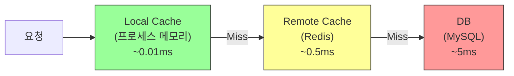
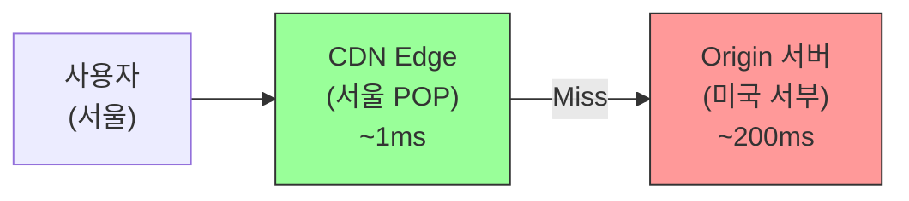
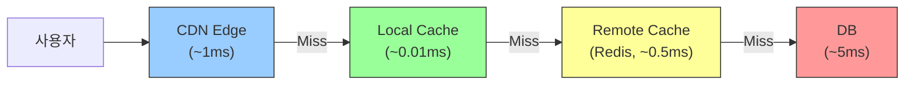

# Ch.18 계층 캐시 설계

[< 사례: 매번 Redis에서 가져온다고?](./01-case.md) | [유사 사례와 키워드 정리 >](./03-summary.md)

---

앞에서 Local Cache를 Redis 앞에 한 겹 추가하는 것만으로 Redis 호출을 95~99% 줄일 수 있다는 걸 확인했다. 그런데 "가까운 곳부터 찾는다"는 이 원리가 어디서 왔는지를 한번 봐야 한다. 사실 이건 소프트웨어 개발자가 발명한 게 아니다. CPU가 수십 년 전부터 쓰고 있던 방식이다.


## CPU Cache: 하드웨어가 먼저 답을 알고 있었다

CPU가 데이터를 처리하려면 메모리에서 가져와야 한다. 그런데 CPU와 RAM의 속도 차이가 엄청나다. CPU는 나노초(ns) 단위로 동작하고, RAM은 수십~수백 나노초가 걸린다. CPU가 매번 RAM까지 가서 데이터를 가져오면, 대부분의 시간을 "기다리는 데" 쓰게 된다.

그래서 CPU 안에 작은 메모리를 넣었다. L1 Cache다. RAM보다 훨씬 빠르지만 용량이 아주 작다(보통 32~64KB). L1으로 부족하니까 L2를 추가했다(256KB~1MB). 그래도 부족해서 L3를 추가했다(수 MB~수십 MB).

| 계층 | 용량 | 접근 시간 | 비유 |
|------|------|----------|------|
| L1 Cache | 32~64KB | ~1ns | 책상 위의 메모지 |
| L2 Cache | 256KB~1MB | ~4ns | 서랍 안의 노트 |
| L3 Cache | 수 MB~수십 MB | ~10ns | 책장의 파일 |
| RAM | 수 GB~수백 GB | ~100ns | 옆방 캐비닛 |
| SSD | 수백 GB~수 TB | ~100,000ns (0.1ms) | 창고 |
| HDD | 수 TB | ~10,000,000ns (10ms) | 다른 건물 창고 |

(출처: Latency Numbers Every Programmer Should Know, Jeff Dean / Peter Norvig. 원래 2010년대 초반 자료이며, 최신 하드웨어에서는 절대값이 다르지만 계층 간 비율은 유사하다.)

L1이 1ns이고 RAM이 100ns면 100배 차이다. CPU가 L1에서 데이터를 찾으면 100배 빠르다. L1에 없으면 L2, L2에 없으면 L3, L3에도 없으면 RAM. "가까운 곳부터 찾고, 없으면 한 단계 더 먼 곳으로 간다."

이 구조가 작동하는 이유가 뭔가? 두 가지 원리 때문이다.

1. Temporal Locality (시간적 지역성): 최근에 접근한 데이터는 곧 다시 접근될 가능성이 높다. 방금 쓴 변수를 다음 줄에서 또 쓸 확률이 높다.
2. Spatial Locality (공간적 지역성): 특정 주소에 접근하면 그 근처 주소에도 곧 접근할 가능성이 높다. 배열의 0번 원소를 읽으면 1번, 2번도 곧 읽을 거다.

(이 두 원리를 "참조 지역성 (Locality of Reference)"이라고 한다. Computer Architecture 수업의 핵심 개념이다.)

이 원리가 소프트웨어 캐시에도 그대로 적용된다. "서울특별시 강남구 테헤란로"를 방금 검색한 사용자가 곧 다시 검색할 가능성이 높다(Temporal Locality). "테헤란로 1"을 검색한 사용자가 "테헤란로 2", "테헤란로 3"도 검색할 가능성이 높다(Spatial Locality).

<details>
<summary>참조 지역성 (Locality of Reference)</summary>

프로그램이 메모리에 접근하는 패턴이 특정 영역에 집중되는 경향이다. 시간적 지역성(최근 접근한 데이터를 다시 접근)과 공간적 지역성(인접한 데이터를 연이어 접근)이 있다. 캐시가 효과적인 근본적인 이유다. 만약 모든 데이터 접근이 완전히 랜덤이라면, 캐시는 무의미하다. 다행히 현실의 프로그램 대부분은 지역성이 매우 높다.

</details>


## 소프트웨어 캐시 계층

CPU의 L1 -> L2 -> L3 -> RAM 구조를 소프트웨어로 옮기면 이렇다.



| 계층 | CPU 비유 | 소프트웨어 | 접근 시간 | 일관성 |
|------|----------|-----------|----------|--------|
| L1 | L1 Cache | Local Cache (cachetools) | ~0.01ms | 서버별 다를 수 있음 |
| L2 | L3 Cache / RAM | Remote Cache (Redis) | ~0.5ms | 모든 서버 공유 |
| L3 | Disk | DB (MySQL) | ~5ms | 원본 (Single Source of Truth) |

CPU Cache에서 L1이 가장 빠르고 용량이 작듯이, Local Cache가 가장 빠르고 용량이 작다. Redis는 중간이고, DB는 가장 느리지만 데이터가 전부 있다.


## Local Cache의 장단점

장점은 명확하다.

1. 가장 빠르다. 네트워크 왕복이 없다. 프로세스 메모리에서 딕셔너리 조회하는 것과 같다.
2. Redis 부하를 줄인다. 인기 있는 데이터는 Local에서 바로 반환되니까 Redis가 한가해진다.
3. Redis 장애에 일부 대응 가능하다. Redis가 죽어도 Local Cache에 있는 데이터는 TTL 동안 서비스 가능하다.

단점도 명확하다.

1. 서버별 데이터 불일치. 서버 A의 Local Cache와 서버 B의 Local Cache가 다를 수 있다. 앞 사례에서 봤던 문제다.
2. 메모리 사용. 프로세스 메모리를 먹는다. maxsize를 관리하지 않으면 OOM 위험이 있다.
3. 프로세스 재시작 시 소멸. 배포하거나 서버가 죽으면 Local Cache가 전부 날아간다. 재시작 직후에는 모든 요청이 Redis나 DB로 간다 (Cold Start).

그래서 Local Cache에 넣기 좋은 데이터는 이런 거다.

| 조건 | 이유 |
|------|------|
| 자주 읽히는 데이터 | Cache Hit Rate가 높아야 의미가 있다 |
| 거의 변하지 않는 데이터 | 불일치 시간이 길어도 괜찮다 |
| 크기가 작은 데이터 | 메모리 부담이 적다 |
| 불일치가 치명적이지 않은 데이터 | 잠깐 옛날 데이터를 보여줘도 큰 문제가 없다 |

도로명 주소? 자주 읽히고, 거의 안 바뀌고, 크기가 작고, 잠깐 옛날 주소를 보여줘도 치명적이지 않다. Local Cache에 넣기 딱 좋은 데이터다.

반대로 Local Cache에 넣으면 안 되는 데이터: 재고 수량, 계좌 잔액, 실시간 가격. 이런 건 0.1초 차이도 문제가 될 수 있다. 이런 데이터는 Remote Cache(Redis)에서 관리하거나, 아예 캐시하지 않고 DB에서 직접 읽어야 한다.


## Remote Cache의 장단점

Remote Cache의 장점:

1. 모든 서버가 같은 데이터를 공유한다. 서버 A에서 쓴 캐시를 서버 B에서 읽을 수 있다.
2. 서버 재시작에 영향받지 않는다. 애플리케이션을 재배포해도 Redis의 데이터는 살아 있다.
3. 대용량 데이터를 저장할 수 있다. Redis 서버의 메모리만큼 저장 가능하다. 수십 GB도 가능하다.

Remote Cache의 단점:

1. 네트워크 지연. 아무리 빨라도 TCP 왕복은 있다. 같은 데이터센터 내에서 0.1~0.5ms, 다른 리전이면 수 ms.
2. Single Point of Failure. Redis 서버가 죽으면 모든 서버의 캐시가 한꺼번에 사라진다. Redis Sentinel이나 Cluster로 이중화가 필요하다.
3. 직렬화 비용. 데이터를 Redis에 넣으려면 JSON이나 MessagePack으로 직렬화해야 한다. Local Cache는 Python 객체 그대로 저장하니까 이 비용이 없다.


## Cache Invalidation: 캐시에서 가장 어려운 문제

Phil Karlton이 이런 말을 남겼다:

> "컴퓨터 과학에서 어려운 것은 딱 두 가지다. 캐시 무효화와 이름 짓기."

(출처: 이 인용은 다양한 형태로 전해지며, Martin Fowler의 블로그 등에서 Phil Karlton의 말로 소개된다. 정확한 원본 출처는 불분명하지만, CS 업계에서 널리 인용되는 명언이다.)

농담 같지만 진짜다. 캐시를 넣는 건 쉽다. 캐시를 지우는 타이밍을 결정하는 게 어렵다.

Cache Invalidation이란 "원본 데이터가 바뀌었으니 캐시를 무효화(삭제 또는 갱신)해야 한다"는 거다. 전략이 세 가지 있다.

### 전략 1: TTL 기반

가장 간단하다. 캐시에 유효 기간을 설정한다. 시간이 지나면 자동으로 만료된다.

```python
# Local Cache: 5분 후 자동 만료
local_cache = TTLCache(maxsize=10000, ttl=300)

# Redis: 1시간 후 자동 만료
redis_client.set("key", "value", ex=3600)
```

장점: 구현이 간단하다. 별도의 무효화 로직이 필요 없다.
단점: TTL 동안은 옛날 데이터를 보여줄 수 있다. TTL을 짧게 잡으면 Cache Hit Rate가 떨어진다.

언제 쓰는가? 데이터가 느리게 변하고, 잠깐 옛날 데이터를 보여줘도 괜찮을 때. 도로명 주소, 환율, 날씨 데이터 같은 것.

### 전략 2: 이벤트 기반 (Pub/Sub)

원본 데이터가 바뀌면 이벤트를 발행하고, 캐시가 그 이벤트를 구독해서 스스로 무효화한다.

```python
import redis
import threading
from cachetools import TTLCache

redis_client = redis.Redis(host="localhost", port=6379, decode_responses=True)
local_cache = TTLCache(maxsize=10000, ttl=300)

def cache_invalidation_listener():
    """Redis Pub/Sub으로 캐시 무효화 이벤트를 수신한다"""
    pubsub = redis_client.pubsub()
    pubsub.subscribe("cache:invalidate")

    for message in pubsub.listen():
        if message["type"] == "message":
            key = message["data"]
            # Local Cache에서 해당 키 삭제
            local_cache.pop(key, None)
            # Redis에서도 삭제
            redis_client.delete(key)

# 백그라운드 스레드로 실행
thread = threading.Thread(target=cache_invalidation_listener, daemon=True)
thread.start()

# 데이터 갱신 시 이벤트 발행
def update_address(keyword: str, new_address: str):
    db_update_address(keyword, new_address)  # DB 갱신
    redis_client.publish("cache:invalidate", f"addr:{keyword}")  # 이벤트 발행
```

장점: 데이터가 바뀌는 즉시 캐시를 무효화할 수 있다. TTL 기반보다 불일치 시간이 짧다.
단점: 구현이 복잡하다. Pub/Sub 메시지가 유실되면 캐시가 안 지워진다. 서버가 재시작 중이면 이벤트를 못 받는다.

언제 쓰는가? 데이터 불일치가 허용되지 않을 때. 상품 가격, 재고 상태 같은 것. 다만 "허용되지 않는다"의 기준을 따져야 한다. 0.1초 차이도 안 되면 캐시 자체를 안 쓰는 게 맞다.

### 전략 3: Write-Through (직접 갱신)

데이터를 쓸 때 DB와 캐시를 동시에 갱신한다.

```python
def update_address(keyword: str, new_address: str):
    # DB 갱신
    db_update_address(keyword, new_address)

    # Redis 갱신 (삭제가 아니라 새 값으로 덮어쓴다)
    cache_key = f"addr:{keyword}"
    redis_client.set(cache_key, new_address, ex=3600)

    # Local Cache는 TTL로 자연 만료시키거나, 직접 갱신
    local_cache[cache_key] = new_address
```

Ch.17에서 다뤘던 Write-Through 패턴이다. 장점은 캐시가 항상 최신이라는 거다. 단점은 쓰기 성능이 떨어진다(DB + Redis + Local 세 군데를 써야 하니까).

### 실무에서는 어떻게 조합하는가?

보통 이렇게 조합한다.

```
Local Cache: TTL 기반 (짧은 TTL, 5~30초)
Remote Cache: TTL + Write-Through 혼합
              읽기 전용 데이터는 TTL, 변경 가능 데이터는 Write-Through
```

그리고 최후의 안전망으로 Local Cache에 항상 TTL을 건다. 이벤트 기반이든 Write-Through든, 뭔가 잘못돼서 캐시가 안 지워졌을 때 TTL이 자동으로 정리해준다.

<details>
<summary>Cache Invalidation (캐시 무효화)</summary>

원본 데이터가 변경됐을 때 캐시의 데이터를 삭제하거나 갱신하는 행위다. "언제, 어떻게 캐시를 지울 것인가"가 핵심이고, 이게 캐시 설계에서 가장 어렵다. TTL 기반(시간이 지나면 자동 만료), 이벤트 기반(변경 시 알림), Write-Through(쓸 때 같이 갱신)가 대표적인 전략이다. 완벽한 전략은 없고, 데이터 특성에 따라 선택해야 한다.

</details>


## CDN: 사용자 가까이에 두는 캐시

캐시 계층을 사용자 쪽으로 한 단계 더 확장하면 CDN이 된다.



CDN (Content Delivery Network)은 전 세계 여러 곳에 캐시 서버(Edge Server)를 두고, 사용자와 가장 가까운 서버에서 콘텐츠를 제공하는 구조다. 이미지, CSS, JavaScript, 동영상 같은 정적 파일을 캐시하는 데 주로 쓴다.

서울에 있는 사용자가 미국에 있는 서버에서 이미지를 가져오면 왕복 200ms가 걸린다. CDN이 서울에 Edge Server를 두고 있으면? 1ms면 된다.

CDN도 캐시다. Cache Hit면 Edge Server에서 바로 반환하고, Miss면 Origin Server에서 가져온다. TTL로 관리한다. 원본 파일이 바뀌면 Purge(강제 무효화)를 한다.

전체 캐시 계층을 한번 그려보면 이렇다.



(CDN은 주로 정적 파일에 쓰고, Local/Remote Cache는 API 응답이나 DB 쿼리 결과에 쓴다. 계층이 겹치는 건 아니고 각자 역할이 다르다.)

<details>
<summary>CDN (Content Delivery Network)</summary>

전 세계에 분산된 캐시 서버 네트워크다. 사용자와 물리적으로 가까운 서버에서 콘텐츠를 제공해서 응답 시간을 줄인다. CloudFront(AWS), Cloudflare, Akamai가 대표적이다. 주로 정적 파일(이미지, CSS, JS)을 캐시하지만, 최근에는 API 응답을 캐시하는 경우도 있다. 핵심 개념은 "데이터를 사용자 가까이에 둔다"이고, 이건 CPU Cache에서 시작된 메모리 계층 구조의 연장선이다.

Ch.19에서 다루는 Scale-Out과 함께, 트래픽이 많은 서비스에서 거의 필수적으로 사용된다.

</details>


## Memcached vs Redis: 언제 뭘 쓰는가

Remote Cache를 이야기하면 Redis만 나오는 경우가 많다. 하지만 Memcached도 여전히 현역이다. 둘의 차이를 알아두면 선택 기준이 생긴다.

| 항목 | Memcached | Redis |
|------|-----------|-------|
| 데이터 구조 | 단순 키-값 (String만) | String, List, Set, Hash, Sorted Set 등 |
| 멀티스레드 | O (멀티스레드 아키텍처) | X (싱글스레드, 6.0부터 I/O 멀티스레딩) |
| 메모리 효율 | 단순 키-값에서 더 효율적 | 데이터 구조 오버헤드 있음 |
| 영속성 | X (순수 인메모리) | O (RDB, AOF) |
| Pub/Sub | X | O |
| Lua 스크립팅 | X | O |
| Cluster | 클라이언트 샤딩 | 네이티브 Cluster |

(출처: Redis 공식 문서 "Redis vs Memcached", Memcached 공식 위키)

Memcached를 쓰는 경우:

- 단순 키-값 캐시만 필요할 때 (세션, 페이지 캐시)
- 멀티스레드로 CPU 코어를 전부 활용하고 싶을 때
- 영속성이 필요 없을 때 (캐시는 날아가도 DB에서 다시 가져오면 된다)

Redis를 쓰는 경우:

- 리스트, 셋, 정렬 셋 같은 복잡한 데이터 구조가 필요할 때
- Pub/Sub으로 이벤트 기반 캐시 무효화를 하고 싶을 때
- 영속성이 필요할 때 (세션 데이터가 중요한 경우)
- 이미 Redis를 쓰고 있을 때 (굳이 두 가지 운영할 필요 없다)

현실적으로는 대부분 Redis를 쓴다. Redis가 Memcached의 기능을 거의 다 포함하고, 추가 기능도 많기 때문이다. Memcached를 쓰는 경우는 "이미 Memcached를 쓰고 있고 잘 돌아가는데 굳이 바꿀 이유가 없을 때", 또는 "아주 단순한 키-값 캐시에서 멀티스레드 성능이 중요할 때" 정도다.

(Facebook/Meta가 Memcached를 대규모로 사용한다. TAO라는 그래프 캐시 시스템이 Memcached 기반이다. "TAO: Facebook's Distributed Data Store for the Social Graph", USENIX ATC 2013.)

<details>
<summary>Memcached</summary>

2003년에 LiveJournal에서 만든 분산 메모리 캐시 시스템이다. 단순한 키-값 저장에 특화되어 있고, 멀티스레드 아키텍처라 CPU 코어를 잘 활용한다. Redis보다 먼저 나왔고, 데이터 구조가 단순한 대신 메모리 효율이 좋다. Redis가 등장한 이후 점유율이 줄었지만, 대규모 시스템에서는 여전히 사용된다.

</details>


## Local Cache + Remote Cache: 조합의 원칙

두 캐시를 조합할 때 기억할 원칙 세 가지.

### 원칙 1: TTL은 안쪽이 짧아야 한다

```
Local TTL < Remote TTL < 원본 데이터 변경 주기
```

이걸 어기면 데이터 역행이 발생한다. 앞에서 봤던 거다. Local TTL이 Redis TTL보다 길면 Redis에서는 새 데이터를 가져왔는데 Local에는 옛날 데이터가 남아 있다.

### 원칙 2: Local Cache에는 "읽기 전용" 성격의 데이터를 넣는다

재고 수량을 Local Cache에 넣으면? 서버 A에서 재고를 차감했는데, 서버 B의 Local Cache에는 반영이 안 된다. 사용자가 "재고 있음"을 보고 주문했는데 실제로는 품절이다.

Local Cache에 넣기 좋은 데이터:

- 코드 테이블 (국가 코드, 카테고리 코드)
- 설정값 (기능 플래그, 요율 테이블)
- 정적 콘텐츠 메타데이터 (이미지 URL, 파일 크기)
- 자주 조회되는 읽기 전용 데이터

### 원칙 3: Local Cache의 크기를 제한한다

maxsize 없이 Local Cache를 운영하면 메모리가 계속 자란다. 프로세스당 사용할 수 있는 메모리에는 한계가 있다. 특히 컨테이너 환경(Docker, Kubernetes)에서는 메모리 제한이 명시적으로 걸려 있다. Local Cache가 메모리를 너무 많이 먹으면 애플리케이션 자체가 OOM으로 죽는다.

```python
# 좋은 예: 크기 제한 있음
local_cache = TTLCache(maxsize=10000, ttl=300)

# 나쁜 예: 제한 없는 딕셔너리
local_cache = {}  # 계속 커진다
```

(Ch.4에서 다뤘던 OOM 이야기와 연결된다. 메모리를 쓰는 모든 곳에서 상한을 관리해야 한다.)

---

[< 사례: 매번 Redis에서 가져온다고?](./01-case.md) | [유사 사례와 키워드 정리 >](./03-summary.md)
