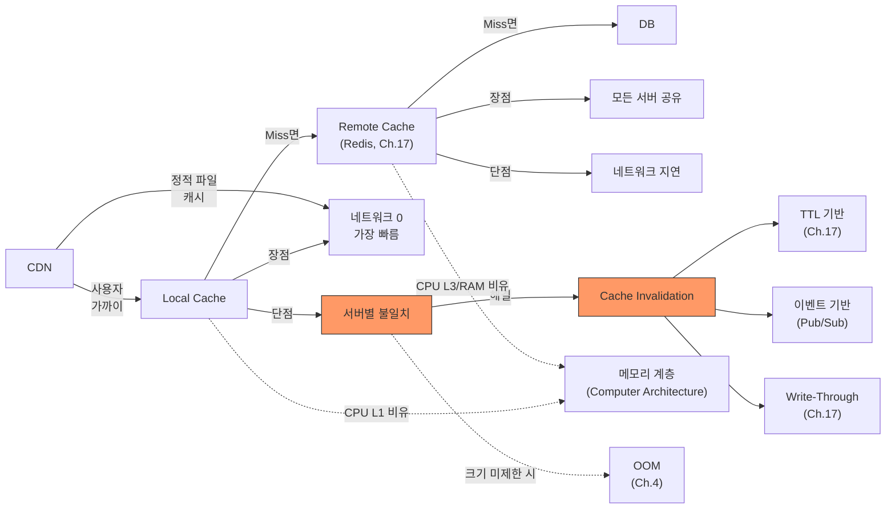

# Ch.18 유사 사례와 키워드 정리

[< 계층 캐시 설계](./02-layered-cache.md)

---

앞에서 Local Cache와 Remote Cache를 조합하는 계층 캐시 설계, CPU Cache에서 시작된 메모리 계층 구조, Cache Invalidation 전략을 확인했다. 같은 원리가 적용되는 유사 사례를 보고 키워드를 정리한다.


## 18-5. 유사 사례

### 사례: 브라우저 캐시 (localStorage, Cache API)

웹 브라우저에도 계층 캐시가 있다. 사용자가 웹 페이지를 열면:

1. 메모리 캐시: 현재 탭에서 이미 로드한 리소스. 탭을 닫으면 사라진다.
2. 디스크 캐시: 브라우저가 디스크에 저장한 리소스. 브라우저를 닫아도 남아 있다.
3. CDN / Origin 서버: 캐시에 없으면 네트워크 요청.

`Cache-Control: max-age=3600` 헤더가 TTL 역할을 한다. `ETag`와 `If-None-Match`가 Cache Invalidation 역할을 한다. "리소스가 바뀌었는지 서버에 물어보고, 안 바뀌었으면 304 Not Modified를 반환한다" -- 이게 조건부 요청이다.

localStorage에 API 응답을 캐시하는 것도 Local Cache의 일종이다. 네트워크 요청 없이 즉시 데이터를 보여주고, 백그라운드에서 최신 데이터를 가져와서 갱신하는 "Stale-While-Revalidate" 패턴도 같은 원리다.


### 사례: DNS 캐시

도메인 이름을 IP 주소로 변환하는 DNS도 계층 캐시 구조다.

```
1. 브라우저 DNS 캐시 (~1ms)
2. OS DNS 캐시 (~1ms)
3. 공유기/ISP DNS 서버 (~5ms)
4. Root DNS → TLD DNS → Authoritative DNS (~100ms)
```

한번 "google.com"의 IP를 알아내면 TTL 동안 캐시한다. 같은 도메인을 다시 요청하면 1번에서 바로 반환된다. 4단계까지 가는 경우는 거의 없다.

DNS에서도 Cache Invalidation이 문제가 된다. 서버 IP를 바꿨는데 DNS 캐시가 옛날 IP를 가리키고 있으면? TTL이 만료될 때까지 옛날 서버로 요청이 간다. 그래서 서버 이전 전에 DNS TTL을 미리 짧게 낮추는 게 실무 관행이다.


### 사례: Spring의 @Cacheable

Java Spring에서 `@Cacheable` 어노테이션을 붙이면 메서드 결과를 자동으로 캐시한다.

```java
@Cacheable(value = "addresses", key = "#keyword")
public Address searchAddress(String keyword) {
    return addressRepository.findByKeyword(keyword);
}
```

이 코드가 하는 일:

1. `keyword`를 키로 캐시를 확인한다.
2. 캐시에 있으면 메서드를 실행하지 않고 캐시된 결과를 반환한다.
3. 캐시에 없으면 메서드를 실행하고 결과를 캐시에 저장한다.

기본 캐시 구현은 ConcurrentHashMap (Local Cache)이다. Caffeine으로 교체하면 TTL과 LRU를 쓸 수 있고, Redis로 교체하면 Remote Cache가 된다. EhCache를 쓰면 Local + Remote 2단계도 가능하다.

(Python에서 비슷한 역할을 하는 게 `functools.lru_cache`와 `cachetools`다. 다만 Python에는 Spring 같은 선언적 캐시 추상화가 표준으로 없다. `flask-caching`이나 `aiocache` 같은 라이브러리를 쓰거나, 직접 데코레이터를 만든다.)


### 사례: Python의 @lru_cache

```python
from functools import lru_cache

@lru_cache(maxsize=128)
def fibonacci(n):
    if n < 2:
        return n
    return fibonacci(n - 1) + fibonacci(n - 2)
```

`@lru_cache`는 함수의 인자를 키로, 반환값을 값으로 캐시한다. 같은 인자로 다시 호출하면 함수를 실행하지 않고 캐시된 결과를 반환한다. 이것도 Local Cache다. 프로세스 메모리에 저장되고, 프로세스가 죽으면 사라진다.

피보나치 함수에 `@lru_cache`를 붙이면 시간 복잡도가 O(2^n)에서 O(n)으로 떨어진다. 이미 계산한 값을 다시 계산하지 않으니까. 이걸 Memoization이라고 하고, Dynamic Programming의 핵심 기법이다.

`@lru_cache`의 한계는 앞에서 말한 대로 TTL이 없다는 거다. 한번 캐시된 데이터는 maxsize를 초과하거나 프로세스가 죽을 때까지 남아 있다. 변하지 않는 계산 결과(피보나치, 팩토리얼)에는 좋지만, 외부 데이터(DB 쿼리, API 응답)를 캐시하기에는 부적합하다.


## 그래서 실무에서는 어떻게 하는가

### 1. 데이터 특성에 따라 캐시 계층을 선택한다

| 데이터 특성 | 추천 캐시 | 이유 |
|------------|----------|------|
| 절대 안 바뀜 (코드 테이블, 상수) | Local Cache only | 네트워크 비용 0, Redis 불필요 |
| 거의 안 바뀜 (주소, 설정값) | Local + Remote | Local에서 대부분 처리, TTL로 갱신 |
| 자주 바뀌지만 잠깐 캐시해도 됨 | Remote Cache only | Local에 두면 불일치 위험이 너무 높다 |
| 실시간 정확성 필요 (재고, 잔액) | 캐시 안 함 or 매우 짧은 TTL | 캐시가 오히려 독이 된다 |

### 2. Local Cache에는 반드시 TTL과 maxsize를 건다

```python
from cachetools import TTLCache

# 좋은 예
local_cache = TTLCache(maxsize=10000, ttl=300)

# 나쁜 예 1: TTL 없음
local_cache = LRUCache(maxsize=10000)  # 데이터가 영원히 남는다

# 나쁜 예 2: maxsize 없음 (딕셔너리)
local_cache = {}  # 메모리가 끝없이 자란다
```

### 3. Cache Hit Rate를 모니터링한다

캐시를 넣었으면 효과를 측정해야 한다. Hit Rate가 90% 미만이면 캐시 설계를 재검토한다.

```python
import logging

hit_count = 0
miss_count = 0

def get_from_cache(key):
    global hit_count, miss_count

    if key in local_cache:
        hit_count += 1
        return local_cache[key]

    miss_count += 1
    return None

def log_cache_stats():
    total = hit_count + miss_count
    if total > 0:
        hit_rate = hit_count / total * 100
        logging.info(f"Cache Hit Rate: {hit_rate:.1f}% ({hit_count}/{total})")
```

(실무에서는 이런 수동 카운팅 대신 Prometheus + Grafana로 실시간 모니터링한다. Ch.19에서 다룬다.)

### 4. Cold Start에 대비한다

서버를 재시작하면 Local Cache가 전부 비어 있다. 모든 요청이 Redis나 DB로 몰린다. 이걸 Cold Start라고 한다.

대비 방법:

- 서버 시작 시 인기 데이터를 미리 로드한다 (Cache Warming).
- Rolling 배포로 서버를 한 대씩 재시작한다. 전체 서버가 동시에 Cold Start를 겪지 않게 한다.
- Redis가 있으니까 Local Cache가 비어 있어도 Redis에서 가져오면 된다. DB까지 가는 요청은 Redis도 Miss인 경우뿐이다.


## 오늘의 키워드 정리

### 새 키워드

<details>
<summary>Local Cache (로컬 캐시)</summary>

애플리케이션 프로세스의 메모리에 데이터를 저장하는 캐시다. 네트워크 왕복이 없어서 가장 빠르다. 하지만 서버별로 독립된 캐시이기 때문에 서버 간 데이터 불일치가 발생할 수 있고, 프로세스 재시작 시 소멸된다. Python의 `cachetools.TTLCache`, Java의 Caffeine, Go의 ristretto가 대표적이다.

CPU Cache의 L1이 가장 빠르고 용량이 작듯이, Local Cache도 가장 빠르고 용량이 작다.

</details>

<details>
<summary>Remote Cache (원격 캐시)</summary>

애플리케이션 외부의 별도 서버에 데이터를 저장하는 캐시다. Redis, Memcached가 대표적이다. 모든 서버가 같은 캐시를 공유할 수 있어서 데이터 일관성이 높다. 네트워크를 타야 하기 때문에 Local Cache보다 느리다.

CPU Cache에서 L3나 RAM에 해당한다. L1(Local)보다 느리지만, 용량이 크고 공유 가능하다.

</details>

<details>
<summary>Cache Invalidation (캐시 무효화)</summary>

원본 데이터가 변경됐을 때 캐시의 데이터를 삭제하거나 갱신하는 행위다. Phil Karlton이 "컴퓨터 과학에서 가장 어려운 두 가지 중 하나"라고 한 것으로 유명하다. TTL 기반(시간 만료), 이벤트 기반(Pub/Sub), Write-Through(쓸 때 같이 갱신)가 대표적인 전략이다.

캐시를 넣는 건 쉽지만, 언제 지울지를 결정하는 게 어렵다. 실무에서는 보통 TTL을 최후의 안전망으로 깔아두고, 필요에 따라 이벤트 기반이나 Write-Through를 추가하는 방식으로 조합한다.

</details>

<details>
<summary>CDN (Content Delivery Network)</summary>

전 세계에 분산된 캐시 서버(Edge Server) 네트워크다. 사용자와 물리적으로 가까운 서버에서 콘텐츠를 제공해서 응답 시간을 줄인다. CloudFront(AWS), Cloudflare, Akamai가 대표적이다. 주로 이미지, CSS, JavaScript 같은 정적 파일을 캐시하지만, API 응답 캐시도 가능하다.

"데이터를 사용자 가까이에 둔다"는 원리로, CPU Cache -> Local Cache -> Remote Cache -> CDN으로 이어지는 메모리 계층 구조의 최외곽에 해당한다.

</details>

<details>
<summary>Memcached</summary>

2003년에 LiveJournal에서 만든 분산 메모리 캐시 시스템이다. 단순 키-값 저장에 특화되어 있고, 멀티스레드 아키텍처라 CPU 코어를 잘 활용한다. Redis보다 먼저 나왔고, 데이터 구조가 단순한 대신 메모리 효율이 좋다. Redis가 기능면에서 Memcached를 거의 다 포함하기 때문에 신규 프로젝트에서는 Redis를 쓰는 경우가 많지만, 대규모 시스템(Meta/Facebook의 TAO 등)에서는 여전히 현역이다.

</details>


### 재등장 키워드

| 키워드 | 최초 등장 | 이번 챕터에서의 역할 |
|--------|----------|-------------------|
| Cache | Ch.17 | Local/Remote 계층 구조로 확장 |
| TTL (Time-To-Live) | Ch.17 | Local TTL < Remote TTL 관계의 핵심 |
| Redis | Ch.17 | Remote Cache의 대표 구현체 |
| Cache Stampede | Ch.9, Ch.17 | Cold Start 시 유사한 현상 발생 가능 |
| OOM | Ch.4 | Local Cache의 maxsize 미설정 시 메모리 폭주 위험 |
| Eviction Policy | Ch.17 | Local Cache의 LRU/LFU 선택 |


### 키워드 연관 관계




## 다음에 이어지는 이야기

Ch.17에서 캐시의 기본 전략을, Ch.18에서 캐시의 계층 구조를 다뤘다. 캐시를 잘 설계하면 DB 부하가 줄고, 응답 시간이 빨라진다.

그런데 캐시를 다 적용했는데도 성능이 안 나오는 경우가 있다. 캐시가 문제가 아니라, 병목이 다른 곳에 있는 거다. CPU가 부족한 건지, 네트워크가 포화된 건지, DB Connection이 모자란 건지 -- 병목의 위치를 정확히 짚지 않으면 엉뚱한 곳에 돈을 쓰게 된다.

"성능이 안 나오니까 서버를 200대로 늘려볼까?" -- Ch.19의 제목이다. 서버를 늘려도 안 빨라지는 이유, Amdahl의 법칙이 말하는 병렬화의 한계를 다룬다. Bottleneck을 찾지 않고 Scale-Out하면 돈만 날린다.

---

[< 계층 캐시 설계](./02-layered-cache.md)
