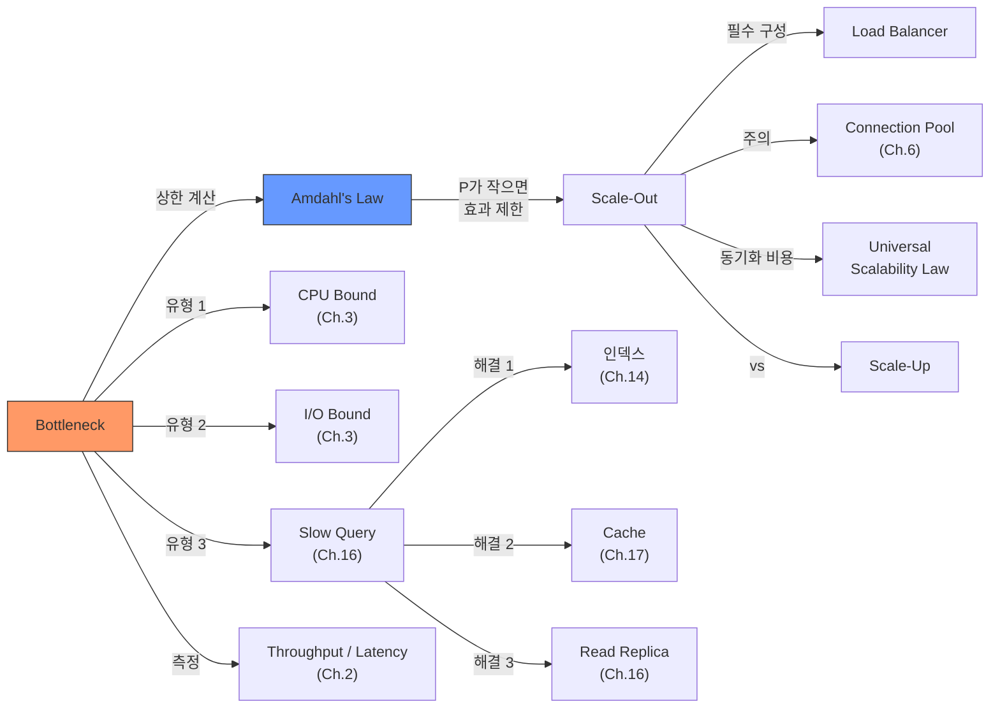

# Ch.19 유사 사례와 키워드 정리

[< Bottleneck과 Amdahl의 법칙](./02-bottleneck-amdahl.md)

---

앞에서 Bottleneck 식별 방법, Amdahl's Law, Scale-Up vs Scale-Out, 성능 최적화의 순서를 확인했다. 같은 원리가 적용되는 유사 사례를 보고 키워드를 정리한다.


## 19-6. 유사 사례

### 사례: CI/CD 파이프라인의 Bottleneck

회사에서 CI/CD 파이프라인이 너무 느리다는 불만이 나왔다. 전체 파이프라인이 25분이다.

```
CI/CD 파이프라인 (총 25분)
├── 1. 코드 체크아웃           1분   (4%)
├── 2. 의존성 설치             2분   (8%)
├── 3. 빌드                   2분   (8%)
├── 4. 테스트 실행             18분  (72%)
└── 5. 배포                   2분   (8%)
```

"빌드 서버 스펙을 올리자"라는 제안이 나왔다. CPU를 2배로 올리면 빌드가 빨라지지 않을까?

빌드(2분)를 0초로 만들어도 전체는 23분이다. 2분밖에 안 줄었다. Bottleneck이 테스트(18분)이니까.

테스트가 왜 18분인지를 파고들었더니, 테스트 코드가 전부 순차 실행이었다. 독립적인 테스트를 병렬로 돌리니까 18분이 5분으로 줄었다. 전체 파이프라인이 10분이 됐다.

서버 스펙을 올리는 것(비용 증가)보다, 테스트를 병렬화하는 것(코드 수정)이 효과가 훨씬 컸다.

이것도 Amdahl's Law다. 전체의 72%를 차지하는 부분을 최적화했으니 효과가 큰 거다.


### 사례: 개발팀 인원 추가가 오히려 느려지는 경우

프로젝트가 지연되고 있다. 관리자가 개발자를 더 투입했다. 그런데 프로젝트가 더 느려졌다.

Fred Brooks가 1975년에 쓴 "The Mythical Man-Month"에서 이 현상을 설명했다. Brooks's Law라고 불린다.

(출처: Brooks, Frederick P. "The Mythical Man-Month: Essays on Software Engineering." Addison-Wesley, 1975)

```
"Adding manpower to a late software project makes it later."
(늦어진 소프트웨어 프로젝트에 인력을 투입하면 더 늦어진다.)
```

왜? 새로 합류한 개발자가 생산적이 되려면 시간이 필요하다. 기존 개발자가 새 개발자를 가르쳐야 하니까 기존 인원의 생산성도 떨어진다. 의사소통 비용은 인원 수의 제곱에 비례한다. 3명이면 3개의 소통 경로, 4명이면 6개, 5명이면 10개.

```
소통 경로 = n(n-1)/2
3명: 3개
5명: 10개
10명: 45개
20명: 190개
```

이게 앞에서 언급한 Universal Scalability Law의 coherence penalty와 같은 개념이다. 서버를 늘릴수록 서버 간 동기화 비용이 증가하듯, 개발자를 늘릴수록 의사소통 비용이 증가한다.

(물론 이건 극단적인 상황에서의 이야기다. 장기적으로는 인원 추가가 팀 전체의 산출물을 늘릴 수 있다. 핵심은 "투입 = 산출"이 아니라는 것이다. 서버를 늘린다고 선형적으로 빨라지지 않듯, 인원을 늘린다고 선형적으로 빨라지지 않는다.)


### 사례: 네트워크 대역폭 Bottleneck

API 서버의 CPU, Memory, DB 전부 여유가 있다. 그런데 응답이 느리다. 원인은 네트워크 대역폭이었다.

API 응답 크기가 평균 500KB였다. 서버의 네트워크 대역폭이 1Gbps라면:

```
1Gbps = 약 125MB/s
125MB/s / 500KB = 초당 약 250건
```

동시 요청이 250건을 넘으면 네트워크가 Bottleneck이 된다. 서버를 늘려도 나가는 네트워크가 같으면 소용없다.

해결:
1. 응답 크기를 줄인다. SELECT *를 없애고 필요한 필드만 반환한다 (Ch.16).
2. 응답을 압축한다. gzip 압축을 적용하면 500KB가 50KB로 줄 수 있다.
3. CDN을 쓴다 (Ch.18). 정적 콘텐츠는 CDN에서 직접 응답한다.

500KB를 50KB로 줄이면, 같은 대역폭에서 초당 2,500건을 처리할 수 있다. 서버를 10대 추가하는 것보다 응답 크기를 줄이는 게 효과가 크다.


## 그래서 실무에서는 어떻게 하는가

### 1. 측정 먼저, 추측 금지

"느린 것 같다"는 추측으로 시작하면 안 된다. 숫자로 측정한다.

```python
# 간단한 API 단계별 측정
import time
import functools
import logging

logger = logging.getLogger(__name__)

def measure(step_name):
    def decorator(func):
        @functools.wraps(func)
        def wrapper(*args, **kwargs):
            start = time.perf_counter()
            result = func(*args, **kwargs)
            elapsed = time.perf_counter() - start
            logger.info(f"[{step_name}] {elapsed:.3f}s")
            return result
        return wrapper
    return decorator

@measure("DB 쿼리")
def query_products(keyword):
    # DB 조회 로직
    ...

@measure("결과 가공")
def format_results(rows):
    # 가공 로직
    ...
```

이 로그를 모아서 분석하면 "전체의 몇 %가 어디서 소요되는가"가 보인다. Amdahl's Law에 대입할 P값이 나온다.

### 2. Bottleneck 해결 → 다시 측정 → 새 Bottleneck 찾기

Bottleneck은 하나를 해결하면 다음 것이 드러난다.

```
1차: DB 쿼리가 80% → 인덱스 추가 → DB 쿼리가 20%로 줄어듦
2차: 결과 가공이 50% → 직렬화 최적화 → 가공이 10%로 줄어듦
3차: 네트워크 전송이 40% → 응답 압축 → 전송이 10%로 줄어듦
4차: 전체 응답 시간이 충분히 빨라졌으면 멈춘다
```

"충분히 빨라졌으면 멈춘다"가 중요하다. 최적화에는 끝이 없다. 0.1초를 0.05초로 줄이는 데 드는 비용이, 사용자 체감 개선보다 클 수 있다. 비즈니스 요구사항(SLA)을 기준으로 "여기까지면 충분하다"를 정해야 한다.

### 3. Scale-Out은 마지막이 아니라 "적절한 시점에"

Scale-Out이 나쁜 건 아니다. Bottleneck을 해결한 뒤에 하면 효과가 크다. DB 쿼리를 최적화해서 순차 실행 비율이 10%로 줄었다면:

```
P = 0.9, 1-P = 0.1
서버 4대: Speedup = 1 / (0.1 + 0.9/4) = 1 / 0.325 = 3.08배
서버 8대: Speedup = 1 / (0.1 + 0.9/8) = 1 / 0.2125 = 4.71배
```

P=0.2일 때 서버 4대가 1.18배였는데, P=0.9이면 3.08배다. Bottleneck을 줄인 뒤에 Scale-Out을 하면 투자 대비 효과가 극적으로 올라간다.


## Part 5 마무리

Ch.17~19에서 다룬 핵심:

1. 캐시는 만능이 아니다. 잘못 적용하면 장애가 난다 (Ch.17: Cache Stampede, TTL, Eviction)
2. 캐시도 계층 구조로 설계해야 한다 (Ch.18: Local → Remote → DB, Cache Invalidation)
3. 서버를 늘리기 전에 Bottleneck을 찾아라 (Ch.19: Amdahl's Law, 측정 → 진단 → 최적화)

Part 5의 한 줄 결론: 성능 최적화의 순서가 중요하다. 측정 → 진단 → 최적화 → 캐시 → Scale.


## 오늘의 키워드 정리

### 새 키워드

<details>
<summary>Bottleneck (병목)</summary>

시스템 전체 성능을 제한하는 가장 느린 구간이다. 병의 목이 좁으면 물이 천천히 나오듯, 시스템에서 가장 느린 부분이 전체 속도를 결정한다. Bottleneck을 해결하지 않고 다른 곳을 최적화하는 건 효과가 거의 없다. top, iostat, SHOW PROCESSLIST, 코드 레벨 프로파일링으로 찾는다. Bottleneck 하나를 해결하면 다음 Bottleneck이 드러나므로, "측정 → 해결 → 다시 측정"을 반복한다.

</details>

<details>
<summary>Amdahl's Law (암달의 법칙)</summary>

`Speedup = 1 / ((1-P) + P/N)`. 프로그램의 병렬화 가능 비율이 P일 때, N개의 프로세서로 얻을 수 있는 최대 성능 향상을 계산하는 법칙이다. 순차 실행 부분(1-P)이 전체 성능의 상한을 결정한다. 순차 실행이 50%면 프로세서를 무한히 늘려도 2배까지만 빨라진다. 1967년 Gene Amdahl이 제시했다. "서버를 늘리기 전에 Bottleneck을 해결하라"의 이론적 근거다.

</details>

<details>
<summary>Scale-Up (수직 확장)</summary>

서버 한 대의 성능을 높이는 방법이다. CPU 업그레이드, RAM 증설, SSD 교체 등이 해당한다. 코드 변경이 필요 없고 아키텍처가 바뀌지 않는 것이 장점이다. 단점은 물리적 상한이 있고, 고사양으로 갈수록 비용 대비 효율이 떨어진다는 것이다. DB 서버처럼 수평 확장이 어려운 경우에 주로 사용한다.

</details>

<details>
<summary>Scale-Out (수평 확장)</summary>

서버 수를 늘려서 전체 처리 능력을 높이는 방법이다. Load Balancer로 요청을 분산한다. 이론적으로 무한 확장이 가능하지만, Amdahl's Law에 의해 순차 실행 부분이 있으면 효과가 제한된다. Load Balancer, Session 관리, 배포 복잡도, 모니터링 등 숨겨진 비용이 있다. Bottleneck을 먼저 해결한 뒤에 적용해야 투자 대비 효과가 크다.

</details>

<details>
<summary>Load Balancer (로드 밸런서)</summary>

들어오는 트래픽을 여러 서버에 분산하는 장치 또는 소프트웨어다. Round Robin, Least Connection, IP Hash 등의 분산 알고리즘이 있다. Scale-Out의 필수 구성 요소다. AWS ALB(L7), NLB(L4), 소프트웨어 기반 Nginx, HAProxy 등이 있다. Load Balancer 자체가 SPOF가 될 수 있어서 이중화가 필요하다.

</details>


### 재등장 키워드

| 키워드 | 최초 등장 | 이번 챕터에서의 역할 |
|--------|----------|-------------------|
| Throughput / Latency | Ch.2 | Throughput 문제인지 Latency 문제인지에 따라 Scale-Out 효과가 달라진다 |
| CPU Bound / I/O Bound | Ch.3 | Bottleneck 유형을 구분하는 기준, top의 us와 wa로 확인 |
| Connection Pool | Ch.6 | Scale-Out 시 서버 수 x pool_size가 DB max_connections를 초과하는 문제 |
| Slow Query | Ch.16 | DB Bottleneck의 가장 흔한 원인 |
| Cache | Ch.17 | Bottleneck 해결 순서에서 쿼리 최적화 다음 단계 |
| Cache Invalidation | Ch.18 | Scale-Out 시 서버 간 캐시 동기화 비용 (coherence penalty) |


### 키워드 연관 관계




## 다음에 이어지는 이야기

Part 5에서 성능 최적화를 다뤘다. 쿼리를 고치고, 캐시를 붙이고, Bottleneck을 찾아서 해결하는 방법을 배웠다.

성능은 잡았다. 그런데 코드가 3,000줄짜리 God Class인 건 어떻게 할 건가? 하나의 Service 클래스에 DB 접근, 비즈니스 로직, 외부 API 호출, 캐시 관리, 로깅이 전부 들어 있다. 기능 하나 추가하면 버그가 세 개 생긴다. 테스트는 어디서부터 짜야 할지 모르겠다.

Part 6 (Ch.20~22)에서는 소프트웨어 설계와 아키텍처를 다룬다. Ch.20의 제목이 "소프트웨어 공학의 핵심 - 관심사의 분리"다. 성능이 아무리 좋아도 코드를 유지보수할 수 없으면 서비스는 결국 무너진다.

---

[< Bottleneck과 Amdahl의 법칙](./02-bottleneck-amdahl.md)
