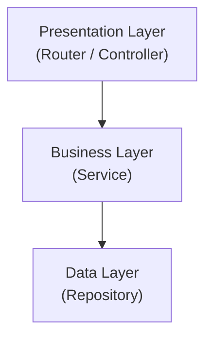
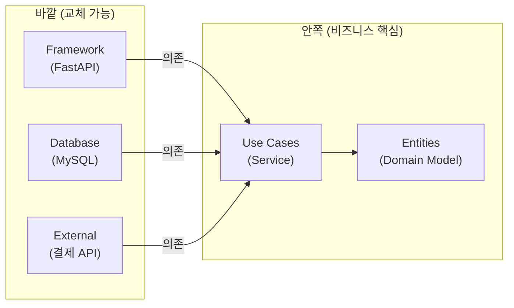

# Ch.20 SOLID와 Clean Architecture

[< 사례 - 3000줄짜리 God Class](./01-case.md) | [유사 사례와 키워드 정리 >](./03-summary.md)

---

앞에서 3,000줄짜리 God Class를 관심사별로 분리했다. 파일 수는 늘었지만 수정 범위는 줄었다. 이번에는 "왜 이렇게 분리하면 좋은지", "어떤 원칙에 따라 분리하는지"를 CS 관점에서 파고든다.


## SOLID 원칙

"관심사의 분리"를 구체적인 규칙으로 정리한 것이 SOLID 원칙이다. Robert C. Martin(Uncle Bob)이 2000년대 초반에 정리한 객체지향 설계의 5가지 원칙이다.

(출처: Martin, Robert C. "Design Principles and Design Patterns." 2000, 이후 "Agile Software Development, Principles, Patterns, and Practices" 2002에서 체계화)

5개 전부를 달달 외울 필요는 없다. 실무에서 진짜 체감이 큰 건 SRP와 DIP 두 가지다. 나머지 세 개(OCP, LSP, ISP)는 이 두 개를 제대로 지키면 자연스럽게 따라오는 경우가 많다. 그래도 한 번씩은 봐두는 게 좋다. 면접에서 물어보기도 하고, 키워드를 알아야 검색이라도 할 수 있으니까.

<details>
<summary>SOLID (솔리드 원칙)</summary>

객체지향 설계의 5가지 원칙의 머리글자다. SRP(단일 책임), OCP(개방-폐쇄), LSP(리스코프 치환), ISP(인터페이스 분리), DIP(의존성 역전). Robert C. Martin이 정리했다. 이 원칙들을 지키면 코드가 변경에 유연해지고, 테스트하기 쉬워지고, 재사용성이 높아진다. "이 다섯 개를 전부 외우는 게 중요한 게 아니라, SRP와 DIP를 제대로 이해하는 게 중요하다"는 게 이 챕터의 핵심이다.
(Java 진영에서 가장 많이 이야기되지만, Python, Go, TypeScript 등 어떤 언어에서든 적용되는 보편적인 설계 원칙이다.)

</details>


## S - SRP (Single Responsibility Principle, 단일 책임 원칙)

"하나의 클래스는 하나의 변경 이유만 가져야 한다."

이게 SOLID에서 가장 중요한 원칙이다. 앞의 God Class 사례가 정확히 SRP 위반이다.

`OrderService`의 변경 이유를 나열해보면:

1. 결제 수단이 추가될 때 → 결제 로직 변경
2. 알림 채널이 바뀔 때 → 알림 로직 변경
3. 재고 관리 정책이 바뀔 때 → 재고 로직 변경
4. 쿠폰 할인 규칙이 바뀔 때 → 쿠폰 로직 변경
5. 로깅 포맷이 바뀔 때 → 로깅 로직 변경

변경 이유가 5개다. SRP에 따르면 이 클래스는 5개로 쪼개져야 한다. 앞에서 `InventoryService`, `PaymentService`, `NotificationService`로 분리한 게 바로 SRP를 적용한 결과다.

여기서 주의할 점: SRP는 "하나의 기능만 해야 한다"가 아니다. "하나의 변경 이유만 가져야 한다"다. `PaymentService`는 결제 관련 메서드가 여러 개 있을 수 있다. charge, refund, getStatus. 하지만 변경 이유는 "결제 정책이 바뀔 때" 하나다. 그래서 SRP를 지키는 거다.

<details>
<summary>SRP (Single Responsibility Principle, 단일 책임 원칙)</summary>

"하나의 클래스는 하나의 변경 이유만 가져야 한다." Robert C. Martin이 정의했다. "기능이 하나"가 아니라 "변경 이유가 하나"라는 점에 주의해야 한다. SRP를 위반하면 한 곳을 수정할 때 관련 없는 곳이 깨지는 현상이 발생한다. SOLID에서 실무 체감이 가장 큰 원칙이다.

</details>

"그런데 '변경 이유'라는 게 모호하지 않은가? 어디까지가 하나의 변경 이유인가?"

맞다. SRP는 해석의 여지가 있다. 현실적인 기준은 이렇다: "이 클래스를 고치려는 사람이 항상 같은 사람인가?" 결제 로직을 고치는 사람과 알림 로직을 고치는 사람이 다르다면, 그 두 관심사는 분리해야 한다. 같은 사람이 같은 이유로 고치는 것들은 같은 클래스에 있어도 괜찮다.


## O - OCP (Open-Closed Principle, 개방-폐쇄 원칙)

"확장에는 열려 있고, 수정에는 닫혀 있어야 한다."

말이 좀 어렵다. 쉽게 풀면 이렇다: 새 기능을 추가할 때 기존 코드를 고치지 않아야 한다.

앞의 God Class에서 결제 수단을 추가하는 상황을 다시 보자.

OCP 위반 (기존 코드를 수정해야 한다):

```python
def charge(self, method, amount):
    if method == "card":
        return self.gateway.card.charge(amount)
    elif method == "bank_transfer":
        return self.gateway.bank.charge(amount)
    elif method == "kakao_pay":
        return self.gateway.kakao.charge(amount)
    # 토스페이 추가하려면 여기에 elif를 추가해야 한다
    # 기존 코드를 '수정'하는 거다
```

OCP 준수 (기존 코드를 수정하지 않고 확장한다):

```python
from abc import ABC, abstractmethod

class PaymentHandler(ABC):
    @abstractmethod
    def charge(self, amount: int) -> PaymentResult:
        pass

    @abstractmethod
    def refund(self, payment_id: str) -> RefundResult:
        pass


class CardPayment(PaymentHandler):
    def charge(self, amount):
        # 카드 결제 로직
        ...

    def refund(self, payment_id):
        # 카드 환불 로직
        ...


class TossPayment(PaymentHandler):
    def charge(self, amount):
        # 토스페이 결제 로직 (새 파일을 추가하면 된다)
        ...

    def refund(self, payment_id):
        # 토스페이 환불 로직
        ...


class PaymentService:
    def __init__(self):
        self.handlers: dict[str, PaymentHandler] = {}

    def register(self, method: str, handler: PaymentHandler):
        self.handlers[method] = handler

    def charge(self, method: str, amount: int) -> PaymentResult:
        handler = self.handlers.get(method)
        if not handler:
            raise UnsupportedPaymentError(method)
        return handler.charge(amount)
```

토스페이를 추가할 때: `TossPayment` 클래스를 새로 만들고, `payment_service.register("toss_pay", TossPayment())`를 호출한다. `PaymentService` 코드 자체는 한 줄도 수정하지 않았다. 기존 코드를 "수정"한 게 아니라 새 코드를 "추가"한 거다.

이게 바로 "확장에 열려 있고, 수정에 닫혀 있다"는 의미다.

(Java에서는 이 패턴을 Strategy Pattern이라고 부른다. Python에서는 dict + ABC, 또는 프로토콜(Protocol)로 같은 구조를 만든다.)

<details>
<summary>OCP (Open-Closed Principle, 개방-폐쇄 원칙)</summary>

"소프트웨어 개체(클래스, 모듈, 함수)는 확장에는 열려 있고 수정에는 닫혀 있어야 한다." 1988년 Bertrand Meyer가 처음 제시하고, Robert C. Martin이 SOLID에 포함시켰다. 새 기능을 추가할 때 기존 코드를 수정하면 기존 기능이 깨질 위험이 있다. 추상 클래스(ABC)나 인터페이스를 사용해서 확장 포인트를 만들면, 기존 코드를 건드리지 않고 새 구현을 추가할 수 있다.
(Strategy Pattern, Template Method Pattern 등이 OCP를 실현하는 대표적인 디자인 패턴이다.)

</details>

<details>
<summary>Strategy Pattern (전략 패턴)</summary>

알고리즘을 인터페이스로 추상화하고, 구체적인 구현을 런타임에 교체할 수 있게 하는 디자인 패턴이다. 위의 결제 수단 예시에서 `PaymentHandler`가 전략 인터페이스, `CardPayment`/`TossPayment`가 구체적인 전략이다. if/elif 분기를 없애고 OCP를 실현하는 가장 흔한 방법이다.

</details>


## L - LSP (Liskov Substitution Principle, 리스코프 치환 원칙)

"자식 클래스는 부모 클래스를 대체할 수 있어야 한다."

Barbara Liskov가 1987년에 제시한 원칙이다. 위의 결제 예시에서 `CardPayment`과 `TossPayment`가 `PaymentHandler`를 상속받았다. `PaymentService`는 `PaymentHandler` 타입만 알고 있다. 어떤 구체 클래스가 들어오든 동작이 달라지면 안 된다.

(출처: Liskov, Barbara H. "Data Abstraction and Hierarchy." ACM SIGPLAN Notices, 1987)

LSP 위반의 전형적인 사례:

```python
class PaymentHandler(ABC):
    @abstractmethod
    def charge(self, amount: int) -> PaymentResult:
        pass

class FreeTrialPayment(PaymentHandler):
    def charge(self, amount: int) -> PaymentResult:
        # 무료 체험이라 결제를 안 한다
        raise NotImplementedError("무료 체험은 결제가 불필요합니다")
```

`FreeTrialPayment`는 `PaymentHandler`를 상속받았지만, `charge()`를 호출하면 에러가 난다. 부모를 대체할 수 없다. 이건 LSP 위반이다. "무료 체험"은 "결제"가 아니니까 `PaymentHandler`를 상속받으면 안 된다.

솔직히 LSP는 SOLID 5개 중에서 실무에서 가장 덜 체감되는 원칙이다. 왜냐하면 Python은 Duck Typing 언어라서, 정적 타입 기반의 상속 계층을 엄격하게 쓰는 경우가 상대적으로 적기 때문이다. 그래도 "인터페이스를 구현한 클래스가 그 인터페이스의 계약을 깨면 안 된다"는 원칙은 언어에 상관없이 중요하다.

<details>
<summary>LSP (Liskov Substitution Principle, 리스코프 치환 원칙)</summary>

"S가 T의 하위 타입이면, T 타입 객체를 S 타입 객체로 대체해도 프로그램의 정확성이 변하지 않아야 한다." 1987년 Barbara Liskov가 제시했다. 쉽게 말하면, 부모 클래스를 쓰는 곳에 자식 클래스를 넣어도 동작이 깨지면 안 된다. 위반하면 다형성이 무너진다.
(Python에서는 Duck Typing 때문에 상속보다 프로토콜(Protocol)을 쓰는 경향이 있지만, "인터페이스의 계약을 지킨다"는 원칙은 동일하게 적용된다.)

</details>


## I - ISP (Interface Segregation Principle, 인터페이스 분리 원칙)

"클라이언트가 사용하지 않는 메서드에 의존하지 않아야 한다."

뚱뚱한 인터페이스를 만들면 어떻게 되는지 보자.

ISP 위반 (하나의 거대 인터페이스):

```python
class OrderRepository(ABC):
    @abstractmethod
    def create_order(self, order): ...

    @abstractmethod
    def get_order(self, order_id): ...

    @abstractmethod
    def update_order(self, order): ...

    @abstractmethod
    def delete_order(self, order_id): ...

    @abstractmethod
    def get_order_statistics(self, start_date, end_date): ...

    @abstractmethod
    def export_orders_to_csv(self, path): ...

    @abstractmethod
    def sync_orders_to_warehouse(self): ...
```

주문 조회만 필요한 클래스가 이 인터페이스를 구현하려면? `create_order`, `delete_order`, `export_orders_to_csv`, `sync_orders_to_warehouse`까지 전부 구현해야 한다. 쓰지도 않는 메서드를.

ISP 준수 (필요한 것만 분리):

```python
class OrderReader(ABC):
    @abstractmethod
    def get_order(self, order_id): ...

class OrderWriter(ABC):
    @abstractmethod
    def create_order(self, order): ...

    @abstractmethod
    def update_order(self, order): ...

class OrderExporter(ABC):
    @abstractmethod
    def export_orders_to_csv(self, path): ...
```

주문 조회만 필요하면 `OrderReader`만 의존하면 된다. 주문 생성/수정이 필요하면 `OrderWriter`를 추가한다. 내보내기가 필요하면 `OrderExporter`를 추가한다. 각 클라이언트가 자기가 쓰는 것만 알면 된다.

(이건 Ch.16에서 다뤘던 CQRS(Command Query Responsibility Segregation)와도 통하는 이야기다. 읽기와 쓰기를 분리하는 게 ISP의 가장 흔한 적용 사례다.)

<details>
<summary>ISP (Interface Segregation Principle, 인터페이스 분리 원칙)</summary>

"클라이언트는 자신이 사용하지 않는 인터페이스에 의존하지 않아야 한다." 뚱뚱한 인터페이스 하나보다 작고 구체적인 인터페이스 여러 개가 낫다. Python에서는 ABC(Abstract Base Class)나 Protocol을 사용해서 인터페이스를 정의한다.
(Java에서는 interface 키워드로, Go에서는 implicit interface로 같은 원칙을 적용한다.)

</details>


## D - DIP (Dependency Inversion Principle, 의존성 역전 원칙)

"상위 모듈이 하위 모듈에 의존하면 안 된다. 둘 다 추상에 의존해야 한다."

이게 SRP 다음으로 중요한 원칙이다. 이 원칙에서 DI(Dependency Injection)와 IoC(Inversion of Control)가 파생된다.

DIP 위반 (상위가 하위에 직접 의존):

```python
class OrderService:
    def __init__(self):
        # 직접 생성한다. OrderService가 MySQLRepository를 "안다"
        self.repo = MySQLOrderRepository()
        self.payment = KakaoPayGateway()
        self.notification = EmailNotifier()
```

이 코드의 문제: `OrderService`가 `MySQLOrderRepository`를 직접 만든다. MySQL을 PostgreSQL로 바꾸려면? `OrderService` 코드를 수정해야 한다. 결제를 카카오페이에서 토스페이로 바꾸려면? 역시 `OrderService`를 수정해야 한다.

"주문 서비스"가 "MySQL", "카카오페이", "이메일"이라는 구체적인 구현에 묶여 있다. 상위 모듈(OrderService)이 하위 모듈(MySQL, 카카오페이)에 의존하고 있는 거다.

DIP 준수 (추상에 의존):

```python
class OrderRepository(ABC):
    """추상 - 인터페이스만 정의"""
    @abstractmethod
    def save(self, order): ...

    @abstractmethod
    def find_by_id(self, order_id): ...


class MySQLOrderRepository(OrderRepository):
    """구현 - MySQL 전용"""
    def save(self, order):
        self.session.add(order)
        self.session.commit()

    def find_by_id(self, order_id):
        return self.session.query(Order).filter(Order.id == order_id).first()


class OrderService:
    def __init__(self, repo: OrderRepository):
        # 추상 타입만 알고 있다.
        # MySQL인지 PostgreSQL인지 모른다. 알 필요도 없다.
        self.repo = repo
```

`OrderService`는 `OrderRepository`(추상)에만 의존한다. MySQL인지 PostgreSQL인지 모른다. 나중에 PostgreSQL로 바꾸려면? `PostgreSQLOrderRepository`를 만들고, `OrderService`를 생성할 때 그걸 넣어주면 된다. `OrderService` 코드는 한 줄도 안 바뀐다.

이 "넣어준다"는 행위가 바로 DI(Dependency Injection, 의존성 주입)다.

<details>
<summary>DIP (Dependency Inversion Principle, 의존성 역전 원칙)</summary>

"상위 모듈이 하위 모듈에 의존하면 안 된다. 둘 다 추상에 의존해야 한다." SOLID의 마지막이자 SRP 다음으로 실무 체감이 큰 원칙이다. 구체적인 구현(MySQL, Redis, 카카오페이)에 직접 의존하면, 그 구현을 바꿀 때 상위 로직도 수정해야 한다. 추상(인터페이스)에 의존하면, 구현만 교체하면 된다.
(Python에서는 ABC나 Protocol로 추상을 정의한다. Java에서는 interface, Go에서는 implicit interface.)

</details>


## DI와 IoC

### DI (Dependency Injection, 의존성 주입)

의존성을 클래스 내부에서 직접 만들지 않고, 외부에서 넣어주는 패턴이다.

```python
# DI 없음 - 직접 생성
class OrderService:
    def __init__(self):
        self.repo = MySQLOrderRepository()  # 직접 만든다

# DI 있음 - 외부에서 주입
class OrderService:
    def __init__(self, repo: OrderRepository):  # 밖에서 받는다
        self.repo = repo
```

외부에서 받으면 뭐가 좋은가?

1. 테스트할 때 가짜 객체(Mock)를 넣을 수 있다. (Ch.21에서 자세히 다룬다.)
2. MySQL을 PostgreSQL로 교체할 때 `OrderService`를 수정하지 않아도 된다.
3. 의존성이 명시적으로 보인다. `__init__`만 보면 이 클래스가 뭘 필요로 하는지 알 수 있다.

<details>
<summary>DI (Dependency Injection, 의존성 주입)</summary>

클래스가 필요로 하는 의존성을 외부에서 주입하는 설계 패턴이다. 생성자 주입(Constructor Injection), 세터 주입(Setter Injection), 인터페이스 주입 세 가지 방식이 있는데, 생성자 주입이 가장 권장된다. DIP를 실현하는 구체적인 기법이다. FastAPI의 `Depends()`가 DI의 실제 구현이다.
(Java의 Spring은 @Autowired로, Python의 FastAPI는 Depends()로, Go는 보통 생성자 함수에서 DI를 수행한다.)

</details>

### FastAPI의 Depends()

FastAPI를 쓰고 있다면 이미 DI를 쓰고 있는 거다. `Depends()`가 바로 DI 메커니즘이다.

```python
from fastapi import Depends
from sqlalchemy.orm import Session

def get_db():
    db = SessionLocal()
    try:
        yield db
    finally:
        db.close()

def get_order_repository(db: Session = Depends(get_db)):
    return MySQLOrderRepository(db)

def get_order_service(repo: OrderRepository = Depends(get_order_repository)):
    return OrderService(repo)

@router.post("/orders")
def create_order(
    request: CreateOrderRequest,
    service: OrderService = Depends(get_order_service),
):
    return service.create_order(request)
```

`create_order` 함수는 `OrderService`가 필요하다. FastAPI가 자동으로 `get_order_service`를 호출하고, 그 안에서 `get_order_repository`를 호출하고, 그 안에서 `get_db`를 호출한다. 의존성 체인이 자동으로 해결된다.

이 자동 해결을 해주는 주체, 즉 "누가 의존성을 조립하는가"의 제어가 개발자에서 프레임워크로 넘어간다. 이것이 IoC(Inversion of Control, 제어의 역전)다.

### IoC (Inversion of Control, 제어의 역전)

보통 코드에서는 개발자가 직접 객체를 만들고, 연결하고, 실행한다. IoC에서는 프레임워크가 그 일을 대신 한다.

```python
# IoC 없음 - 개발자가 직접 조립
db = SessionLocal()
repo = MySQLOrderRepository(db)
payment = PaymentService(KakaoPayGateway())
notification = NotificationService(EmailClient(), SMSClient(), PushClient())
service = OrderService(repo, payment, notification)
result = service.create_order(request)

# IoC 있음 - 프레임워크(FastAPI)가 조립
@router.post("/orders")
def create_order(
    request: CreateOrderRequest,
    service: OrderService = Depends(get_order_service),  # FastAPI가 조립해준다
):
    return service.create_order(request)
```

개발자는 "이 함수는 OrderService가 필요하다"고 선언만 한다. 실제로 만들고 연결하는 건 FastAPI(프레임워크)의 몫이다.

"제어"가 "역전"됐다. 개발자가 하던 일(객체 생성, 조립)을 프레임워크가 대신한다. 이게 IoC다.

<details>
<summary>IoC (Inversion of Control, 제어의 역전)</summary>

프로그램의 제어 흐름을 개발자가 아닌 프레임워크가 관리하는 설계 원칙이다. 개발자는 "무엇이 필요한가"를 선언하고, 프레임워크가 "어떻게 조립할 것인가"를 결정한다. DI는 IoC를 실현하는 구체적인 기법 중 하나다. 헐리우드 원칙(Hollywood Principle)이라고도 불린다: "Don't call us, we'll call you."
(Java의 Spring IoC Container, Python의 FastAPI Depends, Go의 Wire/Fx 등이 IoC를 제공한다.)

</details>


## 아키텍처 패턴

SOLID를 개별 클래스 수준의 원칙이라고 하면, 아키텍처 패턴은 시스템 전체 수준의 구조다. "클래스를 어떻게 설계할 것인가"가 SOLID라면, "클래스들을 어떤 계층으로 배치할 것인가"가 아키텍처다.

### Layered Architecture (계층형 아키텍처)

가장 기본적인 아키텍처 패턴이다. 코드를 역할별 계층으로 나눈다.



- Presentation Layer: HTTP 요청/응답 처리. FastAPI의 라우터가 여기에 해당한다.
- Business Layer: 비즈니스 로직. `OrderService`, `PaymentService`가 여기다.
- Data Layer: DB 접근. `OrderRepository`가 여기다.

규칙은 하나다: 위에서 아래로만 호출한다. Presentation이 Business를 호출하고, Business가 Data를 호출한다. 반대 방향(Data가 Business를 호출)은 안 된다.

FastAPI에서 이미 이 구조를 쓰고 있을 확률이 높다. `routers/` 폴더가 Presentation, `service/` 폴더가 Business, `repository/` 폴더가 Data.

<details>
<summary>Layered Architecture (계층형 아키텍처)</summary>

코드를 Presentation(표현) → Business(비즈니스) → Data(데이터) 계층으로 분리하는 패턴이다. 각 계층은 바로 아래 계층에만 의존한다. 가장 단순하고 널리 쓰이는 아키텍처 패턴이다. 단점은 모든 요청이 모든 계층을 거쳐야 해서, 단순한 CRUD에서는 불필요한 코드가 늘어날 수 있다.
(Spring의 Controller-Service-Repository, Django의 View-Service-Model, FastAPI의 Router-Service-Repository가 전부 이 패턴이다.)

</details>

### Clean Architecture (클린 아키텍처)

Layered Architecture의 문제점: Business Layer가 Data Layer에 의존한다. `OrderService`가 `MySQLOrderRepository`를 직접 알고 있으면, MySQL을 바꿀 때 Business Layer도 바뀌어야 한다.

Clean Architecture는 의존성 방향을 뒤집는다. 안쪽 원이 바깥쪽 원을 모르게 만든다.



핵심 규칙: 의존성은 항상 안쪽으로만 향한다. 바깥의 Framework, Database, External API가 안쪽의 Use Cases와 Entities에 의존하지, 그 반대가 아니다.

이게 앞에서 DIP를 적용한 것과 같다. `OrderService`(Use Case)가 `OrderRepository`(추상)에 의존하고, `MySQLOrderRepository`(바깥)가 `OrderRepository`(추상)를 구현한다. `OrderService`는 MySQL을 모른다.

Robert C. Martin이 2012년에 블로그에서 제안하고, 2017년 "Clean Architecture" 책에서 체계화했다.

(출처: Martin, Robert C. "Clean Architecture: A Craftsman's Guide to Software Structure and Design." Prentice Hall, 2017)

<details>
<summary>Clean Architecture (클린 아키텍처)</summary>

Robert C. Martin이 제안한 아키텍처 패턴으로, 의존성이 항상 안쪽(비즈니스 핵심)으로만 향하게 설계한다. 안쪽 원(Entities, Use Cases)은 바깥쪽 원(Framework, DB, UI)을 모른다. 바깥쪽을 교체해도 안쪽이 바뀌지 않는다. DIP를 시스템 전체에 적용한 것이라고 볼 수 있다.
(Hexagonal Architecture(포트와 어댑터), Onion Architecture와 핵심 아이디어가 같다. 이름은 다르지만 "의존성 방향을 안쪽으로"라는 원칙은 동일하다.)

</details>

### Hexagonal Architecture (포트와 어댑터)

Clean Architecture와 핵심은 같다. 이름만 다르다. Alistair Cockburn이 2005년에 제안했다. "포트"가 인터페이스(추상)이고, "어댑터"가 구현이다.

```
포트: OrderRepository (인터페이스)
어댑터: MySQLOrderRepository (MySQL 구현)
어댑터: PostgreSQLOrderRepository (PostgreSQL 구현)
어댑터: InMemoryOrderRepository (테스트용)
```

이번 챕터에서는 깊이 들어가지 않는다. "Clean Architecture, Hexagonal Architecture, Onion Architecture는 이름이 다르지만 핵심은 같다: 의존성을 안쪽으로만 향하게 하라"는 것만 기억하면 된다.


## 다시 돌아와서: 이 원칙들이 왜 중요한가

SOLID 5개를 전부 외우는 게 중요한 게 아니다. 핵심은 두 가지다:

1. SRP: 하나의 클래스에 변경 이유가 여러 개면, 분리한다.
2. DIP: 구체적인 구현에 직접 의존하지 않고, 추상에 의존한다.

이 두 개를 지키면:

- 코드 수정 시 영향 범위가 줄어든다. (SRP)
- 구현 교체가 쉬워진다. MySQL → PostgreSQL, 이메일 → 카카오톡. (DIP)
- 테스트가 쉬워진다. 추상에 의존하니까 가짜 구현을 넣을 수 있다. (DI → Ch.21)

나머지 세 개(OCP, LSP, ISP)는 이 두 개를 제대로 적용하다 보면 자연스럽게 따라온다. SRP를 지키면 클래스가 작아지고 (ISP를 지키기 쉬워지고), DIP를 지키면 추상에 의존하게 되고 (OCP, LSP를 지키기 쉬워진다).

"SOLID를 다 외웠는가?"가 중요한 게 아니다. "내 코드에서 변경 이유가 여러 개인 클래스가 있는가?"를 찾을 수 있는 눈이 중요하다.

---

[< 사례 - 3000줄짜리 God Class](./01-case.md) | [유사 사례와 키워드 정리 >](./03-summary.md)
