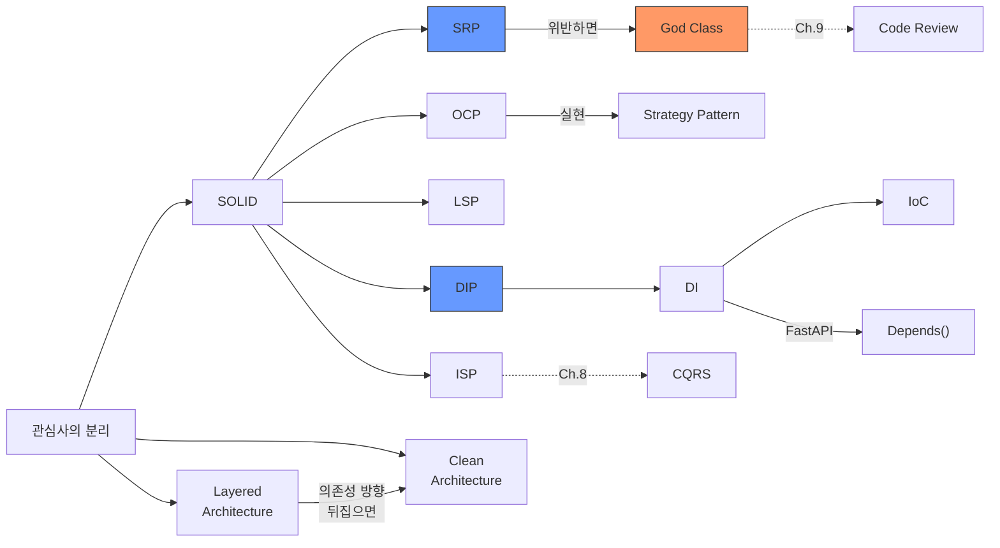

# Ch.20 유사 사례와 키워드 정리

[< SOLID와 Clean Architecture](./02-solid-architecture.md)

---

앞에서 God Class가 왜 문제인지, SOLID 원칙으로 어떻게 분리하는지, DI/IoC가 뭔지, 아키텍처 패턴이 왜 필요한지 확인했다. 같은 원리가 적용되는 실무 사례를 몇 가지 더 본다.


## 20-5. 유사 사례

### Django의 views.py 비대화

Django 프로젝트를 하다 보면 `views.py` 하나가 점점 커진다. 처음에는 깔끔한 5줄짜리 뷰 함수였는데, 비즈니스 로직이 추가되고, 권한 체크가 들어가고, 캐시 로직이 붙고, 외부 API 호출이 추가되면서 한 함수가 200줄이 된다. 이걸 10개의 뷰 함수가 반복하면 2,000줄짜리 views.py가 탄생한다.

Django에서의 관심사 분리: views.py는 HTTP 요청/응답만 처리한다 (Presentation). 비즈니스 로직은 `services.py`로 분리한다. DB 접근은 `repositories.py` 또는 Django ORM의 Manager/QuerySet으로 분리한다.

```python
# views.py - Presentation만
class OrderView(APIView):
    def post(self, request):
        service = OrderService()
        order = service.create_order(request.data)
        return Response(OrderSerializer(order).data)

# services.py - Business 로직
class OrderService:
    def create_order(self, data):
        # 비즈니스 로직
        ...
```

Django에서 "Fat Model, Thin View"라는 격언이 있는데, 사실 Model도 너무 뚱뚱하면 안 된다. Model은 데이터 정의와 간단한 도메인 로직만, 복잡한 비즈니스 로직은 Service로 분리하는 게 맞다.


### Spring의 Service 레이어 비대화

Java Spring 진영에서도 같은 문제가 발생한다. `@Service` 붙은 클래스 하나가 1,000줄이 넘고, `@Autowired`가 10개 이상 달려 있다.

(Python에서 FastAPI를 쓰는 사람에게도 해당되는 이야기다. 언어는 다르지만 구조적 문제는 동일하다.)

Spring에서의 전형적인 God Service:

```
OrderService
├── @Autowired OrderRepository
├── @Autowired PaymentRepository
├── @Autowired NotificationService
├── @Autowired CouponService
├── @Autowired PointService
├── @Autowired RedisTemplate
├── @Autowired KafkaTemplate
└── ... 10개 이상
```

`@Autowired`가 7개 이상이면 SRP 위반을 의심해봐야 한다는 것이 Spring 커뮤니티의 경험적 기준이다.

해결 방법도 동일하다: 관심사별로 서비스를 분리하고, DI로 조립한다.


### FastAPI 라우터 비대화

FastAPI에서도 라우터 파일 하나가 비대해지는 경우가 많다. 처음에는 `main.py`에 라우터를 몇 개 넣다가, 기능이 늘면서 라우터 파일 하나가 수백 줄이 된다.

이 프로젝트(`csbe-study`)의 구조를 보면, 이미 라우터를 챕터별로 분리해놨다. `routers/ch02_printer.py`, `routers/ch05_concurrency.py` 등. 이것도 관심사 분리의 한 형태다. 챕터(주제)가 다르면 파일을 분리한다.

실무에서는 "기능 도메인"으로 분리하는 게 일반적이다:

```
routers/
  order.py         # 주문 관련 엔드포인트
  payment.py       # 결제 관련 엔드포인트
  user.py          # 사용자 관련 엔드포인트
  notification.py  # 알림 관련 엔드포인트
```

라우터가 두꺼워지면? 라우터 안에 비즈니스 로직이 들어가 있을 확률이 높다. 라우터는 요청/응답 처리만 해야 한다. 로직은 서비스로 빼야 한다.


## 그래서 실무에서는 어떻게 하는가

### 1. 파일 분리 기준: 변경 이유가 다르면 분리한다

"어디서 자르는가"가 가장 많이 받는 질문이다. 답은 SRP에 있다: 변경 이유가 다르면 분리한다.

| 변경 이유 | 분리되어야 할 모듈 |
|-----------|-------------------|
| 결제 수단이 추가될 때 | PaymentService |
| 알림 채널이 바뀔 때 | NotificationService |
| 재고 관리 정책이 바뀔 때 | InventoryService |
| DB 종류가 바뀔 때 | Repository |
| HTTP 응답 형식이 바뀔 때 | Router / Serializer |

"잘 모르겠으면 일단 한 파일에 쓰고, 나중에 분리해도 된다." 처음부터 과도하게 쪼개면 오히려 복잡해진다. 파일이 300줄을 넘거나, `__init__`의 매개변수가 5개를 넘기면 그때 분리를 고려하면 된다. 이건 절대적인 기준이 아니라 경험적 기준이다.


### 2. 의존성 방향: 항상 한 방향으로만

```
Router → Service → Repository
  (O)      (O)        (X)
                    Repository → Service (이건 안 된다)
```

계층 간 순환 의존이 생기면 수정 시 영향 범위가 급격히 커진다. A가 B를 호출하고 B가 A를 호출하면, A를 고칠 때 B도 확인해야 하고, B를 고칠 때 A도 확인해야 한다.

의존성이 순환하는지 확인하는 간단한 방법: import를 따라가본다.

```python
# order_service.py
from repositories.order_repository import OrderRepository  # OK

# order_repository.py
from services.order_service import OrderService  # NG! 순환 의존
```

이런 순환이 발견되면, 공통 인터페이스를 별도 모듈로 빼서 둘 다 그 인터페이스에 의존하게 만든다.


### 3. 리팩토링 순서: 한 번에 다 바꾸지 않는다

God Class를 한 번에 10개 파일로 쪼개면 위험하다. 버그가 생겨도 어디서 생겼는지 알 수 없다.

단계적으로 한다:

```
1단계: 가장 독립적인 관심사를 먼저 분리한다 (보통 알림, 로깅)
  → 기존 테스트가 통과하는지 확인

2단계: 다음으로 독립적인 관심사를 분리한다 (결제, 재고)
  → 기존 테스트가 통과하는지 확인

3단계: 나머지를 분리한다
  → 기존 테스트가 통과하는지 확인
```

한 번에 하나의 관심사만 분리하고, 매번 테스트를 돌린다. (테스트가 없다면? Ch.21에서 이야기한다.)


### 4. FastAPI에서의 DI 패턴

FastAPI를 쓴다면 `Depends()`를 적극 활용한다.

```python
# dependencies.py
from fastapi import Depends
from sqlalchemy.orm import Session

def get_db():
    db = SessionLocal()
    try:
        yield db
    finally:
        db.close()

def get_order_repository(db: Session = Depends(get_db)):
    return OrderRepository(db)

def get_payment_service():
    return PaymentService(gateway=PaymentGateway())

def get_order_service(
    repo: OrderRepository = Depends(get_order_repository),
    payment: PaymentService = Depends(get_payment_service),
):
    return OrderService(repo=repo, payment=payment)
```

```python
# routers/order.py
from dependencies import get_order_service

@router.post("/orders")
def create_order(
    request: CreateOrderRequest,
    service: OrderService = Depends(get_order_service),
):
    return service.create_order(request)
```

이 구조의 장점:
- 라우터가 서비스의 생성 방법을 모른다 (IoC)
- 테스트할 때 `Depends()`를 오버라이드해서 가짜 서비스를 넣을 수 있다 (Ch.21)
- 의존성이 함수 시그니처에 명시적으로 드러난다


## 오늘의 키워드 정리

코드 구조가 왜 중요한지, 어떤 원칙으로 분리하는지를 키워드로 정리한다.

### 새 키워드

<details>
<summary>God Class (갓 클래스)</summary>

너무 많은 책임을 가진 거대 클래스다. "신처럼 모든 것을 다 하는 클래스"라는 뜻이다. SRP를 위반한 대표적인 안티 패턴이다. 변경 이유가 여러 개이고, 의존성이 과도하고, 코드 중복이 많고, 테스트하기 어렵다. 파일이 1,000줄을 넘거나 `__init__` 매개변수가 7개를 넘으면 의심해봐야 한다.

</details>

<details>
<summary>SOLID (솔리드 원칙)</summary>

객체지향 설계의 5가지 원칙의 머리글자다. SRP(단일 책임), OCP(개방-폐쇄), LSP(리스코프 치환), ISP(인터페이스 분리), DIP(의존성 역전). Robert C. Martin이 정리했다. 전부 외우는 것보다 SRP와 DIP를 제대로 이해하는 게 중요하다.

</details>

<details>
<summary>SRP (Single Responsibility Principle, 단일 책임 원칙)</summary>

"하나의 클래스는 하나의 변경 이유만 가져야 한다." SOLID에서 실무 체감이 가장 큰 원칙이다. "기능이 하나"가 아니라 "변경 이유가 하나"라는 점이 핵심이다. 위반하면 한 곳을 수정할 때 관련 없는 곳이 깨진다.

</details>

<details>
<summary>OCP (Open-Closed Principle, 개방-폐쇄 원칙)</summary>

"확장에는 열려 있고 수정에는 닫혀 있어야 한다." 새 기능을 추가할 때 기존 코드를 수정하지 않아야 한다. 추상 클래스(ABC)나 인터페이스를 사용해서 확장 포인트를 만든다. Strategy Pattern이 대표적인 실현 방법이다.

</details>

<details>
<summary>LSP (Liskov Substitution Principle, 리스코프 치환 원칙)</summary>

"자식 클래스는 부모 클래스를 대체할 수 있어야 한다." 1987년 Barbara Liskov가 제시했다. 인터페이스를 구현한 클래스가 그 인터페이스의 계약을 깨면 안 된다. Python에서는 Duck Typing 때문에 상대적으로 덜 체감되지만, 원칙 자체는 언어에 상관없이 유효하다.

</details>

<details>
<summary>ISP (Interface Segregation Principle, 인터페이스 분리 원칙)</summary>

"클라이언트는 자신이 사용하지 않는 인터페이스에 의존하지 않아야 한다." 뚱뚱한 인터페이스 하나보다 작고 구체적인 인터페이스 여러 개가 낫다. CQRS(읽기/쓰기 분리)가 ISP의 대표적인 적용 사례다.

</details>

<details>
<summary>DIP (Dependency Inversion Principle, 의존성 역전 원칙)</summary>

"상위 모듈이 하위 모듈에 의존하면 안 된다. 둘 다 추상에 의존해야 한다." SRP 다음으로 실무 체감이 큰 원칙이다. 구체 구현(MySQL, 카카오페이)에 직접 의존하면 교체가 어렵다. 추상(인터페이스)에 의존하면 구현만 바꾸면 된다. DI와 IoC가 이 원칙을 실현하는 기법이다.

</details>

<details>
<summary>DI (Dependency Injection, 의존성 주입)</summary>

클래스가 필요로 하는 의존성을 외부에서 주입하는 설계 패턴이다. 생성자 주입이 가장 권장된다. DIP를 실현하는 구체적인 기법이다. FastAPI의 `Depends()`가 DI 메커니즘이다.
(Java의 Spring @Autowired, Go의 생성자 함수 패턴도 같은 개념이다.)

</details>

<details>
<summary>IoC (Inversion of Control, 제어의 역전)</summary>

프로그램의 제어 흐름을 개발자가 아닌 프레임워크가 관리하는 설계 원칙이다. 개발자는 "무엇이 필요한가"를 선언하고, 프레임워크가 "어떻게 조립할 것인가"를 결정한다. DI는 IoC를 실현하는 기법 중 하나다.
(헐리우드 원칙: "Don't call us, we'll call you.")

</details>

<details>
<summary>관심사의 분리 (Separation of Concerns)</summary>

프로그램을 서로 다른 관심사(concern)별로 나누는 설계 원칙이다. 1974년 Dijkstra가 제시했다. 결제와 알림은 서로 다른 관심사다. 분리하면 한쪽을 수정할 때 다른 쪽을 건드릴 필요가 없다. SOLID, 아키텍처 패턴 전부 이 원칙의 구체화다.

</details>

<details>
<summary>Layered Architecture (계층형 아키텍처)</summary>

Presentation → Business → Data 계층으로 코드를 분리하는 패턴이다. 각 계층은 바로 아래 계층에만 의존한다. 가장 단순하고 널리 쓰이는 아키텍처. FastAPI의 Router → Service → Repository가 이 구조다.

</details>

<details>
<summary>Clean Architecture (클린 아키텍처)</summary>

의존성이 항상 안쪽(비즈니스 핵심)으로만 향하게 설계하는 아키텍처 패턴이다. 2017년 Robert C. Martin이 체계화했다. Hexagonal Architecture, Onion Architecture와 핵심 아이디어가 같다: "바깥(프레임워크, DB)을 교체해도 안쪽(비즈니스 로직)이 바뀌지 않게 하라."

</details>

<details>
<summary>Strategy Pattern (전략 패턴)</summary>

알고리즘을 인터페이스로 추상화하고, 구체 구현을 런타임에 교체할 수 있게 하는 디자인 패턴이다. if/elif 분기를 없애고 OCP를 실현하는 가장 흔한 방법이다. 결제 수단, 알림 채널, 할인 정책 등 "같은 역할을 다른 방식으로 수행"하는 경우에 사용한다.

</details>


### 재등장 키워드

| 키워드 | 최초 등장 | 이번 챕터에서의 역할 |
|--------|----------|-------------------|
| YAGNI | Ch.9 | 과도한 분리를 경계. "필요할 때 분리하라" |
| Code Review | Ch.9 | God Class를 발견하는 주요 수단 |
| CQRS | Ch.8 | ISP의 대표적 적용 사례: 읽기/쓰기 인터페이스 분리 |


### 키워드 연관 관계




## 다음에 이어지는 이야기

이번 챕터에서 코드를 관심사별로 분리하는 원칙과 방법을 다뤘다. God Class를 여러 서비스로 쪼개고, DI로 조립하고, 계층 구조로 배치했다.

코드를 분리했다. 그런데 이게 제대로 동작하는지 어떻게 검증하는가? 분리 전에는 3,000줄 전체를 테스트해야 했는데, 분리 후에는 어떻게 테스트하는가? 테스트를 짜라고 했더니 전부 Mock으로 도배된 테스트가 나온다. Mock으로만 통과한 테스트가 운영에서 터진다면?

Ch.21에서 테스트 전략을 다룬다. Unit Test, Integration Test, E2E Test의 경계. 그리고 DI가 테스트를 어떻게 쉽게 만드는지.

---

[< SOLID와 Clean Architecture](./02-solid-architecture.md)

[< Ch.19 Replica를 200개로 늘려볼까요?](../ch19/README.md) | [Ch.21 테스트를 짜라고 했더니 전부 Mocking입니다 >](../ch21/README.md)
