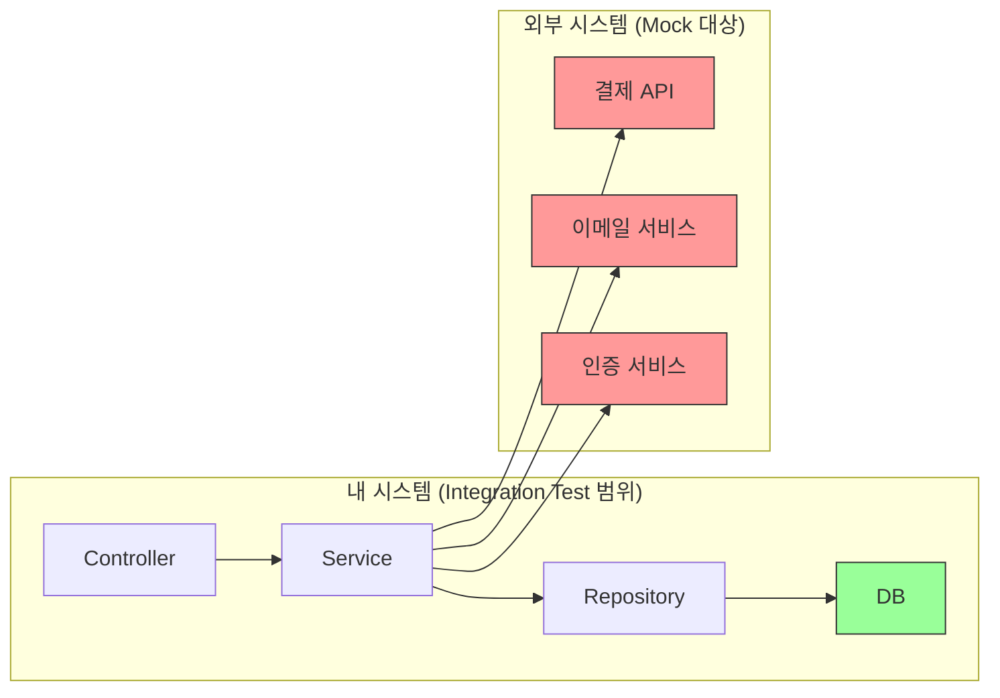

# Ch.21 테스트 전략과 경계

[< 사례: Mock으로만 통과한 테스트](./01-case.md) | [유사 사례와 키워드 정리 >](./03-summary.md)

---

앞에서 Mock으로만 작성한 테스트가 운영 장애를 막지 못하는 사례를 봤다. 이번에는 "어떤 테스트를 얼마나 짜야 하는가"를 CS 관점에서 파고든다.


## Test Pyramid: 어디에 몇 개를 짜야 하는가

Martin Fowler가 정리한 Test Pyramid라는 개념이 있다.

(출처: Fowler, Martin. "TestPyramid." martinfowler.com, 2012)

```
        /  E2E  \          적게, 비싸고, 느리다
       /----------\
      / Integration \      적당히, 실제 연동 확인
     /----------------\
    /    Unit Tests     \  많이, 빠르고, 싸다
   /--------------------\
```

아래에서 위로 갈수록 테스트 하나의 비용(시간, 복잡도, 유지보수)이 올라간다. 아래에서 위로 갈수록 검증 범위가 넓어진다.

<details>
<summary>Test Pyramid (테스트 피라미드)</summary>

Martin Fowler가 정리한 테스트 전략 모델이다. Unit Test를 가장 많이, Integration Test를 적당히, E2E Test를 가장 적게 작성하는 게 이상적이라는 구조다. 핵심은 "비용 대비 효과"다. Unit Test는 빠르고 싸지만 범위가 좁다. E2E Test는 범위가 넓지만 느리고 깨지기 쉽다. 피라미드가 뒤집히면(E2E가 많고 Unit이 적으면) 테스트가 느리고, 실패 원인 파악이 어렵고, 유지보수가 고통스러워진다.
(출처: Fowler, Martin. "TestPyramid." martinfowler.com, 2012)

</details>

각 층이 뭘 검증하는지 구체적으로 보자.

| 층 | 뭘 검증하는가 | 속도 | 예시 |
|----|-------------|------|------|
| Unit Test | 함수/메서드의 로직 | 빠르다 (ms) | `calculate_total()`이 가격을 올바르게 계산하는가 |
| Integration Test | 모듈 간 연동 | 보통 (수백ms~수초) | Service + Repository + DB가 함께 동작하는가 |
| E2E Test | 사용자 시나리오 전체 | 느리다 (수초~수분) | 회원가입 → 로그인 → 주문 → 결제까지 전체 플로우 |

앞의 사례에서 문제가 뭐였는가? Unit Test만 있고 Integration Test가 없었다. DB 연동 코드가 실제 DB를 한 번도 거치지 않은 거다.

"그러면 Integration Test만 잔뜩 짜면 되는 거 아닌가?"

안 된다. Integration Test는 느리다. DB를 띄우고, 데이터를 넣고, 정리해야 한다. 테스트가 100개면 몇 분이 걸린다. CI/CD 파이프라인에서 매 커밋마다 10분씩 기다리면? 개발 속도가 죽는다. Ch.19에서 봤던 CI 파이프라인 Bottleneck이 바로 이 상황이다.

피라미드가 중요한 이유: Unit Test로 로직을 빠르게 검증하고, Integration Test로 연동을 확인하고, E2E Test로 전체 흐름을 보장한다. 각각의 역할이 다르다.


## Test Double: Mock만 있는 게 아니다

앞에서 "Mock"이라는 단어를 많이 썼는데, 사실 테스트에서 실제 객체를 대체하는 가짜 객체에는 여러 종류가 있다. 이걸 통칭 Test Double이라고 부른다. 영화에서 위험한 장면을 대신하는 스턴트 더블(Stunt Double)에서 따온 이름이다.

(출처: Meszaros, Gerard. "xUnit Test Patterns." Addison-Wesley, 2007)

<details>
<summary>Test Double (테스트 더블)</summary>

테스트에서 실제 객체를 대체하는 가짜 객체의 총칭이다. 영화의 스턴트 더블에서 따온 용어다. Dummy, Stub, Spy, Mock, Fake 5가지가 있으며, 각각 용도가 다르다. "Mock"은 이 5가지 중 하나일 뿐인데, 실무에서는 모든 Test Double을 뭉뚱그려 "Mock"이라고 부르는 경우가 많다.
(출처: Meszaros, Gerard. "xUnit Test Patterns." Addison-Wesley, 2007)

</details>

### 5가지 Test Double

| 종류 | 역할 | Python 예시 | 언제 쓰는가 |
|------|------|------------|------------|
| Dummy | 아무 동작도 안 함. 시그니처를 채우기 위해 전달 | `None` 또는 빈 객체 | 함수 인자를 채워야 하는데, 그 인자가 테스트와 무관할 때 |
| Stub | 미리 정해진 값을 반환 | `mock.return_value = 42` | 외부 의존성의 반환값을 고정하고 싶을 때 |
| Spy | 실제 동작을 수행하면서 호출 기록도 남김 | `wraps=real_object` | 실제 동작은 유지하되 호출 여부를 확인하고 싶을 때 |
| Mock | 호출 여부와 인자를 기록하고 검증 | `MagicMock()` | "이 함수가 호출됐는가?"를 확인할 때 |
| Fake | 실제 동작을 간략화한 구현체 | In-memory DB, dict 기반 저장소 | 실제 시스템 대신 경량 대체품으로 테스트할 때 |

<details>
<summary>Stub (스텁)</summary>

미리 정해진 응답을 반환하는 Test Double이다. Mock과 혼동하기 쉬운데, 핵심 차이가 있다. Stub은 "상태 검증"이다. "이 함수를 호출하면 이 값이 나오는가?"를 확인한다. Mock은 "행위 검증"이다. "이 함수가 호출됐는가? 몇 번? 어떤 인자로?"를 확인한다. 둘 다 Python의 `MagicMock`으로 만들 수 있어서 구분이 안 될 수 있지만, 개념적으로는 다른 도구다.

```python
# Stub: 반환값만 설정. "뭘 반환하는가?"가 관심사
stub_repo = MagicMock()
stub_repo.get_product.return_value = Product(stock=100, price=10000)
# 테스트에서는 이 반환값을 가지고 로직을 검증한다

# Mock: 호출 여부를 검증. "호출됐는가?"가 관심사
mock_repo = MagicMock()
service.create_order(...)
mock_repo.create.assert_called_once_with(...)  # 호출 여부 검증
```

</details>

<details>
<summary>Spy (스파이)</summary>

실제 객체를 감싸서, 실제 동작은 그대로 수행하면서 호출 기록을 남기는 Test Double이다. Stub이나 Mock처럼 가짜 동작을 하는 게 아니라, 진짜 동작을 하면서 "감시"만 하는 거다. Python에서는 `MagicMock(wraps=real_object)`로 만든다.

```python
real_service = PaymentService()
spy_service = MagicMock(wraps=real_service)

# 실제로 결제를 수행하면서, 호출 기록도 남긴다
result = spy_service.charge(user_id=1, amount=10000)
spy_service.charge.assert_called_once()
```

</details>

<details>
<summary>Fake (페이크)</summary>

실제 시스템의 동작을 간략화한 대체 구현이다. Mock이나 Stub과 달리 "실제로 동작하는 로직"이 있다. 대표적인 예가 In-memory DB다. 실제 MySQL 대신 SQLite나 dict 기반 저장소를 쓰는 거다. Integration Test에서 외부 DB 없이 빠르게 돌릴 때 유용하다.

```python
class FakeOrderRepository:
    def __init__(self):
        self._orders = {}
        self._next_id = 1

    def create(self, **kwargs):
        order_id = self._next_id
        self._next_id += 1
        self._orders[order_id] = kwargs
        return {"order_id": order_id, **kwargs}

    def get(self, order_id):
        return self._orders.get(order_id)
```

Fake는 Mock보다 구현 비용이 크지만, 실제 동작에 더 가깝다. "Mock은 아무 것도 안 하는 대역인데, Fake는 연기를 할 줄 아는 대역"이라고 생각하면 된다.

</details>

### Mock vs Stub: 행위 검증 vs 상태 검증

이 구분이 중요하다. Martin Fowler가 쓴 유명한 글에서 이 차이를 설명한다.

(출처: Fowler, Martin. "Mocks Aren't Stubs." martinfowler.com, 2007)

```python
# 상태 검증 (Stub 스타일)
# "결과가 맞는가?"를 확인한다
def test_order_total_with_stub():
    stub_repo = MagicMock()
    stub_repo.get_product.return_value = Product(price=10000)

    service = OrderService(stub_repo, ...)
    total = service.calculate_total(product_id=1, quantity=3)

    assert total == 30000  # 상태(결과값)를 검증


# 행위 검증 (Mock 스타일)
# "올바르게 호출됐는가?"를 확인한다
def test_order_sends_notification():
    mock_notifier = MagicMock()

    service = OrderService(..., notifier=mock_notifier)
    service.create_order(user_id=1, product_id=1, quantity=2)

    mock_notifier.send.assert_called_once_with(  # 행위(호출)를 검증
        user_id=1,
        message="주문이 완료됐습니다"
    )
```

상태 검증은 "결과가 30000인가?"를 본다. 어떻게 계산했는지는 신경 안 쓴다. 행위 검증은 "send()가 호출됐는가?"를 본다. 실제로 알림이 갔는지는 확인 안 한다.

어디에 어떤 걸 쓰는가?

- 순수 계산 로직: 상태 검증이 좋다. 결과가 맞으면 내부 구현이 바뀌어도 테스트가 안 깨진다.
- 부수 효과(알림 발송, 로그 기록): 행위 검증이 적절하다. "알림이 갔는가?"는 반환값으로 확인할 수 없으니까.

과도한 행위 검증의 문제: `assert_called_once_with()`를 남발하면, 내부 구현을 조금만 바꿔도 테스트가 와장창 깨진다. 함수 이름을 바꾸거나, 인자 순서를 바꾸거나, 내부 메서드 호출 순서를 바꾸면 전부 실패한다. 이런 테스트를 "깨지기 쉬운 테스트(Fragile Test)"라고 부른다.


## Mock을 써야 하는 곳, 쓰면 안 되는 곳

이게 이번 챕터의 핵심이다.

### Mock이 적절한 곳: 시스템 경계 밖

"내 시스템" 밖에 있는 것들은 Mock으로 대체해도 된다. 아니, 대체해야 한다.

| 대상 | 이유 | 예시 |
|------|------|------|
| 외부 결제 API | 테스트할 때마다 실제 결제하면 안 된다 | PG사 API, PayPal |
| 이메일/SMS 발송 | 테스트마다 메일을 보내면 안 된다 | SendGrid, Twilio |
| 외부 서비스 API | 외부 서비스의 상태를 통제할 수 없다 | 카카오 로그인, Google Maps |
| 현재 시각 | `datetime.now()`는 호출할 때마다 값이 다르다 | 시간 의존 로직 |

이것들의 공통점: "내가 통제할 수 없는 것"이다. 외부 API가 느려지거나 응답 형식이 바뀌면, 내 테스트가 깨진다. 그건 내 코드의 버그가 아니다. 테스트가 불안정해지는(flaky) 원인이 된다.

```python
# 적절한 Mock 사용: 외부 결제 API
def test_order_with_mocked_payment():
    mock_payment = MagicMock()
    mock_payment.charge.return_value = {
        "data": {"id": "pay_789", "status": "approved"}
    }

    service = OrderService(
        order_repo=real_repo,       # 실제 DB
        payment_client=mock_payment, # 외부 API는 Mock
        inventory_repo=real_repo     # 실제 DB
    )
    result = service.create_order(user_id=1, product_id=1, quantity=1)
    assert result is not None
```

### Mock을 쓰면 안 되는 곳: 시스템 경계 안

"내 시스템" 안에 있는 것들은 가능하면 실제로 돌려야 한다.

| 대상 | 이유 | 위험 |
|------|------|------|
| DB 쿼리 | 스키마, 쿼리 문법, 트랜잭션 검증이 필요하다 | 컬럼명 불일치, N+1, 트랜잭션 롤백 실패 |
| 내 서비스의 다른 모듈 | 모듈 간 인터페이스 검증이 필요하다 | 인자 타입 불일치, 반환값 구조 변경 |
| 캐시 로직 | TTL, Eviction, Cache Miss 흐름 검증 | 캐시 무효화 로직 버그 |

```python
# 위험한 Mock 사용: DB 쿼리를 Mock으로 대체
def test_search_products_with_mock_db():
    mock_repo = MagicMock()
    mock_repo.search.return_value = [Product(id=1, name="테스트")]

    # 이 테스트는 search()의 SQL이 맞는지 전혀 확인하지 않는다
    # LIKE '%keyword%' 대신 = 'keyword'로 잘못 짜도 통과한다
    service = ProductService(mock_repo)
    results = service.search("테스트")
    assert len(results) == 1
```

이 테스트에서 `search()`의 SQL이 `WHERE name = 'keyword'`인지 `WHERE name LIKE '%keyword%'`인지는 전혀 검증되지 않는다. Mock이 항상 같은 결과를 반환하니까.


## Integration Test의 경계

"내 코드 + DB"까지는 Integration Test로 묶는다. 그 밖의 외부 서비스는 Mock으로 둔다.



녹색이 실제로 동작시키는 영역이고, 붉은색이 Mock으로 대체하는 영역이다.

이 기준이면 앞의 사례에서 DB 컬럼명 불일치는 잡혔을 거다. 결제 API 응답 형식 변경은? 그건 Mock의 "대본"을 업데이트해야 한다. 이게 바로 "Contract Test"의 영역인데, 03-summary.md에서 다룬다.


## E2E Test: 비싸지만 반드시 필요한 경우

<details>
<summary>E2E Test (End-to-End Test)</summary>

사용자 시나리오 전체를 처음부터 끝까지 검증하는 테스트다. 실제 브라우저를 띄우거나, 실제 API 서버를 띄우고, 실제 DB와 연결해서, 사용자가 하는 것과 동일한 플로우를 실행한다. 테스트 피라미드의 꼭대기에 있다. 가장 넓은 범위를 검증하지만, 느리고, 깨지기 쉽고, 유지보수가 어렵다. 핵심 비즈니스 플로우(결제, 회원가입 등)에만 선별적으로 적용하는 게 좋다.
(Java에서는 Selenium/Playwright, Python에서는 Playwright/httpx로 작성한다.)

</details>

E2E Test는 비싸다. 실제 서버를 띄우고, 실제 DB를 붙이고, 전체 플로우를 돌린다. 하나에 수초~수분이 걸린다. 그런데 이걸 아예 안 짜면 안 되는 경우가 있다.

| 언제 E2E가 필요한가 | 예시 |
|---------------------|------|
| 돈이 오가는 플로우 | 주문 → 결제 → 배송 시작 |
| 데이터가 여러 시스템을 거치는 플로우 | 가입 → 이메일 인증 → 프로필 생성 |
| 장애 시 복구가 어려운 플로우 | 데이터 마이그레이션, 배치 처리 |

E2E Test는 "이 비즈니스 플로우가 끝까지 동작하는가?"를 확인하는 마지막 보루다. Unit Test와 Integration Test가 각 부분을 검증하고, E2E Test가 전체를 엮어서 한 번 더 확인한다.

E2E Test를 많이 짜면 안 되는 이유: 느리니까 CI가 막힌다. 깨지기 쉬우니까 유지보수가 고통이다. UI가 바뀌면 전부 고쳐야 한다. 핵심 플로우 5~10개만 E2E로 커버하고, 나머지는 Unit + Integration으로 잡는 게 현실적이다.


## Fixture와 Test Data 관리

Integration Test를 짜다 보면 테스트 데이터 관리가 골칫거리가 된다. 테스트마다 DB에 데이터를 넣고, 끝나면 정리해야 한다. 안 그러면 테스트 순서에 따라 결과가 달라지는 "순서 의존 버그"가 생긴다. (Ch.5에서 봤던 Race Condition과 비슷한 구조다. 공유 자원을 제대로 관리하지 않으면 꼬인다.)

```python
import pytest

@pytest.fixture
def clean_db(db_session):
    """각 테스트 시작 전에 DB를 깨끗하게 만든다."""
    yield db_session
    db_session.rollback()  # 테스트 후 롤백

@pytest.fixture
def sample_products(clean_db):
    """테스트에 필요한 상품 데이터를 미리 넣는다."""
    products = [
        Product(id=1, name="키보드", price=50000, stock=100),
        Product(id=2, name="마우스", price=30000, stock=50),
    ]
    for p in products:
        clean_db.add(p)
    clean_db.commit()
    return products

def test_order_keyboard(clean_db, sample_products):
    # sample_products fixture가 데이터를 넣어준다
    # clean_db fixture가 테스트 후 정리해준다
    repo = OrderRepository(clean_db)
    order = repo.create(user_id=1, product_id=1, quantity=2)
    assert order is not None
```

pytest의 fixture는 "테스트에 필요한 사전 조건을 함수로 선언"하는 패턴이다. 여러 테스트에서 같은 fixture를 공유할 수 있고, fixture끼리 의존할 수도 있다.

핵심 원칙:

1. 각 테스트는 독립적이어야 한다. 테스트 A의 결과가 테스트 B에 영향을 주면 안 된다.
2. 테스트 후 DB를 rollback하거나 truncate한다. 데이터가 남아 있으면 다음 테스트가 오염된다.
3. fixture로 공통 데이터를 선언한다. 테스트마다 INSERT를 반복하면 유지보수가 고통이다.


## TDD: 테스트를 먼저 짜는 방법

<details>
<summary>TDD (Test-Driven Development, 테스트 주도 개발)</summary>

"테스트를 먼저 쓰고, 그 다음에 코드를 짠다"는 개발 방법론이다. Kent Beck이 체계화했다. Red-Green-Refactor 사이클을 반복한다: 실패하는 테스트를 쓰고(Red), 테스트를 통과시키는 최소한의 코드를 쓰고(Green), 중복을 제거하고 구조를 개선한다(Refactor). 이 강의에서 TDD를 강제하지는 않는다. 다만, "테스트를 먼저 생각하는 습관"은 코드 설계를 개선한다.
(출처: Beck, Kent. "Test Driven Development: By Example." Addison-Wesley, 2002)

</details>

TDD를 간략히 언급한다. 강제할 생각은 없다. 다만 이 사이클의 구조를 알아두면 유용하다.

```
1. Red:    실패하는 테스트를 먼저 쓴다
2. Green:  테스트를 통과시키는 최소한의 코드를 쓴다
3. Refactor: 중복을 제거하고 구조를 개선한다
4. 반복
```

TDD를 안 하더라도, "이 코드를 어떻게 테스트할 것인가?"를 먼저 생각하는 습관은 좋다. 테스트하기 어려운 코드는 대체로 설계가 나쁜 코드다. Ch.20에서 다뤘던 God Class가 테스트하기 어려운 이유가 뭔가? 의존성이 뒤엉켜 있어서 하나를 격리하기가 불가능하기 때문이다. 테스트 가능성(Testability)이 좋은 설계의 지표다.

(뭐 TDD를 실무에서 100% 적용하는 팀은 솔직히 그렇게 많지 않다. 그런데 "테스트를 생각하면서 코드를 짜는 팀"과 "코드를 다 짜고 나서 테스트를 억지로 붙이는 팀"의 품질 차이는 크다.)


## 정리: 테스트 전략 의사결정 트리

테스트를 짤 때 머릿속에 이 흐름을 가지고 가면 된다.

```
이 코드는 뭘 하는가?
├── 순수 계산 로직인가? → Unit Test (Mock 없이)
├── DB 쿼리가 포함되는가? → Integration Test (실제 DB)
├── 외부 API를 호출하는가? → 외부 API만 Mock, 나머지는 실제
├── 여러 시스템이 엮이는가? → E2E Test (핵심 플로우만)
└── 부수 효과(메일, 알림)가 있는가? → Mock으로 행위 검증
```

Mock의 황금률: "Mock은 경계에서만 쓴다." 시스템의 안과 밖을 나누는 경계에서만 Mock을 쓰고, 시스템 안쪽은 가능한 한 실제로 돌린다.

---

[< 사례: Mock으로만 통과한 테스트](./01-case.md) | [유사 사례와 키워드 정리 >](./03-summary.md)
