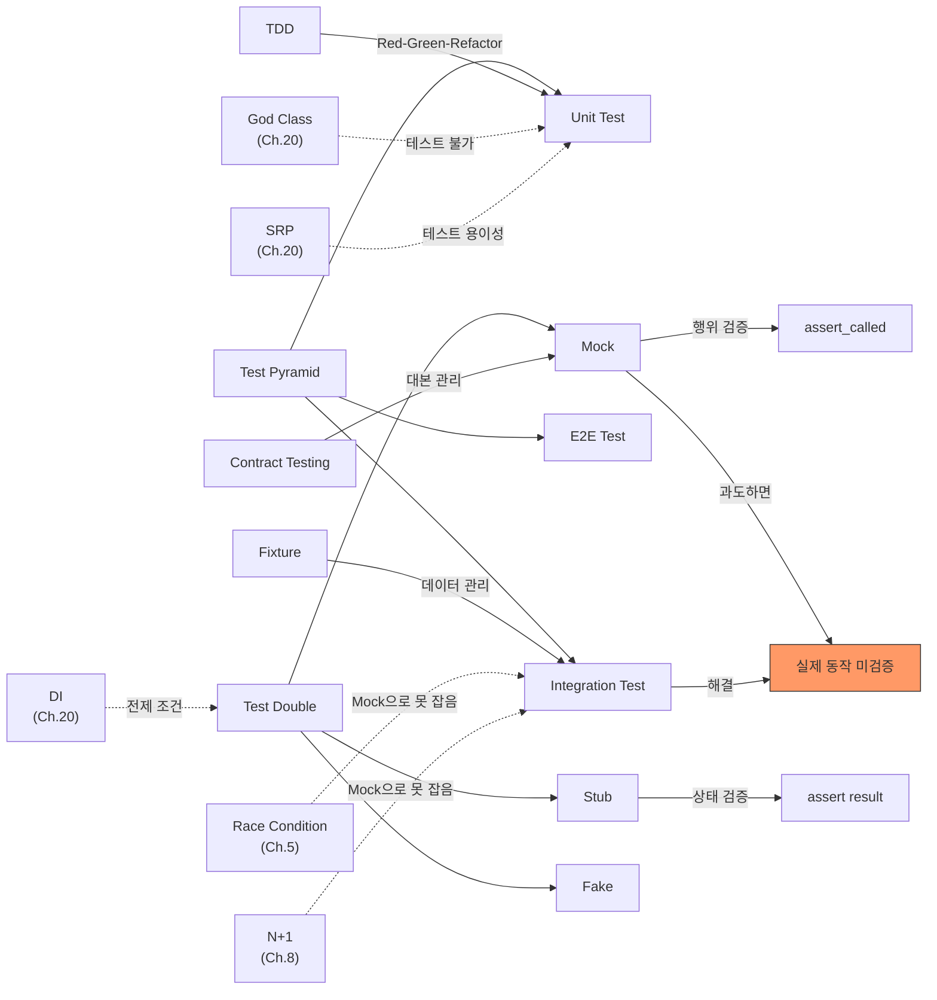

# Ch.21 유사 사례와 키워드 정리

[< 테스트 전략과 경계](./02-test-strategy.md)

---

앞에서 Mock 과다 테스트의 위험성, Test Pyramid, Test Double의 종류, Mock을 써야 하는 곳과 쓰면 안 되는 곳의 경계를 확인했다. 같은 원리가 적용되는 유사 사례를 보고, 실무에서 어떻게 하는지 정리한다.


## 21-6. 유사 사례

### Spring @DataJpaTest: DB Integration Test의 정석

Java Spring 생태계에서는 `@DataJpaTest`라는 어노테이션이 있다. JPA(ORM) 관련 컴포넌트만 로딩해서 실제 DB(보통 H2 인메모리)와 연결한 상태에서 Repository를 테스트한다.

```java
@DataJpaTest
class OrderRepositoryTest {
    @Autowired
    private OrderRepository orderRepository;

    @Test
    void testSaveAndFind() {
        Order order = new Order(userId: 1, productId: 1, quantity: 2);
        orderRepository.save(order);

        Order found = orderRepository.findById(order.getId()).orElseThrow();
        assertEquals(2, found.getQuantity());
    }
}
```

(Python 사용자라면 pytest + SQLAlchemy + SQLite 조합이 같은 역할이다. 앞에서 본 `db_session` fixture 패턴이 정확히 이 구조다.)

`@DataJpaTest`가 하는 일: 테스트용 DB를 자동으로 띄운다 -> 엔티티에 맞는 테이블을 생성한다 -> 테스트를 실행한다 -> 끝나면 롤백한다. Repository의 쿼리가 실제로 동작하는지 확인하는 가장 가벼운 Integration Test다.

핵심: Mock으로 Repository를 대체하지 않고, 실제 DB(H2)를 쓴다. 이것만으로도 컬럼명 불일치, 쿼리 문법 오류, 트랜잭션 문제를 배포 전에 잡을 수 있다.


### Testcontainers: 실제 DB를 Docker로 띄우는 테스트

H2나 SQLite 같은 인메모리 DB는 실제 운영 DB(MySQL, PostgreSQL)와 동작이 다를 수 있다. MySQL에서만 동작하는 쿼리가 SQLite에서는 에러 나는 경우가 있다.

Testcontainers는 이 문제를 해결한다. 테스트 실행 시 Docker로 실제 MySQL/PostgreSQL 컨테이너를 띄우고, 테스트가 끝나면 자동으로 내린다.

```python
# Python testcontainers 예시
from testcontainers.mysql import MySqlContainer

def test_with_real_mysql():
    with MySqlContainer("mysql:8.0") as mysql:
        engine = create_engine(mysql.get_connection_url())
        # 실제 MySQL 8.0에서 테스트 실행
        ...
```

(Java에서는 `@Testcontainers` 어노테이션으로 같은 걸 한다. Go에서는 `testcontainers-go` 패키지가 있다.)

장점: 운영과 동일한 DB 엔진으로 테스트한다. MySQL 특유의 문법이나 Isolation Level 차이를 잡을 수 있다.
단점: Docker를 띄우니까 느리다. 컨테이너 시작에 수초가 걸린다. CI 환경에 Docker가 있어야 한다.

Ch.22에서 Docker를 다룰 때, Testcontainers의 원리(namespace, cgroup으로 격리된 프로세스를 띄우는 것)가 더 분명해진다.


### API Contract Testing: 외부 API의 "대본"을 관리하는 방법

앞의 사례에서 결제 API의 응답 형식이 바뀌어서 장애가 났다. Mock의 "대본"이 현실과 달라진 거다. 이 문제를 어떻게 해결하는가?

Contract Testing은 "API 제공자와 소비자가 응답 형식(Contract)에 대해 합의하고, 양쪽이 각자 이 계약을 검증하는 테스트"다. Pact라는 도구가 대표적이다.

```
소비자 측: "결제 API가 이 형식으로 응답할 거라고 기대한다"
  → Contract 파일을 생성

제공자 측: "이 Contract대로 응답하는지 내 서버를 검증한다"
  → Contract 파일을 읽고 실제 서버에서 확인
```

Contract가 바뀌면 양쪽 테스트가 깨진다. "API가 바뀌었으니 소비자 코드도 바꿔야 한다"는 사실을 배포 전에 알 수 있다.

실무에서 Contract Testing을 완전히 도입하는 팀은 아직 많지 않다. 하지만 최소한, Mock의 "대본"을 별도 파일로 관리하고, API 버전이 올라갈 때 대본도 업데이트하는 습관은 가져야 한다.


## 그래서 실무에서는 어떻게 하는가

### 1. Mock은 경계에서만, 핵심 로직은 실제 의존성으로

```python
# 실무 패턴: 외부만 Mock, 내부는 실제
@pytest.fixture
def order_service(db_session):
    order_repo = OrderRepository(db_session)     # 실제 DB
    inventory_repo = InventoryRepository(db_session)  # 실제 DB
    mock_payment = MagicMock()  # 외부 결제만 Mock
    mock_payment.charge.return_value = {
        "data": {"id": "pay_test", "status": "approved"}
    }
    return OrderService(order_repo, mock_payment, inventory_repo)

def test_full_order_flow(order_service, seed_products):
    result = order_service.create_order(user_id=1, product_id=1, quantity=2)
    assert result["order_id"] is not None
    # DB에 실제로 저장됐는지 확인
    # 재고가 실제로 줄었는지 확인
```

### 2. CI에서 Integration Test를 반드시 돌린다

```yaml
# GitHub Actions 예시
jobs:
  test:
    services:
      mysql:
        image: mysql:8.0
        env:
          MYSQL_ROOT_PASSWORD: test
          MYSQL_DATABASE: test_db

    steps:
      - run: poetry run pytest tests/unit -v          # Unit: 빠르게
      - run: poetry run pytest tests/integration -v    # Integration: DB 포함
```

Unit Test와 Integration Test를 디렉토리로 분리하고, CI에서 둘 다 돌린다. Unit은 빠르니까 먼저, Integration은 DB가 필요하니까 services에 MySQL을 띄운 뒤에 실행한다.

### 3. 테스트 디렉토리 구조

```
tests/
  unit/
    test_order_service.py      # Mock으로 로직만 검증
    test_price_calculator.py   # Mock 없이 순수 함수 검증
  integration/
    test_order_repository.py   # 실제 DB 연결
    test_order_flow.py         # Service + Repository + DB
  e2e/
    test_order_checkout.py     # 서버 띄우고 전체 플로우
  conftest.py                  # 공통 fixture
```

이 구조를 가져가면, `pytest tests/unit`으로 빠른 피드백을 받고, `pytest tests/integration`으로 연동을 확인하고, `pytest tests/e2e`로 전체를 점검할 수 있다.

### 4. coverage 숫자에 집착하지 않는다

coverage 90%인데 장애가 나는 게 앞의 사례였다. coverage가 높다는 건 "코드를 많이 실행했다"는 뜻이지, "코드가 잘 동작한다"는 뜻이 아니다.

의미 있는 테스트의 기준:

- "이 테스트가 실패하면, 진짜 버그가 있는 건가?"
- "이 테스트가 통과하면, 이 기능이 동작한다고 확신할 수 있는가?"

Mock으로 도배한 테스트는 두 질문 모두에 "아니오"다.


## 오늘의 키워드 정리

### 새 키워드

<details>
<summary>Unit Test (단위 테스트)</summary>

함수/메서드 단위로 격리된 동작을 검증하는 테스트다. 외부 의존성을 Mock이나 Stub으로 대체해서, 오직 해당 로직만 확인한다. 실행이 빠르고(ms 단위), 실패 시 원인 파악이 쉽다. 하지만 함수 간 연동이나 DB 호환성은 검증하지 못한다. Test Pyramid의 기저를 이루는 층으로, 가장 많이 작성해야 한다.

</details>

<details>
<summary>Integration Test (통합 테스트)</summary>

여러 모듈이나 시스템이 함께 동작하는 것을 검증하는 테스트다. "내 코드 + 실제 DB"를 연결해서 쿼리 동작, 트랜잭션, 스키마 호환성을 확인한다. Unit Test보다 느리지만, Mock이 가려버린 연동 문제를 잡을 수 있다. Spring의 `@DataJpaTest`, Python의 pytest + SQLAlchemy fixture가 대표적인 도구다.

</details>

<details>
<summary>E2E Test (End-to-End Test)</summary>

사용자 시나리오 전체를 처음부터 끝까지 검증하는 테스트다. 실제 서버, 실제 DB, 실제 플로우를 실행한다. Test Pyramid의 꼭대기 층으로, 가장 적게 작성해야 한다. 비용이 크고 깨지기 쉬워서, 결제 같은 핵심 비즈니스 플로우에만 적용하는 게 현실적이다.

</details>

<details>
<summary>Test Double (테스트 더블)</summary>

테스트에서 실제 객체를 대체하는 가짜 객체의 총칭이다. Dummy, Stub, Spy, Mock, Fake 5가지 종류가 있다. 영화의 스턴트 더블에서 따온 용어로, Gerard Meszaros가 "xUnit Test Patterns"(2007)에서 체계화했다.

</details>

<details>
<summary>Mock (모의 객체)</summary>

호출 여부와 인자를 기록하고 검증하는 Test Double이다. "행위 검증"이 핵심이다. Python에서는 `unittest.mock.MagicMock()`으로 생성한다. 외부 API, 이메일 발송처럼 "내가 통제할 수 없는 것"을 대체할 때 적절하다. DB 쿼리나 내부 로직까지 Mock으로 대체하면 테스트가 실제 동작을 검증하지 못하게 된다.

</details>

<details>
<summary>Stub (스텁)</summary>

미리 정해진 응답을 반환하는 Test Double이다. Mock과 달리 "상태 검증"이 핵심이다. "이 함수를 호출하면 이 값이 나오는가?"를 확인한다. Python에서는 `MagicMock(return_value=...)`으로 Stub처럼 쓸 수 있다. Martin Fowler의 "Mocks Aren't Stubs"(2007)에서 둘의 차이를 설명한다.

</details>

<details>
<summary>Fake (페이크)</summary>

실제 시스템의 동작을 간략화한 대체 구현이다. Mock이나 Stub과 달리 "실제로 동작하는 로직"이 있다. In-memory DB, dict 기반 저장소가 대표적이다. Mock보다 구현 비용이 크지만, 실제 동작에 가까운 테스트가 가능하다.

</details>

<details>
<summary>Test Pyramid (테스트 피라미드)</summary>

Martin Fowler가 정리한 테스트 전략 모델이다. Unit Test를 가장 많이, Integration Test를 적당히, E2E Test를 가장 적게 작성하는 구조다. 핵심은 "비용 대비 효과"의 균형이다. 피라미드가 뒤집히면 테스트가 느리고 유지보수가 고통이다.

</details>

<details>
<summary>TDD (Test-Driven Development)</summary>

"테스트를 먼저 쓰고, 그 다음에 코드를 짠다"는 개발 방법론이다. Red(실패하는 테스트) -> Green(통과시키는 최소 코드) -> Refactor(정리) 사이클을 반복한다. Kent Beck이 "Test Driven Development: By Example"(2002)에서 체계화했다. 강제하지는 않지만, "테스트를 생각하면서 코드를 짜는 습관"은 설계를 개선한다.

</details>

<details>
<summary>Fixture (픽스처)</summary>

테스트에 필요한 사전 조건(데이터, 환경)을 준비하는 코드다. pytest에서는 `@pytest.fixture` 데코레이터로 정의한다. DB 세션 생성, 테스트 데이터 삽입, 테스트 후 정리 등을 자동화한다. 여러 테스트에서 같은 fixture를 공유할 수 있고, fixture끼리 의존 관계를 가질 수도 있다.

</details>

<details>
<summary>Contract Testing (계약 테스트)</summary>

API 제공자와 소비자가 응답 형식(Contract)에 합의하고, 양쪽이 각자 이 계약을 검증하는 테스트 방식이다. Mock의 "대본"이 현실과 달라지는 문제를 방지한다. Pact가 대표적인 도구다. 외부 API의 응답 형식이 바뀌면 계약 위반으로 테스트가 실패해서, 배포 전에 알 수 있다.

</details>


### 재등장 키워드

| 키워드 | 최초 등장 | 이번 챕터에서의 역할 |
|--------|----------|-------------------|
| Code Review | Ch.9 | 테스트 코드도 리뷰 대상이다. Mock 과다 사용을 리뷰에서 잡아야 한다 |
| YAGNI | Ch.9 | Mock으로 100가지 시나리오를 미리 만드는 것도 YAGNI 위반이 될 수 있다 |
| Race Condition | Ch.5 | Mock 테스트는 동시성 문제를 검증하지 못한다. 실제 환경에서만 잡힌다 |
| N+1 Problem | Ch.8 | Mock으로 Repository를 대체하면 N+1을 절대 잡을 수 없다 |
| God Class | Ch.20 | 테스트하기 어려운 코드의 대표. 의존성이 뒤엉켜 있어서 격리 불가능 |
| DI (Dependency Injection) | Ch.20 | DI가 없으면 Mock을 끼워넣을 수 없다. DI는 테스트 가능성의 전제 조건 |
| SRP | Ch.20 | 책임이 하나인 클래스는 테스트도 명확하다. SRP가 곧 테스트 용이성 |


### 키워드 연관 관계




## 다음에 이어지는 이야기

이번 챕터에서는 테스트의 전략과 경계를 다뤘다. Mock은 경계에서만 쓰고, 핵심 로직은 실제 의존성으로 검증하고, Test Pyramid의 비율을 지킨다.

테스트까지 했다. 코드를 분리했고(Ch.20), 테스트를 짰고(Ch.21), 이제 배포만 하면 된다.

"내 컴퓨터에서는 되는데요."

이 말이 나오는 순간, 아무리 테스트가 잘 짜여 있어도 소용이 없다. 개발 환경과 운영 환경이 다르기 때문이다. Python 버전이 다르거나, 시스템 라이브러리가 없거나, 환경 변수가 빠져 있거나.

Ch.22에서는 분산 시스템의 기초를 다룬다. Docker가 왜 필요한지, Container가 뭔지, "내 컴퓨터에서는 되는데요"를 어떻게 해결하는지 파고든다.

---

[< 테스트 전략과 경계](./02-test-strategy.md)

[< Ch.20 관심사의 분리](../ch20/README.md) | [Ch.22 분산 시스템의 기초 >](../ch22/README.md)
