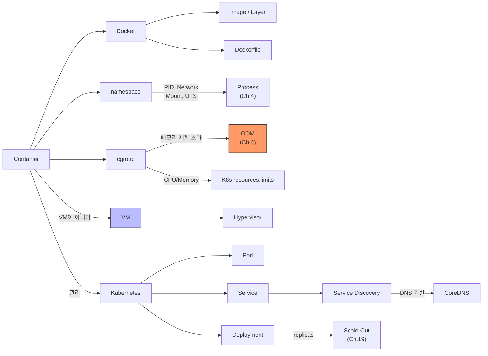

# Ch.22 유사 사례와 키워드 정리

[< Container와 Orchestration](./02-container-orchestration.md)

---

이번 챕터에서는 Container의 실체를 확인했다. VM이 아니라 namespace + cgroup으로 격리된 프로세스다. Docker Image의 레이어 구조, K8s의 Pod/Service/Deployment, Service Discovery까지 다뤘다.

같은 원리가 적용되는 실무 사례를 몇 가지 더 본다.


## 22-5. 유사 사례

### CI/CD Pipeline에서의 Docker

코드를 push하면 자동으로 테스트를 돌리고, 빌드하고, 배포하는 파이프라인이 CI/CD다. 여기서 Docker가 핵심 역할을 한다.

```yaml
# GitHub Actions 예시
jobs:
  test:
    runs-on: ubuntu-latest
    container:
      image: python:3.12-slim    # 테스트 환경도 Container로 통일
    steps:
      - uses: actions/checkout@v4
      - run: pip install poetry && poetry install
      - run: poetry run pytest

  build:
    needs: test
    steps:
      - run: docker build -t my-app:${{ github.sha }} .
      - run: docker push my-registry/my-app:${{ github.sha }}
```

테스트를 돌리는 환경도 Container다. "CI에서는 되는데 로컬에서는 안 된다"가 사라진다. 빌드 결과물도 Docker Image다. "로컬에서는 되는데 서버에서는 안 된다"가 사라진다.

### Dev / Staging / Prod 환경 통일

전통적으로 개발(Dev), 스테이징(Staging), 운영(Prod) 환경이 다르다. 개발은 macOS, 운영은 Linux. 개발은 SQLite, 운영은 MySQL. 이 차이에서 문제가 생긴다.

Docker를 쓰면 세 환경을 동일하게 만들 수 있다:

```
Dev:     docker compose up (로컬)
Staging: K8s cluster (동일한 Docker Image)
Prod:    K8s cluster (동일한 Docker Image, 설정만 다름)
```

환경에 따라 다른 건 설정(환경 변수)뿐이다. 코드와 의존성은 같은 Docker Image를 쓴다.

### 마이크로서비스 배포

모놀리식 서비스를 마이크로서비스로 쪼개면, 각 서비스가 독립적으로 배포되어야 한다. 서비스 A는 Python 3.12, 서비스 B는 Go 1.22, 서비스 C는 Node 20. 각각 다른 언어, 다른 런타임, 다른 의존성.

Container가 없으면 하나의 서버에 Python, Go, Node를 다 설치해야 한다. 의존성이 충돌할 수도 있다. Container를 쓰면 각 서비스가 자기만의 격리된 환경에서 돌아간다. 같은 서버에 Python Container, Go Container, Node Container가 간섭 없이 공존한다.

이게 namespace의 힘이다. 파일 시스템, 네트워크, 프로세스가 전부 격리되니까, 하나의 호스트에 이질적인 서비스들이 공존할 수 있다.


## 그래서 실무에서는 어떻게 하는가

### 1. Dockerfile 작성 원칙

```dockerfile
# 1. 가벼운 베이스 이미지를 쓴다
FROM python:3.12-slim    # python:3.12보다 ~500MB 가볍다
# FROM python:3.12-alpine  # 더 가볍지만 C 확장 빌드에 문제가 생길 수 있다

# 2. 자주 바뀌지 않는 것을 위에, 자주 바뀌는 것을 아래에
COPY pyproject.toml poetry.lock ./    # 의존성 (덜 바뀜) -> 위
RUN pip install poetry && poetry install
COPY csbe_study/ ./csbe_study/        # 소스 코드 (자주 바뀜) -> 아래

# 3. RUN 명령은 가능한 합친다 (레이어 수 줄이기)
RUN apt-get update && \
    apt-get install -y --no-install-recommends gcc && \
    pip install poetry && \
    poetry install && \
    apt-get purge -y gcc && \
    rm -rf /var/lib/apt/lists/*

# 4. root가 아닌 사용자로 실행한다
RUN useradd -m appuser
USER appuser

# 5. .dockerignore로 불필요한 파일을 제외한다
# (.git, __pycache__, .env 등)
```

### 2. docker-compose로 로컬 개발 환경을 구성한다

```yaml
version: "3.8"

services:
  app:
    build: .
    ports:
      - "8000:8000"
    volumes:
      - ./csbe_study:/app/csbe_study    # 소스 코드 마운트 (핫 리로드)
    environment:
      - DB_HOST=mysql
      - REDIS_HOST=redis
    depends_on:
      mysql:
        condition: service_healthy
      redis:
        condition: service_started

  mysql:
    image: mysql:8.0
    environment:
      MYSQL_ROOT_PASSWORD: csbe
      MYSQL_DATABASE: csbe_study
    ports:
      - "3306:3306"
    healthcheck:
      test: ["CMD", "mysqladmin", "ping", "-h", "localhost"]
      interval: 5s
      timeout: 3s
      retries: 10

  redis:
    image: redis:7-alpine
    ports:
      - "6379:6379"
```

새 팀원이 합류하면: `git clone && docker compose up`. 끝이다. Python 버전도, MySQL 버전도, Redis도 전부 docker-compose.yml에 정의되어 있다.

`volumes`로 소스 코드를 마운트하면, 코드를 수정할 때마다 Container를 다시 빌드할 필요 없이 바로 반영된다. 개발할 때는 이 패턴이 필수다.

### 3. K8s에서 리소스 제한을 반드시 설정한다

```yaml
resources:
  requests:
    memory: "256Mi"     # 최소 보장
    cpu: "250m"         # 0.25 코어
  limits:
    memory: "512Mi"     # 최대 허용 (초과 시 OOM Kill)
    cpu: "500m"         # 0.5 코어
```

`requests`는 "이 Pod에 최소한 이만큼은 보장해달라"는 거고, `limits`는 "이 이상은 쓰지 못하게 제한해달라"는 거다. `limits`를 안 걸면? Container가 호스트 메모리를 전부 먹을 수 있다. 같은 노드의 다른 Pod까지 영향을 받는다.

Ch.4에서 ProcessPool 워커 16개가 1GB를 먹는다는 걸 확인했다. `limits.memory: 512Mi`인 Pod에서 워커를 16개 띄우면 즉시 OOM Kill이다. Container의 자원 제한(cgroup)을 고려해서 워커 수를 결정해야 한다.

### 4. 환경 변수로 설정을 주입한다

```python
import os

DB_HOST = os.getenv("DB_HOST", "localhost")
DB_PORT = int(os.getenv("DB_PORT", "3306"))
REDIS_HOST = os.getenv("REDIS_HOST", "localhost")
```

Docker/K8s 환경에서는 설정을 환경 변수로 주입하는 게 표준이다. 코드에 `localhost`를 하드코딩하면 Container 환경에서 동작하지 않는다. 기본값을 `localhost`로 두되, 환경 변수로 오버라이드할 수 있게 만든다.


## Part 6 마무리

Part 6에서 소프트웨어 설계와 아키텍처를 다뤘다:

- Ch.20: 코드 구조를 잡았다 (SOLID, Clean Architecture)
- Ch.21: 테스트로 품질을 확인했다 (Unit/Integration/E2E Test, Test Pyramid)
- Ch.22: 환경을 코드로 정의하고, 어디서든 동일하게 배포했다 (Container, K8s)

코드를 잘 짜고, 테스트를 잘 하고, 배포를 잘 하는 것. 이 세 가지가 소프트웨어 엔지니어링의 기본이다.

그런데 아직 하나가 빠졌다. 서비스를 외부에 공개하는 순간, 보안이 문제가 된다.


## 3. 오늘 키워드 정리

Container의 원리를 키워드로 정리한다.

<details>
<summary>Container (컨테이너)</summary>

호스트 OS의 커널을 공유하면서, namespace와 cgroup으로 프로세스를 격리하는 기술이다. VM과 달리 별도의 Guest OS가 없다. "Container는 프로세스다"라는 한 문장이 핵심이다. 가볍고(수 MB), 빠르게 시작되고(수백 ms), 밀도가 높다(서버당 수백~수천 개).

</details>

<details>
<summary>Docker</summary>

Container를 빌드하고 실행하는 도구의 사실상 표준이다. Dockerfile로 환경을 정의하고, docker build로 이미지를 만들고, docker run으로 실행한다. 2013년 Solomon Hykes가 발표했다.
Docker 자체는 Container 런타임의 하나일 뿐이다. containerd, CRI-O 등 다른 런타임도 있다. K8s도 Docker를 직접 쓰지 않고 containerd를 사용한다.

</details>

<details>
<summary>namespace (네임스페이스)</summary>

Linux 커널이 프로세스에게 자원의 "뷰"를 격리해서 제공하는 메커니즘이다. PID, Network, Mount, UTS, IPC, User namespace가 있다. Container의 격리를 구현하는 핵심 기술이다.
Ch.4에서 프로세스마다 독립적인 메모리 공간을 가진다고 했는데, namespace는 그 격리를 파일 시스템, 네트워크, 프로세스 ID 등으로 확장한 것이다.

</details>

<details>
<summary>cgroup (Control Group)</summary>

Linux 커널이 프로세스 그룹의 CPU, 메모리, 디스크 I/O 등 자원 사용량을 제한하고 모니터링하는 메커니즘이다. Docker의 `--memory`, `--cpus` 옵션과 K8s의 `resources.limits`가 모두 cgroup 설정이다.
Ch.4에서 다뤘던 OOM이 Container 환경에서는 cgroup 메모리 제한 초과로 발생한다.

</details>

<details>
<summary>Docker Image / Layer</summary>

Docker Image는 Container를 실행하기 위한 읽기 전용 파일 시스템 패키지다. Dockerfile의 각 명령어가 하나의 Layer를 만들고, Layer들이 겹겹이 쌓여서 Image가 된다. Layer는 캐싱되므로, 변경되지 않은 Layer는 다시 빌드하지 않는다.
Union File System(OverlayFS)이 여러 Layer를 하나의 파일 시스템처럼 합쳐서 보여준다.

</details>

<details>
<summary>Kubernetes (K8s)</summary>

Google이 Borg 시스템의 경험을 바탕으로 만든 오픈소스 컨테이너 오케스트레이션 플랫폼이다. Container의 배포, 스케일링, 네트워킹, 장애 복구를 자동화한다. "원하는 상태를 선언하면 K8s가 맞춰준다"는 선언적 관리가 핵심 철학이다.

</details>

<details>
<summary>Pod (파드)</summary>

Kubernetes에서 배포할 수 있는 가장 작은 단위다. 하나 이상의 Container를 포함한다. 같은 Pod 안의 Container들은 네트워크(IP, 포트)와 저장소를 공유한다. 대부분 Pod 하나에 Container 하나를 넣는다.

</details>

<details>
<summary>Deployment (디플로이먼트)</summary>

Pod의 "원하는 상태"를 선언하는 K8s 리소스다. replicas 수를 지정하면 항상 그만큼의 Pod이 유지된다. Pod이 죽으면 새로 만들고, 이미지를 업데이트하면 Rolling Update로 무중단 배포한다.

</details>

<details>
<summary>Service (서비스, K8s)</summary>

Pod 집합에 대한 안정적인 네트워크 엔드포인트를 제공하는 K8s 리소스다. Pod의 IP가 바뀌어도 Service의 DNS 이름은 변하지 않는다. label selector로 대상 Pod을 결정한다.

</details>

<details>
<summary>Service Discovery (서비스 디스커버리)</summary>

분산 시스템에서 서비스의 네트워크 위치(IP:Port)를 동적으로 찾는 메커니즘이다. Container 환경에서는 IP가 동적으로 바뀌기 때문에 필수다. K8s에서는 DNS 기반(CoreDNS)으로 구현된다. docker-compose에서 서비스 이름으로 접근하는 것도 Service Discovery의 한 형태다.

</details>

<details>
<summary>VM (Virtual Machine)</summary>

Hypervisor 위에 Guest OS를 통째로 설치해서 돌리는 가상 머신이다. 각 VM이 자체 커널을 가진다. 완전한 격리를 제공하지만, 무겁다(수백 MB~수 GB). Container와의 핵심 차이는 커널 공유 여부다.

</details>

<details>
<summary>Hypervisor (하이퍼바이저)</summary>

VM을 생성하고 관리하는 소프트웨어다. Type 1(Bare-metal: ESXi, KVM)은 하드웨어 위에 직접, Type 2(Hosted: VirtualBox, VMware Workstation)는 호스트 OS 위에서 실행된다. Container에는 Hypervisor가 필요 없다.

</details>


### 재등장 키워드

| 키워드 | 최초 등장 | 이번 챕터에서의 역할 |
|--------|----------|-------------------|
| Process | Ch.4 | Container의 실체는 격리된 프로세스다 |
| OOM (Out of Memory) | Ch.4 | cgroup 메모리 제한 초과 시 OOM Kill, K8s Pod 재시작의 원인 |
| Virtual Memory | Ch.4 | Container는 VM(Virtual Machine)이 아니라 프로세스 격리라는 점에서 구별 |
| IPC | Ch.3 | IPC namespace가 프로세스 간 통신 자원을 격리 |
| Connection Pool | Ch.6 | Container 환경에서 DB_HOST를 서비스 이름으로 설정 |
| Scale-Out | Ch.19 | K8s Deployment의 replicas로 구현, Bottleneck 없이 늘리면 무의미 |


### 키워드 연관 관계




## 다음에 이어지는 이야기

이번 챕터에서 Container의 원리, Docker, K8s의 기초를 다뤘다. 환경을 코드로 정의하고, 어디서든 동일하게 배포하는 방법을 확인했다. Part 6의 세 챕터(Ch.20 코드 설계, Ch.21 테스트, Ch.22 배포)를 통해 소프트웨어 엔지니어링의 기본 사이클을 완성했다.

그런데 서비스를 배포하고 외부에 공개하는 순간, 새로운 문제가 시작된다. XSS 한 줄로 서비스가 털리고, SQL Injection으로 데이터가 유출된다. 보안 취약점은 CS를 모르면 왜 위험한지조차 이해할 수 없다.

다음 챕터에서는 보안을 다룬다.

---

[< Container와 Orchestration](./02-container-orchestration.md)

[< Ch.21 테스트를 짜라고 했더니 전부 Mocking입니다](../ch21/README.md) | [Ch.23 보안은 남의 일이 아니다 >](../ch23/README.md)
