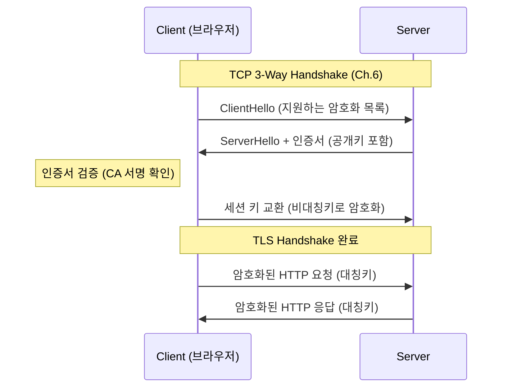
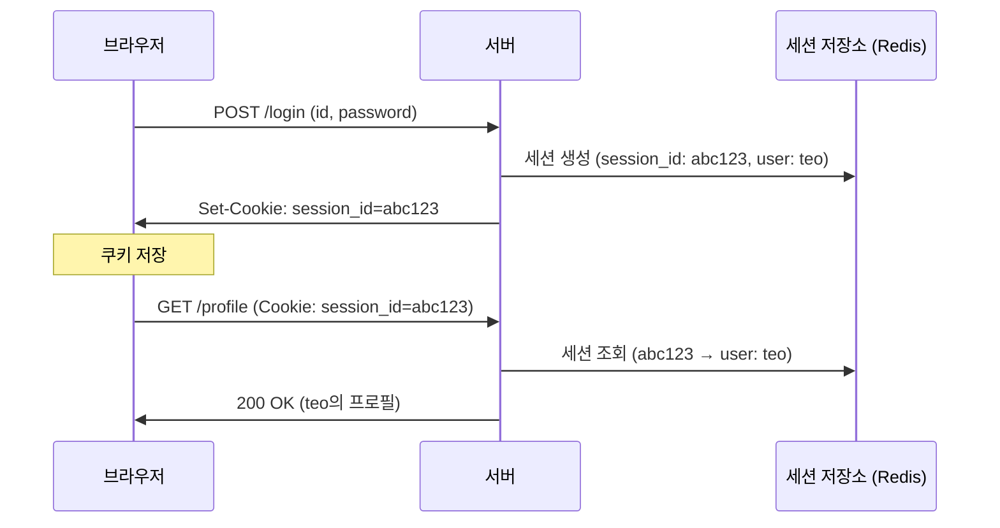
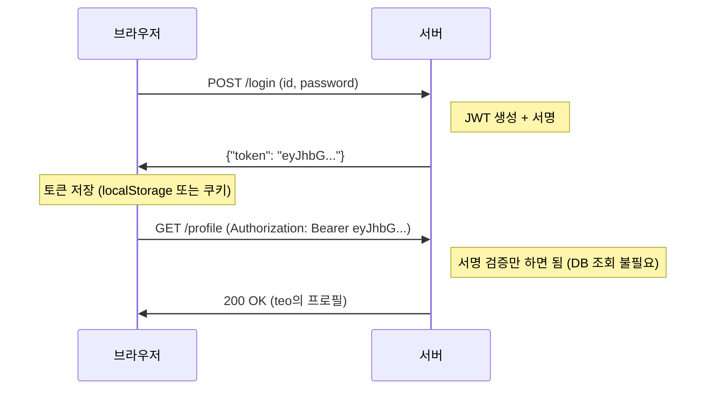

# Ch.23 웹 보안의 핵심

[< 사례](./01-case.md) | [유사 사례와 키워드 정리 >](./03-summary.md)

---

앞에서 XSS, SQL Injection, CSRF를 봤다. 전부 "사용자 입력을 신뢰하지 마라"에서 출발하는 공격이었다. 이번에는 범위를 넓혀서, 웹 보안의 다른 핵심 주제들을 다룬다. 브라우저의 보안 정책, 통신 암호화, 인증 방식, 비밀번호 관리, 무차별 대입 방어까지.


## Same-Origin Policy와 CORS

"CORS 에러"를 한 번도 안 본 개발자는 없을 거다.

```
Access to fetch at 'https://api.example.com/data' from origin
'https://app.example.com' has been blocked by CORS policy
```

프론트엔드에서 백엔드 API를 호출했더니 이 에러가 뜬다. "왜 안 되는 거지?"라고 구글링하면 "CORS 헤더를 추가해라"라는 답이 나온다. 헤더를 추가하면 된다. 그런데 왜 이런 정책이 있는가?

<details>
<summary>Same-Origin Policy (동일 출처 정책)</summary>

브라우저의 보안 정책이다. "같은 출처(Origin)에서 온 리소스만 접근할 수 있다"는 규칙이다. 여기서 Origin은 프로토콜 + 도메인 + 포트의 조합이다.

- `https://app.example.com` 과 `https://api.example.com` → 도메인이 다르니 다른 Origin
- `https://example.com` 과 `http://example.com` → 프로토콜이 다르니 다른 Origin
- `https://example.com:443` 과 `https://example.com:8080` → 포트가 다르니 다른 Origin

이 정책이 없으면? 악성 사이트 evil.com에 접속했을 때, evil.com의 자바스크립트가 bank.com의 API를 호출해서 잔고를 조회하거나 송금을 할 수 있다. 사용자가 bank.com에 로그인한 상태라면 쿠키가 자동으로 포함되니까. Same-Origin Policy가 이걸 막는다.

</details>

Same-Origin Policy는 보안을 위해 존재한다. 그런데 현실에서는 프론트엔드(`app.example.com`)와 백엔드(`api.example.com`)가 다른 도메인에 있는 경우가 많다. 이때 "이 도메인의 요청은 허용해도 된다"고 서버가 명시적으로 선언하는 게 CORS다.

<details>
<summary>CORS (Cross-Origin Resource Sharing, 교차 출처 리소스 공유)</summary>

Same-Origin Policy를 선택적으로 완화하는 메커니즘이다. 서버가 HTTP 응답 헤더에 "이 Origin에서 오는 요청은 허용한다"고 명시하면, 브라우저가 해당 요청을 허용한다.

핵심 헤더:
- `Access-Control-Allow-Origin`: 허용할 Origin (예: `https://app.example.com` 또는 와일드카드 `*`)
- `Access-Control-Allow-Methods`: 허용할 HTTP 메서드 (GET, POST 등)
- `Access-Control-Allow-Headers`: 허용할 커스텀 헤더
- `Access-Control-Allow-Credentials`: 쿠키 포함 여부 (true/false)

</details>

FastAPI에서 CORS를 설정하는 코드:

```python
from fastapi.middleware.cors import CORSMiddleware

app.add_middleware(
    CORSMiddleware,
    allow_origins=["https://app.example.com"],  # 특정 도메인만 허용
    allow_credentials=True,
    allow_methods=["GET", "POST"],
    allow_headers=["*"],
)
```

여기서 흔한 실수:

```python
# 이렇게 하면 모든 Origin을 허용한다 - 개발 환경에서만 써야 한다
allow_origins=["*"]
```

`allow_origins=["*"]`에 `allow_credentials=True`를 같이 쓰면? 브라우저가 거부한다. 모든 Origin을 허용하면서 쿠키까지 보내게 하면 Same-Origin Policy를 무력화하는 것이나 마찬가지이기 때문이다.

CORS는 브라우저의 정책이다. 서버 간 통신(서버에서 다른 서버로 요청을 보내는 경우)에는 CORS가 적용되지 않는다. `curl`이나 Postman으로 요청하면 CORS 에러가 안 나는 이유가 이거다.


## HTTPS와 TLS: 통신 암호화

HTTP로 데이터를 보내면 어떻게 되는가?

```
[브라우저] ---"password=1234"---> [서버]
```

이 데이터가 네트워크를 지나가는 동안, 중간에 있는 누구든 볼 수 있다. 같은 Wi-Fi를 쓰는 사람, ISP(인터넷 서비스 제공자), 중간 라우터 관리자. HTTP는 평문(plaintext)이다. 도청이 가능하다.

HTTPS는 HTTP에 TLS를 씌운 것이다. TLS가 통신을 암호화해서, 중간에서 봐도 내용을 알 수 없게 만든다.

<details>
<summary>HTTPS / TLS (Transport Layer Security)</summary>

HTTPS는 HTTP + TLS다. TLS는 통신 암호화 프로토콜로, Ch.6에서 다뤘던 TCP 위에서 동작한다. TCP 3-Way Handshake 후, TLS Handshake가 추가로 진행된다.

TLS가 보장하는 것 세 가지:
- 기밀성(Confidentiality): 데이터가 암호화되어 도청할 수 없다
- 무결성(Integrity): 데이터가 중간에 변조되면 감지된다
- 인증(Authentication): 서버가 진짜 그 서버인지 인증서로 확인한다

TLS 1.3이 현재 최신 버전이다. TLS 1.2 이전 버전(SSL 3.0, TLS 1.0, TLS 1.1)은 알려진 취약점이 있어서 사용하면 안 된다.

</details>

TLS에서 암호화가 어떻게 이루어지는지 간략히 보면:

<details>
<summary>대칭키 암호화 (Symmetric Encryption)</summary>

같은 키로 암호화하고 복호화하는 방식이다. 빠르다. 하지만 "키를 어떻게 안전하게 전달하는가"가 문제다. 키를 네트워크로 보내는 순간 도청될 수 있다. AES가 대표적인 대칭키 알고리즘이다.

</details>

<details>
<summary>비대칭키 암호화 (Asymmetric Encryption)</summary>

공개키(Public Key)와 개인키(Private Key) 쌍을 사용한다. 공개키로 암호화한 데이터는 개인키로만 복호화할 수 있다. 느리지만, 키 교환 문제를 해결한다. 공개키는 말 그대로 공개해도 되니까. RSA, ECDHE가 대표적이다.

</details>

TLS는 이 둘을 조합해서 쓴다. 처음에 비대칭키로 "세션 키(대칭키)"를 안전하게 교환하고, 이후 통신은 빠른 대칭키로 암호화한다. 비대칭키의 안전성과 대칭키의 속도를 둘 다 취하는 구조다.



"HTTPS는 느리다"는 말을 들어본 적이 있을 수 있다. TLS Handshake 때문에 최초 연결 시 약간의 지연이 추가되는 건 맞다. 하지만 TLS 1.3에서는 Handshake가 1-RTT(기존 1.2는 2-RTT)로 줄었고, 0-RTT 재연결도 지원한다. 현대 하드웨어에서 AES 암호화는 CPU 명령어 수준으로 지원되어(AES-NI) 성능 부담이 거의 없다. "느리니까 HTTP를 쓰겠다"는 이유가 될 수 없다.

2024년 기준, 전체 웹 트래픽의 약 95% 이상이 HTTPS를 사용한다. Chrome은 HTTP 사이트에 "주의 요함" 경고를 표시한다. Let's Encrypt 같은 서비스로 무료 인증서를 발급받을 수 있다. HTTPS를 안 쓸 이유가 없다.

(출처: Google Transparency Report, HTTPS encryption on the web, 2024)


## 인증 방식: Session vs JWT

사용자가 로그인하면, 이후 요청에서 "이 사용자는 인증된 사용자다"라는 걸 서버가 어떻게 알 수 있는가? 대표적으로 Session 방식과 JWT 방식이 있다.

### Session 기반 인증

<details>
<summary>Session (세션)</summary>

서버에 사용자 상태를 저장하는 인증 방식이다. 로그인하면 서버가 세션 ID를 생성하고, 이 ID를 쿠키로 브라우저에 보낸다. 이후 요청에서 브라우저가 쿠키를 자동으로 전송하면, 서버가 세션 ID로 사용자를 식별한다. 세션 데이터(사용자 정보, 권한 등)는 서버의 메모리나 Redis에 저장된다.

(Java Spring의 HttpSession, Django의 session framework이 이 방식이다.)

</details>



장점:

- 서버가 세션을 완전히 제어한다. 강제 로그아웃(세션 삭제)이 즉시 가능하다.
- 쿠키에 HttpOnly, Secure, SameSite 속성을 설정하면 XSS/CSRF 방어가 가능하다.
- 세션 데이터가 서버에만 있으니, 클라이언트에 민감 정보가 노출되지 않는다.

단점:

- 서버가 상태를 저장해야 한다 (Stateful). 서버가 여러 대면 세션 공유가 필요하다 (Redis 등).
- 매 요청마다 세션 저장소를 조회해야 한다.

### JWT 기반 인증

<details>
<summary>JWT (JSON Web Token)</summary>

서버가 발급하는 서명된 토큰이다. 토큰 자체에 사용자 정보(payload)가 포함되어 있고, 서버의 비밀키로 서명되어 있다. 서버는 토큰의 서명만 검증하면 되므로, 별도의 세션 저장소가 필요 없다 (Stateless).

구조: Header.Payload.Signature (Base64 인코딩, 점으로 구분)

- Header: 알고리즘 정보 (예: HS256)
- Payload: 사용자 정보 (claims). 예: `{"user_id": 123, "role": "admin", "exp": 1234567890}`
- Signature: Header + Payload를 서버 비밀키로 서명한 값

주의: JWT의 Payload는 암호화가 아니라 Base64 인코딩이다. 누구나 디코딩해서 내용을 볼 수 있다. 민감한 정보(비밀번호 등)를 넣으면 안 된다.

</details>



장점:

- 서버가 상태를 저장하지 않는다 (Stateless). 서버를 아무리 늘려도 세션 공유 문제가 없다.
- 세션 저장소 조회가 없으니 빠르다.

단점:

- 토큰 탈취 시 만료될 때까지 무효화할 수 없다. 서버에 "이 토큰은 무효"라는 정보를 저장하면? 그 순간 Stateless의 장점이 사라진다.
- 토큰에 사용자 정보가 포함되어 있으므로, 권한 변경이 즉시 반영되지 않는다.
- 토큰 크기가 세션 ID보다 크다 (매 요청에 포함됨).

### 어느 게 좋은가?

"상황에 따라 다르다"가 정답이고, 이건 변명이 아니다.

| 상황 | 추천 | 이유 |
|------|------|------|
| 단일 서버, 전통적 웹앱 | Session | 간단하고, 강제 로그아웃이 쉽다 |
| MSA, 서버 여러 대 | JWT | 세션 공유 인프라 불필요 |
| 모바일 앱 + API | JWT | 쿠키 대신 Header로 전송 |
| 보안이 극도로 중요 (금융) | Session + Redis | 즉시 무효화가 가능해야 한다 |

실무에서는 Access Token(JWT, 짧은 만료) + Refresh Token(긴 만료, 서버 저장) 조합을 많이 쓴다. Access Token이 탈취돼도 만료가 짧아서 피해가 제한되고, Refresh Token으로 새 Access Token을 발급받는 구조다.


## 비밀번호 관리: 평문 저장은 범죄다

"설마 비밀번호를 평문으로 저장하는 서비스가 있겠어?"라고 생각할 수 있다. 있다. 2019년 Facebook이 수억 개의 사용자 비밀번호를 내부 로그에 평문으로 저장하고 있었다는 사실이 밝혀졌다.

(출처: KrebsOnSecurity, "Facebook Stored Hundreds of Millions of User Passwords in Plain Text for Years", 2019)

비밀번호는 반드시 해시(hash)해서 저장해야 한다.

```python
# 절대 하면 안 되는 것
db.execute("INSERT INTO users (password) VALUES (:pw)", {"pw": "1234"})

# 해야 하는 것
import bcrypt

hashed = bcrypt.hashpw("1234".encode(), bcrypt.gensalt())
db.execute("INSERT INTO users (password) VALUES (:pw)", {"pw": hashed})
```

왜 단순 해시(SHA-256 같은)가 아니라 bcrypt를 쓰는가? SHA-256은 빠르다. 빠르다는 건 공격자가 1초에 수십억 개의 해시를 시도할 수 있다는 뜻이다. bcrypt, scrypt, argon2 같은 "느린 해시 함수"는 의도적으로 연산을 느리게 만들어서 무차별 대입(Brute Force)을 비실용적으로 만든다.

| 해시 함수 | 초당 시도 횟수 (GPU) | 용도 |
|-----------|-------------------|------|
| SHA-256 | 수십억 | 데이터 무결성 검증 (비밀번호에 부적합) |
| bcrypt | 수만 | 비밀번호 해싱 |
| argon2 | 수천 | 비밀번호 해싱 (메모리도 많이 사용) |

(bcrypt의 cost factor를 올리면 더 느려진다. 기본값은 12로, 하나의 해시에 약 200~300ms가 걸린다. 공격자에게는 이 200ms가 수십억 번 곱해진다.)

Salt는 같은 비밀번호라도 다른 해시값을 만들어준다. "1234"를 10명이 쓰더라도 해시값이 전부 다르다. Rainbow Table(미리 계산해둔 해시-비밀번호 대응표) 공격을 방어한다. bcrypt는 Salt를 자동으로 포함한다.


## Rate Limiting: 무차별 대입 방어

비밀번호를 안전하게 저장하는 것만으로는 부족하다. 공격자가 로그인 API에 비밀번호를 무한히 시도할 수 있으면, 시간이 충분하면 결국 뚫린다.

Rate Limiting은 일정 시간 내 요청 횟수를 제한하는 기법이다.

```python
from fastapi import Request
from collections import defaultdict
import time

# 간단한 Rate Limiter (실무에서는 Redis 기반으로 구현)
_login_attempts = defaultdict(list)

@router.post("/login")
def login(request: Request, username: str, password: str):
    client_ip = request.client.host
    now = time.time()

    # 최근 5분간의 시도 횟수 확인
    recent = [t for t in _login_attempts[client_ip] if now - t < 300]
    _login_attempts[client_ip] = recent

    if len(recent) >= 5:
        raise HTTPException(
            status_code=429,
            detail="Too many login attempts. Try again in 5 minutes."
        )

    _login_attempts[client_ip].append(now)

    # 로그인 검증 로직...
```

5분에 5번까지만 허용한다. 6번째부터는 429(Too Many Requests)를 반환한다. 무차별 대입 공격이 비실용적이 된다.

실무에서는 nginx나 API Gateway 레벨에서 Rate Limiting을 거는 경우가 많다. 애플리케이션 코드까지 도달하기 전에 차단하는 게 효율적이다. Redis의 `INCR` + `EXPIRE` 조합으로 분산 환경에서도 일관된 Rate Limiting을 구현할 수 있다.


## 전체 그림

보안은 한 가지만 하면 되는 게 아니다. 여러 계층에서 방어해야 한다.

```
[사용자 입력] --Escape/Validate--> [애플리케이션]
                                      |
                            Parameterized Query
                                      |
                                    [DB]

[브라우저] --HTTPS/TLS--> [서버]
              |
        Same-Origin Policy
        CORS 설정
        SameSite Cookie

[인증] --Session 또는 JWT-->  [권한 확인]
          |
    bcrypt 비밀번호 해싱
    Rate Limiting
    CSRF Token
```

이 모든 것의 출발점은 하나다: 사용자 입력을 절대 신뢰하지 마라.

XSS는 HTML에 사용자 입력을 넣기 전에 escape하면 막히고, SQL Injection은 Parameterized Query를 쓰면 막히고, CSRF는 토큰으로 출처를 검증하면 막힌다. CORS는 브라우저가 Origin을 검증하게 하고, TLS는 통신을 암호화하고, bcrypt는 비밀번호를 안전하게 저장한다.

보안의 핵심은 거창한 기술이 아니다. 기본을 지키는 거다.

---

[< 사례](./01-case.md) | [유사 사례와 키워드 정리 >](./03-summary.md)
