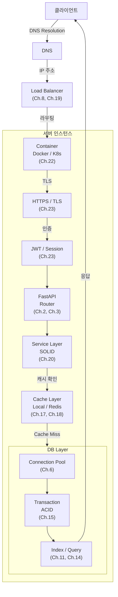
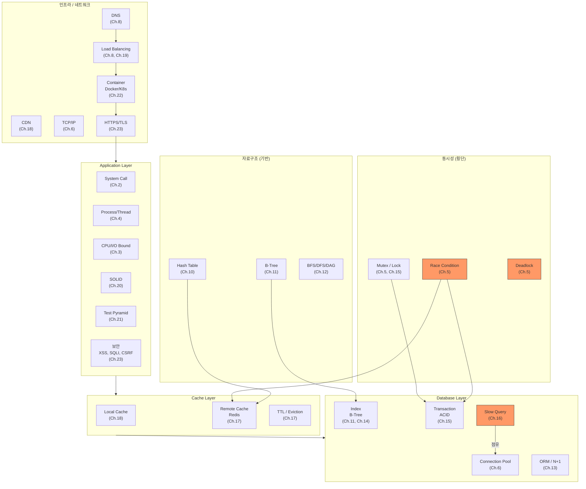

# Ch.24 전체 키워드 총정리

[< 이 챕터에 대해](./README.md)

---

앞에서 이 챕터의 목적을 이야기했다. 개별 키워드를 외우는 게 아니라, 전체 그림에서 연결하는 거다. 이번에는 하나의 가상 서비스를 기준으로, 요청이 들어와서 응답이 나가기까지 거치는 모든 레이어를 따라간다.


## 하나의 요청이 거치는 길

이커머스 주문 API를 가정하자. 사용자가 "주문하기" 버튼을 누르면 어떤 일이 벌어지는가?

```
POST /api/orders
{
    "product_id": 12345,
    "quantity": 2
}
```

이 요청 하나가 응답으로 돌아오기까지 거치는 레이어를 순서대로 따라간다. 각 레이어에서 어떤 CS 키워드가 작동하는지, 어떤 챕터에서 다뤘는지를 매핑한다.


### 1단계: 클라이언트 -> DNS -> CDN

사용자가 `api.shop.com`에 요청을 보낸다. 브라우저(또는 앱)는 먼저 이 도메인의 IP 주소를 알아내야 한다.

| 키워드 | 챕터 | 이 레이어에서의 역할 |
|--------|------|-------------------|
| DNS Resolution | Ch.8 | 도메인을 IP 주소로 변환 |
| CDN | Ch.18 | 정적 리소스를 가까운 서버에서 제공, 원본 서버 부하 감소 |
| Cache (DNS Cache) | Ch.17 | DNS 결과를 캐시해서 매번 조회하지 않음 |

주문 API는 동적 요청이니까 CDN을 거치지 않고 원본 서버로 간다. 하지만 상품 이미지, JS/CSS 같은 정적 리소스는 CDN에서 처리된다. Ch.18에서 Local Cache와 Remote Cache를 다루면서 CDN도 캐시의 한 형태라는 걸 봤다.


### 2단계: Load Balancer -> Container

요청이 서버에 도착하기 전에 Load Balancer를 거친다. 서버가 여러 대면 어디로 보낼지 결정해야 한다.

| 키워드 | 챕터 | 이 레이어에서의 역할 |
|--------|------|-------------------|
| Load Balancing | Ch.8 | 여러 서버 인스턴스에 트래픽 분산 |
| Scale-Out / Scale-Up | Ch.19 | 서버를 늘릴 건지, 성능을 올릴 건지 |
| Container (Docker) | Ch.22 | 서버 인스턴스가 컨테이너로 실행 |
| Kubernetes | Ch.22 | 컨테이너 오케스트레이션, 자동 스케일링 |
| namespace / cgroup | Ch.22 | 컨테이너의 프로세스 격리와 자원 제한 |
| Service Discovery | Ch.22 | 동적으로 서버 위치를 찾는 메커니즘 |

Ch.19에서 "Replica를 200개로 늘려봐도 Bottleneck이 다른 데 있으면 소용없다"는 걸 봤다. Scale-Out은 Bottleneck을 찾은 뒤에 하는 거다. Amdahl's Law가 그 상한을 보여준다.


### 3단계: HTTPS/TLS -> 인증

요청이 서버 인스턴스에 도착했다. TCP Connection이 수립되고, TLS 위에서 HTTP 통신이 시작된다.

| 키워드 | 챕터 | 이 레이어에서의 역할 |
|--------|------|-------------------|
| TCP/IP | Ch.6 | 통신 기반, 신뢰성 보장 |
| 3-Way Handshake | Ch.6 | TCP Connection 수립 |
| HTTPS / TLS | Ch.23 | 통신 암호화, 도청/변조 방지 |
| Keep-Alive | Ch.6 | TCP Connection 재활용 |
| JWT / Session | Ch.23 | 사용자 인증, "이 요청이 누구의 것인가" |
| CORS | Ch.23 | 다른 도메인에서의 API 호출 제어 |
| CSRF | Ch.23 | 위조된 요청 방어 |

주문 API는 인증이 필수다. JWT 토큰을 검증하든, Session을 확인하든, "이 요청을 보낸 사람이 누구인가"를 먼저 확인해야 한다. Ch.23에서 보안은 "나중에 하면 되는 것"이 아니라 "처음부터 설계에 녹여야 하는 것"이라고 했다.


### 4단계: FastAPI -> 라우터 -> Service Layer

인증을 통과한 요청이 애플리케이션 코드에 도착한다.

| 키워드 | 챕터 | 이 레이어에서의 역할 |
|--------|------|-------------------|
| System Call | Ch.2 | 네트워크 소켓 읽기, 로그 출력, 모든 I/O의 기반 |
| Process / Thread | Ch.4 | FastAPI Worker, 요청 처리 단위 |
| Thread Pool | Ch.3 | FastAPI의 동기 엔드포인트가 실행되는 곳 |
| Event Loop | Ch.3 | FastAPI의 비동기 엔드포인트가 실행되는 곳 |
| GIL | Ch.3 | CPython에서 동시 실행 제약 |
| Memory Layout | Ch.4 | Stack Frame, Heap 할당 |
| SOLID / SRP | Ch.20 | Service Layer의 책임 분리 |
| DI / IoC | Ch.20 | 의존성 주입, 테스트 용이성 |
| Layered Architecture | Ch.20 | Presentation -> Business -> Data 계층 구조 |
| YAGNI | Ch.9 | 불필요한 추상화 배제 |

Ch.2에서 `print()` 하나가 System Call을 거치면서 Mode Switch 비용이 든다는 걸 봤다. 운영 서버에서 로그를 쏟아내면 그 비용이 쌓인다. Ch.3에서는 이미지 리사이즈 같은 CPU Bound 작업을 async로 처리하면 오히려 느려진다는 걸 봤다. 요청이 코드에 도착했을 때 "이 작업이 CPU Bound인가 I/O Bound인가"를 아는 것이 올바른 처리 전략의 출발점이다.

Ch.20에서 본 SOLID 원칙은 여기서 작동한다. 주문 Service가 재고 확인, 결제 처리, 알림 발송까지 전부 하는 3000줄짜리 God Class라면? 장애 하나가 전체를 먹통으로 만든다.


### 5단계: Cache 확인

DB에 가기 전에 캐시를 먼저 확인한다. 상품 정보는 자주 바뀌지 않으니 캐시에 있을 가능성이 높다.

| 키워드 | 챕터 | 이 레이어에서의 역할 |
|--------|------|-------------------|
| Cache / Cache Hit / Miss | Ch.17 | 캐시에 데이터가 있으면 DB를 안 거침 |
| Local Cache | Ch.18 | 애플리케이션 메모리의 캐시, 가장 빠르지만 서버별 불일치 위험 |
| Remote Cache (Redis) | Ch.18 | 별도 캐시 서버, 일관성 있지만 네트워크 지연 |
| TTL | Ch.17 | 캐시 데이터의 유효 기간 |
| Cache Stampede | Ch.9, Ch.17 | 캐시 만료 순간 대량의 DB 요청 발생 |
| Eviction Policy | Ch.17 | 캐시가 가득 찼을 때 제거 정책 (LRU, LFU) |
| Write-Through / Cache-Aside | Ch.17 | 캐시 쓰기 전략 |
| Cache Invalidation | Ch.18 | 원본 데이터 변경 시 캐시 무효화 |

Ch.17에서 "느리니까 Redis 붙이자"가 왜 위험한지 봤다. Cache Stampede가 TTL 만료 순간에 DB를 죽일 수 있다. Ch.18에서는 Local Cache -> Remote Cache -> DB 순서로 계층을 구성하면 각 레이어의 장단점을 보완할 수 있다는 걸 봤다.

주문에서는 상품 정보(이름, 가격)를 캐시에서 가져오지만, 재고 수량은 캐시에서 가져오면 안 된다. 재고는 동시성 문제가 있으니 DB에서 직접 확인해야 한다. 캐시를 "어디에 쓰고 어디에 쓰지 않는가"를 결정하는 것도 CS 역량이다.


### 6단계: DB - Connection Pool -> Transaction -> Query

캐시에 없는 데이터, 또는 쓰기 작업은 DB로 간다.

| 키워드 | 챕터 | 이 레이어에서의 역할 |
|--------|------|-------------------|
| Connection Pool | Ch.6 | DB Connection 재활용, 3-Way Handshake 비용 절감 |
| ORM | Ch.13 | 객체와 테이블 매핑 |
| N+1 Problem | Ch.13 | ORM의 Lazy Loading이 만드는 쿼리 폭발 |
| Lazy / Eager Loading | Ch.13 | 연관 데이터 로딩 전략 |
| Transaction | Ch.15 | 주문 = 재고 차감 + 주문 생성 + 결제 기록, 전부 성공하거나 전부 실패 |
| ACID | Ch.15 | Transaction의 4가지 보장 |
| Isolation Level | Ch.15 | 동시 트랜잭션 간 간섭 정도 |
| Pessimistic / Optimistic Lock | Ch.15 | 동시 주문에서 재고 정합성 보장 |
| Index (B-Tree) | Ch.11, Ch.14 | 상품 조회, 주문 이력 검색 성능 |
| Covering Index | Ch.14 | 테이블 접근 없이 인덱스만으로 쿼리 처리 |
| Composite Index | Ch.14 | 여러 컬럼 조합 인덱스 |
| EXPLAIN | Ch.11 | 쿼리 실행 계획 확인 |
| QEP / CBO | Ch.13 | 옵티마이저의 실행 계획 결정 |
| Slow Query | Ch.16 | 실행 시간이 긴 쿼리, Connection Pool 고갈의 원인 |
| Full Table Scan | Ch.11 | 인덱스 없이 전체 행을 순회 |
| Pagination | Ch.16 | 대량 데이터를 페이지 단위로 나눠 조회 |
| Partitioning / Sharding | Ch.16 | 테이블 분할, 데이터 분산 |

여기가 제일 복잡한 레이어다. 하나의 주문 요청 안에서 재고 확인(SELECT) -> 재고 차감(UPDATE) -> 주문 생성(INSERT) -> 결제 기록(INSERT)이 하나의 Transaction으로 묶여야 한다. Ch.15에서 ACID와 Isolation Level을 다뤘다. 이 중 하나라도 실패하면 전부 롤백해야 한다. "재고는 차감됐는데 주문은 안 만들어진" 상태가 되면 안 된다.

Ch.5에서 다뤘던 Race Condition이 여기서 다시 나타난다. 재고가 1개 남았는데 동시에 2명이 주문하면? Ch.15에서 본 Pessimistic Lock(`SELECT ... FOR UPDATE`)이나 Optimistic Lock(version 컬럼)으로 해결한다.

Ch.6에서 다뤘던 Connection Pool 고갈도 여기서 발생한다. Slow Query 하나가 Connection을 10초간 점유하면, 다른 요청들이 빈 Connection을 기다리다가 timeout이 난다. Ch.16에서 본 것처럼, 원인은 Pool 크기가 아니라 Slow Query다.


### 7단계: 응답

처리가 끝나면 응답이 역순으로 돌아간다.

```
DB -> Service -> Router -> FastAPI -> TLS -> TCP -> Load Balancer -> 클라이언트
```

각 레이어에서 반환이 일어나면서 Connection이 Pool로 돌아가고, Stack Frame이 해제되고, TCP 패킷이 클라이언트로 전달된다.


## 요청 흐름 전체 그림

위의 7단계를 하나의 그림으로 보면 이렇다.




## Part별 키워드 정리

이제 챕터별이 아니라, Part별로 키워드를 묶어서 전체 그림을 본다. 각 Part가 이 서비스의 어디에 해당하는지를 연결하는 거다.

### Part 1: 기초 체력 (Ch.1~6)

서비스의 "바닥"에 해당한다. 어떤 레이어에서든 이 키워드들이 등장한다.

| 챕터 | 핵심 키워드 | 서비스에서의 위치 |
|------|-----------|----------------|
| Ch.1 | Computational Thinking, Keyword | 모든 레이어 - 문제 분해의 출발점 |
| Ch.2 | System Call, File Descriptor, Mode Switch | 모든 I/O - 로그, 네트워크, DB 전부 |
| Ch.3 | CPU Bound, I/O Bound, GIL, Event Loop | Application Layer - 요청 처리 전략 |
| Ch.4 | Process, Thread, Memory Layout, Virtual Memory | 서버 프로세스, OOM 진단 |
| Ch.5 | Race Condition, Mutex, Deadlock, Semaphore | 동시 요청 처리, 재고 차감 |
| Ch.6 | TCP/IP, Socket, Connection Pool, Keep-Alive | 서버-DB, 서버-Redis, 서버-외부 API 전부 |

Ch.1에서 "키워드를 모르면 검색도 못 한다"고 했다. Ch.2~6에서 쌓은 키워드는 이후 모든 파트의 토대다. Connection Pool(Ch.6)은 DB, Redis, HTTP Client 어디에서든 재등장한다. Race Condition(Ch.5)은 재고 차감(Ch.15), 캐시 갱신(Ch.17) 어디에서든 재등장한다.


### Part 2: AI와 CS의 접점 (Ch.7~9)

서비스의 특정 레이어가 아니라, 모든 레이어를 다루는 "도구"에 해당한다.

| 챕터 | 핵심 키워드 | 서비스에서의 위치 |
|------|-----------|----------------|
| Ch.7 | LLM, Prompt Engineering, Hallucination | 전 레이어 - AI로 문제를 풀 때의 방법론 |
| Ch.8 | DNS Resolution, Load Balancing, N+1, Time Complexity | 전 레이어 - 카테고리별 키워드 사전 |
| Ch.9 | Code Review, YAGNI, Cache Stampede | 전 레이어 - AI가 만든 코드 검증 |

Part 2는 다른 파트와 성격이 다르다. 특정 레이어의 키워드가 아니라 "어떤 레이어의 문제든 AI에게 정확하게 지시하려면 키워드를 알아야 한다"는 방법론이다. Ch.7에서 본 "키워드 없는 프롬프트 vs 키워드 있는 프롬프트"의 차이가 24챕터 전체에 걸쳐 적용된다. 다음 파일에서 이걸 종합한다.


### Part 3: 자료구조와 알고리즘의 실무 (Ch.10~12)

DB 인덱스, 캐시 구현, 의존성 관리의 "근거"에 해당한다.

| 챕터 | 핵심 키워드 | 서비스에서의 위치 |
|------|-----------|----------------|
| Ch.10 | Hash Table, Time Complexity, Space Complexity | 캐시 내부 구현, Set/Dict 선택 기준 |
| Ch.11 | Binary Search, B-Tree, Index, EXPLAIN | DB 인덱스의 원리 |
| Ch.12 | BFS, DFS, DAG, Topological Sort | 카테고리 트리 조회, 작업 의존성 관리 |

"왜 Index를 걸면 빨라지는가?"에 대한 답이 Ch.10~12에 있다. Hash Table이 O(1) 검색을 가능하게 하고, B-Tree가 범위 검색과 정렬까지 지원한다. contains()를 List에서 쓰면 O(n), Set에서 쓰면 O(1) - Ch.10에서 봤던 4,000배 차이가 실무에서 그대로 나타난다.


### Part 4: 데이터베이스 깊게 보기 (Ch.13~16)

6단계(DB Layer)의 모든 키워드가 여기에 있다.

| 챕터 | 핵심 키워드 | 서비스에서의 위치 |
|------|-----------|----------------|
| Ch.13 | ORM, N+1, Lazy/Eager Loading, QEP, CBO | 주문/상품 조회 쿼리 |
| Ch.14 | Covering Index, Composite Index, Cardinality | 검색 성능 최적화 |
| Ch.15 | ACID, Transaction, Isolation Level, Lock | 주문 처리의 데이터 정합성 |
| Ch.16 | Slow Query, Pagination, Partitioning, Sharding | 대규모 데이터 처리 |

주문 서비스에서 가장 장애가 잦은 레이어가 DB다. Ch.13의 N+1이 주문 목록 조회에서 터지고, Ch.14의 인덱스 미설정이 검색을 느리게 만들고, Ch.15의 Isolation Level 설정이 동시 주문의 정합성을 좌우하고, Ch.16의 Slow Query가 Connection Pool을 고갈시킨다. 이 네 챕터가 하나의 흐름으로 연결된다.


### Part 5: 캐시와 성능 최적화 (Ch.17~19)

5단계(Cache Layer)와 전체 시스템의 성능 진단에 해당한다.

| 챕터 | 핵심 키워드 | 서비스에서의 위치 |
|------|-----------|----------------|
| Ch.17 | Cache, TTL, Eviction, Write Strategy, Redis | 상품 정보 캐시, 세션 관리 |
| Ch.18 | Local Cache, Remote Cache, CDN, Cache Invalidation | 계층 캐시 설계 |
| Ch.19 | Bottleneck, Amdahl's Law, Scale-Out/Up | 전체 시스템 성능 진단 |

Ch.19의 Bottleneck 분석이 핵심이다. "느리다"고 서버를 늘리기 전에, Bottleneck이 CPU인지, I/O인지, DB인지, 네트워크인지를 먼저 찾아야 한다. Amdahl's Law는 병렬화의 한계를 수식으로 보여준다. "Replica를 200개로 늘려도 DB가 Bottleneck이면 의미 없다"는 걸 Ch.19에서 봤다.


### Part 6: 소프트웨어 설계와 아키텍처 (Ch.20~22)

4단계(Application Layer)의 코드 품질과, 2단계(Container)의 배포 환경에 해당한다.

| 챕터 | 핵심 키워드 | 서비스에서의 위치 |
|------|-----------|----------------|
| Ch.20 | SOLID, DI/IoC, Clean/Layered Architecture | Service Layer 설계 |
| Ch.21 | Unit/Integration/E2E Test, Test Pyramid, Mock/Stub | 코드 품질 보장 |
| Ch.22 | Container, Docker, namespace, cgroup, K8s | 배포 환경, 프로세스 격리 |

Ch.20의 SOLID 원칙이 Service Layer의 구조를 결정하고, Ch.21의 테스트 전략이 그 구조의 품질을 검증하고, Ch.22의 Container가 그 코드를 운영 환경에 올린다. 설계 -> 검증 -> 배포의 순서다.


### Part 7: 보안과 마무리 (Ch.23~24)

3단계(인증/보안)와 전체 시스템의 보안에 해당한다.

| 챕터 | 핵심 키워드 | 서비스에서의 위치 |
|------|-----------|----------------|
| Ch.23 | OWASP, XSS, SQL Injection, CSRF, CORS, JWT, TLS | 모든 레이어의 보안 |
| Ch.24 | 전체 키워드 맵, AI 활용 전략 | 종합 정리 |

보안은 특정 레이어가 아니라 모든 레이어에 걸쳐 있다. SQL Injection은 DB Layer에서 막아야 하고, XSS는 Application Layer에서 막아야 하고, CSRF는 인증 레이어에서 막아야 하고, TLS는 네트워크 레이어에서 막아야 한다.


## 전체 키워드 연관 관계

23개 챕터의 키워드를 레이어별로 배치한 큰 그림이다. Ch.1에서 시작한 키워드 그래프가 여기서 완성된다.



이 그래프에서 빨간색으로 표시된 것들(Race Condition, Deadlock, Slow Query)이 장애의 주요 원인이다. 이 키워드들을 알고 있으면 장애가 발생했을 때 어디부터 봐야 하는지 방향을 잡을 수 있다. 모르면? "서버가 느려요" 하고 서버를 재시작한다.


## Ch.1의 Computational Thinking 트리, 완성

Ch.1에서 이런 트리를 봤다.

```
"서버가 느리다"
    |
    +-- CPU Bound인가?
    |
    +-- I/O Bound인가?
    |     |
    |     +-- Connection Pool이 고갈된 건 아닌가?
    |     |
    |     +-- 인덱스가 안 걸린 쿼리가 있는 건 아닌가?
    |     |
    |     +-- N+1 쿼리가 발생하고 있는 건 아닌가?
    |
    +-- 메모리 문제인가?
    |
    +-- 네트워크 문제인가?
```

24챕터를 거친 지금, 이 트리의 각 가지에 해당하는 키워드를 전부 안다. CPU Bound가 뭔지, Connection Pool 고갈이 왜 일어나는지, N+1이 ORM의 Lazy Loading 때문이라는 것까지. 그리고 각 키워드에서 또 다른 키워드로 뻗어나가는 연관어 그래프를 그릴 수 있다.

Ch.1에서는 이 트리가 "앞으로 배울 것의 미리보기"였다. 지금은 이 트리가 "내가 아는 것의 목차"가 된 거다.

---

[< 이 챕터에 대해](./README.md) | [AI 활용 전략 >](./02-ai-strategy.md)
